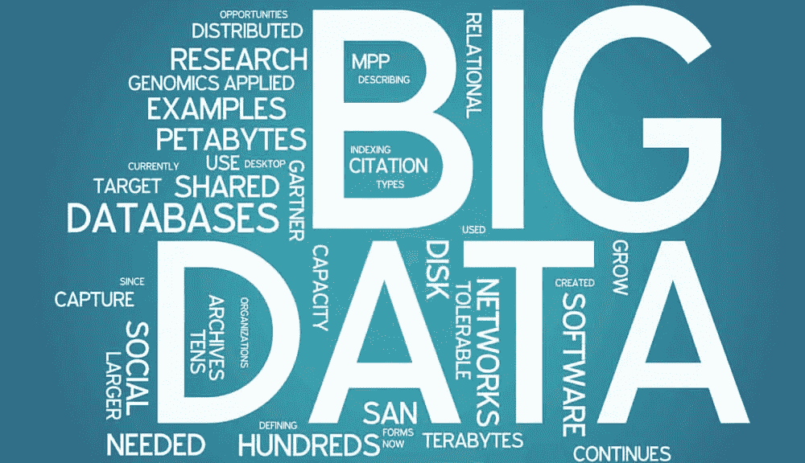

# 实现企业大数据分析的 10 项关键技术

> 原文：<https://towardsdatascience.com/10-key-technologies-that-enable-big-data-analytics-for-businesses-d82703891e2f?source=collection_archive---------3----------------------->

Ref — [https://www.comparethecloud.net/news/survey-reveals-50-point-big-data-adoption-chasm-in-uk-public-sector/](https://www.comparethecloud.net/news/survey-reveals-50-point-big-data-adoption-chasm-in-uk-public-sector/)

[大数据分析技术](https://www.marutitech.com/big-data-analytics-need-business/)是多种技术和处理方法的结合。使它们有效的是企业集体使用它们来获得战略管理和实施的相关结果。

尽管有投资热情和利用数据的力量来转变企业的雄心，但结果因成功而异。组织仍在努力打造被认为是“数据驱动”的文化。在[报告](https://hbr.org/2017/04/how-companies-say-theyre-using-big-data)开始这样一个项目的高管中，只有 40.2%的人报告说取得了成功。巨大的转变需要时间，尽管绝大多数公司渴望成为“数据驱动型”，但只有很少一部分公司实现了这一雄心。文化转变很少在一夜之间发生。

在大数据的[演进过程中，大多数公司面临的挑战与技术无关。采用的最大障碍与文化挑战有关:组织一致性、抵制或缺乏理解，以及变更管理。](https://www.marutitech.com/big-data-analytics-need-business/)

以下是为企业实现大数据的一些关键技术:

Ref — [https://www.marutitech.com/big-data-analytics-will-play-important-role-businesses/](https://www.marutitech.com/big-data-analytics-will-play-important-role-businesses/)

# 1)预测分析

作为企业规避决策风险的主要工具之一，[预测分析可以帮助企业](https://www.marutitech.com/machine-learning-predictive-analytics/)。通过处理大数据，预测分析硬件和软件解决方案可用于预测场景的发现、评估和部署。这些数据可以帮助公司为即将到来的事情做好准备，并通过分析和理解问题来帮助解决问题。

# 2) NoSQL 数据库

这些数据库用于跨可扩展数量的存储节点进行可靠、高效的数据管理。 [NoSQL 数据库](https://www.marutitech.com/nosql-big-data/)将数据存储为关系数据库表、JSON 文档或键值对。

# 3)知识发现工具

这些工具允许企业挖掘存储在多个来源上的大数据(结构化和非结构化)。这些源可以是不同的文件系统、API、DBMS 或类似的平台。有了搜索和知识发现工具，企业可以隔离和利用信息为自己谋利。

# 4)流分析

有时，一个组织需要处理的数据可能会以多种格式存储在多个平台上。流分析软件对于这种大数据的过滤、聚合和分析非常有用。流分析还允许连接到外部数据源，并将它们集成到应用程序流中。

# 5)内存中的数据结构

这项技术有助于在动态 RAM、闪存或固态存储驱动器等系统资源中分发大量数据。这进而实现了在连接的节点上对大数据的低延迟访问和处理。

# 6)分布式存储

作为应对独立节点故障和大数据源丢失或损坏的一种方式，分布式文件存储包含复制的数据。有时，数据还会被复制，以便在大型计算机网络上进行低延迟快速访问。这些通常是非关系数据库。

# 7)数据虚拟化

它使应用程序能够检索数据，而无需实施技术限制，如数据格式、数据的物理位置等。Apache Hadoop 和其他分布式数据存储使用数据虚拟化来实时或接近实时地访问存储在各种平台上的数据，这是最常用的大数据技术之一。

# 8)数据集成

对于大多数处理大数据的组织来说，一个关键的运营挑战是以对客户交付有用的方式处理 TB(或 Pb)数据。数据集成工具允许企业跨多个大数据解决方案(如 Amazon EMR、Apache Hive、Apache Pig、Apache Spark、Hadoop、MapReduce、MongoDB 和 Couchbase)简化数据。

# 9)数据预处理

这些软件解决方案用于将数据处理成一致的格式，并可用于进一步分析。数据准备工具通过格式化和清理非结构化数据集来加速数据共享过程。数据预处理的一个局限性是，它的所有任务都不能自动化，需要人工监督，这可能是乏味且耗时的。

# 10)数据质量

大数据处理的一个重要参数是数据质量。数据质量软件可以利用并行处理对大型数据集进行清理和丰富。这些软件被广泛用于从大数据处理中获得一致和可靠的输出。

**总之**、[大数据已经被用于](https://www.marutitech.com/big-data-analytics-need-business/)提高运营效率，根据最新的即时信息做出明智决策的能力正迅速成为主流标准。

毫无疑问，大数据将继续在全球许多不同行业发挥重要作用。它肯定能为一个商业组织创造奇迹。为了获得更多收益，对您的员工进行大数据管理培训非常重要。借助对大数据的适当管理，您的企业将变得更有生产力和效率。