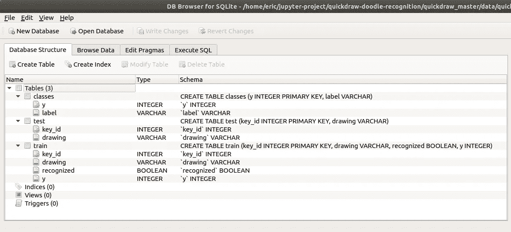
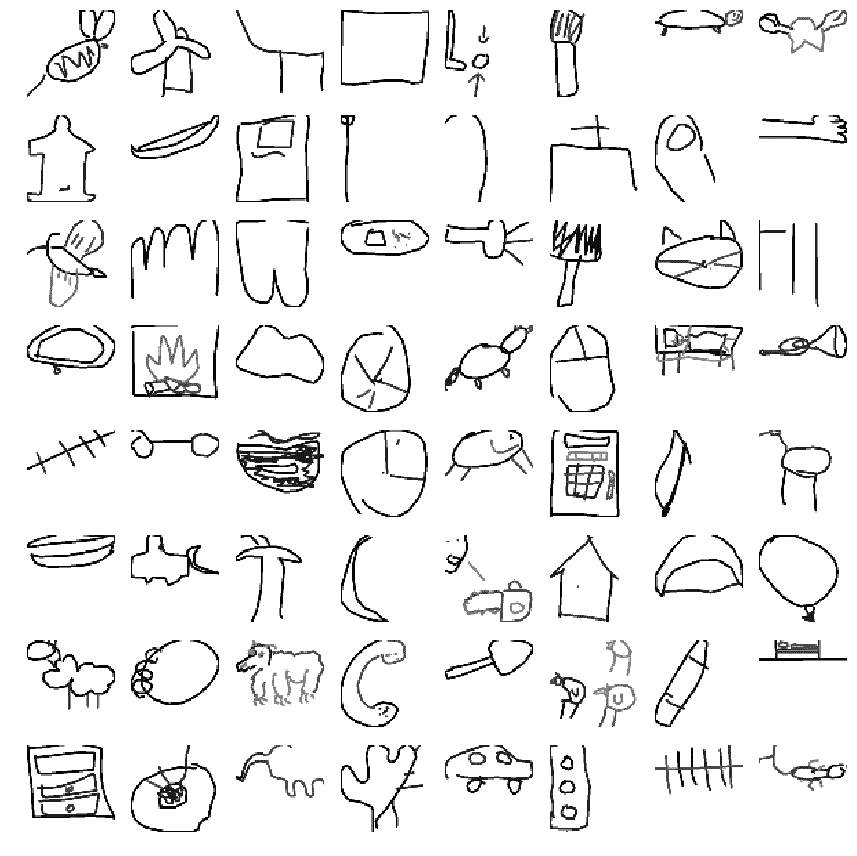
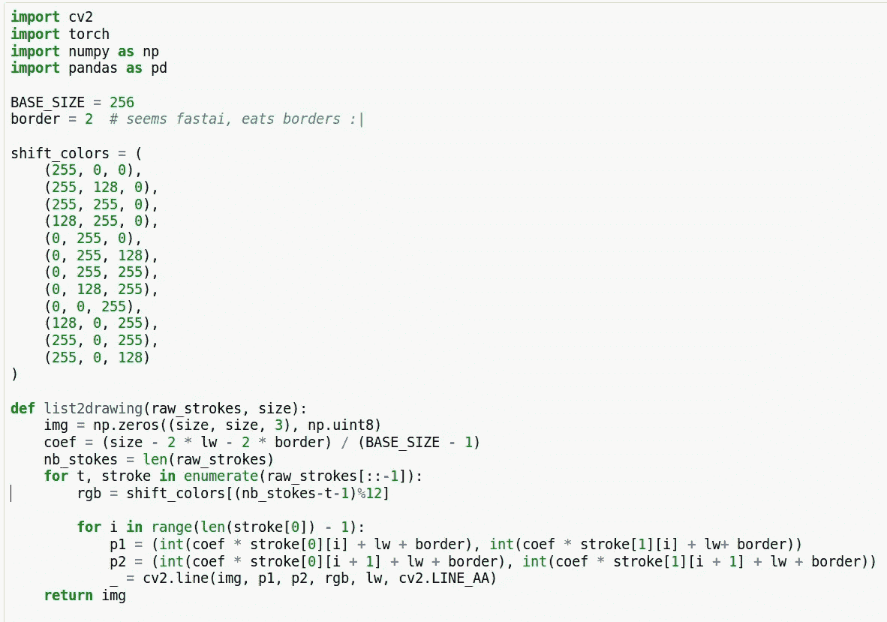
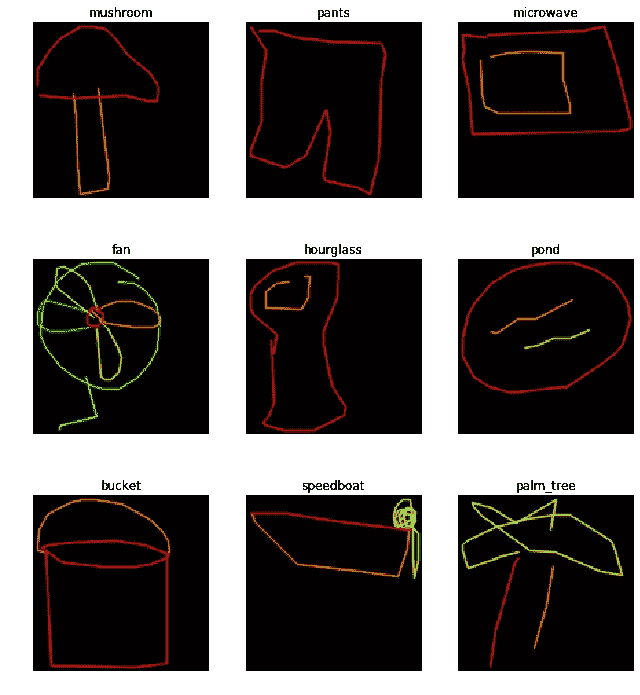
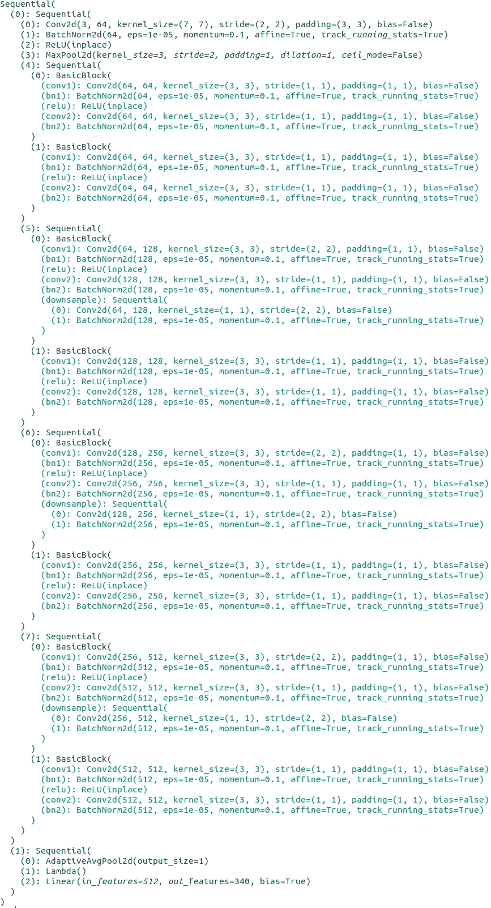
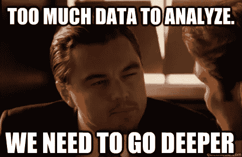
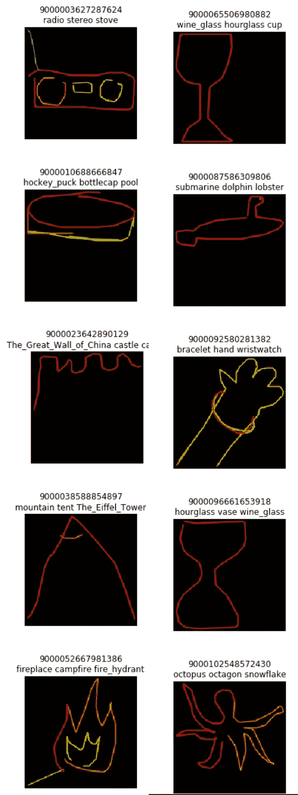
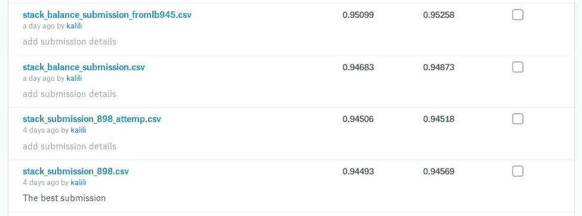

# 参加谷歌人工智能挑战赛的 10 条经验

> 原文：<https://towardsdatascience.com/10-lessons-learned-from-participating-to-google-ai-challenge-268b4aa87efa?source=collection_archive---------13----------------------->

[快，画！涂鸦识别挑战赛](https://www.kaggle.com/c/quickdraw-doodle-recognition)是由[谷歌 AI](https://ai.google/research) 赞助、 [Kaggle](https://www.kaggle.com) 主持的人工智能挑战赛。

我的团队在这次比赛中获得了第 46 名，而 1584 名选手和 1316 支队伍参加了这次比赛。以下是我想与大家分享的一些背景、见解和感受，以及我们是如何与金牌失之交臂的。

# 挑战概述

这个挑战的目的很简单，猜猜有人在画什么。不是你，你的电脑会猜。听起来很有趣，对吧？

换句话说，你的电脑是否足够智能来决定下面画的是什么？

Sample images from the [quickdraw-dataset](https://github.com/googlecreativelab/quickdraw-dataset)

有点简单化的定义？以下是官方描述:

 [## 快，画！涂鸦识别挑战

### 你能多准确地识别涂鸦？

www.kaggle.com](https://www.kaggle.com/c/quickdraw-doodle-recognition) 

> [“快，画！”作为一款实验性游戏发布，以一种有趣的方式教育公众人工智能是如何工作的。该游戏提示用户绘制描述某一类别的图像，例如“香蕉”、“桌子”等。这个游戏产生了超过 1B 的图画，其中的一个子集被公开发布作为这个比赛的训练集的基础。该子集包含 5000 万张图纸，涵盖 340 个标签类别。](https://quickdraw.withgoogle.com/)
> 
> 听起来很有趣，对吧？挑战在这里:由于训练数据来自游戏本身，图纸可能不完整或可能与标签不符。您需要构建一个识别器，它可以有效地从这些有噪声的数据中学习，并在来自不同发行版的手动标记的测试集上表现良好。
> 
> 你的任务是为现有的 Quick，Draw 建立一个更好的分类器！数据集。通过在这个数据集上推进模型，Kagglers 可以更广泛地改进模式识别解决方案。这将对手写识别及其在 OCR(光学字符识别)、ASR(自动语音识别)和 NLP(自然语言处理)等领域的强大应用产生直接影响。

# ✎队😭😴

首先，我真的要感谢我所有的队友，没有他们这是不可能的！

其次，让我们解释一下背景:我喜欢学习关于软件工程、科学、编程的新东西……人工智能/机器学习是我最近一年来的学习热情。在这个领域我还是个新手，但我发现它真的很吸引人。所以为了活出我的新激情，我在 Kaggle 上开始了另一个新的挑战(准确地说是第六次)，那就是 [**快，画！涂鸦识别挑战**](https://www.kaggle.com/c/quickdraw-doodle-recognition) 。到目前为止，我独自参加了所有的挑战，我觉得已经准备好加入一个团队，我在 Kaggle 论坛上发表了[这篇文章](https://www.kaggle.com/c/quickdraw-doodle-recognition/discussion/72553)，那时我在排行榜上大约是第 84 名。我从其他同样没有团队的 Kagglers 那里得到了一些答案，要么是通过论坛，要么是直接给我发消息让我加入团队。很难决定和谁组队，所以我和卡格勒建立了一个团队，和我当时在排行榜上的水平差不多。

这是最终的魔术队:

*   我自己，迷人的队长
*   phun :团队的调和炼金术师
*   [卡莉莉](https://www.kaggle.com/kalili):团队深度模型向导
*   [YIANG](https://www.kaggle.com/peterzheng) :团队的机器学习魔术师

我们来自中国、法国和美国。

有一段时间，球队用了我的名字，但最终，我们搬到了“✎”😭😴".一个很好玩的队名，但我还是不知道怎么念，但至少让你想象到了我们的团队故事。

> `Lesson 1: Build a team with people having the same level as you in the competition. That way everyone feels comfortable working together.`

在挑战中，我的队友们的敬业精神给我留下了深刻的印象。每次有任务出现(训练一个新模型，调查一个解决方案)，他们都会站起来去做。

# (深入)学习对我来说很关键

我是一个学习者，所以我决定这次比赛使用:新的硬件，新的人工智能框架和新技术。那很有趣！

> 我们不断前进，打开新的大门，做新的事情，因为我们很好奇，好奇心不断引领我们走上新的道路。**华特·迪士尼**

## 新硬件

在我之前参加的 Kaggle 比赛中，我家里没有具备计算能力的 GPU 可以使用，所以我通常使用免费的 [Kaggle 内核](https://www.kaggle.com/kernels)或[谷歌合作实验室](https://www.kaggle.com/kernels)。他们免费使用，提供一个旧的和缓慢的，但可靠的 K80 GPU，但他们是有限的时间。所以我决定是时候给我的电脑换一个全新的显卡，配一个像样的 GPU 了。我指的是一个 GPU，我可以用它来做有趣的新事物，比如深度学习。于是我的电脑迎来了一款 [rtx 2080 ti](https://www.nvidia.com/en-us/geforce/graphics-cards/rtx-2080-ti/) ，NVIDIA 于 2018 年 9 月 27 日推出。给你一个思路，比赛从 2018 年 9 月 26 日开始，历时两个月。我不能让它更近一些。

 [## NVIDIA GeForce RTX 2080 Ti 显卡

### GeForce RTX 2080 Ti 领先其他卡几光年…

www.nvidia.com](https://www.nvidia.com/en-us/geforce/graphics-cards/rtx-2080-ti/) 

由于数据集的规模(5000 万张图片)，硬件在这场比赛中至关重要。这场竞赛的获胜者展示了他们拥有惊人的计算能力。

我可以告诉你，仅仅因为你无法使用 GPU 而无法尝试新算法是令人沮丧的。

> `Lesson 2: Choose wisely the competition you want to participate in based on your compute resources (local or cloud).`

## 新的自定义二进制文件

硬件相当新，但随之而来的是一些问题。为了使用我的显卡的所有功能，我不得不使用 NVIDIA 的 CUDA 10，没有官方支持的机器学习框架，也没有预建的二进制文件。

首先，我必须用 Ubuntu 18.04 重新安装我的 Linux 电脑，因为 NVIDIA 驱动程序 410.72，CUDA 10.0，cuDNN 7.3.1 和 NCCL 2.3.5 只在这个 LTS(长期支持)版本的 Ubuntu 中受支持。

所以我不得不使用 CUDA 10 从源代码重新编译 Google 的 [tensorflow](https://www.tensorflow.org/) 。[这里的](https://www.python36.com/how-to-install-tensorflow-gpu-with-cuda-10-0-for-python-on-ubuntu/)是解释如何做的教程。

 [## 张量流

### 面向所有人的开源机器学习框架

www.tensorflow.org](https://www.tensorflow.org/) 

我还必须用 CUDA 10 从脸书和优步维护的源码 [pytorch](https://github.com/pytorch/pytorch) 中编译。

 [## 皮托赫/皮托赫

### Python 中具有强 GPU 加速的张量和动态神经网络- pytorch/pytorch

github.com](https://github.com/pytorch/pytorch) 

**注意:**为你的 CPU 架构编译软件(GCC -march 选项)可能会提供巨大的提升。在我的测试中，启用 tensorflow 中的 [AVX2](https://en.wikipedia.org/wiki/Advanced_Vector_Extensions) 将 CPU 计算时间除以 2。

> `Lesson 3: Optimize your software stack for the task. E.g. Recompile tensorflow from source, as the pre-built downloadable version is compiled for maximum CPU compatibility and not maximum performance.`

## 新的深度学习框架

我已经使用了 [keras](https://keras.io/) 和 [Google tensorflow](https://www.tensorflow.org/) ，keras 对初学者来说是一个很好的框架，Google tensorflow 非常强大，可以补充 Keras，也可以单独使用。这些都是非常有趣和成熟的框架。

 [## 克拉斯

### Keras，Python 深度学习库。

keras.io](https://keras.io/) 

所以我决定通过使用 fastai 1.0 库来尝试一些新的东西。它是在 [pytorch](https://github.com/pytorch/pytorch) 框架之上的一个高级库。所以我在这里看到了学习新事物的潜力。

 [## 法斯泰/法斯泰

### fastai 深度学习库，加上课程和教程

github.com](https://github.com/fastai/fastai) 

最后，我发现这个 fastai 库非常有趣，它提供了一个高级接口和一个简单的使用流程。但是由于该库相当新，(第一个 1.0 版本于 2018 年 10 月 16 日发布)，所使用的版本(1.0.26)有许多怪癖(例如，如果 *find_lr* 没有在它之前运行，则无法执行预测)，错误(当启用混合精度时，许多函数会抛出异常)，并且文档有许多缺陷(如何在深度学习模型上定制头部)？).最重要的是， g 中的[语义版本不受尊重，所以我警告你即使在补丁版本之间也会有代码兼容性问题(我为 1.0.26 编写的代码与 1.0.28 不兼容)。](https://semver.org/)

但是，这个库内置了非常好的东西，比如 1cycle policy、学习率查找器和(部分)混合精度支持。当我写这篇文章的时候，几乎每天都有新的版本发布，所以进展也很快。

> `Lesson 4: Read the source Luke. You will learn how these libraries and frameworks work, especially if the documentation is incomplete.`

## 最新最先进的技术

**混合精度**是我选择 rtx-2080-ti 而不是更便宜的 gtx-1080-ti 的关键因素之一。rtx-2080-ti 是 NVIDIA 第一款支持 16 位浮点(fp16)的非专业显卡。

你可能会问你一直跟我说的混合精度是什么？这是一组技巧，允许在深度神经网络中使用 16 位浮点而不是 32 位浮点，从而将内存减少两倍，并将计算吞吐量增加相同或更多倍。

关于混合精度的更精确定义，你可以参考 [NVIDIA 开发者博客](https://devblogs.nvidia.com/mixed-precision-training-deep-neural-networks/):

> 深度神经网络(DNNs)已经导致了许多领域的突破，包括图像处理和理解、语言建模、语言翻译、语音处理、游戏以及许多其他领域。为了实现这些结果，DNN 的复杂性一直在增加，这反过来增加了训练这些[网络](https://developer.nvidia.com/discover/artificial-neural-network)所需的计算资源。混合精度训练通过使用较低精度的算法来降低所需的资源，这具有以下优点。
> 
> **减少所需的内存量**。半精度浮点格式(FP16)使用 16 位，而单精度浮点格式(FP32)使用 32 位。降低所需的内存可以训练更大的模型或训练更大的迷你批次。
> 
> **缩短训练或推理时间**。执行时间可能对内存或运算带宽很敏感。半精度将访问的字节数减半，从而减少了在内存有限的层上花费的时间。[与单精度相比，NVIDIA GPUs 提供高达 8 倍的半精度算术吞吐量](https://devblogs.nvidia.com/parallelforall/inside-volta/)，从而加速数学受限层。
> 
> 由于 DNN 训练传统上依赖于 IEEE 单精度格式，本文的重点是半精度训练，同时保持单精度实现的网络精度[…]。这种技术被称为混合精度训练，因为它同时使用单精度和半精度表示。

NVIDIA 还提供了一个 6 分钟的视频，解释如何使用 tensorflow 实现它:

> `Lesson 5: Take full advantage of your hardware, use mixed-precision if your hardware is compatible.`

# 我的工作要点

**免责声明:**我将只展示我为这次比赛写的一部分代码，我的队友绝对**而不是**对我糟糕和错误的代码负责。该代码的一部分灵感来自伟大的 Kaggler 在 ka ggle 内核和论坛中分享他们的见解和代码。我希望我没有忘记提到其中一个值得称赞的例子。

完整的源代码可以在[我的 github 库](https://github.com/ebouteillon/kaggle-quickdraw-doodle-recognition-challenge)上找到。

本部分可能包含一些技术术语。

## SQLite 的使用

为此挑战提供了一个训练数据集。它包含 5000 万张图像，每张图像都有详细信息:图像属于哪个类别、唯一标识符(key_id)、绘图来自哪个国家(country)以及复制绘图的笔画点(drawing)。

挑战训练数据集以 CSV 文件的形式提供(正好 340 个文件)，每个类别一个文件(一个文件用于飞机类别，另一个文件用于西瓜……)。当你想随机洗牌样本来训练一个深度学习模型时，这并不是最方便的。所以我必须把它们转换成更方便的方式。

首先，我去了 fastai 的通常和深度整合的做法；即每个样本有一个图像文件。但是使用这个解决方案，在如此大的数据集下，我面临另一个挑战:我的 Linux 文件系统没有配置为支持如此大量的[索引节点](https://en.wikipedia.org/wiki/Inode)(向文件系统添加了 5000 万个文件，因此创建了 5000 万个新的索引节点)，结果文件系统在没有使用所有可用 GB 的情况下就满了。必须使用另一种解决方案。有许多文件格式可以包含数据( [pickle](https://docs.python.org/3/library/pickle.html) 、 [hdf5](https://www.h5py.org/) 、 [dask](http://docs.dask.org/en/latest/dataframe-create.html) 、CSV……)。经过一些实验，我想出了一个 [SQLite](https://www.sqlite.org/index.html) 数据库方法。

该数据库是使用 Jupyter 笔记本生成的，可在 [my github](https://github.com/ebouteillon/kaggle-quickdraw-doodle-recognition-challenge) 上获得，并命名为[*1-concat-csvs-into-SQLite . ipynb*](https://github.com/ebouteillon/kaggle-quickdraw-doodle-recognition-challenge/blob/master/1-concat-csvs-into-sqlite.ipynb)*。*数据库中实现的数据结构非常简单:

*   **用训练样本训练**表
*   **用测试样品测试**表
*   **类别**表，每个可用类别用一个整数编码

Overview of the database structure

这种方法允许我将所有的训练和测试数据集保存在一个文件中。在我的各种实验中，我还注意到，与通常使用的每个样本一个图像文件相比，SQLite 方法具有额外的优势，可以减少 SSD 上的 I/O 数量。

> 第六课:不要害怕使用数据库。如果数据库服务器是多余的，那么考虑 SQLite。

如果你看我下面的代码，你可能会注意到我正在使用并行工作器将动态图像从一列笔画转换成一幅图像；这是通过使用全局锁来访问数据库实现的。我最初的意图是通过为每个 worker 提供一个 SQLite 文件对象来实现以只读模式访问数据库的并行 worker，但是在这样做之前，我首先尝试在单个 SQLite 对象上使用全局锁，它令人惊讶地立即给出了不错的结果(GPU 使用率为 98%)，这就是为什么我甚至懒得改进它。

Lock in image generator callback

## 图像笔画

这个比赛的一个重要部分就是把一系列的笔画变成有用的东西。论坛中描述了两种主要方法。要么使用笔画作为可变大小的输入，为此可以使用[递归神经网络](https://en.wikipedia.org/wiki/Recurrent_neural_network) (RNN)(具有 LSTM 或 GRU 层)，要么将它们转换为图像，为此我们可以使用[卷积神经网络](https://en.wikipedia.org/wiki/Convolutional_neural_network) (CNN)。我个人只探索了最新的。

将笔画编码成图像很简单，只需要在笔画点之间画线。但是为了给 CNN 提供尽可能多的信息，我们需要帮助他区分不同的笔画，例如使用不同的颜色。

为此，我从[白鲸的内核](https://www.kaggle.com/gaborfodor/greyscale-mobilenet-lb-0-892)中获得灵感，这是许多竞争对手的基准:

Beluga’s stroke to image function

但是我注意到这段代码有一些问题:

*   以 256x256 px 绘制图像，然后将其大小调整为 64x64 px 会占用大量 CPU 资源，并使图像模糊。
*   生成的图像仅在一个通道上。
*   这段代码没有正确处理图像边界，绘图的一小部分脱离了图像。
*   如果你想用更大的图像训练一个神经网络，那么应该明智地选择线宽来处理图像缩放。

Images generated, sample taken from Beluga’s kernel

进行了以下改进:

*   避免在图像外画线。
*   直接在最终空间计算线条位置，避免无用的图像大小调整。
*   添加一个小边界(2 像素)，以便第一个卷积层(3x3)可以更容易地检测线条。
*   使用 3 个通道来编码颜色。选择调色板，使线条不会出现在每个图层上，但连续的笔画至少有一个共同的通道。
*   最初的笔画通常表示有助于识别物体的整体形状，而最近的笔画是简单的细节。因此笔画以相反的顺序绘制，这样最后的笔画不会与第一个笔画重叠。
*   线宽是一个独立于最终图像大小的超参数，它确保在较大的图像上进行更快的迁移学习。

**注意:**我没有对提供的速度或时间进行编码，这可能会增加 CNN 可以使用的更多信息。

My strokes to images code

Image generated

> 第 7 课:其他竞争对手共享的内核通常是很好的基线。从他们那里获得灵感，改进他们的工作，让你达到顶峰。

## 卷积神经网络模型

既然数据已经准备就绪，我必须选择使用哪种人工智能算法。使用卷积神经网络的深度学习是图像识别的最先进技术。很明显，我选择走那条路。

[https://towardsdatascience.com/cousins-of-artificial-intelligence-dda4edc27b55](/cousins-of-artificial-intelligence-dda4edc27b55)

在这篇博客文章和[共享源代码](https://github.com/ebouteillon/kaggle-quickdraw-doodle-recognition-challenge)中，我将描述一个单一的深度学习模型，以避免无用的复杂性。所以我用的是 [resnet-18](https://arxiv.org/abs/1512.03385) 型号。这个模型是一个“浅层”深度学习模型，更深层的模型肯定会在这个数据集上给出更好的结果，例如 [se-resnext-50](https://arxiv.org/abs/1709.01507) ， [xception](https://arxiv.org/abs/1610.02357) 。我决定不在这里展示它们，因为它们需要更多的时间来训练，并且不会为这个快速展示的目的提供额外的价值。当然，我们的团队训练了更深层次的模型，以达到第 46 位。😄

这个 [resnet-18](https://arxiv.org/abs/1512.03385) 模型是从零开始训练的，没有任何预训练的权重(例如基于 [imagenet](http://www.image-net.org) )。我做出这个决定是基于这样一个事实，即拥有 5000 万张图像的数据集非常庞大，而 imagenet 图像(真实世界的图片)远远不是 10 秒钟绘制的草图。我这边的实证检验证实了这个假设。具有预先训练的权重的模型在第一个时期给出了好的结果，但是随着时期的增加，具有随机初始化的权重的“临时”模型的表现更好。我想，如果我在预训练和随机初始化的模型上运行更多的纪元，那么它们最终可能会给出相似的结果。但是对于分配的时间，“scratch”模式更好。

resnet-18 layers

展示的模型是一个普通的 [torchvision](https://pytorch.org/docs/stable/torchvision/index.html) 模型，但是有一个类似于原始的自定义头部，但是我用一个自适应的对应物( *AdaptiveAvgPool2d* )替换了最终的池层，以优雅地处理不同分辨率的图像。我还故意删除了 fastai 添加的自定义头，这对于预训练的模型很好，但对于随机初始化的权重模型(非预训练)，我觉得没有必要。

fastai 文档明显缺少添加自定义项以及如何用自定义头替换它的信息。我是这样解决的:

Customized head for scratch resnet-18

> 第八课:选择模型是深度学习解决方案的关键部分。不要犹豫去适应它们。这通常是训练数据集大小、计算能力和时间之间的权衡。

Data-inception

该模型使用 128px 图像进行训练，然后使用 144px 图像进行微调。

# 结果

为了向您展示我们的 resnet-18 的表现，下面是我们应该猜测的第一批图像，以及我们的 resnet-18 认为最有可能的三个类别:

Sample results from our resnet-18

这款极其简单的 resnet-18 型号已经为您赢得了一枚铜牌(在排行榜上排名第 104 位左右)。

Private Leaderboard for our sample resnet-18

深度学习取得的超人类的成果，我还是很惊讶。我们的最终得分是 0.94493，这可以粗略地解释为我们的解决方案在 94.5%的时间里获得了正确的类别。这个结果是通过堆叠不同的模型得到的(kalili 是目前为止我们的模型大师)。

# 我们是如何错失金牌的

在比赛中，我注意到一个有趣的事实，我和我的队友们分享了这个事实:我们必须猜测的图像类别的数量是 340 x 330 的一个。这令人惊讶，因为有 340 个可能的类别。因此，我认为测试集可以是完美平衡的，它由每个类别大约 330 个图像组成。YIANG 通过提交一个将所有图像设置为单一类别的解决方案来探测 leaderbord，他得到的分数是 0.002，这意味着该探测类别有 224 到 336 张图像，这当然无法确定测试集是否平衡。这种平衡测试集的想法随后被遗忘，因为比赛即将结束。

比赛结束后，获胜者在 Kaggle 论坛上发布了对他们的解决方案的描述。他们描述了一种“秘方”，又名“щепотка табака”，这让他们在排行榜上额外上升了 0.7%。那个“秘制酱”是什么？他们利用了测试集是平衡的这一事实。当我读到这一点时，我告诉自己，我应该花更多的时间来尝试重新平衡解决方案。😢

在比赛结束后，卡利利确实试图重新平衡我们的最佳解决方案，他获得了 0.6%的额外提升，这(理论上)会让我们上升到第 9 名。根据[卡格尔晋升系统](https://www.kaggle.com/progression)，该职位可获得一枚金牌。

Private leaderboard results with and without re-balancing the solution

错过了获得我们第一枚金牌的机会让我很难过，特别是当你有获得金牌的想法而没有好好利用它的时候。无论如何，我们获得了银牌，这已经很酷了。

> 第九课:花时间探索想法。三思而后行，即使时间不多了，也不要仓促行事。

# 结论

举办这次比赛是一件非常愉快的事情，我真的很感激第一次加入一个团队。我写这篇博文是因为我通常期待获胜者在论坛上描述他们的解决方案，他们通常有一些巧妙的技巧可以借鉴。这是我学到的最后一课。

> 第十课:向最优秀的人学习，并与他人分享。把事情写下来，往往能理清自己的思路，也可能对别人有帮助。

感谢阅读！