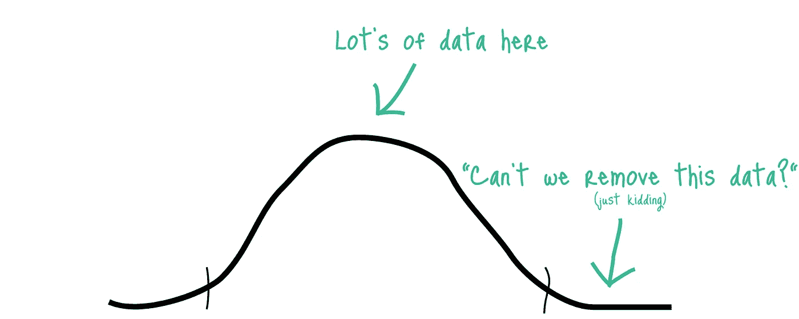
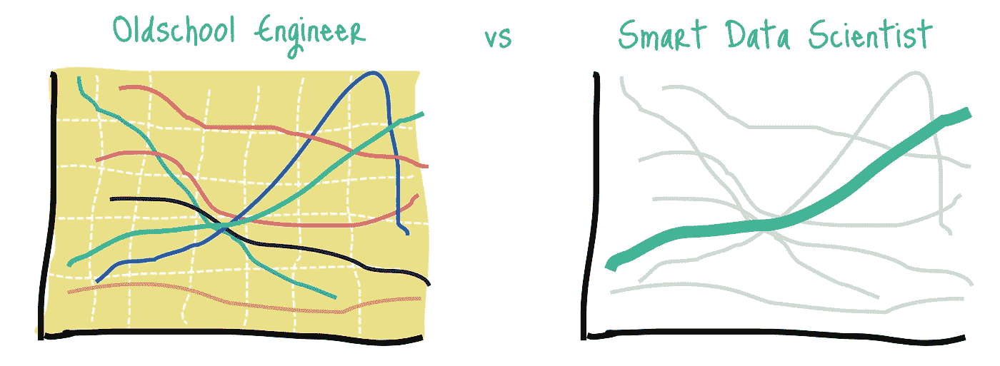

# 在数据科学会议上显得聪明的 10 个技巧

> 原文：<https://towardsdatascience.com/10-tricks-to-appear-smart-during-data-science-meetings-be1fc76264a4?source=collection_archive---------3----------------------->

我最喜欢的帮助你成为智能数据科学专家的做法。

Adapted from [Pexels](https://www.pexels.com/photo/abstract-blackboard-bulb-chalk-355948/) using [Chalk Brushes](https://www.deviantart.com/art/Chalk-Brush-for-any-situation-chalk-and-pastel-505938845)

显得聪明应该是每个数据科学家的首要任务。这是你职业生涯的动力，对吗？Sarah Cooper 关于如何在会议上显得聪明的建议是一个很好的开始，但是在数据科学家中取得成功完全是另外一回事。我们说的是给一屋子的博士和自学成才的天才留下深刻印象。但是不要害怕，用一些简单的技巧你可以欺骗任何人。

 [## 在会议中显得聪明的 10 招

medium.com](https://medium.com/conquering-corporate-america/10-tricks-to-appear-smart-during-meetings-27b489a39d1a) 

# 1.画一条钟形曲线

站起来画东西对你的个人曝光很有帮助。

正态分布可以在任何地方的所有数据中找到，所以没有比画钟形曲线更好的方式来展示你的统计技能了。最重要的是，画一必然会引发一场关于数据可能存在的其他假设的讨论。之后，正如库珀所说，你可以继续玩你的智能手机。

# 2.询问异常值

数据科学会议是关于以某种形式呈现的数据和数据可视化。而且数据总是有问题。因此，当会议期间出现沉默时，提问:“*我们能回到有异常值的那张幻灯片吗？*”。这是一次有保证的成功！

注意:如果你发现自己在演示的最后，一定要确保在你的数字中留下一些你可以很容易解释的异常值。很管用。

# 3.当你听到过度合身时，点头表示同意

当你在一场无聊的讨论中打瞌睡时，你听到单词*过拟合*，确保你表现出警觉，并朝着说话者的方向用力点头。过度拟合是万恶之源！所有有经验的数据科学家都学会了害怕它。承认这一事实不仅能让你立即变得聪明，而且当你们再次见面时，他们会记得在面对共同的敌人时你和他们站在一起。

你是否应该参加一个偶然的会议，会上有人问*“什么是过度配合？”*，只需将问题转给最初级的工程师进行澄清(他最近肯定上过数据科学课程)。这让你看起来更像一个领导。

# 4.询问商业价值

最终，你的分析或产品的商业价值是唯一重要的，对吗？但数据科学家只想解决有趣的谜题，制作酷图，显得聪明。所以这会让他们在疯狂的精神世界里奔跑！

# 5.建议一个随机算法

把这个算法列表背下来就行了，随便喊一个还没说的。你应该都试试。

*   线性回归(总是经典)
*   套索回归
*   随机森林
*   任何带有*贝叶斯*字样的东西
*   神经网络(或者快速谷歌一下最新炒作的，例如:胶囊网络)
*   主成分分析
*   k-最近邻

随着您在数据科学会议和在线文章中提到的术语方面获得经验，您可以随意扩展这个列表。

# 6.扭曲使用的指标

当有人提到他们的方法有 10%的错误率时，立即接手并宣布这意味着我们找到了 90%的成功率！改成分数的分数也很棒。从 90%到 95%的成功率意味着错误率减少了 50%!人们会对微小的成就感觉良好，他们会因为你指出来而更加喜欢你。

你可以在《如何用统计学 撒谎》一书中进一步背熟所有方法。

# 7.提议“保持简单”

如果你不理解一个数字，最好把它变成一种资产。但别忘了把责任推到别处。暗示你公司的经理或客户可能不这么理解。如果演示者只是*【保持简单】*，图表会有很大的改善。

也可以随机说出*“少即是多”*，并参考[爱德华·塔夫特](https://www.edwardtufte.com/tufte/books_vdqi)。没有人真正读过他的书，但这让你看起来像一个真正的爱好者。

# 8.开个无聊的玩笑

有趣的人被认为更聪明。有趣的书呆子因此必须在聪明等级的顶端。会出什么问题呢？

# 9.组织数据黑客

最好的。会议。永远不会。你邀请所有聪明人到你的会议室。给他们你的数据和问题。然后他们用漂亮的脚本和图表为你解决这些问题。最后，你根据他们的贡献给他们打分。最后，他们甚至会感谢你所做的一切！

# 10.问深层次的问题，比如“为什么？”

Typical Data Science project flow

可能发生的最糟糕的事情是你的项目结束了，你不得不重新开始在新的项目中给新的人留下深刻印象。

那么，如何让车轮继续转动呢？借助众所周知的项目数据科学流程，您可以明确如何做到这一点。最好的办法是强迫所有人回到起点。问一些问题，比如“我们为什么要再做一次？”或者只是“为什么？”。不叫数据*科学*白叫；科学就是问永无止境的问题！

*Matthijs Cox 是一名来自荷兰的高科技专业人士，专攻纳米技术和数据科学。他喜欢用第三人称谈论自己，玩他孩子的乐高，创造* [*美丽的图像*](https://art4science.deviantart.com/gallery/) *并设计可能接管世界的算法。以上其中一个他只是在开玩笑。*