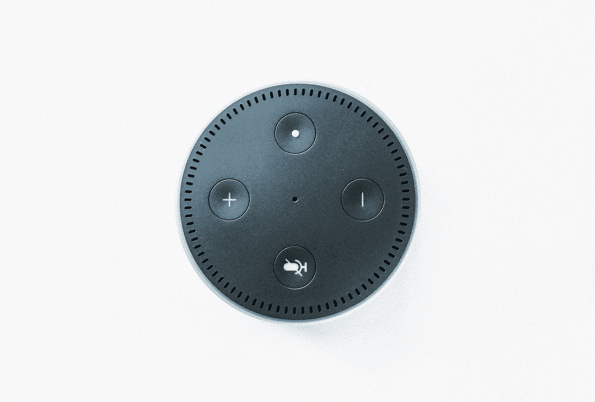

# 从 Alexa 奖中我们又学到了 11 课

> 原文：<https://towardsdatascience.com/11-more-lessons-we-have-to-learn-from-alexa-prize-94fe14b8986f?source=collection_archive---------19----------------------->

我们又参加了 [Alexa 奖](https://developer.amazon.com/alexaprize)。我们开发了 [Alquist 2.0](http://alquistai.com) ，在此期间我们学到了很多关于对话式人工智能的知识。我愿意与你分享我们新获得的知识。这篇文章是我们从亚马逊 Alexa 奖中学到的 [13 课的延续。前一篇文章中包含的信息仍然有效，我强烈推荐它。这是我们今年发现很有帮助的新的 11 点。](https://chatbotsmagazine.com/13-lessons-we-have-to-learn-from-amazon-alexa-prize-965628e38ccb)

# 1.将对话分成小部分

我们决定从大量专注于单一事物的小型对话中构建系统。这意味着我们有单独的对话，关于用户在哪里看电影，关于他如何选择一部电影来看，或者询问用户最喜欢的电影。每个对话最多有四个回合。它们的小尺寸带来了几个好处。这种对话创建起来简单快捷，易于调试，单个对话中的任何问题(例如错误识别)只适用于对话式人工智能的整个内容的一小部分。

# 2.创建主题的互联图

大量的小对话带来了新的挑战。你必须以某种方式将它们结合起来，形成一个有趣的对话，而不是在主题之间随意跳跃。我们用 T *opic 图*解决了这个问题。这是一个连接话题和对话的图表。图的一个基本积木就是一个主题(*电影*、*电影*、*音乐*、*人物*、*演员*)。每个主题都包含对话。主题*音乐*包含关于一般音乐的对话，如关于用户最喜欢的流派的对话或询问用户是否是一个好歌手的对话。这些主题由图的边连接起来。从具体话题到一般话题都有边缘。从*电影*(它包含关于特定电影的对话)到*电影*(关于一般电影的对话)或者从*演员*到*人物*有一个边缘。

如果我们检测到用户想要谈论矩阵，我们选择主题*电影*。我们从*电影*主题中随机选取一些对话。当前一个对话结束时，我们随机选择下一个对话，直到我们没有使用完*电影*主题中的所有对话。当我们使用 all 时，我们可以从通过一条边连接到*电影*主题的主题中随机选择任何对话。在我们的例子中，它可以是来自电影主题的任何对话。通过这种方法，我们可以创建连贯的对话，在相关话题之间平滑过渡。此外，每个对话略有不同，因为我们随机选择下一个对话。

要解决的有趣问题可以是确定将最大化用户满意度的下一个对话。这意味着使用一些更智能的功能，而不是随机选择。我猜强化学习可能会有帮助。

# 3.开发工具来加速内容创建

去年我们在 12 个月内开发了 17 个主题。主题由状态自动机表示的对话组成，我们从 60%的预制状态和 40%的特殊硬编码状态中创建了状态自动机。这是一项痛苦而缓慢的任务。

今年我们只有 8 个月。我们决定投资一个月来开发一个图形工具，以加速对话的发展。这提高了我们的生产力，我们能够创建 27 个主题。

我们使用编辑器来创建对话树，随后我们基于[混合代码网络](https://arxiv.org/abs/1702.03274)为我们新开发的对话管理器生成训练数据。

# 4.使用机器学习作为制定规则的快速方法

如果你有很多数据，机器学习是很棒的。但在大多数情况下，你没有足够的数据，而且获取更多数据的成本很高。这就是为什么对我们来说使用不像已经提到的[混合代码网络](https://arxiv.org/abs/1702.03274)那样数据饥渴的模型很重要的原因。我们用它来进行对话管理。它将学到的部分与硬编码的规则结合起来。这使得我们可以用少量的例子来做决定。

但少量例子的问题是，机器学习算法将与看不见的例子斗争。然而，如果你仔细想想，这并不是一个大问题。为什么？因为你还有其他选择吗？你可以完全抛弃机器学习，硬编码一些规则。但是你确定你能写出涵盖所有例子的规则吗？还有，需要多长时间？

这就是我们使用机器学习的原因。我们并不期望我们的机器学习能够概括和处理所有的例子。我们认为机器学习是一种产生与硬编码规则相当的结果的方法，但它是自动创建的，速度更快。总而言之，我们知道我们的模型不是完美的，但是它们节省了我们的开发时间。

# 5.并非用户所说的一切都很重要

去年我们遇到了长用户消息的问题。一些用户简单地用长句回答，并不是句子中的所有内容都很重要。这种信息的一个例子可以是:“你知道，我是一个非常糟糕的厨师。但我想问你，你最喜欢的食物是什么？”句子中最重要的部分是*“你最喜欢的食物是什么，”*只处理这一部分并扔掉其余部分要容易得多。我们使用的解决方案是用标点符号将句子分开，只处理最后一部分。

但是这里有一个问题。Alexa 的 ASR 不识别标点符号。它只返回令牌。这是一个我们必须通过给句子添加标点符号的神经网络来解决的问题。好消息是这项任务有大量的数据。你只需要任何包含标点符号的文本语料库。

# 6.很难确定用户没有回答你的问题

我们的人工智能问了很多问题。有些很普通，有些有点奇怪。我们最大的问题之一是发现用户没有回答我们提出的问题，或者她回答了问题，但以某种我们没有预料到的方式回答了问题。如果出现这种情况，我们准备的答案没有任何意义。我们决定解决这个问题。我们最初的想法是这是一个容易解决的问题。我们将创建一个有两个输入的神经网络，即问题，并回答它。并且神经网络的任务将是分类该答复是否可以被认为是对问题的回答。我们使用对话数据集中的所有问题和答案作为正面例子，使用带有一些随机句子的问题作为负面例子。我们坚持训练，瞧，表演糟透了。遗憾的是，我们没有时间找出这次失败的原因。可能是数据量小，也可能是类不平衡造成的。需要更多的努力来解决这个重要的问题。

# 7.添加通用对话

我们今年设定的大目标是能够就任何实体或主题进行对话。这意味着我们希望能够谈论捕鱼、炼铁、战争或维多利亚女王。你不能准备所有话题的对话，而且在很多情况下，你甚至不能找到用户想要谈论的实体类型。我们称这样的实体为“通用实体”你唯一知道的是它的名字。幸运的是，你可以用这个名字找到[新闻文章](https://www.washingtonpost.com/)、[趣闻](https://www.reddit.com/r/todayilearned/)，以及[关于它的淋浴想法](https://www.reddit.com/r/Showerthoughts/)。你可以将这些组合成对话，适用于任何主题或实体。问题是这些对话不够有趣，所以它们只在几个回合中起作用，然后你应该尝试将对话的主题改为对话式人工智能中更有趣的部分。

# 8.创造观点

我们注意到用户会问类似*“你觉得 X 怎么样？”*、*“你最喜欢的 Y 是什么？”*，或者*“你知道 Z 吗？”*经常。所以我们不能对这些问题置之不理。

我们通过获取包含 *X* 的最近推文，并测量他们的平均情绪，解决了*“你对 X 有什么看法”*。我们获得了一个介于 0.0 和 1.0 之间的数字，并设置了两个阈值。如果平均值低于 0.4，我们回答说我们不喜欢 *X* 。如果分数在 0.4 到 0.6 之间，我们回答说 *X* 有积极和消极的方面，如果分数高于 0.6，我们回答说我们喜欢 *X* 。我们必须缓存分数，因为它对于实时使用来说太慢了。但是，我建议您小心使用这种方法，因为计算出的*【恐怖主义】的分数介于 0.4 和 0.6 之间。这导致了答案*“有积极的一面，也有消极的一面。”这是你绝对不想回答的问题。我们不得不筛选像这样敏感话题的答案。**

*我们用[微软概念图](https://concept.research.microsoft.com/)对*“你最喜欢的 Y 是什么”*的处理，如果 *Y* 是*书*，我们在里面找到概念*书*，回答人气最大的实体。在我们的例子中，答案是*“我最喜欢的书是百科全书】*。*

*最后一个问题*“你知道 Z 吗”*如你所料简单。我们刚刚在维基百科上找到了 *Z* ，并由*回答“是的，我知道 Z。它是……”**

*你可能觉得这些答案没那么有趣。是的，你是对的，但这不是目标。我们的目标是建立一个系统，能够回答任何实体或主题的这些问题。他们确实这么做了。产生引人入胜的答案是我们随后进行的对话的目标。*

# *9.为回访用户创建内容*

**

*你也应该花一些时间为已经和你交谈过的用户提供内容。我们去年在有限的范围内对回归用户做出了反应。这意味着我们记住了她的名字和我们谈论的话题。我们决定今年更进一步。我们的方法是使用她告诉我们的信息，并在她下次与我们交谈时尝试使用这些信息进行对话。*

*如果她告诉我们她有一只宠物，我们会在接下来的对话中问这个宠物怎么样。如果她告诉我们她有一个兄弟姐妹，我们会在接下来的对话中询问他的名字。这就产生了这样一种感觉:我们记住了用户告诉我们的内容。但是如果你没有好的内容给第一次使用的用户，这种技术是没有用的。原因是不满意的首次用户将永远不会回来。所以首先关注首次用户，然后为回头客添加内容。但是我认为这个建议很明显。*

# *10.迷路了就聊聊平常的事*

**

*有时候会这样。你收到一些奇怪的输入，尽管你很努力，但所有的分类器都没有捕捉到任何主题或合适的答案。在这种情况下该怎么办？我们的方法是说*“对不起”*，然后从一些非常基本的对话开始，比如*“你喝自来水吗？”*、*“你有宠物吗？”*或*“你早上会按贪睡键吗？”*多亏了这一策略，我们才得以化险为夷，继续对话。*

# *11.转述是很酷的技巧*

**

*转述是一种有用的交流技巧。它是用不同的词重述课文的意思。它的主要目的是向交流伙伴发出信号，表明我们理解他。我们实现了它，并惊讶地发现用它对话听起来更自然。*

*我们的系统将用户的信息*“我喜欢煎饼，我的父母喜欢蛋糕”*由*转述，“所以你试图告诉我，你喜欢煎饼，你的妈妈和爸爸喜欢蛋糕。”*释义系统的主要部分是一个数据库，包含我们交换的成对短语。有成对的*、*、*、【我是】、【你是】、*、*、【我的父母】、【你的爸爸妈妈】、*等等。我们也有一个转述句子开头的数据库，包含*“所以你试图对我说“*、*”，所以你说的是“*或*”，例如“如果我理解正确的话”*。如果用户的信息是一个问题(我们通过 wh-word 的存在来确定)，我们准备了不同的短语，如*“你在问”*、*“你想知道”*或*“你问了我一个非常有趣的问题。”*我们以小概率随机执行了转述系统。*

# *结论*

**

*这些是我的 11 条建议，我们是通过 Alexa Prize 和我们的对话 AI Alquist 了解到的。我相信，我们在减少创建对话式人工智能内容所需的时间方面取得了很大的进展，我们创造了允许我们谈论任何话题或实体并发表意见的技术，还实际测试了几个对话技巧，如返回用户的内容或释义。我希望这篇文章能激励你参与对话式人工智能的开发。*

*另外，你可能感兴趣的最后一件事是，对话式人工智能现在还有多远？现在我们只是在制造一个人工智能可以对话的假象。我们用了很多技巧让它看起来更聪明，但实际上，并不是这样。你可能觉得我的回答很怀疑，但实际上并不是。这意味着有很大的改进空间，我们需要很多聪明的人来实现我们的目标，即真正智能的对话式人工智能。这将是具有挑战性的。但是要记住！我们选择这个目标不是因为它容易，而是因为它难！*

*[*彼得·马雷克*](https://twitter.com/thePetrMarek)*

**原载于*[*petr-marek.com*](http://petr-marek.com/blog/2018/11/20/11-lessons-learn-alexa-prize/)*。**

*喜欢这篇文章吗？点击👏**下面把它推荐给其他感兴趣的读者！***