# 17 个完全免费的维恩图模板

> 原文：<https://towardsdatascience.com/17-totally-free-venn-diagram-templates-bc384bdae8a4?source=collection_archive---------5----------------------->

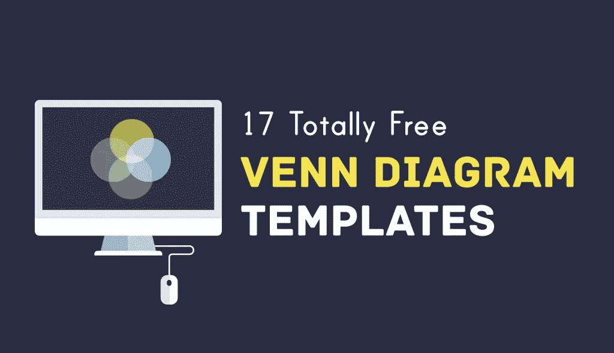

在你的演讲中加入数据是支持你观点的好方法。显示数据可以进一步增强你的文字，但有时普通的图表并不是可视化概念之间关系的最佳选择。如果是这样，也许尝试一个文氏图是正确的方法。

# 什么是维恩图？

维恩图可用于任何研究领域，直观地表示概念之间的关系。每组元素表示为圆形或其他形状，重叠区域用于描述两个或多个概念的共同点。根据需要，它们可以非常复杂，也可以非常简单。

我们在这里收集了 17 个有用的维恩图模板来帮助你开始。

# 找到正确的维恩图模板

# 1.双圆文氏图

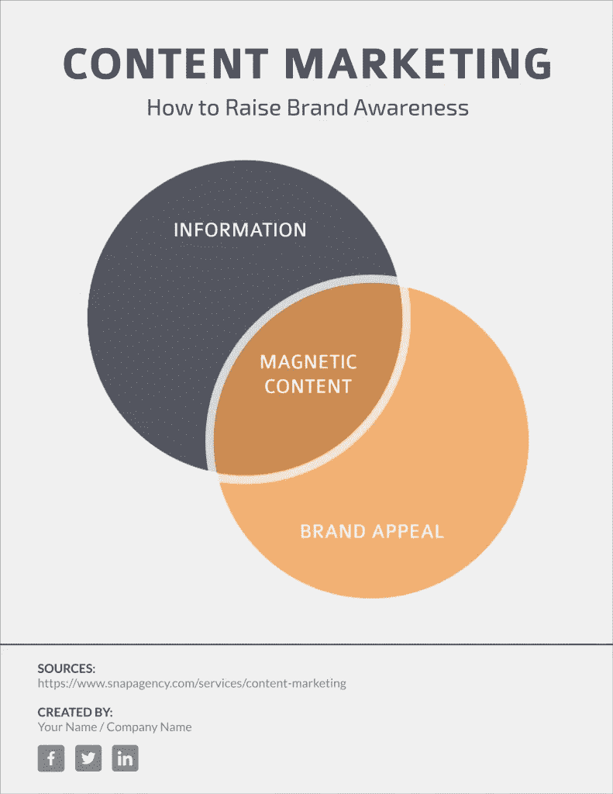

用您自己的信息自定义此模板。[免费下载](https://dashboard.visme.co/dashboard/template/infographics/1425276887)

可能是最常见的维恩图，也是最简单的，这个模板最适合用来比较两个对象。你可能在无数的演讲和课堂上见过它。然而，如果使用得当，这是一个有效的工具。

这个文氏图相对来说比较容易使用——选择你的两个焦点，把它们放在两边各自的圆圈里，列出它们的特质，然后把它们的共同特质放在中间。

为了让你的视觉不感到懒惰，确保你考虑了排版，以及什么能最好地支持你的文字。尝试添加背景或尝试不同的视觉风格。

一个很好的例子是本页顶部的文氏图。很简单，但是看起来很专业。颜色和文字配合得很好，白线有助于定义中间部分。有时候，简单更好。

# 2.雨滴模板

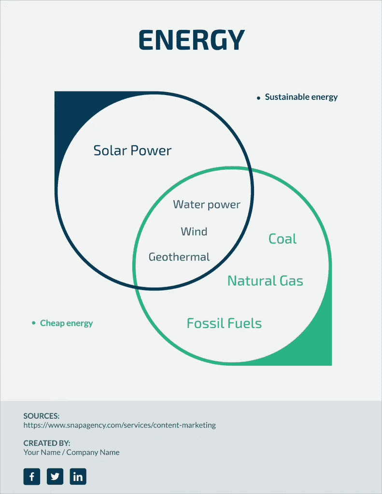

如果想要一个更有创意、更环保的两圈维恩图，可以尝试使用“雨滴”模板。本质上，你不用两个圆，而是用两个雨滴状的形状在它们较大的一端连接起来。

因为这在很大程度上是一种风格上的改变，所以您可以使用您也用于双圆图的任何信息。然而，由于环境主题，这种类型可能更好地用于表示可持续性和能源消耗之间的关系，或其他类似的主题。尝试与你的主题相关的不同形状，看看哪种效果最好。

# 3.三圈文氏图

比两个圆稍微高级一点，但同样普通，这个文氏图可以让你想象三个对象之间的关系，而不是两个。

这个文氏图是一个比较好的例子。它用重叠的圆圈提醒读者，有意义的工作不仅报酬丰厚，而且让你充满激情，自然而然地来到你身边。

在编辑这个模板时，一定要记住不仅要想象三个不同的主题是如何分别与它们的对应主题进行交互的，还要想象它们是如何组合在一起的——这是所有更高级的模板都要记住的。

# 4.三角形文氏图

如果你想要一个有趣的三主题维恩图，那么三角形模板提供了一个很好的例子。就像三个圆一样，这个模板包括三个互锁的形状——只是这一次，它们创建了一个三角形，而不是一个无定形的形状。

三角形的三个“边”包含各个主题，每个角代表这些主题如何交互。三角形的中心可以显示它们是如何相互作用的，也可以是空的。侧面可以是椭圆形、矩形或任何你喜欢的形状。

# 5.三集维恩图

用您自己的信息自定义此模板。[免费下载](https://dashboard.visme.co/dashboard/template/infographics/1425276891)

这张政党流程图是三集维恩图的一个很好的例子，圆圈内的文字有助于进一步解释每个主题，中心是一切交汇的“甜蜜点”。透明的三个圆圈强调了每个主题之间的联系，并有助于使圆圈重叠的区域更加清晰。

# 6.四圆文氏图

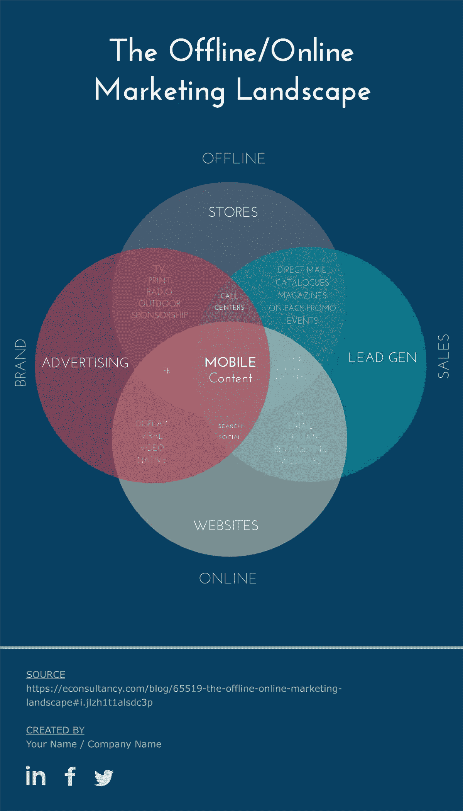

稍微复杂一点，这个例子可以使用四个圆或椭圆来比较它的四个不同部分。

以营销领域为例。每个圆圈代表营销的一个不同方面，相互连接的部分代表每个方面使用的格式。

# 7.菱形/矩形模板

四主题模板的一个变体，这个特殊的例子可以用来给你的视觉效果增加一些亮点。

菱形/矩形模板包括重叠(你猜对了)菱形或矩形，而不是圆形，允许不同的外观和眼睛容易跟随的轨迹。

这些模板也可能相对复杂。举个例子，这张关于狗品种的钻石文氏图。图表为每个矩形列出了不同的特征，然后在里面列出了具有这些特征的犬种，或者它们的组合。通过这些钻石的多重连接，可以展示各种不同的例子，混合的颜色和直线有助于移动眼睛。

# 8.星形维恩图模板

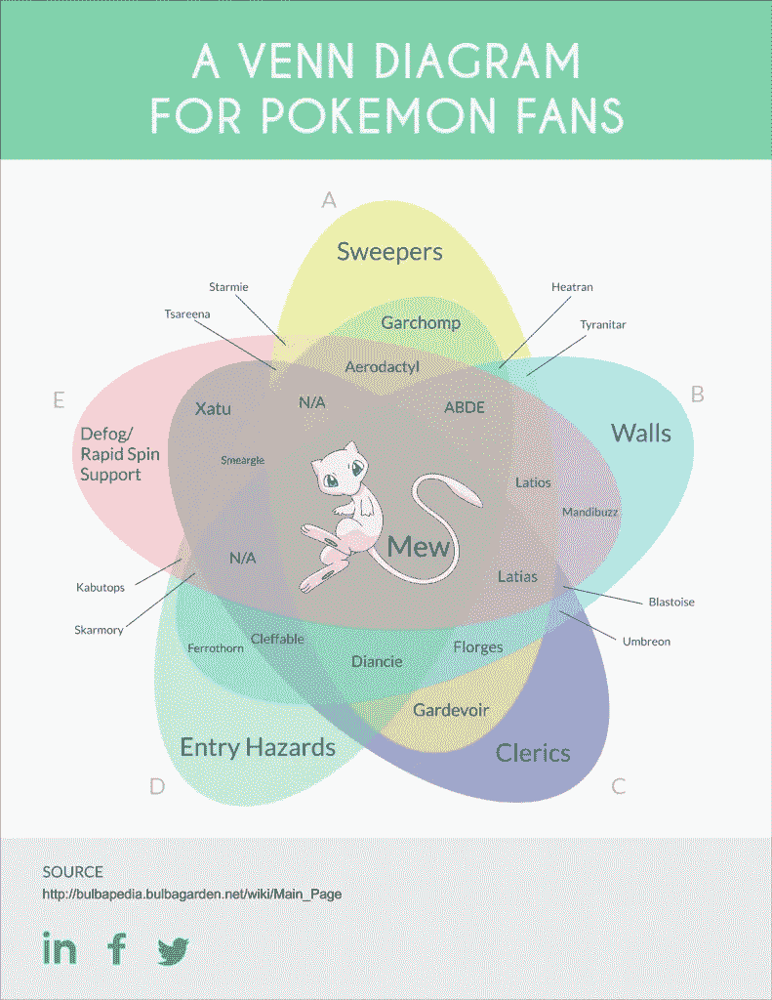

想要一些真正复杂但又有趣的东西吗？试着创造一个明星。

这个“星星”是由五个不同的椭圆组成的，所有的椭圆都以不同的方式重叠在一起。这可以让你看到五个主题如何相互作用，创造出各种独特的选择。

因为这个模板相当复杂，所以尽量让它简单易懂。例如，对每个椭圆进行颜色编码，用混合的颜色代表两个独立对象之间的公共区域，或者创建一个标签系统，使交互更容易跟踪。

# 9.奥林匹克模板

这个五个主题的文氏图对任何体育迷来说都是很棒的，它用圆环创造了一个像奥运会标志一样的图像。

当然，每个环代表一个不同的主题，它们相互交叉的地方显示了主题是如何互动的。虽然比“明星”的例子更容易理解，但它也允许更少的互动，所以确保每个主题都是最有效的。

这可以很好地用来展示某些概念如何与其他概念相互作用。例如，您可以显示故事情节中的两个元素如何相互关联，以及另一个单独的元素如何仅与一个元素相关，等等。

# 10.多层文氏图

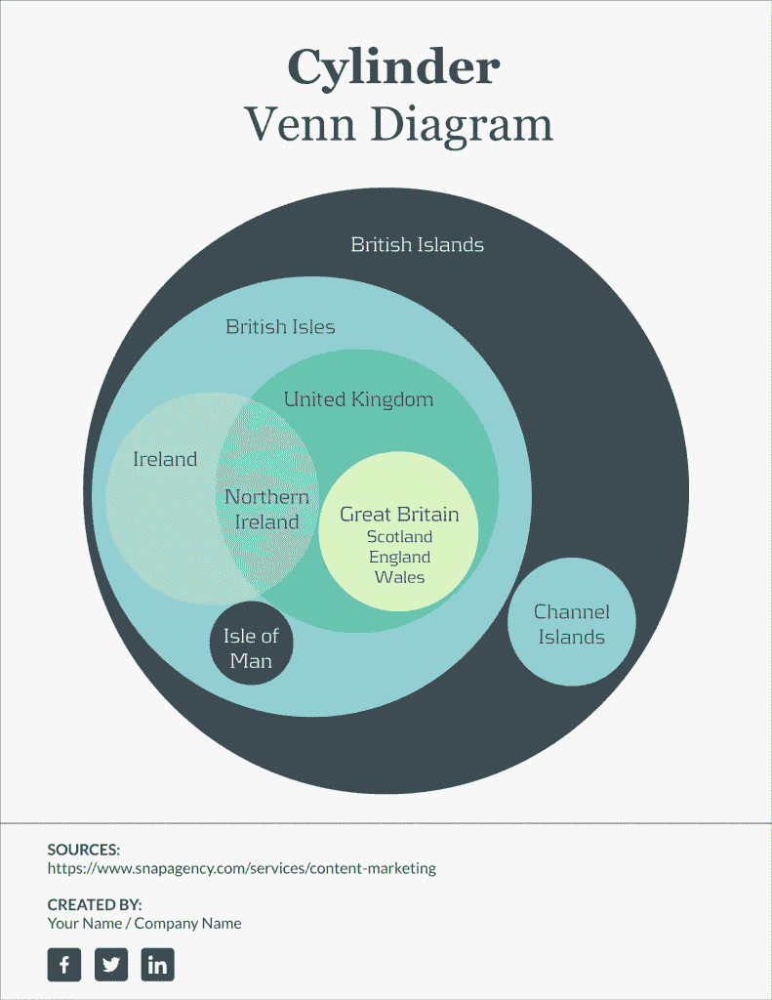

用您自己的信息自定义此模板。[免费下载](https://dashboard.visme.co/dashboard/template/infographics/1425276896)

如果你想对维恩图有一点不同的方法，多层模板可能是正确的选择。在这个模板中，您从一个大的外部圆开始，然后在内部嵌套较小的圆。外面的圆圈通常包含一个主题，嵌套的圆圈，而不是包含主题本身，显示每个新添加的内容如何改变原来的内容。

看看这个圆筒文氏图。它着眼于英国各岛屿之间的关系。每个圆圈代表一个不同的区域；一些包含在另一些中，而另一些作为单独的实体出现。

# 11.3D/嵌套模板

如果你想要一些突出的东西，这种类型的文氏图可以很好地工作。它在执行中使用了类似于多层模板的方法，只是它采用了 3D 嵌套图像的形式。

这个模板让你变得更有创造力。例如，您可以使用实际的嵌套玩偶来玩“主题中的主题”方面，或者使用地球各层的图表来显示每个层如何相互作用。

# 12.电弧维恩图模板

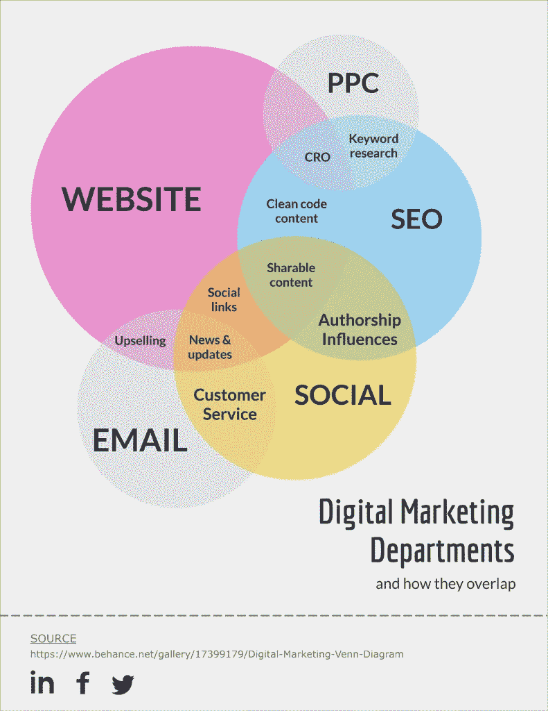

这个模板的主要兴趣在于各种主题如何与单个主题互动，但它以一种非常有趣的方式进行互动:与主题相关的圆圈沿着最大的圆圈的边缘上升，随着它们的上升而变大。

这是一个很好的方式来展示每个主题与主要主题的交互的重要性，最小的主题最不重要，最大的主题最重要。它还可以用来显示与焦点交互的不同主题的复杂性或数量。

# 13.备选尺寸图

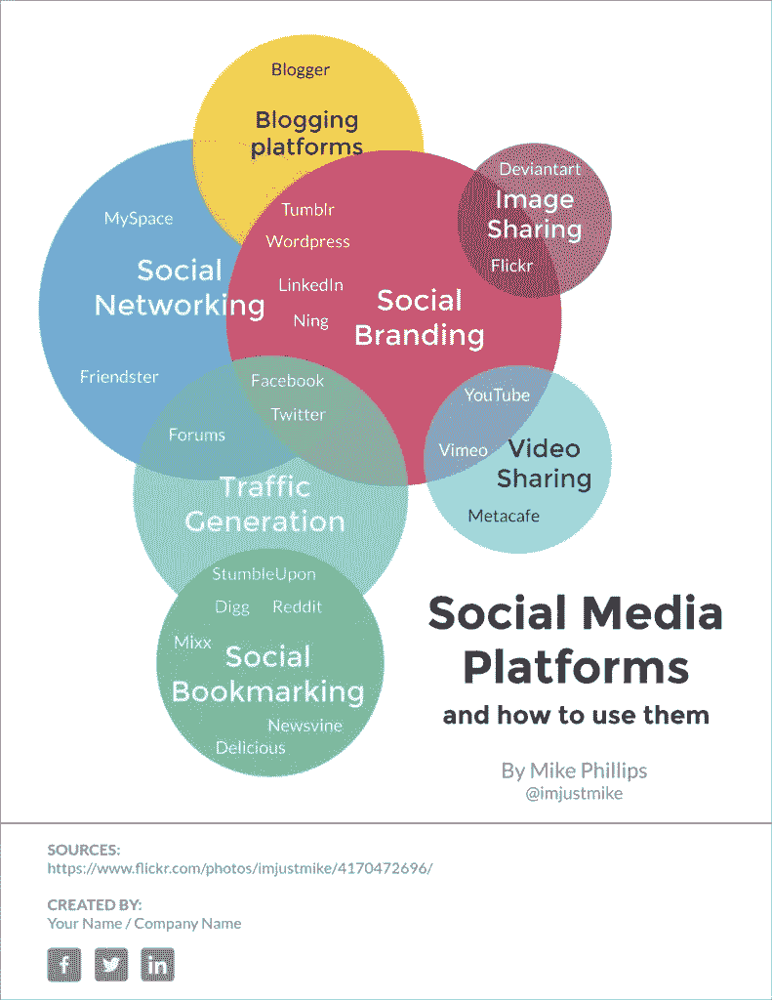

类似于“弧形”模板，这个模板使用不同大小的圆来获得一个点；与前者不同，这个模板展示了它们*和*是如何互动的。

很像弧形文氏图，这可以显示不同主题的重要性或相对大小。

这是一个特别好的例子，集中在社交媒体平台。中心圈(社交品牌)与它之外的其他几个互动，所有这些都列出了最适合给定组合的社交媒体网站。

# 14.基于图片的维恩图

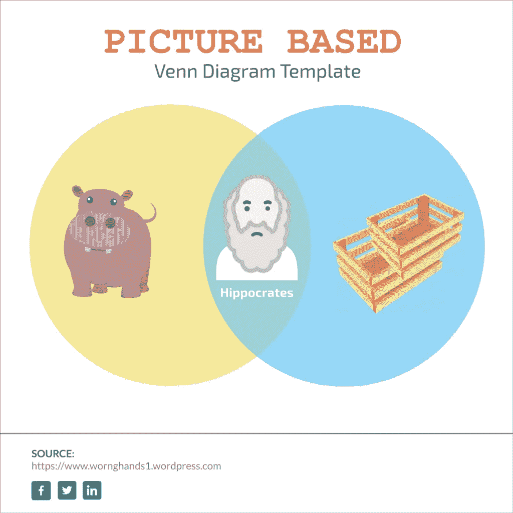

一张图片可以表达千言万语，那么还有什么比使用图片更好的方式来展示主题之间的互动呢？

这个模板通常使用很少的文字，而是让图像来说话。例如，这幅画幽默地展示了河马和板条箱的组合。

你可以用其他有创意的例子来解释主题，比如把两个不同主题的图片放在外面的圆圈里，然后让连接点成为一个完全不同的图片，代表两者结合后产生的东西。

# 15.混合文氏图

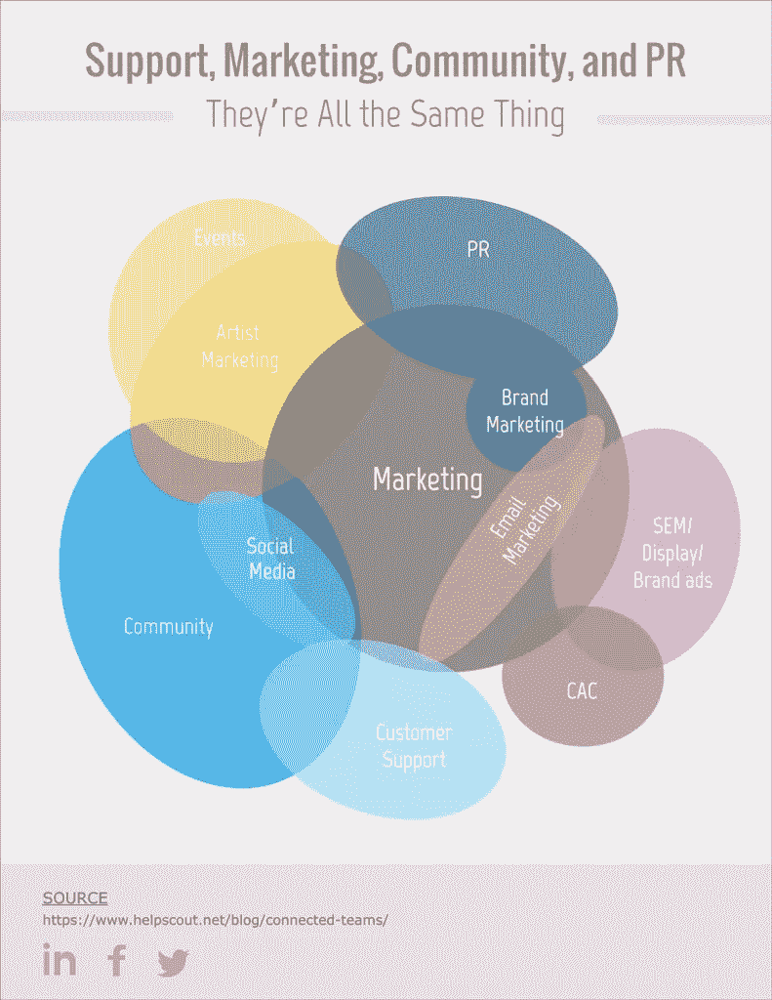

用您自己的信息自定义此模板。[免费下载](https://dashboard.visme.co/dashboard/template/infographics/1425276900)

只有一种风格不适合你？尝试混合几种不同的风格，以获得您想要的效果。例如，你可以将两个圆形和一个多层组合起来，展示一个组合的多重效果如何渗透到另一个主题中。

一个很好的例子是由[伊丽莎白托比](https://www.helpscout.net/blog/connected-teams/)创作的，她将嵌套和交替的尺寸结合成一个复杂的、多面的视觉效果。

这些往往非常复杂，所以要确保你的观众能跟上信息的呈现。

# 16.三组欧拉图

欧拉图类似于维恩图，因为它们说明了两个或多个主题，但在一个关键特征上有所不同:至少有一个主题与另一个主题不重叠。这些对于展示两个主题的不同非常有用。

# 17.两组欧拉图

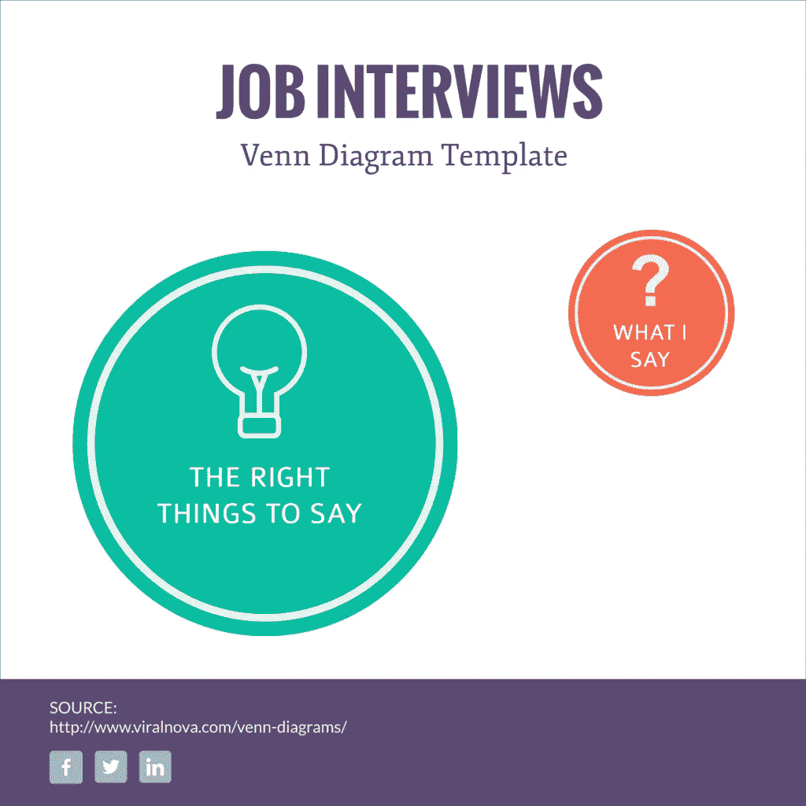

用您自己的信息自定义此模板。[免费下载](https://dashboard.visme.co/dashboard/template/infographics/1425276902)

欧拉图可以单独使用(例如让两个圆靠在一起，但不重叠)，也可以与维恩图结合使用(例如让两个圆重叠，一个圆放在更远的地方，如前面的例子所示)。对它们进行测试，看看使用这样的图表是否适合您的项目。

# 轮到你了

这些只是你可以修改维恩图模板来显示概念之间关系的几种方法。有哪些你喜欢的模板，或者在上面你有什么变化？在下面的评论区和我们分享吧！

*本帖* [*原版*](http://blog.visme.co/venn-diagram-template/) *最早出现在 Visme 的* [*视觉学习中心*](http://blog.visme.co/) *。*