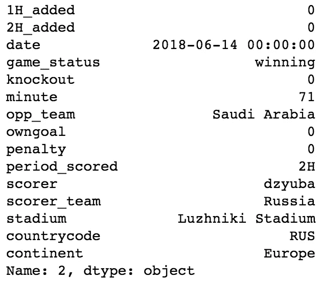
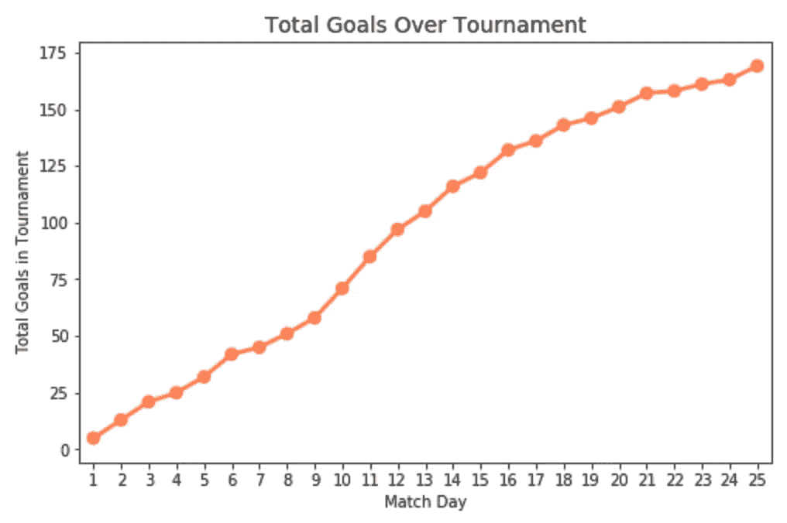
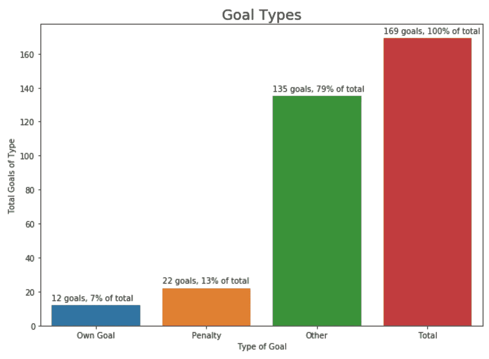

# 通过迭代器和 Zip 函数实现 2018 世界杯进球

> 原文：<https://towardsdatascience.com/2018-world-cup-goals-through-iterators-and-zip-functions-8e4c338adb28?source=collection_archive---------10----------------------->

## 所有进球的 Python EDA 技术要点

唷，这是多么精彩的一个足球月啊。随着法国成为充满冷门、假摔和进球的锦标赛当之无愧的赢家，让我们回顾一下整届锦标赛的 169 个进球。

The agony of having to wait 4 years for the next one.

使用的数据集来自于 [football.db](https://github.com/openfootball/world-cup.json) ，其中包含了其他真正有趣的数据集，供其他球迷参考。我还从[的国际足联 API](https://www.fifa.com/common/fifa-world-ranking/_ranking_matchpoints_totals.js) 中提取了一些国家排名和国际足联积分的数据。

和往常一样，数据集并不能立即用于分析。世界杯的主要数据集是按比赛组织的，每场比赛的进球由一个字典列表表示，如下所示:

这意味着我们必须循环所有的比赛，循环所有的进球，并填写其他比赛的具体信息。通过一些功能工程和团队特定信息的合并，我们将每个目标表示为一个字典，如下所示:

有了这个新形成的目标数据框架，是时候开始一些可视化了。从这个特定的 EDA 中，我有两个主要的技术收获，都围绕着 zip 函数。

## 1.通过元组对字典进行排序

在计算每场比赛的平均进球数并根据结果创建一个字典后，它看起来像这样:

理想情况下，我们希望以降序来绘制这些值，因此需要在这个字典中进行排序。

要对字典进行排序，必须运行排序函数，并使用 lambda 函数来确保键和值对被排序在一起。元组的结果列表如下所示:

出于绘制国家平均值图表的目的，将元组中的数据分为 x 值列表和 y 值列表会有所帮助。

基本的 zip 函数有助于跨可重复项聚合元素。

什么是可迭代的？基本上任何可以循环的东西。

下面是一个简单的例子，其中一个迭代器的第一个元素与第二个迭代器的第一个元素匹配。这在迭代器的长度上是连续的。将返回一个包含元组的迭代器，可以转换成列表。

zip 函数也可以解包“压缩”的结果。通过使用*操作符，我们可以将元素赋回给它们各自的迭代器。

正是使用这种技术，我们对 sorted_average 列表进行解包，以获得按所需顺序排列的国家列表和平均值列表。

## 2.通过 ax.annotate 创建自定义数据标签

我原以为添加数据标签可能是另一种类似于 matplotlib.pyplot.xlabel 或 matplotlib.pyplot.ylabel 的方法。

让我们以标记每个体育场的进球为例。

要显示数据标签，需要两个迭代器:一个迭代器包含对图上补丁的引用，另一个迭代器包含所需的标签。补丁是指图表上的颜色补丁，在条形图的情况下是每个单独的条。因为我们希望标签是每个体育场的进球数，所以我使用 goals_df['stadium']的值。value_counts()。

请注意，如果我们想要显示每个体育场的名称，我们应该使用 goals_df['stadium']。value_counts()。返回带有索引值的迭代器。

现在，我们遍历图中的每个元素，并调用 ax.annotate()来添加标签。我们使用 ax.patches(返回所有补丁的迭代器)和体育场列表作为参数，循环遍历 zip 函数生成的聚合迭代器。

这意味着每次我们调用 ax.annotate()时，都会调用正确的补丁和标签对。使用 p.get_x()和 p.get_height()值将标签居中，这样就完成了！

现在我们已经讨论了一些技术问题，目标告诉了我们什么？

## 1.欧洲是得分最高的大陆

欧洲约占本届锦标赛总进球数的 60%。考虑到有 14 支欧洲球队参加了世界杯，这是意料之中的。他们也比其他大洲打了更多的比赛，因为他们进入了锦标赛的后几轮。

## 2.单个欧洲球队在总进球数和平均进球数排行榜上名列前茅

自然地，欧洲各队在进球数排行榜上名列前茅，锦标赛中的前 5 名射手都来自欧洲。巴西是继比利时、法国、克罗地亚、英格兰和俄罗斯之后第一个溜进排行榜的非欧洲球队。

欧洲球队的进球能力不应该仅仅归功于他们踢了最多的比赛。他们最终也超过了平均每场比赛的进球数。

突尼斯出人意料地排在第七位，领先于另一个非欧洲竞争者巴西。

## 3.高分淘汰赛

小组赛阶段的总进球数远远超过淘汰赛阶段并不奇怪，因为前者有 48 场比赛，后者有 16 场。

每场比赛的平均进球数显示，淘汰赛的得分更高，平均为 2.94 球，而小组赛为 2.54 球。

## 4.大多数进球都是在比赛进行到一半时打进的

比赛日 10、11 和 12 是得分最高的比赛日。把这归因于比利时和突尼西亚的先发制人心态，或者巴拿马的防守在哈里·基恩面前的无能为力。

## 5.乌龙球和点球的出现

虽然对“乌龙球”成为本届世界杯最佳射手没有一个合理的解释，但点球得分的显著上升很可能要归因于 VAR 的使用。

## 6.索契得到了款待

索契的观众在小组赛阶段观看了两场最精彩的比赛:葡萄牙对西班牙，比利时对突尼斯。两场比赛一共进了 13 个球。

## 7.国际足联的排名并不能很好地预测得分

通过将每个国家的平均进球数与他们的国际足联分数进行对比，我们看到排名靠前的球队并没有都达到标准。

我们用每场比赛的平均进球数和国际足联积分的中值来过滤掉令人失望的表现者和超额完成者。

在这些球队中，俄罗斯是一个巨大的惊喜，东道主在第一场比赛中摧毁了沙特阿拉伯，然后在 16 强赛中震惊了西班牙。突尼斯队积极的进攻赢得了球迷的支持，而日本队在令人心碎的最后一分钟输给比利时之前，在整个比赛中都保持了自己的风格。

毫无疑问，德国队在本届世界杯上令人失望，受到了冠军的诅咒，未能从小组中出局。进球对他们来说已经枯竭，他们拥有球队中最低的得分记录之一。莱万多夫斯基未能激发波兰队的努力，而墨西哥队击败德国队的比赛也没有延续他们在随后比赛中的得分记录。

随着本届世界杯的结束，我所代表的克罗地亚队在最后一关倒下了，我现在只希望路卡·莫德里奇赢得一个当之无愧的金球奖。

感谢阅读！