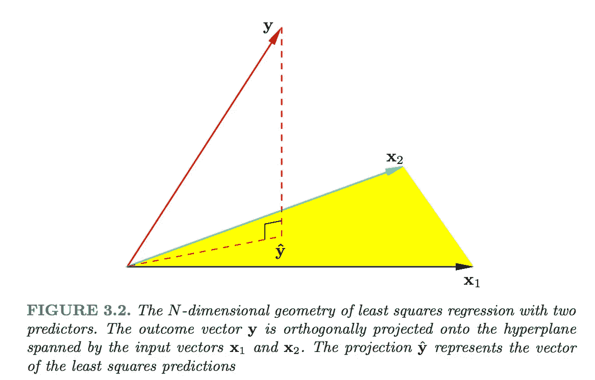

# 关于简单线性回归你不知道的 3 件事

> 原文：<https://towardsdatascience.com/3-things-you-didnt-know-about-simple-linear-regression-b5a86362dd53?source=collection_archive---------5----------------------->

线性回归将输入线性映射到输出。假设作为观测数据基础的数据生成过程是 *y* = X𝛽 + 𝜖，其中

*   *y* 是长度为 *n* (数据点数)的响应向量
*   x 是一个由( *p* +1)个独立变量组成的 *n* 矩阵
*   𝛽是回归系数的( *p* +1)向量
*   𝜖也是每个元素 iid ~ N(0,𝜎的( *p* +1)个扰动向量

x 中的每一行有 *p* 个元素加上常数 1，常数 1 方便地包括系数向量𝛽.中的截距项在没有使用截距项的问题中，1 被省略(通常是特定于应用的决定)。𝜖是不可知的，所以我们基于 x 对 *y* 建模所能做的最好的事情就是用 *b* 来估计𝛽，即 *ŷ* = X *b* ，其中 *ŷ* 是对 *y* 的估计。

为了拟合训练数据，我们最小化残差平方和，其中残差被定义为 *y* - *ŷ* 。由于 *ŷ* = X *b* ，平方和可以写成(*y*-x*b*)ᵀ(*y*-x*b*)。对 *b* 的每个元素进行微分(*y*-x*b*)ᵀ(*y*-x*b*)给出了著名的正规方程:Xᵀ( *y* -X *b* ) = 0。假设 XᵀX 是可逆的， *b* = (XᵀX)- Xᵀ *y* 。

线性回归的几何解释也许更直观。X 的列向量跨越一个子空间，最小化残差相当于将 y 正交投影到这个子空间上，如下图所示。通过正交性，可以立即得到正规方程。



Elements of Statistical Learning, p46

有了这些事实，我们就可以得出带有截距和斜率系数的简单线性回归的某些性质。我们将引用 R 中的一个线性回归示例来仔细检查这些属性。

```
> set.seed(13)
> n = 20; x = 1:n; y = 2*x + rnorm(n, sd = 1)
> model = lm(y~x)
> summary(model)Call:
lm(formula = y ~ x)Residuals:
     Min       1Q   Median       3Q      Max 
-1.89019 -0.47625  0.01282  0.77558  1.48740Coefficients:
            Estimate Std. Error t value Pr(>|t|)    
(Intercept)  0.61809    0.43205   1.431     0.17    
x            1.95829    0.03607  54.296   <2e-16 ***
---
Signif. codes:  0 ‘***’ 0.001 ‘**’ 0.01 ‘*’ 0.05 ‘.’ 0.1 ‘ ’ 1Residual standard error: 0.9301 on 18 degrees of freedom
Multiple R-squared:  0.9939, Adjusted R-squared:  0.9936 
F-statistic:  2948 on 1 and 18 DF,  p-value: < 2.2e-16
```

1.  残差之和为零。由正规方程 xᵀ(*y*-x*b*)= xᵀ(*y*-*ŷ*)= 0。由于 x 有一列 1，1ᵀ( *y* - *ŷ* ) = 0。我们可以用`sum(model$residuals)`在 R 中进行健全性检查。再者，X 中任意一列与残差的点积为 0，可以用`sum(x*model$residuals)`来查。
2.  斜率项的 t 检验与 F 检验等效，因为它们都有相同的零假设:斜率为 0。这就是为什么它们的 p 值在上面的总结中是匹配的，2e-16 和 2.2e-16。来自具有 *k* 自由度的 t 分布的随机变量 *T* 等于*z*/sqrt(𝜒_ {*k*}/*k*，其中𝜒 _{ *k* }是具有 *k* 自由度的卡方随机变量。平方 *T_* ( *k* )给出 *F* (1 *，k* )随机变量:*t*_ {*k*} =*z*/(𝜒_ {*k*}/*k*)=(𝜒_{1}/1)/(𝜒_ {*k*}/*k*我们可以确认，对汇总中 x 项的 t 值(54.296)求平方，得到报告的 F 统计量(2948)。**
3.  决定系数 *R* 等于 *x* 和 *y* 之间相关性的平方。 *R* 测量由 *x* 解释的 *y* 的变化比例。一个证明 y 与 *ŷ* 的相关性的平方等于 *R* 这里是[这里是](https://economictheoryblog.com/2014/11/05/proof/)，对于简单线性回归来说 *y* 与 *ŷ* 的相关性与 *y* 与 *x* 的相关性相同。请注意`cor(x,y)^2`给出的值与“多 R 平方”旁边报告的值相同:0.9939。