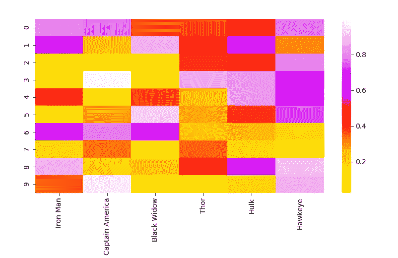
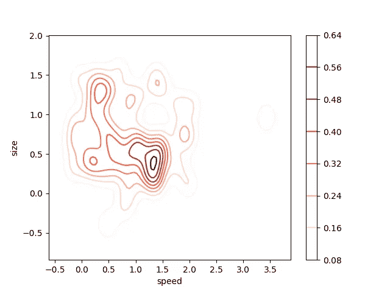
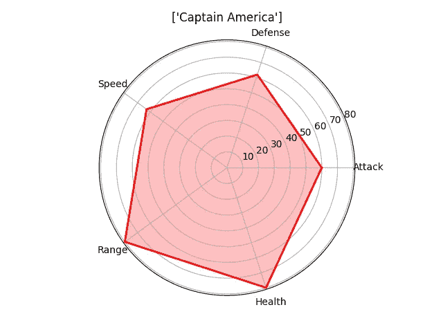
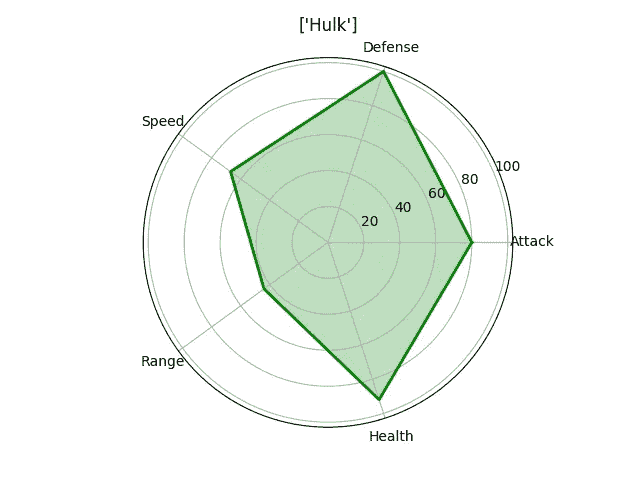
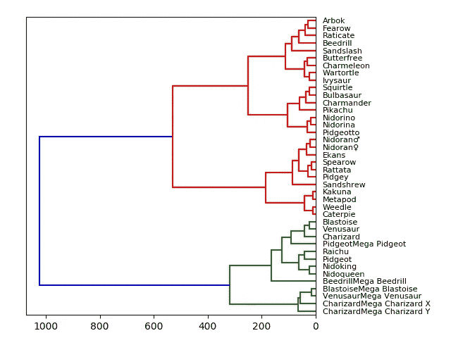

# 4 更快速简单的 Python 数据可视化代码

> 原文：<https://towardsdatascience.com/4-more-quick-and-easy-data-visualizations-in-python-with-code-da9030ab3429?source=collection_archive---------8----------------------->

> 想获得灵感？快来加入我的 [**超级行情快讯**](https://www.superquotes.co/?utm_source=mediumtech&utm_medium=web&utm_campaign=sharing) 。😎

数据可视化是任何数据科学或机器学习项目的重要组成部分。您通常会从探索性数据分析(EDA)开始，以获得对数据的一些见解，创建可视化确实有助于使事情更清楚、更容易理解，尤其是对于较大的高维数据集。在项目接近尾声时，能够以一种清晰、简洁、有说服力的方式展示最终结果是非常重要的，这样观众(通常是非技术客户)才能理解。

你可能已经看过我的上一篇文章 [*用 Python 编写的 5 个快速简单的数据可视化代码*](/5-quick-and-easy-data-visualizations-in-python-with-code-a2284bae952f) ，其中我们经历了 5 个基本的可视化:散点图、线图、直方图、条形图和箱线图。这些都是简单而强大的可视化，你绝对可以用来从你的数据集中提取伟大的洞察力。在这篇文章中，我们将会看到更多的数据可视化！这些将会更详细一些，在你完成了上一篇文章中的基本内容之后，你可以使用它们从你的数据中提取更深层次的信息。

# 热图

热图是数据的矩阵表示，其中每个矩阵值用一种颜色表示。不同的颜色代表不同的量级，矩阵指数将被比较的两个项目或特征联系在一起。热图非常适合显示多个特征变量之间的关系，因为您可以直接看到颜色的大小。您还可以通过查看热点图中的其他点来了解每个关系与数据集中其他关系的对比情况。颜色真的提供了简单的解释，因为它是如此直观。

现在说说代码。与 matplotlib 相比,`seaborn`库可以用于更高级的绘图，通常是需要更多组件的东西，如许多颜色、图形或变量。`matplotlib`用于显示图形，`numpy`用于生成数据，`pandas`用于处理数据！绘图只是一个简单的 seaborn 函数，如果你发现一些视觉上特别愉悦的东西，我们还可以设置颜色映射。

# 2D 密度图

2D 密度图是 1D 版本的简单扩展，增加了能够看到两个变量的概率分布的好处。让我们看看下面的 2D 密度图。右边的图例使用*颜色*代表每个点的概率。最大的可能性，也是我们数据的集中点，似乎是 0.5 左右的大小和 1.4 左右的速度。如你现在所知，2D 密度图对于快速识别我们的数据相对于*和*两个变量最集中的地方非常有用，而不是像 1D 密度图那样只有一个变量。当你有两个对你的输出非常重要的变量，并且想看看它们如何一起对输出分布贡献*时，这是特别强大的。*

**

*seaborn 的代码也非常简单！这一次我们将创建一个偏态分布来使事情变得有趣。如果你觉得某些颜色和/或阴影在视觉上更令人愉悦，大多数可选参数都是为了让事情看起来更清楚。*

# *蜘蛛图*

*蜘蛛图是显示一对多关系的最佳方式之一。也就是说，你可以绘制和查看几个变量相对于单个变量或类别的值。在蜘蛛图中，一个变量相对于另一个变量的显著性是清楚而明显的，因为面积和长度在特定方向上变得更大。如果你想看几个类别是如何与这些变量相关联的，你可以把它们并列起来。在下面的图表中，很容易比较复仇者的不同属性，并看到他们各自的优势所在！(注意这些数据是随机设置的，我没有偏向任何一个复仇者；) )*

******

*这一次，我们将能够直接使用 matplotlib 来创建我们的可视化，而不是 seaborn。我们需要计算每个属性所处的角度，因为我们希望它们沿着圆的圆周等距分布。我们将在每个计算出的角度放置标签，然后将该值绘制为一个单点，其与中心的距离取决于其值/大小。最后，为了清晰起见，我们将使用半透明颜色填充连接属性点的线条所包含的区域。*

# *树形图*

*我们从小学就开始用树形图了！它们是自然和直观的，这使得它们很容易解释。有直接连接的节点具有紧密的关系，而有许多连接的节点不是很相似。在下面的可视化中，我绘制了一小块来自 Kaggle 的 [*口袋妖怪的统计数据*](https://www.kaggle.com/abcsds/pokemon/data) :*

*HP，攻击，防御，特殊攻击，特殊防御，速度*

*因此，最势均力敌的口袋妖怪 *stats wise* 将紧密地连接在一起。例如，我们看到在顶部，阿柏怪和法罗是直接相连的，如果我们检查数据，阿柏怪共有 438 个，而法罗有 442 个，非常接近！但是一旦我们转移到 Raticate，我们得到的总价值是 413，这与阿柏怪和费罗是完全不同的，这就是为什么他们是分开的！随着我们沿着树向上移动，口袋妖怪越来越基于相似性被分组。绿色组中的口袋妖怪彼此之间的相似度比红色组中的任何东西都要高，即使没有直接的绿色联系。*

**

*对于树形图，我们实际上要使用 Scipy！读入数据集后，我们将去掉字符串列。我们在这里这样做只是为了让我们的形象化，但在实践中，为了更好的比较和结果，将这些字符串转换成分类变量会更好。我们还设置了数据框索引，以便我们可以正确地使用它作为引用每个节点的列。最后，在 Scipy 中计算和绘制树是一个简单的一行程序！*

# *喜欢学习？*

*在[推特](https://twitter.com/GeorgeSeif94)上关注我，我会在那里发布所有最新最棒的人工智能、技术和科学！也在 [LinkedIn](https://www.linkedin.com/in/georgeseif/) 上和我联系吧！*