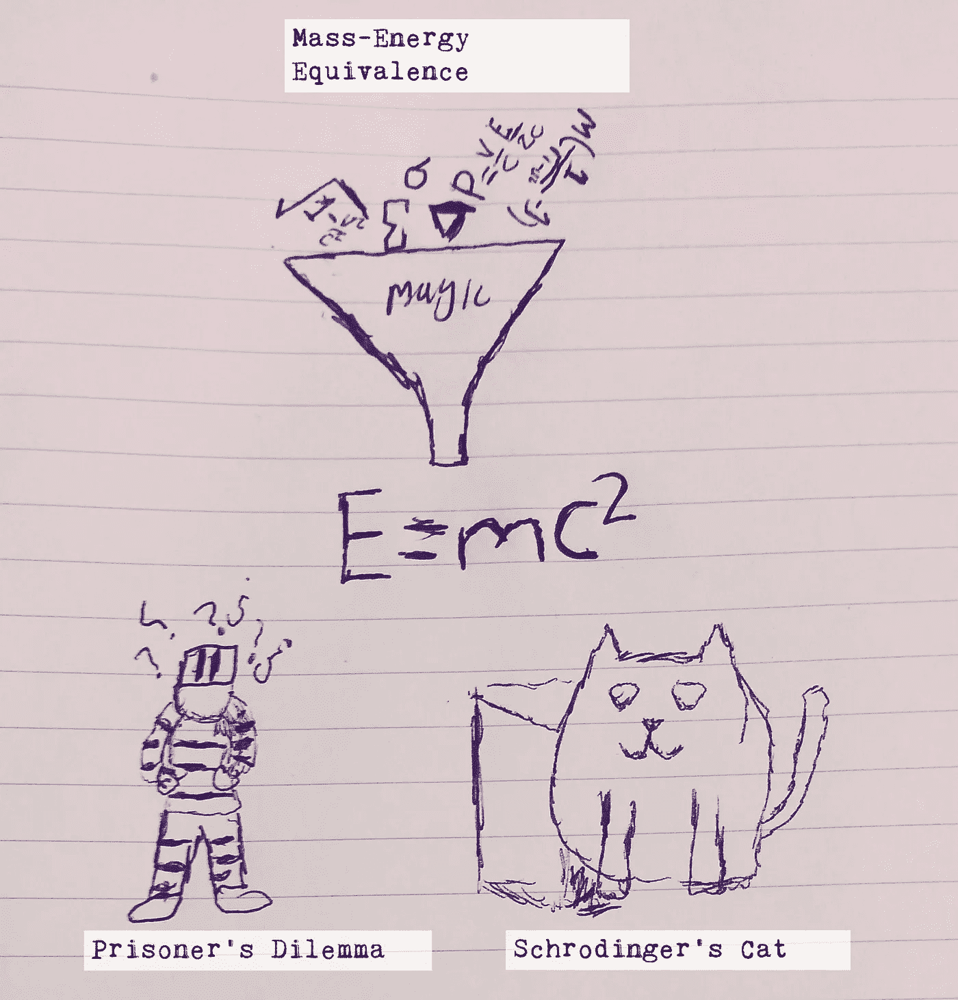
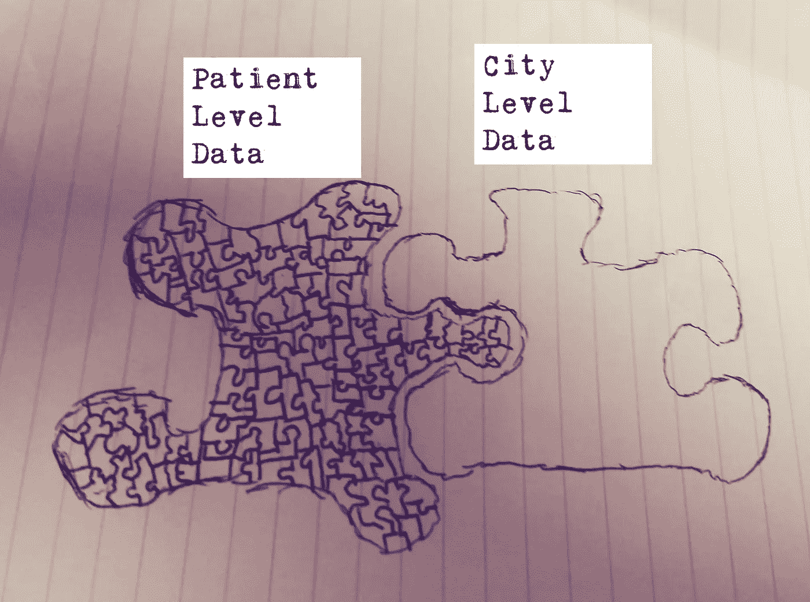
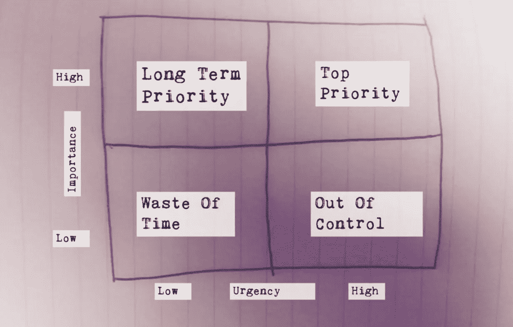

# 4 每个数据科学家都应该学习的技能

> 原文：<https://towardsdatascience.com/4-must-have-skills-every-data-scientist-should-learn-8ab3f23bc325?source=collection_archive---------2----------------------->

本·罗戈扬

我们想继续上一篇关于如何让[成为一名数据科学家](https://www.theseattledataguy.com/grow-data-scientist/)的文章，学习一些高级数据科学家应该具备的其他技能。我们希望通过为[高级数据科学家](https://www.datascienceweekly.org/articles/the-difference-between-junior-mid-level-and-senior-data-scientist-jobs)设定明确的目标，在业务经理和技术数据科学家之间架起一座桥梁。这两个实体不得不面对非常不同的问题。当他们在同一页上时，双方都受益。这就是为什么前一篇文章如此关注交流。这看起来很简单，但是随着每年新技术的不断涌现，技术和业务之间的差距不断扩大。因此，我们发现经理和数据科学家有一个清晰的期望路径非常重要。

Both business and IT knowledge are very specialized. However, due to this specialization of skills, most businesses see a gap between the two specializations. Our role is to help fill it!

我们发现，当数据科学家开始他们的旅程时，他们非常关注技术方面是有益的。这意味着编程、查询、数据清理等。然而，随着数据科学家的成长。他们需要更多地关注设计决策和与管理层的沟通。这将成倍增加更有经验的数据科学家的知识的影响。而不是陷入日复一日的编码中。他们可以做出更高层次的决策，并在年轻的数据科学家遇到困难时帮助他们。当更有经验的数据科学家利用他们的经验来帮助做出简化复杂系统、优化数据流的设计决策，并帮助做出最相关项目的决策时，他们自己和他们的公司都会受益更多。

# 能够简化复杂的事物

数据科学家倾向于在每个问题和每个解决方案中使用他们知道的每种技术和算法。反过来，这产生了难以维护的复杂系统。

数据科学确实需要复杂和抽象的建模以及过多的复杂技术(从 [Hadoop](https://en.wikipedia.org/wiki/Apache_Hadoop) 到 [Tensorflow](https://www.tensorflow.org) )。鉴于这个领域的复杂性，开发复杂的系统和算法是很有诱惑力的。有一种诱惑，涉及 4 或 5 种不同的技术，并利用每一个新的热门算法或框架。然而，像大多数其他领域涉及一些工程。出于多种原因，降低复杂性通常更好。

*If* If [John von Neumann](https://en.wikipedia.org/wiki/John_von_Neumann), [Erwin Schrödinger](https://en.wikipedia.org/wiki/Erwin_Schrödinger) and [Albert Einstein](https://en.wikipedia.org/wiki/Albert_Einstein) can help us understand the complexities of their very math and physics driven fields, then we data scientists can’t hide behind complexity.*,* [*Erwin Schrödinger*](https://en.wikipedia.org/wiki/Erwin_Schrödinger) *and* [*Albert Einstein*](https://en.wikipedia.org/wiki/Albert_Einstein) *can help us understand the complexities of their very math and physics driven fields, then we data scientists can’t hide behind complexity.*

工程师的作用是简化任务。如果你曾经建造过或见过一台鲁布·戈德堡的机器，你就会明白把一项简单的任务过度工程化的想法。一些数据科学家的算法和数据系统看起来更像是用胶带和口香糖粘在一起的疯狂的捕鼠器，而不是优雅但有效的解决方案。制造更简单的系统意味着随着时间的推移，系统将更容易维护，并为未来的数据科学家提供根据需要添加和删除模块的能力。如果你创建了一个简单的框架，下一个接替你位置的数据科学家会感谢你的。另一方面，如果你使用 3 种不同的语言，2 种数据源，10 种算法，却没有留下任何文档，那么你就会知道未来的工程师正在低声咒骂你的名字。

简单的算法和系统也允许更容易的加法和减法。因此，随着技术的变化和更新的需要，或者一个模块需要被取出。一个贫穷的未来数据科学家不会被你的代码困在玩一个叠衣服的游戏中。如果我删除这段代码，一切都会分崩离析吗(你听说过[技术债](https://martinfowler.com/bliki/TechnicalDebt.html)吗？)

# 了解如何在没有主键的情况下网格化数据

强大的数据专家应该提供的一个重要价值是将可能没有内在主要或明显联系的数据集捆绑在一起。数据可以代表一个人或企业的日常互动。拥有在这些数据中发现统计模式的能力使数据科学家能够帮助决策者做出明智的选择。然而，您希望结合在一起的数据并不总是在同一个系统上或相同的粒度上。

那些处理过数据的人会知道，数据并不总是很好地集成在一个数据库中。财务数据通常与 IT 服务管理数据分开保存，外部数据源可能没有相同的聚合级别。这是一个问题，因为发现数据中的价值有时需要来自其他部门和系统的数据。

Data meshing requires building pieces at the same level of granularity. One way to think of it is having one large puzzle piece being joined together by another large piece created by lots of smaller puzzle pieces of data.

例如，如果您获得了医疗索赔、信用卡和邻近地区的犯罪率，并想弄清楚这些社会经济因素是如何影响患者的，该怎么办？。一些数据集可能是一个人一个人的水平，而其他的可能是一个街道或城市的水平，没有明确的方法来连接数据集。进行的最佳方式是什么？这就变成了一个设计问题，一个必须记录，两个必须思考。

每种情况都是不同的，因为有许多方法来网格化数据。它可以基于地区、特征、消费习惯等。这就是为什么经验很重要。一个有经验的数据科学家对如何连接数据有直觉。主要是因为他们已经尝试了上百种不奏效的方法。通常情况下，你越能把两个数据集逐个人地结合起来就越好。因此，如果地区或城市恰好是连接的最低级别(最低级别是指数据的粒度，如个人级别、家庭级别、街道级别、城市级别、州级别或许多其他分组)，那么这将是一个很好的起点。

# 能够对项目进行优先排序

作为一名数据科学家，你必须知道如何解释可能不会成功的项目的 ROI。这只是关于良好的直接沟通(我们的团队永远不会停止谈论沟通)。这是关于能够清楚地表达价值以及区分长期和短期目标的优先次序(再说一遍，说起来容易做起来难)。

团队总是有比他们能处理的更多的项目和项目请求。更有经验的团队成员需要带头，帮助他们的经理决定哪些项目实际上值得承担。在可能没有最高投资回报率但有很大成功机会的快速项目和更有可能失败但也提供很大投资回报率的长期项目之间有一个微妙的平衡。

在这种情况下，最好有一个决策矩阵来帮助简化过程。

项目的经典决策矩阵之一是一个重要性和紧迫性的 2 乘 2 矩阵。这个矩阵可以在大学的大多数商业课程中找到，而且非常简单。这就是它伟大的原因！

我曾在拥有非常聪明的人的公司工作过。然而，每个项目都被视为优先事项，如果你没有听说过这句话，我们就在这里说。

> 如果一切都是优先的，那么什么都不是。

Choosing the right projects requires making had calls. Not everything is a priority.

其他很多公司都有这个问题。这就是为什么对于数据科学团队中有经验的成员来说，清楚地阐明哪些项目真正应该现在做，而不是以后做是很重要的。因此，使用简单的矩阵就可以做到这一点。

(就像我们在上一篇文章中所说的，简洁很重要。使用矩阵来帮助指定 ROI 会有所帮助)。

当有简洁和直接的交流时，项目继续向前发展，信任建立起来。

# 能够开发健壮和优化的系统

制作一个在受控环境中运行的算法或模型是一回事。将一个健壮的模型集成到一个实时的处理大量数据的系统中是另一回事。根据公司的不同，有时数据科学家必须自己开发算法。然后要么是开发者，要么是机器学习工程师，负责把它投入生产。

然而，情况并非总是如此。较小的公司和团队可能会让数据科学团队将代码投入生产。这意味着算法需要能够以合理的速度管理数据流量。如果您的算法需要运行 3 个小时，并且需要实时访问。它不会投入生产。因此，良好的系统设计和优化是必要的。

As data grows, and more and more people interact with a system. It is important your model keeps up.

数据科学是一个复杂的领域，需要了解数据、统计、编程和主题。为了发展，数据科学家需要能够将这些复杂性简化并提取到算法中。他们需要能够更加专注于设计决策。这有助于最大化他们的知识和经验。

# 摘要

当高级数据专家超越他们的技术能力时，他们为自己和他们的公司提供最大的影响。他们带来的价值是他们的经验，它可以帮助指导年轻的开发人员做出更好的设计决策，并帮助管理人员做出更好的决策，决定哪些项目将有最好的投资回报。反过来，这放大了他们的参与对团队的影响。