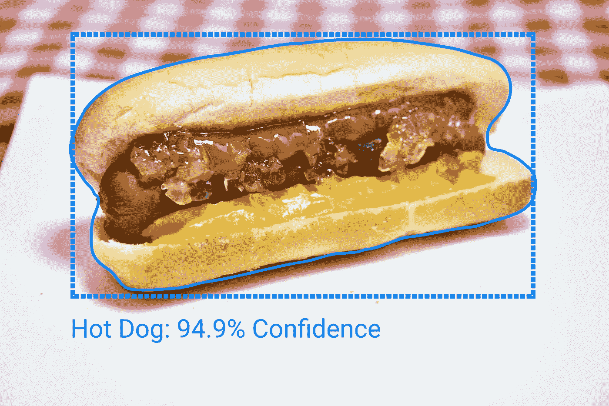
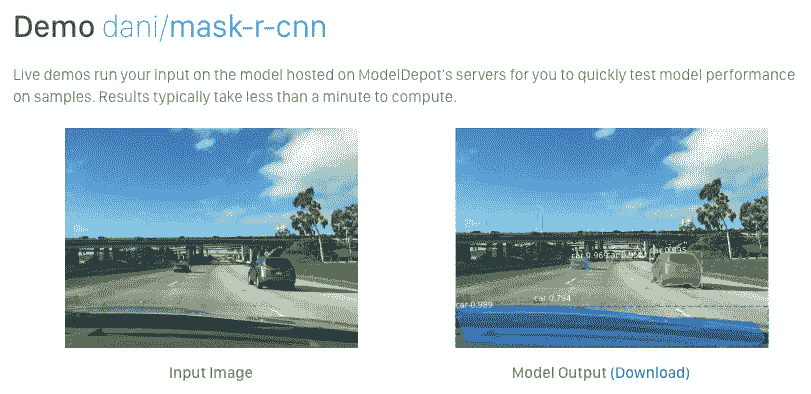

# 找到正确的深度学习模型的 4 个步骤

> 原文：<https://towardsdatascience.com/4-steps-to-finding-the-right-deep-learning-model-f35a9d7988b6?source=collection_archive---------5----------------------->

by Skitterphoto on [Pixabay](https://pixabay.com/en/binoculars-dusk-sunset-birding-1269458/)

## 首次应用深度学习时避免初学者的错误

如果你一直在寻求让你的应用程序具备机器学习能力，你会注意到**有大量的 ML 模型和模型实现，它们可能适合也可能不适合你的任务**。尤其是如果你对特定类型的模型不是很熟悉，那么选择你的项目采用什么样的模型实现可能会让*不知所措。*

作为[模型仓库](https://modeldepot.io)的一部分，在与数百名工程师和他们的 ML 项目交谈后，我整理了这 4 个步骤，当你选择下一个机器学习模式时，你应该明白！

# 1.理解问题域

Originally from [PublicDomainPictures.net](https://www.publicdomainpictures.net/en/view-image.php?image=121201&picture=hotdog-with-works)

虽然您可能正在构建热狗定位器，但您正在寻找的模型可能不被称为“热狗定位器”。用户和 ML 研究者对模型的不同看法会使我们很难找到正确的模型。

对于热狗定位问题，它是“计算机视觉”类别下的“对象检测”问题。事实上，还有一个数据集存在，它在热狗周围有边界框，叫做 [COCO](http://cocodataset.org/#home) ！

当你考虑你手头的问题时，把它转化成正确的 ML 术语的最简单的方法是考虑你的输入。是文字还是图片？这些通常分别对应于自然语言处理(NLP)或计算机视觉(CV)。从那里你会想更深入地研究那个领域，找出存在哪种子问题，比如 NLP 中的情感分类。此外，您可以探索可能已经包含感兴趣的项目的数据集(例如热狗)来缩小在该特定数据集上训练的模型的范围。有时，正确使用术语可能很棘手，因此使用用户友好的 ML 模型搜索工具，如 [ModelDepot](https://modeldepot.io) ，可以帮助您快速找到并理解对您的用例有帮助的模型。

# 2.找到“正确的”精确度

“Machine Learning” from [xkcd](https://xkcd.com/1838/)

显而易见，准确性是您应该非常关心的事情，但是简单地相信任何准确性数字都不会有好结果。在考虑准确性时，有几件事需要记住。

## 准确性度量

根据您正在解决的问题，有大量不同的指标。ML 中的每个特定问题域都有一组相关的标准度量。弄清楚哪些指标对你来说是最重要的，这一点极其重要！

例如，如果我们正在构建一个信用卡欺诈检测系统，并且只考虑`correct_predictions/all_predictions`(又名。准确性)我们可以简单地开发一个总是返回“非欺诈”的模型，并获得 99%的准确性，因为大多数交易都不是欺诈！因此，[为你的任务选择正确的指标很重要](https://www.kdnuggets.com/2018/04/right-metric-evaluating-machine-learning-models-1.html)！

## 报告的准确性

报告的精度是判断模型是否满足应用要求的良好开端。几乎总是，模型的原始论文将报告模型的准确性度量。如果他们使用的指标和你正在使用的指标不同，确保你理解他们使用的指标和你正在使用的指标之间的关系。但也要明白，他们的数据集可能与你手头的任务不同，他们的问题有 2%的改善最终对你来说可能不会太重要。

## 你自己的准确性

如果您发现一些似乎具有合理的报告准确性度量的东西，您将想要亲自测试该模型，以查看该模型将为您做得有多好。理想情况下，您有一个模型期望接收的输入测试集(例如。邮件、评论等。)和相应的预期输出。在您自己的数据上测试模型是确保它在您的用例中表现良好的最佳方式，尽管这也是最费力的方式。

In-Browser Live Demos on [ModelDepot](https://modeldepot.io/ml/demos)

有一些方法可以快速演示模型，比如使用 [ModelDepot 的在线演示功能](https://modeldepot.io/ml/demos)。您可以快速地向模型提供示例输入，并在不到一分钟的时间内看到模型的结果。您还可以在在线环境中试用该模型，如 [Google Colab](https://colab.research.google.com/notebooks/welcome.ipynb) 以跳过设置本地开发环境。

# 3.了解您的数据

根据你有多少数据或者愿意收集多少数据，你寻找模型的方法会有很大的不同！从头开始构建不是唯一的方法，实际上可能是最差的方法，这取决于您的数据！让我们深入一些案例。

## 我有很多数据

如果您有大量的训练数据，您会希望寻找具有易于访问的训练脚本的模型来从头开始训练您的模型。让 DL 模型收敛可能非常困难；为了让你的生活更轻松，你应该在 Github 上寻找看起来很活跃的项目。在一个模特周围有一个支持性的社区会对你有很大的帮助。

## 我有一些数据

如果你只有一些数据，你也许可以使用一种叫做“迁移学习”的训练技术。迁移学习允许您在类似的领域采用预先训练的模型，使用少量的训练数据来调整模型，使其能够很好地解决您的特定问题。您将希望寻找易于“剖析”和重新训练的预训练模型。你可以在 [Tensorflow Hub](https://www.tensorflow.org/hub/) 或 [Keras 应用](https://keras.io/applications/)找到一些。

## 我只有少数几个例子

别担心！举几个例子是一个很好的开始。寻找专门预先训练的模型，并使用您的示例作为“测试集”来评估这些模型对您的数据的执行情况。幸运的是，你可以在几个地方找到预先训练好的模型，例如每个框架的各种模型动物园: [Tensorflow](https://github.com/tensorflow/models) ， [Caffe](https://github.com/caffe2/models/) ， [ONNX](https://github.com/onnx/models) ， [PyTorch](https://pytorch.org/docs/stable/torchvision/models.html) 。 [ModelDepot](https://modeldepot.io) 还为预训练模型提供了一个更通用的搜索界面，以帮助选择正确的 ML 模型。

# 4.挑选建筑

Accuracy vs Speed Tradeoff (Figure 2 from [https://arxiv.org/pdf/1611.10012.pdf](https://arxiv.org/pdf/1611.10012.pdf))

我们现在可以看看模型背后的架构，如果 1)模型对您自己的数据具有可接受的准确性，2)很容易重新训练或带有预训练的模型。

## 精确度、速度和尺寸

最大的实际考虑之一是速度与精度的权衡。研究人员开发了各种各样的架构来匹配应用程序在现实世界中可能遇到的不同用例。例如，也许你的模型应该运行在计算受限的移动电话上，所以你可能正在寻找一个轻量级和快速的 MobileNet 架构。否则，如果您不受计算限制，但希望获得最佳精度，那么您可以使用最先进的技术来保证最佳精度，无论模型有多慢或多大。

一些型号可能会有轻量级的变体，如 [PSPNet50](https://modeldepot.io/oandrienko/pspnet50-for-urban-scene-understanding) vs 全 [PSPNet](https://modeldepot.io/hellochick/pspnet) ，它减少了层数，使其更快更薄。其他时候，你可以使用诸如[修剪](https://jacobgil.github.io/deeplearning/pruning-deep-learning)或[量化](https://sahnimanas.github.io/2018/06/24/quantization-in-tf-lite.html)的技术来使模型更小更快。

# 搞定了。

有了这四个步骤，你就可以从知道你想解决什么问题，到尽快选择几个能最好地解决你的问题的模型。

还有其他的考虑，比如 ML 框架、代码质量或者模型作者的声誉，但是这些考虑通常是一种奢侈品，当你超越了将 ML 集成到你的产品中的 PoC/MVP 阶段时，你就可以负担得起了。让我知道你如何决定在评论中寻找 ML 模型的想法！

Best of luck searching for your next ML model!