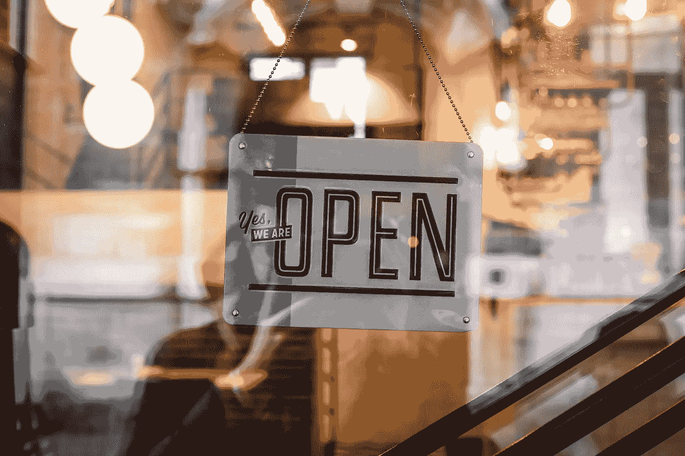

# 零售品牌用来连接线上和线下个性化的 4 项技术

> 原文：<https://towardsdatascience.com/4-technologies-retail-brands-use-to-bridge-online-and-offline-personalization-79d0cc040ed3?source=collection_archive---------11----------------------->

Photo by [Alexandre Godreau](https://unsplash.com/photos/7YlHU_ZPS34?utm_source=unsplash&utm_medium=referral&utm_content=creditCopyText) on [Unsplash](https://unsplash.com/search/photos/open-sign?utm_source=unsplash&utm_medium=referral&utm_content=creditCopyText)

Amazon Go 创造了最先进的购物技术。为了将人们从耗时的结账通道中解救出来，购物者只需下载 Amazon Go 应用程序，然后通过他们的 Amazon 帐户登录。一旦到了位于西雅图的商店，他们只需要在入口处扫描手机，然后像往常一样购物。

该品牌专有的 Just Walk Out 技术然后使用计算机视觉、传感器融合和深度学习来检测谁从商店货架上拿走了什么商品。根据这些数据，一旦人们手里拿着产品离开商店，智能商店就会计算他们的总数，并通过应用程序从他们的亚马逊账户中收费。

将店内和网上体验融合在一起，亚马逊可以真正了解顾客是谁，跟踪他们的行为，进而提供前所未有的个性化便利。

并非所有品牌都能创造全渠道个性化的专有技术，但市场上已经有大量技术可以帮助他们搭建桥梁。让我们探索 4 项技术，帮助品牌创造个性化的、真正的全渠道品牌体验。

**人工智能(AI)让消费者乐于在线上和线下消费。**

亚马逊知道如何将客户数据转化为收入流。贝恩公司[对 522 名购物者的研究](https://www.onlinemarketinginstitute.org/blog/2014/05/what-you-never-knew-about-repeat-customers-and-what-to-do-now/)显示，顾客第五次购买的东西比第一次多 40%。对于亚马逊来说，这是通过数据积累对客户进行 360 度全方位了解来实现的。例如，一个开始每月购买一件商品的顾客，通过人工智能提供的相关推荐，转变为一个月购买几件相关商品的顾客。

一旦一个品牌花费了所有额外的费用来收集数据并从中提取偏好见解，然后培养顾客对其他产品的兴趣，那么在店内体验中从头开始了解她将是一种耻辱，就好像从头开始获得顾客一样。这意味着收入的损失:波士顿咨询集团的一项研究发现，通过营销获得一个新客户比留住一个现有客户要贵 500%。

这就是为什么像亚马逊这样的聪明品牌知道利用在线数据来通知店内购买，反之亦然。每一次购物活动——无论是在线还是店内——都意味着品牌可以使用更多数据，通过 360 度视角更好地了解他们的客户。如果没有店内和在线客户数据的结合，真正的 360 度视角还没有实现。

例如，通过记录客户在 Amazon Go 商店的购买情况，亚马逊允许依赖人工智能根据这些店内购买和行为提供相关的在线建议。最终，有了相关的全渠道推荐，顾客会花更多的钱，并感激品牌给了他们这样做的机会。

**beacon 与数字技术合作，增强体育迷的线下体验。**

93%的美国职业棒球大联盟(MLB)公园、53%的美国国家篮球协会(NBA)体育场和 47%的美国国家橄榄球联盟(NFL)体育场都采用了[体育信标技术](http://adage.com/article/datadriven-marketing/location-trackers-bigger-sports-arenas/305211/)，为服务人员带来个性化体验，并增加球队及其赞助商的收入。

例如，下载金州勇士队应用程序的人被识别为球迷。该应用程序然后提供突发的球队新闻，实时统计数据，球员简历和比赛日历。当球迷亲自参加比赛时，他们可能会收到座位和特许看台的 3D 地图，实时交通更新，以及将比赛照片和视频上传到脸书的能力。

反过来，beacon 技术允许 Oracle Arena 获得额外的好处，如当球迷进入不太理想的区域时，能够提供座位升级的推送通知，跟踪球迷的步行路线以更好地了解客户行为，提供球队商品的近距离营销，甚至帮助球队赞助商与球迷联系。

其他团队安装信标技术也有利于他们的赞助商。例如，当麦当劳赞助密尔沃基雄鹿的应用程序时，他们也[通过安装在镇上商店附近的信标](http://adage.com/article/datadriven-marketing/location-trackers-bigger-sports-arenas/305211/)联系粉丝。反过来，麦当劳可以通过发送到团队应用程序的推送通知向粉丝进行营销。

最终，beacon technology 通过增加收入创造品牌优势，粉丝享受个性化的全渠道体验。在安装后的第一个季度，来自应用营销的收入覆盖了 Warrior 的室内营销基础设施和信标成本的一半。而且，尽管——或者可能是因为——所有的个性化追加销售和推送通知，该应用在谷歌 Play 商店享有 4.7 星的评级。

**增强现实帮助消费者融合他们的实体和在线家庭。**

家得宝通过他们的增强现实(AR)应用程序将线上和线下的品牌体验联系起来。如果顾客想更换家里的门，他们可以在网上浏览门的选择，甚至可以查看当地家得宝有哪些门。一旦他们找到了自己喜欢的门，他们可以点击“在你家看到这个”标签，然后将手机举到物理门上，以增强现实的方式查看门安装后的样子。

顾客可以从应用程序中购买柜门，并在店内取货。或者，在店内，他们可以通过基于手机的店内导航找到商品，然后购买。

通过 AR，家得宝的客户成为室内设计师，混合和搭配品牌产品以获得完美的外观。然后他们可以在网上订购，并在店内取货。此外，产品推荐基于顾客所在地区的[流行趋势。其结果是在线和线下品牌体验的无缝和个性化的桥梁。](https://www.adweek.com/digital/4-brands-explain-how-their-apps-improve-customer-experience/)

Photo by [Brian Metzler](https://unsplash.com/photos/nmWQ2SKvj5M?utm_source=unsplash&utm_medium=referral&utm_content=creditCopyText) on [Unsplash](https://unsplash.com/search/photos/running%2C-colorful%2C-athlete?utm_source=unsplash&utm_medium=referral&utm_content=creditCopyText)

**物联网(IoT)通过个人表现跟踪提升一个品牌的收入。**

安德玛通过物联网智能鞋将他们的线上和线下品牌体验联系起来。他们的 [SpeedForm Gemini 2 Record 配备的](https://blog.underarmour.com/the-revolutionary-smart-shoe-that-makes-you-a-better-runner/)通过嵌入鞋的泡沫鞋底的物联网传感器设备和他们的同伴 UA MapMyRun 应用程序来跟踪跑步者的时间、节奏、持续时间、距离等。成绩数据通过蓝牙技术发送到应用程序，允许跑步者在与应用程序同步成绩数据之间最多跑 5 次。

听起来像跑步者的梦想吗？这也是一个品牌的梦想。心率、跑步地图和个性化音频指导等表现数据可以告诉安德玛，跑步者是一个随意的、当我喜欢它时的表演者，还是一个更专注的马拉松教练。通过跟踪跑步者的表现和鞋子状况，安德玛赢得了提供替换产品、增强表现的配件等的绝佳机会，并通过及时、相关、因此受欢迎的 MapMyRun 推送通知。

线上和线下品牌体验的沟通对消费者和品牌都有好处。在所有频道上，体验都是个性化的，这是消费者愿意做的隐私交易。埃森哲称，缺乏个性化仅在 2016 年就让品牌损失了 7560 亿美元。

**没有为 360 度全渠道个性化做好准备的品牌正在出局。**

对于今天 60%的高管和营销人员来说，个性化仅限于一个渠道，并且只集成在他们的部分技术堆栈中。全球只有 22%的品牌承认有跨职能团队跨渠道执行个性化。

虽然品牌可能没有认真对待全渠道个性化，但消费者是认真的。[《哈佛商业评论》发现](https://hbr.org/2017/01/a-study-of-46000-shoppers-shows-that-omnichannel-retailing-works)与只与一个品牌渠道互动的人相比，全渠道零售客户的店内支出多 4 %,网上支出多 10%。

为了在未来的个性化客户体验(CXs)上竞争，品牌必须努力实现真正的 360 度全渠道视图以及与客户互动的能力。这意味着发展跨职能团队和[端到端技术基础设施](https://www.workfusion.com/smart-process-automation-spa/?utm_source=blog&utm_medium=blog&utm_campaign=Alana%20Rudder%20%2F%204%20Technologies%20Retail%20Brands%20Use%20to%20Bridge%20Online%20and%20Offline%20Personalization%20%2F%20Towards%20Data%20Science&utm_term=artificial%20intelligence&utm_content=4%20Technologies%20Retail%20Brands%20Use%20to%20Bridge%20Online%20and%20Offline%20Personalization)，不仅要对今天的线上和线下客户行为进行 360 度全方位的观察，还要准备好将新兴技术和渠道整合到组合中，以便对客户进行持续、可预测的 360 度了解和拓展。