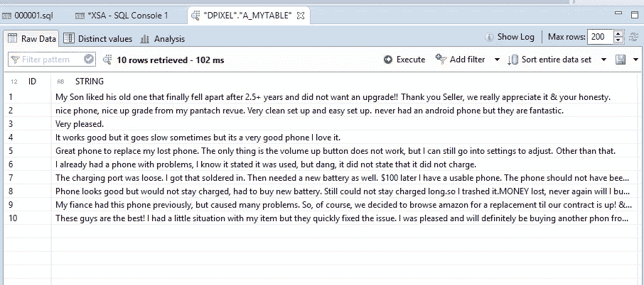
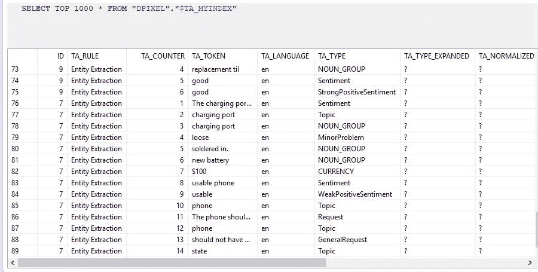
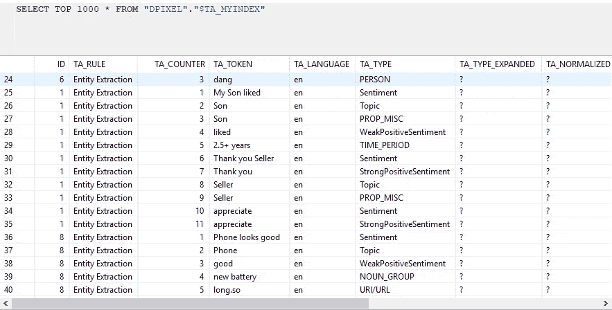
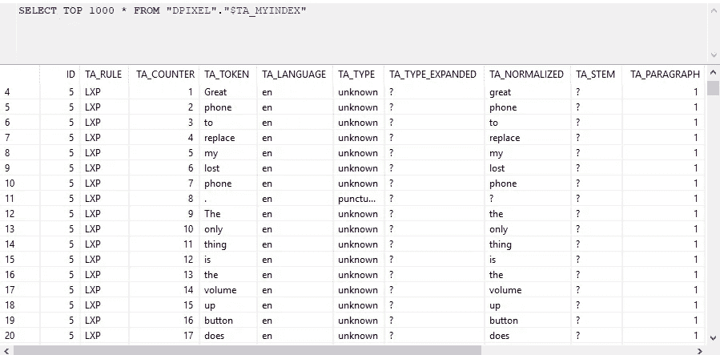
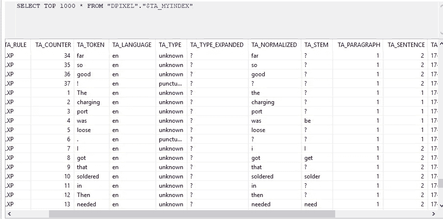
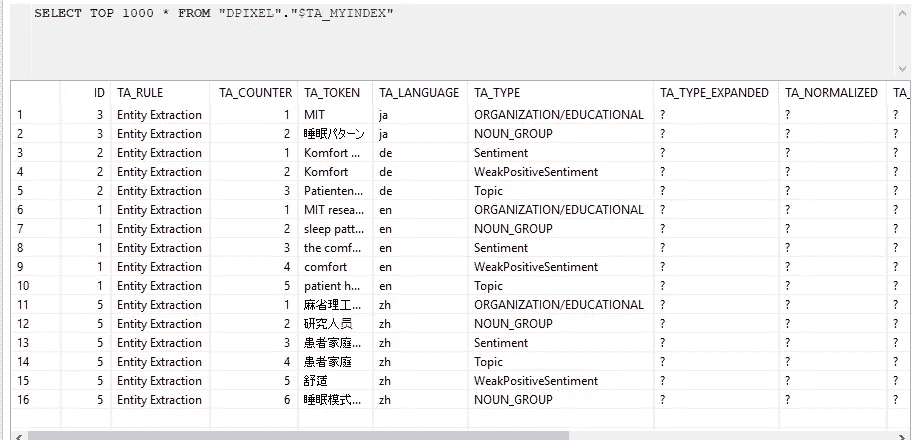
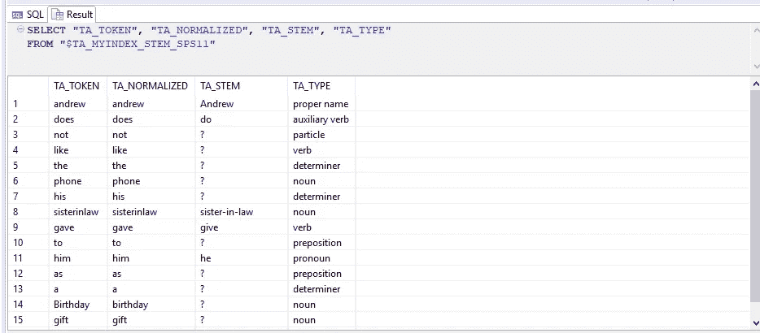

# 关于 SAP HANA 的文本分析，我们不知道的 4 件事

> 原文：<https://towardsdatascience.com/4-things-we-did-not-know-about-text-analysis-with-sap-hana-f6c8b3a79bf0?source=collection_archive---------1----------------------->

Source: SAP

当谈到数据挖掘和文本分析时，我们并不缺少强大的软件和工具，让我们能够以对我们的业务有意义的方式分割信息。有一篇关于 [KDnuggets](http://www.kdnuggets.com/software/text.html) 的文章提供了一个令人印象深刻的文本挖掘和分析软件列表，既全面又令人难以置信。

然而，在数据科学界，知道 [SAP HANA](https://en.wikipedia.org/wiki/SAP_HANA) 与[文本分析](https://en.wikipedia.org/wiki/Text_mining)有关的人并不多。因此，这篇文章是对使用 [SAP HANA](https://en.wikipedia.org/wiki/SAP_HANA) 进行文本分析的介绍。手续相对简单；重要的是可能的应用。

事不宜迟，我们开始吧。

为了便于说明，我使用了从 [Kaggle](https://www.kaggle.com/) 下载的[亚马逊移动评论数据集](https://www.kaggle.com/PromptCloudHQ/amazon-reviews-unlocked-mobile-phones)的一个子集。

A subset of Amazon mobile review data set — Text Table

在大多数情况下，我们需要在包含文本的表的列中创建一个索引表。索引表是进行文本分析的地方。

Index Table Creation

“客户的核心声音”提取是一种标准配置，它提取核心配置之外的实体和事实，以支持情感和请求分析。这种配置是必不可少的，因为它识别与令牌相关的积极和消极情绪。这允许我们在与特定主题相关的语料库中评估观点。当我们执行这个时，它会创建一个索引和一个包含我们情感分析的表，如下所示:

Core-Voice-Of-Customer Extraction — Index Table (1)

让我们详细看看索引表的列。

*   文本表和索引表必须具有相同的 ID 列。
*   因为我们在前面将我们的配置指定为“客户的核心语音”,这决定了我们的“TA 规则”列。
*   “TA_COUNTER”是对文档中的所有令牌进行计数的令牌计数器。在这种情况下，所有文档都是文本表中的十行字符串。
*   文档在“TA_TYPE”列中派生了许多实体类型。
*   “TA_TOKEN”列表示这些实体的实际值或令牌。
*   “TA_LANGUAGE”列表示文档的语言。

[**情绪分析**](https://en.wikipedia.org/wiki/Sentiment_analysis)

也被称为“客户之声”，这是事实提取模块中一个有趣的部分。可以基于一组规则提取单词并为其分配匹配的情感，该组规则包括提取客户情感、请求、表情符号和脏话的要求。情绪可以分为强或弱、积极或消极等等。

*   文本分析认识到，句子“充电口松了”的实体类型是情绪，单词“好”是强烈的肯定陈述，因为它在句子“到目前为止还不错！”。
*   然而，句子“100 美元之后，我有一部可用的手机”中的“可用”一词是一种微弱的肯定陈述。
*   “loose”的实体类型是个小问题，因为“loose”这个词在句子“充电端口是宽松的”中。
*   请求撤离。从上表中，已经提取了句子“电话不应该以它所处的状态出售”。

Core-Voice-Of-Customer Extraction — Index Table (2)

*   此外，文本分析识别出“电话”、“儿子”和“卖方”的实体类型是主题，“100 美元”是货币，“2.5 年以上”是时间段。
*   单词“dang”与“damn”拼写错误，因此，它被归类为一个人。

[**语言分析**](https://en.wikipedia.org/wiki/Semantic_analysis_(linguistics))

*   如果我们在配置期间选择“LINGANALYSIS_BASIC ”,我们将简单地将输入文本分离成它的元素(标记化),如下所示:

LINGANALYSIS_BASIC Configuration

LINGANALYSIS_BASIC — Index Table

*   如果我们在配置期间选择“LINGANALYSIS_STEMS ”,我们将得到词干或字典形式(词干)的标识，如下所示:

LINGANALYSIS_STEMS Configuration

LINGANALYSIS_STEMS — Index Table

例如，从上表中可以看出，“got”的词干是单词“get”，“need”的词干是单词“need”。

*   如果我们在配置过程中选择“LINGANALYSIS_FULL ”,它将为我们提供标记功能(单词词性的标记)。

LINGANALYSIS_FULL Configuration

LINGANALYSIS_FULL — Index Table

标记让我们有能力识别一个单词所属的语法类别。从上表来看，“problems”和“problem”是名词，“decide”和“decide”是动词。它识别并标记上下文中每个单词的词性。标记有助于我们理解句子或段落的意思。

**语言**

SAP HANA 支持 31 种语言。我今天只使用 5 种语言。为了便于说明，我创建了一个玩具桌子，上面有 5 行文字:

Text Table with Five Languages

这个句子来自关于麻省理工学院的最新消息。德语、日语、韩语和中文翻译是通过谷歌翻译完成的。如果不准确，我道歉。

下面是我们从上面的文本表中导出的索引表:

Sentiment Analysis for Five Languages — Index Table

我认为 SAP HANA 文本分析在识别四种语言方面做得相当不错(这里漏掉了韩语)。

**宽容词干**

目前有英语、荷兰语、德语和意大利语版本。该默认行为允许处理非标准拼写，以更好地最大化召回。让我们看一个例子。

*   步骤 1，创建单行文本表格:

Tolerant Stemming — Text Table

这里我们可以看到一些问题；“andrew”要大写，“daughterinlaw”在“in”前后要有连字符，“Birthday”不要大写。

*   步骤 2，使用以下查询创建索引表:

*   步骤 3，选择列，使用以下查询创建结果表:

*   第 4 步，让我们看看我们的结果表:

Tolerant Stemming — Result Table

“安德鲁”被词干改为大写，“生日”被词干改为小写，“弟媳”被词干改为连字符。

**自己试试**

SAP HANA 文本分析包含很多我在这里没有涉及的功能。除了可用的文本数据之外，我们有许多选择来采用文本分析，提取我们需要的实体和事实。

如果你想做同样的实验，你可以很便宜地做到。学习新东西不一定要很贵。您可以下载 [SAP HANA express edition](https://www.sap.com/canada/developer/topics/sap-hana-express.html) 并报名参加关于使用 SAP HANA 平台进行[文本分析的免费课程。然后让我知道学习进度如何！](https://open.sap.com/courses/hsta1)