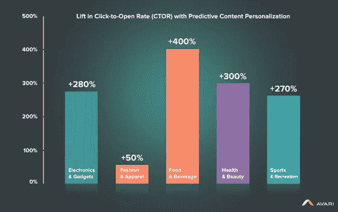

# 推荐引擎可以为企业带来的 5 大优势

> 原文：<https://towardsdatascience.com/5-advantages-recommendation-engines-can-offer-to-businesses-10b663977673?source=collection_archive---------3----------------------->

Ref — www.avari.com

在我们之前的博客中，我们已经解释过[什么是推荐引擎](https://medium.com/towards-data-science/what-are-product-recommendation-engines-and-the-various-versions-of-them-9dcab4ee26d5)以及它们的[工作方式](https://medium.com/towards-data-science/how-does-a-recommendation-engine-really-work-656bdf12a5fc)。实现推荐引擎的主要目的是让客户购买更多的产品。如果不能，那么它就违背了拥有推荐引擎的目的。

现在既然有了[产品推荐引擎](https://medium.com/towards-data-science/what-are-product-recommendation-engines-and-the-various-versions-of-them-9dcab4ee26d5)主要靠数据运行。您的公司可能没有足够的存储容量来存储来自您网站访问者的大量数据。您可以使用 Hadoop、Spark 等在线框架，这些框架允许您将数据存储在多个设备中，以降低一台机器的可靠性。Hadoop 使用 HDFS 将文件分割成大块，并将其分布在集群中的节点上。这使得数据集的处理速度更快、效率更高，相比之下[更传统的超级计算机架构](https://en.wikipedia.org/wiki/Apache_Hadoop)依赖于并行文件系统，计算和数据通过高速网络分布。

最后，我们使用 MapReduce 编程模型处理大数据集。这样，我们可以同时在分布式文件系统中运行该算法，并选择最相似的集群。因此，任何组织都可以使用开源工具开发自己的[推荐引擎架构](https://www.marutitech.com/recommendation-engine-benefits/)，我们可以使用我们的专业技术帮助他们实现该引擎。

# 产品推荐引擎的优势

Ref — [http://www.business2community.com/strategy/product-recommendation-engines-mean-business-0893268](http://www.business2community.com/strategy/product-recommendation-engines-mean-business-0893268)

你不需要通过市场调查来确定一个顾客是否愿意在一个能最大限度帮助他们找到合适产品的商店购买。他们将来也更有可能回到这样的商店。为了了解推荐系统的商业价值:几个月前，[网飞估计，它的推荐引擎每年价值 10 亿美元。](http://www.businessinsider.in/Why-Netflix-thinks-its-personalized-recommendation-engine-is-worth-1-billion-per-year/articleshow/52754724.cms)

以下是企业使用推荐引擎可以获得的 5 个好处:

**收入—** 多年的研究、实验和执行主要是由亚马逊推动的，如今，不仅在线客户的学习曲线减少了。许多不同的算法也已经被探索、执行和证明，以驱动相对于非个性化产品推荐的高转化率。

**客户满意度—** 很多时候，客户倾向于在上次浏览时查看他们的产品推荐。主要是因为他们觉得会找到好产品更好的机会。当他们离开现场后又回来时；如果他们以前的浏览数据是可用的，那将会很有帮助。这可以进一步帮助和指导他们的电子商务活动，类似于实体店的经验丰富的助理。这种类型的客户满意度导致客户保持。

**个性化—** 我们经常接受朋友和家人的建议，因为我们相信他们的意见。他们比任何人都清楚我们喜欢什么。这是他们擅长推荐东西的唯一原因，也是推荐系统试图模仿的。您可以使用间接积累的数据来改善网站的整体服务，并确保它们符合用户的偏好。反过来，用户会有更好的心情购买你的产品或服务。

**发现——**例如，iTunes[的“天才推荐”功能](http://www.apple.com/itunes)，Amazon.com 的“经常一起购买”会做出令人惊讶的推荐，这些推荐与我们已经喜欢的东西相似。人们通常喜欢被推荐他们喜欢的东西，当他们使用一个与他/她的选择非常相关的网站时，他/她必然会再次访问该网站。

**提供报告—** 是[个性化系统](https://wotnot.io/)的组成部分。向客户提供准确和最新的信息，使他能够对自己的网站和活动方向做出可靠的决定。基于这些报告，客户可以为滞销产品提供报价，从而推动销售。

Ref — www.avari.com

当然，进行网上销售是令人满意的，但如果你能做得更多一点呢？电子商务组织可以使用不同类型的过滤(协作、基于内容和混合)来创建有效的推荐引擎。很明显，亚马逊在这个原则上是成功的。每当你买一个动作人偶，就会根据内容本身推荐更多的东西给你。例如，DVD 是根据你刚买的动作玩偶制作的。

向客户推荐优秀产品的第一步就是要有勇气投入到更好的转化中去。请记住——真正吸引客户的唯一方法是与每个人单独交流。

有更先进和非传统的方法来驱动你的推荐过程。这些技术即深度学习、社会学习和张量分解基于[机器学习](https://www.marutitech.com/artificial-intelligence-and-machine-learning/)和神经网络。[这样的认知计算方法](https://www.marutitech.com/cognitive-computing-features-scope/)可以让你的推荐者的质量更上一层楼。此外，随着最近[聊天机器人](https://www.marutitech.com/7-reasons-why-business-needs-chatbot/)的采用，它可以与推荐引擎相结合，提供产品的后续服务。可以肯定地说，产品推荐引擎将随着机器学习的使用而改进。并创建一个更好的客户满意度和保留流程。