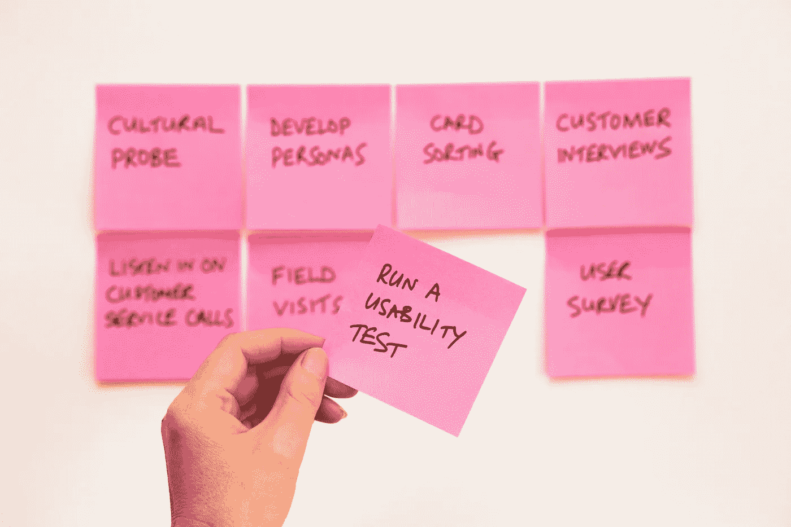
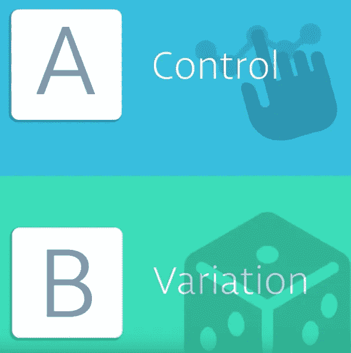
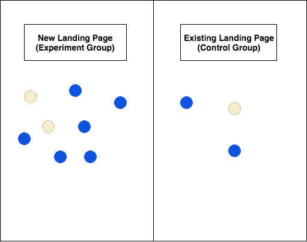

# 预测性业务分析的 5 个关键步骤

> 原文：<https://towardsdatascience.com/5-critical-steps-to-predictive-business-analysis-110b0dedbc9b?source=collection_archive---------9----------------------->

## 如何设计结论性的 A/B 测试实验？

作为一名数据工程师，当我在解决一个问题时，我经常问自己，如果这个问题没有数据会怎么样？如果我不得不在不知道市场/用户会如何反应的情况下进行设计变更，那该怎么办？有没有更靠谱的决策方法？

这篇文章将带你经历五个关键步骤，为 A/B 测试设计一个可靠的结论性实验。以下是我们将涉及的要点:

1.  A/B 测试介绍。
2.  选择正确的业务指标。
3.  统计评论。
4.  设计实验。
5.  分析

市场上有许多 A/B 测试软件。在这篇博客中，我不会关注任何特定的 A/B 测试工具，而是关注它的工作原理。我将讨论一种统计方法，来测试电子零售商的新登录页面是否会帮助他们增加平台上的用户参与度。

# 1.A/B 测试介绍

首先，到底什么是 A/B 测试？

A/B 测试是一种在线测试新产品或新功能的实验方法，将产品的两个不同版本暴露给不同的用户群。第一个版本是现有功能或旧功能，称为控制组，新功能称为实验/变化组。

假设有两组用户，一组可以访问控制组——现有功能，另一组可以访问实验组——您计划推出的新版本。根据您收集的数据，您可以决定哪个版本的产品更好。

因此，A/B 测试有两种变体:

使用 A/B 测试我们能实现什么？
我们可以使用 A/B 测试来测试各种各样的东西，从一些新功能到在线门户/仪表板，到 UI/UX 的添加，或者应用程序的不同外观。你也可以测试用户可能没有注意到的功能，就像亚马逊确定的那样[页面加载时间每增加 100 毫秒，销售额就会减少 1%](http://www.exp-platform.com/Documents/IEEEComputer2007OnlineExperiments.pdf) 。

所有的大玩家——谷歌、亚马逊、微软、网飞、贝宝等等都使用 A/B 测试。举几个例子:

*   亚马逊最初决定推出他们的第一个个性化产品推荐，这是基于一项 [A/B 测试，该测试显示通过添加该功能](http://www.exp-platform.com/Documents/GuideControlledExperiments.pdf)可以大幅增加收入。
*   谷歌[测试了 41 种不同深浅的蓝色](http://www.nytimes.com/2009/03/01/business/01marissa.html?pagewanted=3)。
*   LinkedIn [测试了是否将用户流的顶部位置用于头条新闻文章或鼓励添加更多联系人](http://engineering.linkedin.com/mobile/mobile-ab-testing-linkedin-how-members-shape-our-apps)。(参见“使用基于视图的 JSON 进行 A/B 测试”一节中的第一段。)

鉴于该方法在行业中的广泛使用，以及使用 A/B 测试我们能实现什么，我们需要知道

**有什么不为的？** 因此，如果你试图用 A/B 测试来记录人们对一个全新的产品或小工具或新的用户体验的反应，你获得真实数据的机会非常低。以下是你应该问自己的问题，以确定你是否应该使用 A/B 测试:

*   这个实验可以在短时间内进行吗——比如 2 个业务周期？
*   我能控制实验进行的环境吗？
*   我能为实验定义可测量的指标吗？
*   我能收集到足够的数据来支持我的决策吗？

## 例子

接下来是我们将从现在开始使用的示例案例研究。有一个名为 Edufin.com 的虚拟电子学习平台，专门专注于金融课程。Edufin 遵循以下客户漏斗:

1.  登录页面访问量——漏斗顶部用户互动次数最多。
2.  浏览不同的课程
3.  创建帐户
4.  注册一门课程
5.  完成一门课程

问题陈述:Edufin 对他们现有登录页面的转换率有点怀疑。他们想对一个新的登录页面进行实验，并从那里记录一些数据点，并找出登录页面在观众面前的表现。

> 因此，我们这里的**初始假设**是:推出一个新的登陆页面将会提高平台的转化率。这里的转换率是学生在课程中的注册率。

我们将把剩下的 4 个步骤合并到这个例子中，并尝试设计一个稳健的实验。

# 2.选择正确的业务指标

对于任何电子学习平台，最终目标都是让大量学生完成课程。这是评价我们实验成功/失败的正确标准吗？答案是否定的，因为完成一门课程可能需要几周或几个月，我们需要在短时间内完成。

另一种方法是记录登录页面上*查看课程*按钮的点击次数。“查看课程”按钮将我们引向客户漏斗的第二个阶段。在这里，我们可以对实验运行的环境进行评论。可能有这样的情况，我们在实验组有更多的点击量，但是在控制组有更高的转化率。

在上面的例子中，蓝点代表访问登录页面的用户数量，而黄点代表页面的点击量。显然，新页面上的访问者数量更多，但点击率在对照组中更多(访问者数量/点击数量)。那么，这是一个好的衡量标准吗？等等，这些点击是独一无二的吗？假设有 2 个用户访问了这个页面，其中一个没有点击，另一个因为沮丧而点击了 4 次，也许这个页面加载很慢。这里的 CTR 是 4/2 = 2。这仍然具有误导性，因为它没有告诉我们它将产生的影响。在此基础上进行改进，我们可以在这种情况下使用概率，即**点击独立访问者总数的独立访问者的数量。**对于我们讨论的情况，这将为我们提供 0.5。

> 因此，点击率是最适合实验的指标。
> 一般的经验法则是，当你想测试一个功能或产品的可用性时，使用**等级**，当你想找出它能产生的影响时，使用**概率**。

因此，您决定的指标应该

*   适应时间跨度
*   提供统计上可靠的数据点
*   帮助我们实现最终目标。

# 3.统计评论

A/B 测试是一种**统计假设测试**，在这种情况下，预测登录页面#B 将比登录页面#A 执行得更好，然后观察并比较来自两个页面的数据集，以确定#B 是否比#A 有统计上的显著增强。

> 不要忘记，议程不是测试哪个页面表现更好，而是找出目标受众对登录页面的反应。

统计分析允许我们使用我们知道的信息，以合理的准确度预测我们不知道的结果。

从任何数据集开始，你应该询问数据的结构。这告诉我们数据的可变性。在统计学中，我们有几种类型的分布，可以帮助我们设定一些关于数据可变性的准则？

我们知道，这里有离散数据(而不是连续数据)，有成功(点击)和失败(没有点击)两种情况。因此，我们有一个非常坚实的案例来使用**二项式分布**作为我们的数据。选择正确的发行版是成功的一半。使用二项式的样本标准误差来估计我们期望的总体综合可供订货量的变化程度。当我们谈论可变性时，我们实际上的意思是，对于 95%的置信区间(行业标准)，如果我们在理论上一次又一次地重复实验，我们会期望我们围绕我们的样本构建的区间均值在 95%的时间内覆盖总体中的真实值。

在运行该实验时，我们假设变异 B 将比变异 A 具有更高的总体 CTP。我们不是向所有 100，000 个访问者显示这两个页面，而是向一个样本显示它们，观察会发生什么。

*   如果变化 A(原始)有一个更好的 CTP 与我们的访问者样本，那么没有必要采取进一步的行动，因为变化 A 已经是我们的永久页面。
*   如果变体 B 具有更好的 CTP，那么我们需要确定这种增强在统计上是否显著，以便我们得出结论，这种变化将反映在更大的群体中，从而推出新的登录页面变体 B。

接下来，我们需要注意由于数据的可变性而产生的不同类型的错误。这里，**零假设**是两个数据集之间没有关系的基线假设。因此，我们案例中的理论是，在我们的控制(变化 A)和我们的实验(变化 B)之间，点进概率没有差别。

对于 A/B 测试，这意味着我们可以自动假设新的登录页面不会产生更多的销售线索，而原来的登录页面是我们应该继续前进的。

**定义统计显著性** 假设变异 B 在我们的样本中表现更好。我们如何知道这种改进是否会转化为整体受众？我们如何避免犯错误？

答案是统计学意义。
当我们可以以 95%的把握说变异 B 的 CTP 的增加超出了样本可变性的预期范围时，我们在 A/B 测试中确立了统计显著性。**样本可变性**被定义为当相同的变化被显示给相同的样本群体时，点进概率的变化。

统计显著性与两个变量直接相关:

1.  **p 值:**或计算概率，是当研究问题的**零假设(H** 0 **)** 为真时，发现观察到的或更极端的结果的概率
2.  **显著性水平:****显著性水平**是假设无效假设为真，拒绝该假设的概率。行业标准是上面说的 5%。

只要 p 值小于显著性水平，我们就有统计显著性命题。

# 4.设计

A/B 测试实验的先决条件之一是我们需要在一个受控的环境中运行它。这可以解释为，假设我们可以控制在我们的控制和实验中的页面浏览量，我们必须决定多少页面浏览量可以产生统计上显著的结果。这被称为**统计功效**也就是说，如果我们看到一些有趣的东西，我们应该有足够的功效来得出这个有趣的东西具有统计学意义的结论。

一个可靠的测试所需要的时间会根据一些因素而变化，比如你的转换率，以及你的网站有多少流量；一个好的测试工具应该告诉你什么时候你已经收集了足够的数据来得出一个可靠的结论。

功率与特征或变化的大小成反比。您想要检测的变化越小，或者您希望对结果增加的信心越小，测试就需要越大。因此，我们将需要更多的页面浏览量来有更多的统计能力来总结我们的结果。

# 5.分析结果

对结果的分析包括对收集的数据进行统计数学运算。以下是实现这一点的步骤:

1.  记录控制组和实验组的页面浏览量，比如 P₁和 P₂，以及 C₁和 C₂.的点击量
2.  不要相信你的眼睛，因为它可能会出现一个页面比另一个页面有更多的点击。开始计算差值的置信区间。
3.  计算汇集的概率:P = (C₁ + C₂) / (P₁ + P₂).
4.  计算合并的标准误差:SE = √P(1-P)((1/C₁)+(1/C₂)
5.  将估计的差异计算为 diff =实验概率-控制概率。
6.  计算实验的误差范围 SE * 1.96(置信水平 95%的 Z 得分)。
7.  置信区间的下限是(diff —误差幅度)，上限是(diff +误差幅度)。
8.  根据统计显著性水平和置信区间值，您可以决定是否应该启动新的登录页面。

# **结论**

如果你有一个网站，你有你想要你的用户完成的动作(例如，购买，注册一个时事通讯)和/或你想要改进的指标(例如，收入，会话持续时间，跳出率)。通过 A/B 测试，您可以测试哪个版本的登录页面在转化率(即，您作为目标衡量的已完成活动)或指标值方面的改进最大。

这里有一个配置实验的谷歌指南:

 [## 配置和修改实验

### 在任何时候，每个视图最多可以有 12 个正在运行、正在设置或正在进行的实验…

support.google.com](https://support.google.com/analytics/answer/1745216) 

本质上，样本大小、测试的时间窗口和度量标准必须提前决定。统计学意义不应该是停止测试的唯一标准，否则你的结果可能毫无意义。测试结果将在统计显著和不显著之间振荡。当测试到达终点时，显著性应该成为讨论的焦点。

A/B 测试的投资回报可能是巨大的，因为即使是登录页面或网站上的小变化也会导致潜在客户、销售和收入的显著增加。你所需要做的就是在设计实验和决定正确的度量标准时要小心谨慎。

既然我们都同意使用 A/B 测试可以实现什么，那么是时候测试你的创新想法了，并看到它们蓬勃发展。

T&C *——如果你不同意，请在下面留言，我很乐意回答你！