# 创建更有说服力的图表和图形的 5 个数据故事技巧

> 原文：<https://towardsdatascience.com/5-data-storytelling-tips-for-creating-more-persuasive-charts-and-graphs-3823af33a3c2?source=collection_archive---------6----------------------->

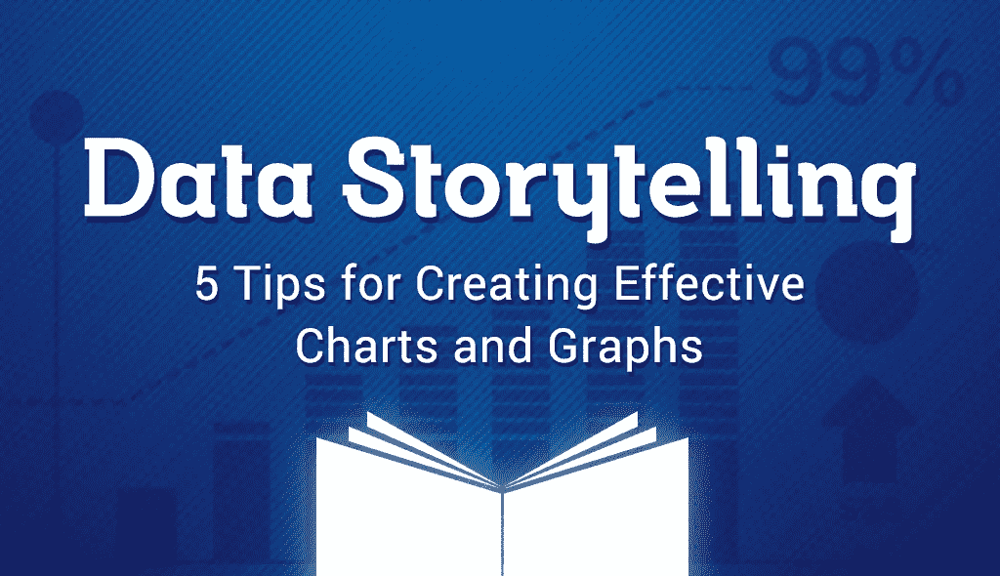

与数字打交道通常不被认为是一份性感的工作。毕竟，像会计和数据录入这样的职业在这个数字时代并不是最令人兴奋的职业。

但是，就像曾经平淡无奇的电脑极客现在统治着世界一样，数据分析师目前被视为“就业市场的独角兽”

根据 LinkedIn 的说法，理解大量杂乱数据并从中找到独特见解的能力是就业市场上最热门的技能之一。

原因显而易见:[自 2013 年](http://www.forbes.com/sites/bernardmarr/2015/09/30/big-data-20-mind-boggling-facts-everyone-must-read/#10836da16c1d)以来，创造的数据比之前人类历史上的总和还要多。

因此，不仅对数据科学家有很高的需求，而且对那些知道如何以有效和有说服力的方式可视化和呈现数据的人也有很高的需求。

这就是[数据叙事](http://blog.visme.co/data-storytelling-tips/)的用武之地。

结合了数据、视觉效果和叙述的[、**数据叙事**是热门的、新的数据科学技能 ***每个人*** 都将在未来需要。](http://www.forbes.com/sites/brentdykes/2016/03/31/data-storytelling-the-essential-data-science-skill-everyone-needs/#302b650bf0c8)

Information source: [Forbes](http://www.forbes.com/sites/brentdykes/2016/03/31/data-storytelling-the-essential-data-science-skill-everyone-needs/#302b650bf0c8)

对于那些不喜欢数字的人来说，这可能真的是个坏消息。

但在你开始恐慌之前，让我们从一些简单的事实开始，这些事实将帮助你理解我们的大脑是如何处理视觉效果的，以及你如何利用这些原则来改进你的图表。

# 视觉大脑及其工作原理

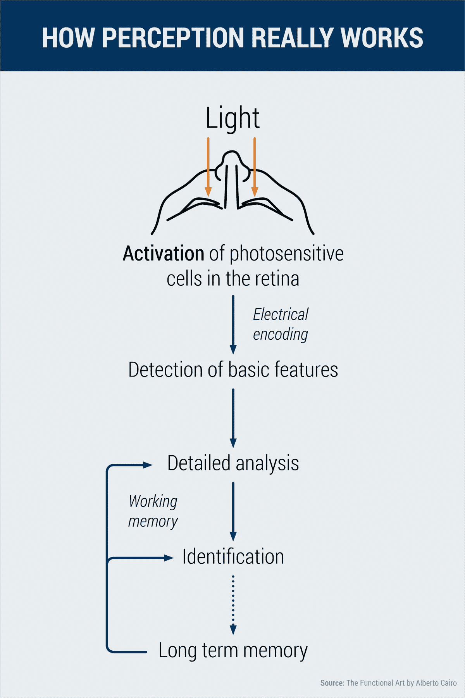

与你在高中所学的相反，人类的视觉比仅仅处理物体反射的光要复杂得多。

虽然我们显然可以看到 180 度角内的一切，但实际上我们只能完全准确地看到那些在我们视野中心的东西，在一个非常狭窄的 2 度范围内。

那我们怎么会看不到一团模糊的东西呢？

由于被称为[迅速扫视](https://www.ncbi.nlm.nih.gov/books/NBK10991/)的快速眼球运动，我们能够感知位于剩余 178 度角内的物体。在没有注意到的情况下，我们的眼睛会快速跳动，并注视着场景的不同点，以从这些综合信息中创建一个准确的视觉地图。

虽然这些运动是无意识的，但我们的眼睛会优先关注它们所注视的东西。例如，**明亮的颜色，不常见的形状和移动的物体会立即吸引我们的注意力**，即使它们不在我们面前。(来源:[阿尔贝托·凯洛的功能艺术](https://www.amazon.com/Functional-Art-introduction-information-visualization-ebook/dp/B0091SXDOM))

Information source: [The Functional Art](https://www.amazon.com/Functional-Art-introduction-information-visualization-ebook/dp/B0091SXDOM)

一旦光被编码成电信号，大脑就会提取主要特征，从粗略的形状和颜色开始，然后才开始真正处理和识别人面前的东西，使用长期记忆中的大量信息。

为了获得更直观的解释，你也可以[观看 Payman Taei](https://www.visme.co/videos/visual-design-principles/) 描述我们如何感知物体背后的科学原理:

# 我们的视觉大脑被差异所吸引

因此，我们的眼睛实际上首先聚焦在突出的关键点上，而不是像相机一样捕捉整个场景。这就是为什么我们的**视觉大脑会立即注意到差异和对比**。

看看下图就知道了。你花了多长时间才看到前两幅插图中的熊？最后一个呢？

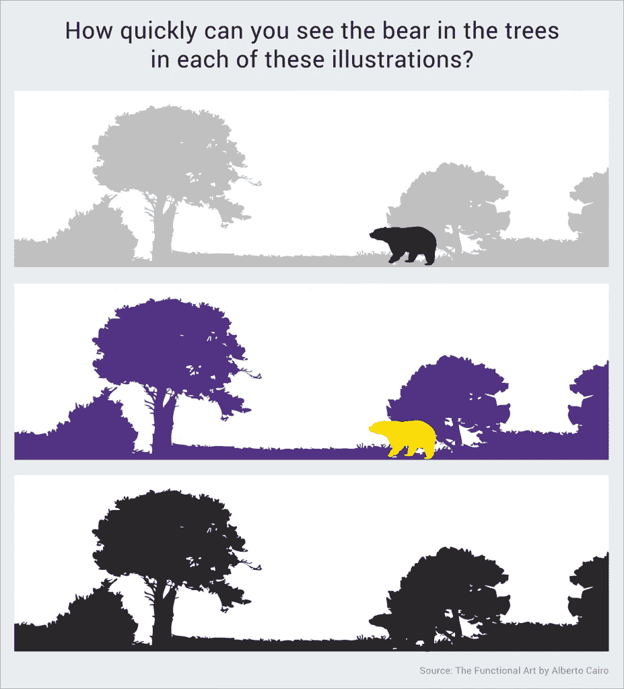

这个简单的练习揭示了我们的大脑更善于识别颜色而不是形状的差异。

# 我们的大脑被设计用来识别模式

你知道吗，在你有意识地意识到之前，你的感官一直在处理来自环境的各种信息。

这被称为**前注意力处理**，如果没有它，我们会浪费大量时间去理解我们周围的世界。

令人欣慰的是，我们的视觉大脑通过自动检测物体之间的差异和相似性，让我们的事情变得简单。

例如，看看下面这张图片。

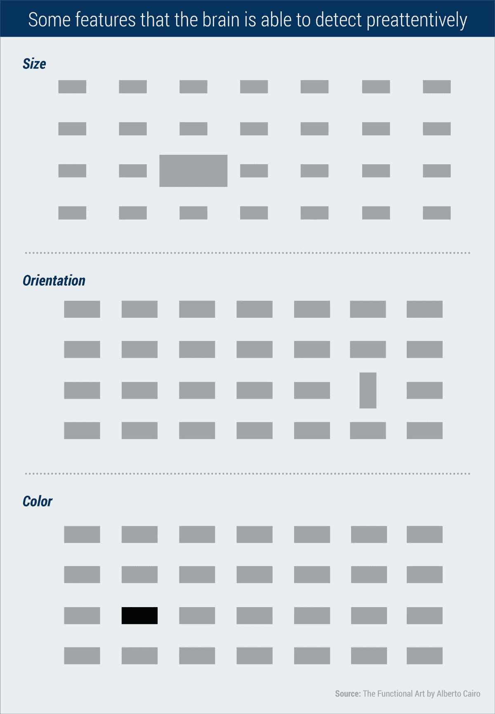

你是否立即关注了中间的一个大矩形？在第二部分中，您可能马上就注意到了一个矩形与其他矩形不同，它是垂直方向的。

这是你的视觉大脑:它被设计用来注意模式，并立即检测这些模式的中断。

# 视觉大脑的 5 个数据故事技巧

既然我们已经对我们感知物体的方式背后的科学有所了解，让我们看看这些知识如何转化为创建有效和有说服力的数据可视化的实用技巧，这些技巧来自《哈佛商业评论》的指南[Good Charts](https://www.amazon.com/dp/B01BO6QM9Q/ref=dp-kindle-redirect?_encoding=UTF8&btkr=1)。

# 1.我们的眼睛不会遵循特定的顺序。

[创建有效的数据可视化需要学习新的语言和新的语法规则。](http://blog.visme.co/data-storytelling-tips/#)

阅读有文字的页面和阅读图表的第一个区别是，在西方文化中，你阅读的顺序是从左到右，从上到下。对于第二种，没有预先确定的顺序——你只是去你的眼睛带你去的地方。

步伐也不一样。你不是一行一行地阅读，而是从一件事跳到另一件事，在某些部分花的时间比其他部分长。

这意味着创建有效的可视化效果，有意识地将观众带入一个**预定义的视觉旅程**，尤其具有挑战性。

# 2.我们的眼睛首先关注突出的东西。

当我们看下图这样的图表时，我们不会一下子看到所有的东西，而是集中在一个显著的点上。

Information source: [Prison Policy Initiative](https://www.prisonpolicy.org/)

图表中最突出的是最右边的峰值。这幅图的中心信息非常清楚:自 20 世纪 70 年代以来，美国的监禁率呈指数增长。

最好的数据故事讲述者利用这一原理，通过**一个清晰易懂的信息创建图表和图形**。

# 3.我们的眼睛可以同时处理几件事情。

每当你有一个超过 5 到 10 个变量的图表时，单个的单元开始失去它们的个性，被我们的眼睛视为一个单一的整体。

考虑到这一点，你应该[简化你的图表，让它们突出你想要表达的一个要点。](http://blog.visme.co/data-storytelling-tips/#)

以这张图表为例。你首先注意到的是中间的峰值、绿线和单词“断电”

如果目标是通过声明性图表(而不是探索性图表)传达明确的信息，那么你会发现这里没有明确的信息。

例如，假设您想要揭示即使在停机后性能评级仍持续下降，那么观众必须努力找到这一趋势，因为背景中的峰值会分散对绿线的注意力。

在这种情况下，最佳解决方案是消除客户服务呼叫数据的数量，并专注于停机前后的客户服务评级。

# 4.我们试图在数据中寻找意义。

另一个重要的事实是，我们的大脑被设计成立即寻找联系，并试图在数据中找到意义。

如果你看这个图表，你会发现你的大脑无意识地将标题中的橙色和橙色的点联系起来。

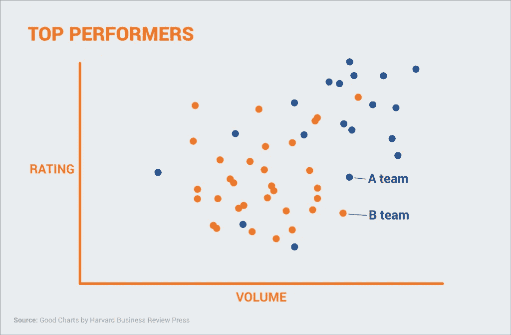

“这一定意味着橙色的点代表表现最好的人，”我们的视觉大脑总结道。

不对。实际上，表现最好的是那些绘制在图表右上角的，与颜色的选择无关。

知道了这一点，我们必须做出明智的设计决定，并且[有意识地分配颜色，以提高你的视觉功能。](http://blog.visme.co/data-storytelling-tips/#)

# 5.我们受文化习俗的指导。

有些习俗我们认为是理所当然的。例如，在西方文化中，我们都直观地知道，当可视化时间时，它从左向右移动，而不是从右向左；或者蓝色代表冷，红色代表热。

视觉隐喻也是如此:我们都把金字塔和等级联系在一起，或者把两个事物的比较和等级联系在一起。

如果你忽略了这些惯例，那么不言而喻，你的视觉效果将难以解读。

看看这个图表，当时间放在 Y 轴上而不是 x 轴上时，从中提取意义是多么困难。

# 如何改进数据叙事的示例

下面是一些如何改进图表和图形的例子，让它们不只是简单地显示数据 ***，而是讲述一个故事*** ，摘自科尔·努斯鲍默《用数据讲故事[一书](https://www.amazon.com/dp/B016DHQSM2/ref=dp-kindle-redirect?_encoding=UTF8&btkr=1)。

# 以前

此条形图显示了一年中收到和处理的票证数量。

# 在...之后

如果你的目的是传达一个信息，并推动某人采取具体行动(在这种情况下，雇佣两名新员工)，那么这就好得多。

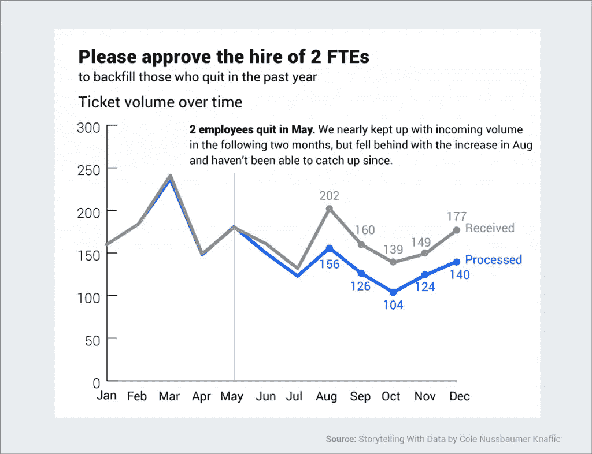

通过选择线形图而不是条形图，收到的票据数量和处理的票据数量之间越来越大的差异变得非常明显。

# 以前

这是另一个没有叙述性或清晰消息的数据显示的例子。

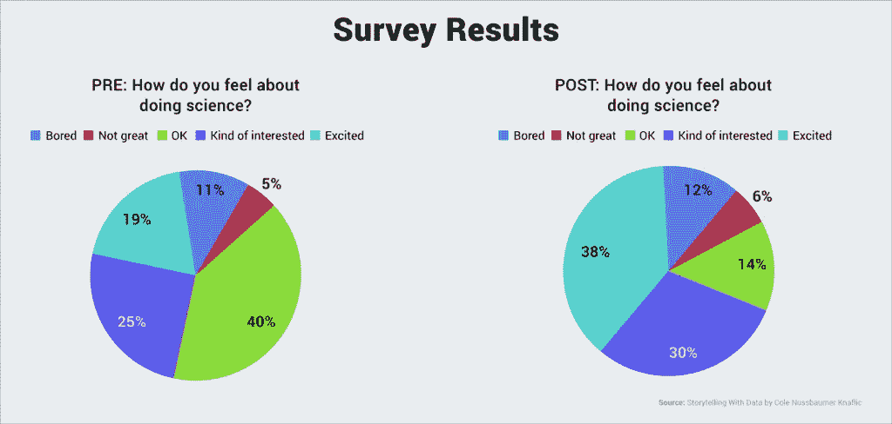

# 在...之后

现在看看以完全不同的方式呈现的相同数据集。差别很大，对吧？核心信息是显而易见的:节目结束后，更多的孩子对科学感到兴奋。

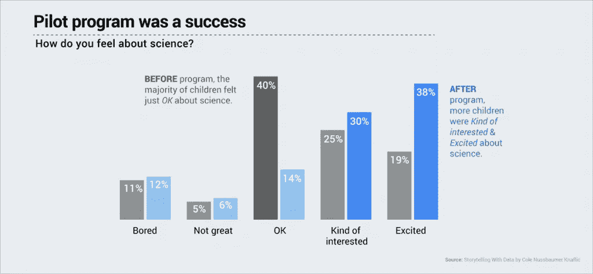

使用单个图表而不是两个独立的图表可以让观众快速了解调查结果。此外，使用一些颜色，而不是五六种颜色，以及一个有效的标题有助于读者快速掌握项目前后结果的差异。

# 以前

另一个无效图表的例子是准确的，但没有传达或说服观众采取特定的行动。

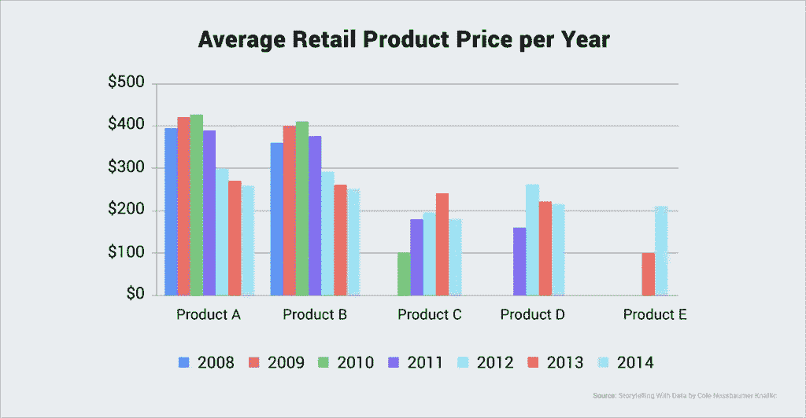

# 在...之后

在这张图表中，我们的眼睛立即被蓝色条、灰色线和代表平均价格点的蓝点所吸引。

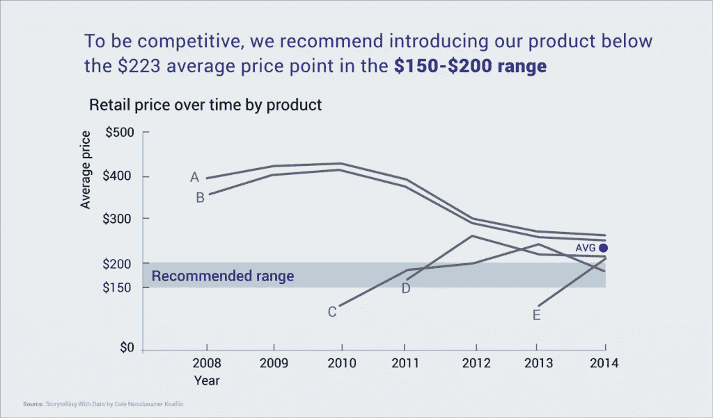

核心信息是显而易见的:要有竞争力，理想的价格在 150 到 200 美元之间。

# 以前

乍一看，这个饼图似乎足够清晰，但深入分析后，您会发现它并不遵守让查看者快速掌握信息的几个约定。

正常情况下，我们会期望人工尺度上的值按顺序排列，从“完全不感兴趣”到“非常感兴趣”但是在这种情况下，值是根据每个响应的百分比排列的。

我们还期望颜色的变化与人工标度相对应，一种颜色在标度的一端，第二种在相反的一端，中间有中间色调。

# 在...之后

乍一看，这要容易理解得多。根据价值等级排列，我们很快了解到大多数人对这种特殊的产品不感兴趣。

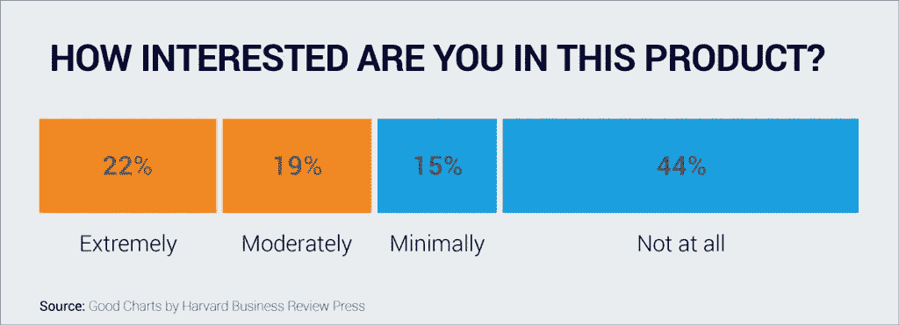

# 轮到你了

既然你已经学会了一些更有说服力和更有效的数据故事的简单原则，你可以试试用这个 [**免费图表和信息图表工具**](https://www.visme.co/make-infographics/) 在**创造你自己的可视化数据故事**。

如果你有任何自己的数据讲述技巧想要分享，请在评论区给我们留言！

*本帖* [*原版*](http://blog.visme.co/data-storytelling-tips/) *最早出现在 Visme 的* [*视觉学习中心*](http://blog.visme.co/) *。*