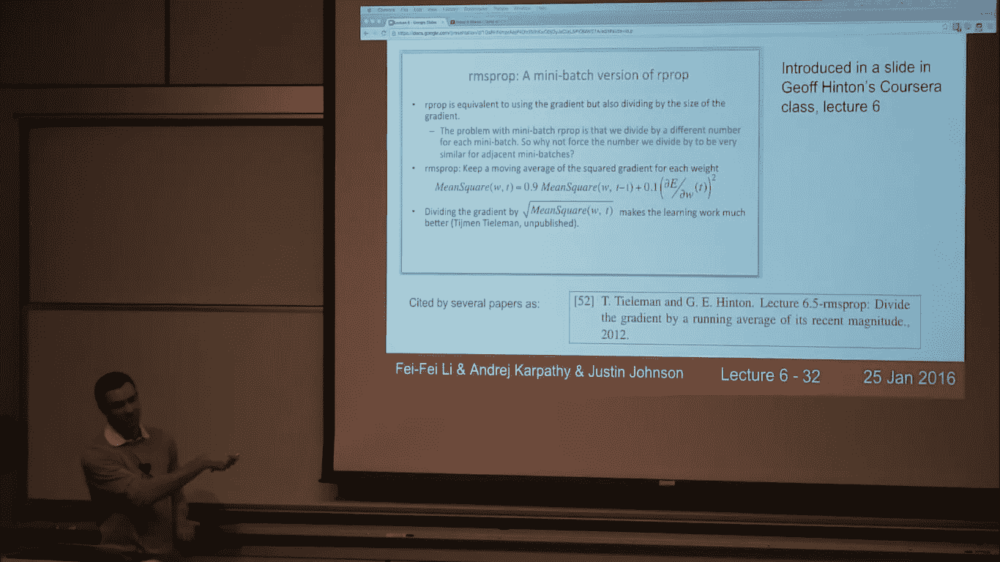

# 5 体现侥幸、坚持和观察的机器学习琐事。

> 原文：<https://towardsdatascience.com/5-machine-learning-trivia-that-embody-fluke-persistance-observation-400db9e206a3?source=collection_archive---------7----------------------->

我一直在观看长达一个小时的视频讲座，阅读书籍，滚动查看 stack exchange 上的问题，有一些信息非常突出。一些有趣的片段让我迷惑，并继续激励我去学习更多。在这篇文章中，我想整理其中的一些。那么，让我们开始吧。

1.  规范化纯属偶然。

规律化是一种神奇的技术，可以防止过度拟合，帮助我们平静地入睡，但实际上它并不是为了治疗过度拟合而开发的。最初开发它是为了通过使用正则化参数抵消不可逆矩阵来使它们可逆。然而，令人欣慰的是，人们注意到这也有助于解决模型过于依赖离群值的恼人问题。天佑不可逆转！

*2。Sigmoid 函数是 softmax 函数的特例*

也许你知道这一点，但当我意识到这一点时，我肃然起敬。我从未想过逻辑回归的核心函数可以与将实数向量压缩成概率的函数联系起来…直到我看到了这个。

我同意，事后看来，你可能认为它正盯着我的脸。二元分类扩展到多类分类，咄？但对我来说并不明显！

*3。Geoffrey Hinton 的 Coursera 课程中介绍了梯度更新的 RMS Prop 方法。*

准确的说是第六讲。神经网络之父杰夫·辛顿在他的幻灯片中说，这是未发表的，通常在实践中效果很好。Andrej Karpathy 在他的测试中实现了它，并发现它给出了更好的结果。当他使用它时，他引用了 coursera 讲座中的幻灯片。事实上，这是一个常见的引用。也许，从现在开始，我们在实现 Coursera 幻灯片上的微妙技术时会格外小心。

4.内核化的支持向量机从被想到到实现有 30 年的差距。

坚持和瞬间迸发的火花是相辅相成的。Vladamir Vapnik 在 60 年代就有了支持向量的基本概念。然而，直到 1993 年，他的同事才决定实现具有 n = 2 核的 SVM，以帮助他们赢得一场关于支持向量机在手写数字分类问题上击败神经网络的晚餐打赌。天哪，即使加入了最轻微的非线性，内核也工作得很好。你可以从我得到这个的地方观看这个惊人的视频，至少可以说它是激励人心的。

[https://youtu.be/_PwhiWxHK8o?t=46m19s](https://youtu.be/_PwhiWxHK8o?t=46m19s)

*5。CIFAR-10 不仅仅是另一个数据集*

标志性的数据集 CIFAR-10 是一个用于物体识别的既定计算机视觉数据集，由*加拿大高级研究所(CIFAR)创建。*我知道你会说，别胡扯了，夏洛克。但是，我在这里想说的是关于 CIFAR 这个机构本身。杰弗里·辛顿在他早期的研究中，去了美国进行研究。然而，当他们不幸地切断了对艾的大部分资助，再加上辛顿不愿意使用军事资助，他决定去加拿大。这也是 CIFAR 给他和平进行研究的机会。谢天谢地，我们为此感谢西法尔。它现在是深度学习的中心，Geoffrey Hinton 自己在那里运行了十年的深度学习项目。这就是我所说的双赢。

如果这些琐事中的任何一个给你的机器学习知识库增加了新的东西，我写它的目的就会得到优化。当我第一次发现它们的时候，我希望你有和我一样的惊奇和惊奇的感觉。请随意提出建议或你可能有的任何有用的信息。愿砝码对你有利！