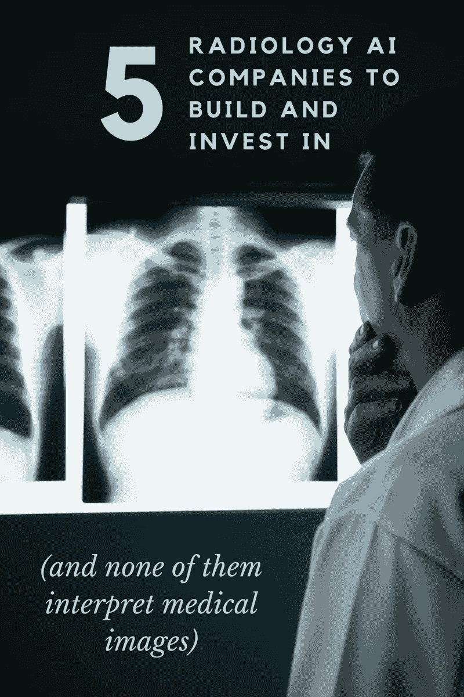
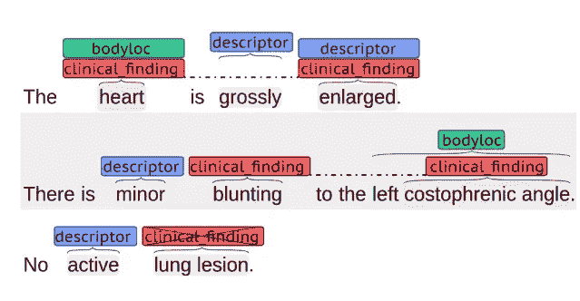
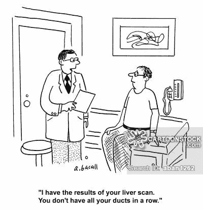
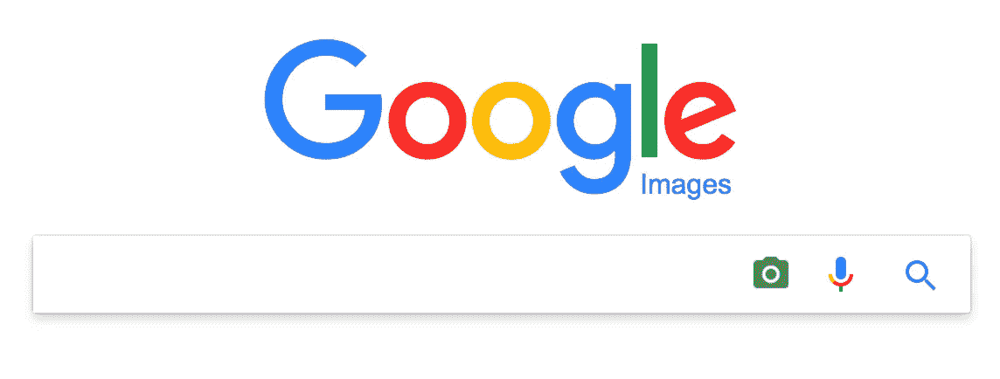

# 5 家放射学人工智能公司要建立和投资(它们都不解释医学图像)

> 原文：<https://towardsdatascience.com/5-radiology-artificial-intelligence-companies-to-build-and-none-of-them-interpret-medical-images-7a21633f4d6?source=collection_archive---------9----------------------->

我之前已经全面地写了关于在哪里投资放射学人工智能，以及如何击败这个领域正在进入的炒作曲线悬崖。对于那些没有看过我之前博客的人，我的总结是这样的:

***选择专注于临床有效用例的公司，这些公司拥有大量数据集，符合法规，并且没有过度宣传自己。***

问题是…像这样的放射学人工智能投资机会几乎不存在，尤其是在英国。我想是时候写下我的想法了，比如我实际上会建立什么(如果我有资金的话)，或者我会建议风投投资什么公司(如果它们存在的话)。

令人惊讶的是，没有一家公司真正解释医学图像——我会在最后解释为什么！

## 1.放射本体建模

好吧，这可能听起来有点简单和明显，但它实际上是所有放射学人工智能工作中最重要的。

首先，我需要解释一下放射学——它不仅仅是解读医学图像的临床专业，它还是一个将专家解读转化为文本的熟练过程。放射科医生本质上是傅立叶变换——将数字图像转换成用他们自己的“放射学”语言编写的模拟单词和句子。作为一名放射科医师，我已经学会了说“放射学”——我可以面无表情地说“一群胆管高回声钙化，伴有后部声学阴影”，其他任何放射科医师都知道我刚才描述的是什么，以及是什么形式。(翻译——我说的是超声波上看到的胆结石)。

这种语言，或者说本体论，对于这个领域来说是独一无二的，并且跨越国界也是相当同质的。在最佳实践中，每一次医学扫描都应该有一份以这种本体论格式编写的报告。这意味着，在世界各地的数据库中，几乎每一次医学扫描都有一个相当标准化的放射学描述。(如果这还不能让数据科学家兴奋，那么我不知道还有什么能让他们兴奋)。我们在这里谈论的是*数十亿*的数据点！更棒的是，数字化医疗记录中有数十亿个数据点！

Image from Modelling Radiological Language with Bidirectional Long Short-Term Memory Networks, Cornugreta et al, 2016.

因此，我将建立或投资的第一家放射学人工智能公司是一家可以将最先进的自然语言处理(NLP)矢量化和概念建模应用于放射学报告的公司。这项技术超越了简单的 LSTM 概念识别、Word2vec 嵌入和其他语言概念模型，通过添加递归神经网络来构建理解。与 RadLex(官方放射学“字典”)和其他医学本体数据库一起使用，公司可以构建一个强大的工具来有效地注释和概念性地建模他们可以访问的每个放射学报告。

无论是谁构建了这一系统，并率先将即插即用的 API 推向市场，都有可能成为大多数其他放射学人工智能研究、服务和其他医学成像人工智能公司的基础。

## 2.放射科地外行翻译

An example of poor Radiology to Lay translation

“放射学”作为一种语言的主要问题是，没有多少其他人能理解它(包括许多医生)。放射科医生通常会在报告的末尾加一个摘要来强调要点，然而，这个摘要是对报告正文的简化，通常不会涵盖其细节和细微差别。意义可能会丢失，摘要可能会被当作真理，由于缺乏细节，临床错误可能(并且已经)发生。

第二，最近推动了一种更加面向患者、以价值为导向的放射服务，这种服务允许放射科医生与患者直接互动，以解释成像结果。不足为奇的是，接受速度很慢，主要是因为放射科医生太忙了，没有时间阅读扫描结果。

我的第二个公司将解决这两个问题，通过建立在本体工作的第一部分上，并产生放射报告的外行翻译。增值是显而易见的——非放射学临床医生和患者都将受益于更易于访问的报告，而不会损失质量或改变放射科医生的工作流程。从本质上讲，这将是一条放射学上的盲鱼——在放射科医生和非放射科医生之间进行无意义的翻译。

以这种方式改善跨专业的交流可以减少复读和意见的要求，提供对临床状态更可靠和更彻底的了解，以及为患者提供更好的洞察力和保证。

这项技术的一个额外的免费好处是能够通过翻译服务推送报告，即时全球化报告，并开辟了英国放射服务外包给外国远程放射公司的可能性，以利用不讲英语的放射学家。

## 3.预测语义学

很久以前，放射科医生曾经在患者的临床记录中手写他们自己的报告。随后出现了口述录音机和放射科秘书/打字员，后来才出现了语音识别软件(这本身就是人工智能的一种形式)。进步终究是进步。我的观点是，现代放射科医生非常习惯于整天对着麦克风清晰易懂地说话，并看到他们的话出现在屏幕上。

放射科医生也有多个屏幕和许多消耗注意力的活动，从他们正在阅读的实际图像，到 PACS 系统屏幕，到报告，以及访问书籍和网站参考资料。我的第三个放射学人工智能公司将专注于这些参考资料。

通过建立语言模型和概念模型，我的目标是设计(或投资)一个系统，该系统内置一个具有推理能力的概念聚合器。这种系统可以根据放射科医师所说的内容，从理论上预测报告的总结发现。一个例子可以是描述病变的放射科医师，并且系统建议该病变的可能病理列表(例如，非骨化性纤维瘤、动脉瘤样骨囊肿、纤维皮质缺损；这些都可以看起来非常相似！).所有这些都可以实时进行。

这具有两个功能:1)以可能的鉴别病理学的形式向放射科医师提供决策支持，以及 2)通过消除口述概要的需要来加速口述过程。两者都通过改进工作流程和减少诊断错误来增加价值。

## 4.基于内容的图像检索

每家医院都有一个 PACS 归档，这是一个巨大的数据存储库，存储了过去 10 年中拍摄的所有图像(令人难以置信的是，归档的图像由于容量问题而被删除的情况屡见不鲜！).这个档案本质上是一个黑暗的坑，数十亿有价值的临床数据点被扔进这个坑，再也看不到了。真是浪费！

目前不可能在 PACS 档案中搜索特定的临床内容。是的，您可以搜索患者姓名或 ID，或按成像设备和日期进行过滤，但这意味着您需要在搜索之前了解扫描是在何时/如何或对谁进行的。然而，直到你打开它，你才知道扫描中的病理是什么。没有通过临床概念、病理学或者更好地通过图像搜索本身进行搜索的功能。

医院希望在影像档案中搜索特定临床病理的原因有很多:审计、研究、错误处理、教学案例、交叉引用等等。目前，记录某些类型临床病例的唯一方法(例如，记录所有患有罕见骨肿瘤的患者)是报告放射科医师在报告时手动将病例添加到文件中。之后，它就消失在档案中的某个地方了(除非有人记得病人的详细信息)。

我的第四家放射学人工智能公司将提供基于文本和基于图像的 PACS 存档搜索。基于文本的搜索将是一个简单的案例，在整个档案上运行我们第一家公司的概念建模 API，并将结果连接到智能搜索功能。临床医生可以立即搜索“患有转移性骨肉瘤的青少年”，并返回几十个病例供他们查看。老实说，在我的学术任期内，我已经搜索了数百万份档案，这个简单的功能可以节省几个月的研究时间！

不过，我想更进一步。通过使用简单的非解释性图像感知技术，如[流形排序，](http://citeseerx.ist.psu.edu/viewdoc/download?doi=10.1.1.228.2490&rep=rep1&type=pdf)我的目标是建立一个系统，允许放射科医生根据图像内容搜索 PACS 档案。(谷歌已经有了类似的服务，允许你上传图片并找到相似的——这也没什么不同)。

[https://images.google.com](https://images.google.com) allows you to upload an image to find similar content

想象一下，一位放射科医生正在查看一个复杂的肾脏肿瘤病例，该病例具有奇怪的血管模式，但他们不确定这是什么。我们的放射科医师可以使用 reading PACS 软件中的工具来裁剪该区域，单击 search，几秒钟后就可以获得几十个以前报告过的类似研究。这种基于内容的即时比较将改变工作流程，减少对外部参考源的依赖，成为出色的教学辅助工具，减少错误，并为基于以前的病例审查临床决策过程提供可靠的方法。

## 5.数字红点

很久以前，在放射学成为数字服务之前，放射科医生使用硬拷贝平片。这些二氧化硅和化学物质的薄片在黑暗的房间里被处理，挂湿晾干，然后被小心地放在棕色的文件纸条里，运送到阅览室。放射技师(技师)负责这个过程(不是放射科医师)。随着时间的推移，随着放射技师越来越熟练地阅读图像，开发了一种系统，放射技师将在胶片的角落放置一个小的圆形红色贴纸，以标记他们认为图像包含需要临床检查的病理。这个“红点”系统运行良好，尤其是在经验丰富的放射技师的监督下。红点胶片将被放置在报告堆的顶部，以确保当值放射科医师首先看到紧急的临床发现，反过来，病情最严重的患者将及时将他们的图像报告给相关的临床团队。

不幸的是，一旦引入数字 PACS，这种简单的警报系统就消失了。是的，放射技师可以数字标记图像，但通常情况下，图像仍然出现在报告队列中的正常位置。放射科医师在他们的阅片 PACS 中实际打开它们之前，不知道哪些胶片包含病理，哪些不包含病理。

*Digitally annotated ‘red dot’ of a left orbital floor fracture. Note the annotation isn’t in fact red nor a dot, but it still does the job!.*

我的第五家，也可能是最具临床价值的放射人工智能公司将开发一种数字红点系统，以实现早期分流。通过在简单标注为“正常”和“异常”的成像数据集上训练卷积神经网络，将建立一个简单的检伤分类系统，具有高异常敏感度但低病理特异性。紧急电影会出现在阅读清单的最上面，在不太重要的“正常”研究之上。

好处不言而喻——具有紧急发现的扫描将被报告并优先于“正常”研究采取行动。病人的安全将在一夜之间得到极大的改善。有报告积压的医院(即英国的每一家医院)可以更有效、更自信地首先处理重要的扫描，潜在地将癌症和其他等待列表减少几个数量级。成本节约潜力巨大。最令人兴奋的是，这样一个系统将为开发病理分类器奠定基础，让我们最终能够一瞥解释医学图像中病理的人工智能的开端。

所以，你有它。五家在医学成像中使用人工智能的公司绝对需要建立，需要投资，需要培育。放射学中的人工智能不一定仅仅是解释图像——这是高度专业化的人类的职权范围，也可以说是一个更加困难的技术挑战。相反，我们必须建立工具，增强和帮助放射科医生，缓解痛点，并改善安全和工作流程。事实上，我认为如果没有这五项技术的存在，对图像的实际解读根本不可能发生。

然而，如果没有成像数据、研究框架、开发、监管审批、市场化和上市，这一切都是不可能的。为此，我们需要一个放射学人工智能孵化器——而我恰好也有这个计划

如果你和我一样对放射学人工智能的未来感到兴奋，并想讨论这些想法，请保持联系。我在推特@drhughharvey

*如果你喜欢这篇文章，点击推荐并分享它会很有帮助。*

*关于作者:*

哈维博士是一名委员会认证的放射科医生和临床学者，在英国国民医疗服务体系和欧洲领先的癌症研究机构 ICR 接受过培训，并两次获得年度科学作家奖。他曾在 Babylon Health 工作，领导监管事务团队，在人工智能支持的分诊服务中获得了世界第一的 CE 标记，现在是顾问放射科医生，皇家放射学家学会信息学委员会成员，以及人工智能初创公司的顾问，包括 Kheiron Medical。