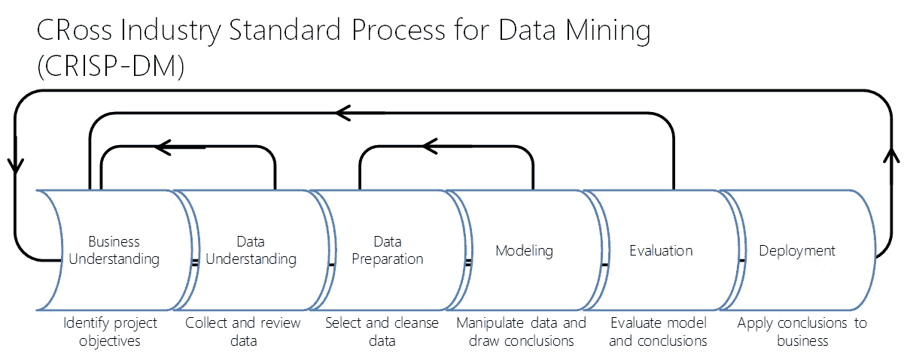
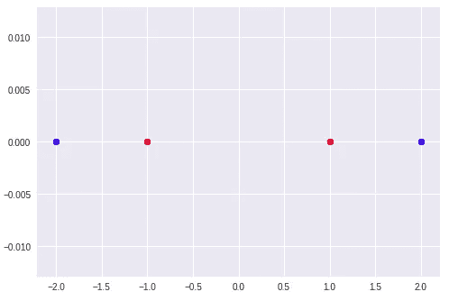
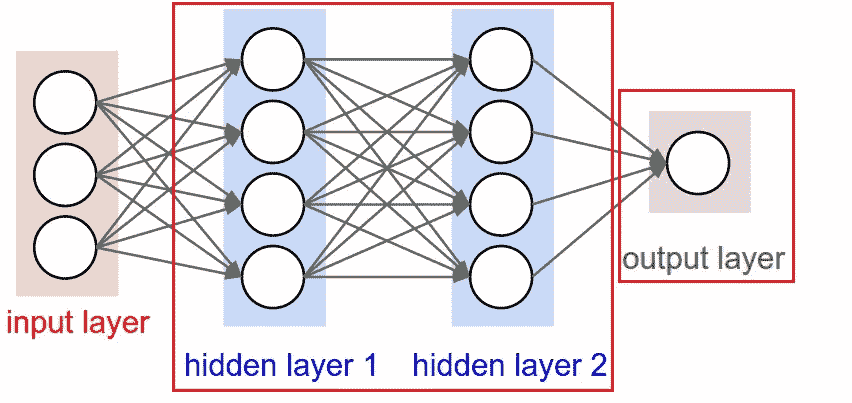

# 成为数据科学家的第一件事应该是学习“逻辑回归”的 5 个理由

> 原文：<https://towardsdatascience.com/5-reasons-logistic-regression-should-be-the-first-thing-you-learn-when-become-a-data-scientist-fcaae46605c4?source=collection_archive---------1----------------------->


几年前，我开始涉足数据科学领域。当时我是一名软件工程师，我首先开始在网上学习(在开始攻读硕士学位之前)。我记得当我搜索在线资源时，我只看到学习算法的名称——线性回归、支持向量机、决策树、随机森林、神经网络等等。很难理解我应该从哪里开始。今天，我知道要成为一名数据科学家，最重要的是学习管道，即获取和处理数据、理解数据、构建模型、评估结果(模型和数据处理阶段)和部署的过程。所以作为一个**TL；本文作者:首先学习逻辑回归，熟悉流水线，不要被花哨的算法淹没。**

你可以在这个[帖子](/experiencing-the-science-in-data-science-b37862b3fbfb)中读到更多关于我从软件工程转向数据科学的经历。

这是我今天认为我们应该首先从逻辑回归开始成为数据科学家的 5 个原因。当然，这只是我的看法，对其他人来说，用不同的方式做事可能更容易。

**因为学习算法只是流水线的一部分**

正如我在开头所说，数据科学工作不仅仅是建立模型。它包括以下步骤:



你可以看到“建模”是这个重复过程的一部分。当构建一个数据产品时，首先构建整个管道是一个很好的做法，尽可能保持简单，了解你到底想要实现什么，你如何衡量自己，你的基线是什么。在那之后，你可以进行奇特的机器学习，并且能够知道你是否正在变得更好。

顺便说一下，逻辑回归(或任何 ML 算法)不仅可以用于“建模”部分，还可以用于“数据理解”和“数据准备”，输入就是一个例子。

**因为你会更好地理解机器学习**

我认为人们在阅读这篇文章标题时问自己的第一个问题是为什么是“逻辑”而不是“线性”回归。事实是这并不重要。仅这个问题就引出了两种监督学习算法——分类(逻辑回归)和回归(线性回归)。当你用逻辑或线性回归建立你的管道时，你会熟悉大多数机器学习概念，同时保持事情简单。像监督和非监督学习，分类与回归，线性与非线性问题等概念。此外，您还将了解如何准备数据，可能存在哪些挑战(如估算和特征选择)，如何衡量您的模型，是否应该使用“准确性”、“精确回忆”、“ROC AUC”？或者也许是“均方差”和“皮尔逊相关”？。所有这些概念都是数据科学过程中最重要的部分。在你熟悉它们之后，一旦你掌握了它们，你就能够用更复杂的模型来代替你的简单模型。

**因为“逻辑回归”是(有时)足够的**

逻辑回归是一种非常强大的算法，即使对于非常复杂的问题，它也可以做得很好。以 MNIST 为例，仅使用逻辑回归就可以达到 95%的准确率，这不是一个很好的结果，但足以确保你的管道工作。实际上，通过正确的特征表示，它可以做得非常好。在处理非线性问题时，我们有时试图用一种可以线性解释的方式来表示原始数据。这是一个简单的例子:我们想对以下数据执行一个简单的分类任务:

```
X1    x2    |  Y
==================
-2    0        1
 2    0        1
-1    0        0
 1    0        0
```

如果我们绘制这些数据，我们会发现没有一条直线可以将它们分开:

```
plt.scatter([-2, 2], [0, 0 ], c='b')
plt.scatter([-1, 1], [0, 0 ], c='r')
```



在这种情况下，不对数据做任何事情的逻辑回归对我们没有帮助，但是如果我们放弃我们的`x2`特性并使用`x1²`来代替，它将看起来像这样:

```
X1    x1^2  |  Y
==================
-2    4       1
 2    4       1
-1    1       0
 1    1       0
```


现在，有一条简单的线可以分隔数据。当然，这个玩具示例一点也不像现实生活，在现实生活中，很难判断您到底需要如何更改数据，因此线性分类器将有助于您，但是，如果您在特征工程和特征选择方面投入一些时间，您的逻辑回归可能会做得非常好。

**因为它是统计的重要工具**

线性回归不仅适用于预测，一旦你有一个拟合的线性回归模型，你就可以了解因变量和自变量之间的关系，或者用更“ML”的语言来说，你可以了解你的特征和你的目标值之间的关系。考虑一个简单的例子，我们有关于房屋定价的数据，我们有一堆特征和实际价格。我们拟合了一个线性回归模型，得到了很好的结果。我们可以查看模型为每个特征学习的实际权重，如果这些权重显著，我们可以说一些特征比其他特征更重要，此外，我们可以说，例如，房屋大小占房价变化的 50%，每增加 1 平方米将导致房价的 10K 增加。线性回归是从数据中学习关系的强大工具，统计学家经常使用它。

**因为这是学习神经网络的良好开端**

对我来说，在我开始学习神经网络的时候，先学习 Logistic 回归帮助很大。你可以把网络中的每个神经元想象成一个逻辑回归，它有输入，权重，偏差，你对所有这些做点积，然后应用一些非线性函数。此外，神经网络的最后一层是一个简单的线性模型(大多数情况下)。看看这个非常基本的神经网络:


让我们仔细看看“输出层”，您可以看到这是一个简单的线性(或逻辑)回归，我们有输入(隐藏层 2)，我们有权重，我们做点积，然后添加一个非线性函数(取决于任务)。考虑神经网络的一个好方法是将 NN 分成两部分，表示部分和分类/回归部分:



第一部分(左侧)试图学习数据的良好表示，这将有助于第二部分(右侧)执行线性分类/回归。你可以在这篇伟大的[帖子](http://colah.github.io/posts/2014-03-NN-Manifolds-Topology/)中读到更多关于这个想法的内容。

**结论**

如果你想成为一名数据科学家，有很多事情要知道，乍一看，学习算法似乎是最重要的部分。现实是，学习算法在大多数情况下非常复杂，需要大量的时间和精力来理解，但只是数据科学管道的一小部分。