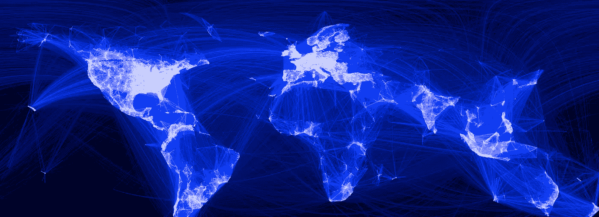
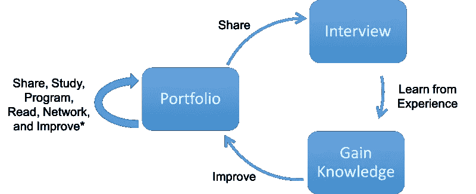

# 启发您下一个数据科学项目的 5 种资源

> 原文：<https://towardsdatascience.com/5-resources-to-inspire-your-next-data-science-project-ea6afbe20319?source=collection_archive---------1----------------------->

## 不要担心——开始是最难的部分

[Facebook 2010](http://www.gargasz.info/a-data-visualization-of-facebook-friendships/)

# 入门指南

我们接触到看似无穷无尽的数据科学职业建议，但有一个话题没有得到足够的重视:兼职项目。副业很棒，原因有很多，但我喜欢朱莉·卓在下面简单的文氏图中的描述:

[Image Source](https://medium.com/the-year-of-the-looking-glass/the-importance-of-side-projects-cf9f63954031)

兼职项目是一种将数据科学应用于目标驱动程度较低的环境中的方式，这种环境可能比你在工作或学校中经历的环境更少。它们提供了一个[的机会，让你可以随心所欲地使用数据，同时学习实用技能。](https://www.ted.com/playlists/383/the_importance_of_play)

除了有趣和学习新技能的好方法之外，兼职项目也有助于你求职。招聘人员和经理们喜欢看到那些显示你对数据感兴趣的项目，而不仅仅是课程和工作。

# 问题是

你有没有过想开始一个新项目却又决定不了要做什么的经历？首先，你花几个小时集思广益。然后几天。在你意识到之前，几个星期过去了，没有任何新的发货。

这在所有领域的自驱动项目中极为常见；数据科学也不例外。有远大的抱负很容易，但要实现却困难得多。我发现数据科学项目最难的部分是开始并决定走哪条路。

**在这篇文章中，我的目的是提供一些有用的提示和资源，帮助您开始下一个数据科学项目。**

# 考虑

在我们进入下面的资源之前，在考虑数据科学项目时，有几件事情值得注意。

## 你的目标

数据科学是一个极其多样化的领域；这意味着几乎不可能将每个概念和工具都压缩到一个项目中。你需要挑选出你想进一步发展的技能。一些相关的例子包括:

*   机器学习和建模
*   探索性数据分析
*   度量和实验
*   数据可视化和通信
*   数据挖掘和清理

请注意，虽然很难将每一个概念结合起来，但您可以将其中的一些结合起来，例如，您可以收集数据进行探索性的数据分析，然后以一种有趣的方式将其可视化。

基本上，如果你想成为一名更有效的机器学习工程师，很可能你不会通过做一个 data viz 项目来实现这一点。你的项目应该反映你的目标。这样，即使它没有爆炸或发现任何突破性的见解，你仍然可以带着胜利和一堆应用知识离开。

## 你的兴趣

就像我们之前提到的，副业应该是令人愉快的。不管我们是否意识到，我们每天都会问自己数百个问题。在今天剩下的时间里，试着比平时更多地关注这些问题。你会对发生的事情感到惊讶。你可能会发现你更有创造力，对你认为的某些事情更感兴趣。

现在将它应用到你的下一个数据科学项目中。你好奇如何对你的晨跑进行分类吗？想知道[川普如何以及何时在推特上发布他做的事情吗？对体育史上最伟大的](http://varianceexplained.org/r/trump-tweets/)[一炮而红的奇迹](https://pudding.cool/2018/04/one-hit-wonders/)感兴趣吗？

可能性确实是无穷无尽的。让你的兴趣、好奇心和目标驱动你的下一个项目。一旦你检查了这些框，让我们得到启发。

[Image Source](/how-to-build-a-data-science-portfolio-5f566517c79c)

# 灵感

我们很容易认为自己是独立的，但事实证明情况并非如此。如果你足够努力，总会有其他人有相似的兴趣和目标。这种效应对思维能力有着难以置信的强大作用。

> “没有什么是原创的。从任何能激发灵感或激发你想象力的地方偷东西。”—吉姆·贾姆什

找到你喜欢或欣赏的项目，然后在上面加入你自己的想法。把它们作为出发点，创作出新的、独一无二的原创作品。我最喜欢的一些灵感来源如下:

## [数据漂亮](https://www.reddit.com/r/dataisbeautiful/)

我可以花几个小时浏览这些数据可视化的子集。你会对人们想出的所有独特的想法和问题感兴趣。还有每月一次的选择数据集的挑战，用户的任务是以最有效的方式可视化它。根据最佳时间排序，以获得即时满足。

## [卡格尔](https://www.kaggle.com/datasets)

如果我没有提到在线数据科学的典型代表，那将是我的失职。有几种方法可以有效地利用 Kaggle 获取灵感。首先，您可以查看[趋势数据集](https://www.kaggle.com/datasets)，并思考利用这些信息的有趣方式。如果你对机器学习和例子本身更感兴趣，那么随着时间的推移，[内核的特性](https://www.kaggle.com/kernels)会变得越来越好。

## [布丁](https://pudding.cool/)

的确，视觉散文是一种新兴的新闻形式。布丁最能体现这种运动。该团队使用原始数据集、原始研究和互动来探索大量有趣的话题。

## [538](https://fivethirtyeight.com/)

经典，但至今依然不错。我是说得了吧，[内特·西尔弗](https://fivethirtyeight.com/contributors/nate-silver/)才是男人。数据驱动的博客涉及从政治到体育到文化的方方面面。更不用说，他们刚刚改进了他们的数据导出页面。

## [走向数据科学](https://towardsdatascience.com/)

最后，我要为 [TDS 团队](https://medium.com/u/7e12c71dfa81?source=post_page-----ea6afbe20319--------------------------------)大声欢呼，因为他们聚集了这群充满激情的聪明人，让他们在数据科学领域取得成就并帮助他人成长。在任何一天，浏览最近的故事都会给你带来很多有趣的项目想法。

# 包扎

兼职项目不仅在我的整个开发过程中极大地帮助了我，而且它们通常也很有趣。最近，数据科学作品集上出现了越来越多的精彩内容。如果有兴趣，我强烈推荐查看以下链接:

*   [关于构建数据科学投资组合的建议](https://medium.com/@jasonkgoodman/advice-on-building-data-portfolio-projects-c5f96d8a0627)
*   [如何构建数据科学组合](/how-to-build-a-data-science-portfolio-5f566517c79c)
*   [如何构建引人注目的数据科学组合&简历](https://www.youtube.com/watch?v=xrhPjE7wHas&t=1814s)

任何事情最难的部分就是开始。我希望上面的提示和资源能够帮助您完成并交付下一个数据科学项目。我会留意的。

感谢阅读！如果你喜欢这篇文章，请继续向鼓掌按钮展示你的爱，看看我最近的一些项目:

*   [解构介质上的指标](https://www.conordewey.com/blog/deconstructing-metrics-on-medium/)
*   [从科技独角兽公司的数据科学实习生身上学到的 5 课](https://www.conordewey.com/blog/5-lessons-from-a-data-science-intern-at-a-tech-unicorn/)
*   [我用 Python 分析 80 多份工作拒绝后学到了什么](https://www.conordewey.com/blog/analyzing-more-than-80-job-rejections-with-python/)

对更多的帖子感兴趣吗？请务必[关注我](https://twitter.com/cdeweyx)并订阅下面的[我的简讯](https://www.conordewey.com/)以接收任何新内容。想了解更多关于我和我在做什么，请查看我的网站。