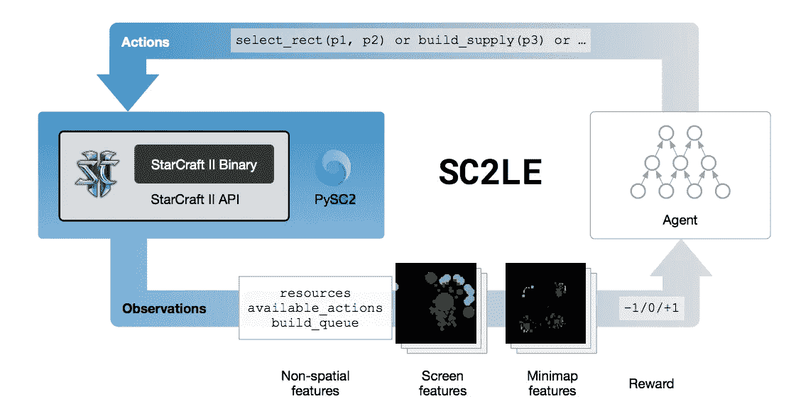
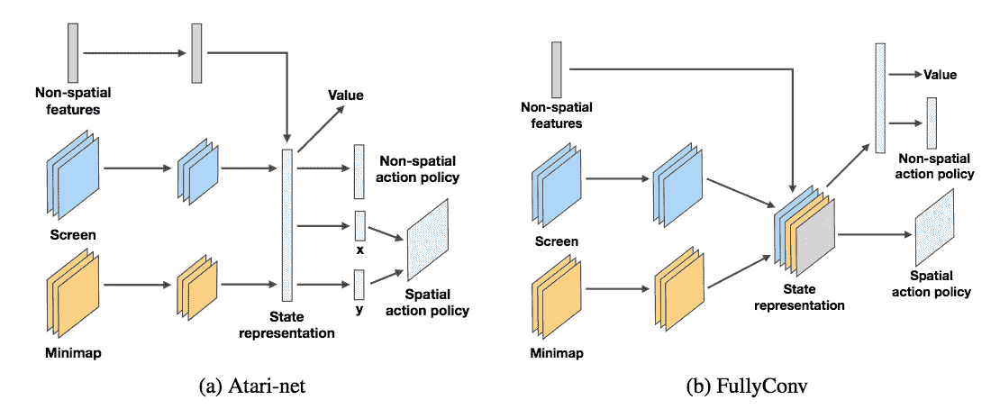
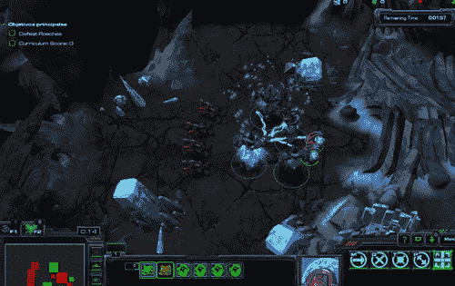
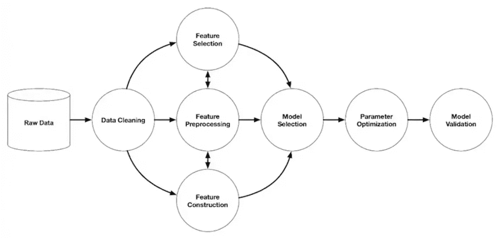
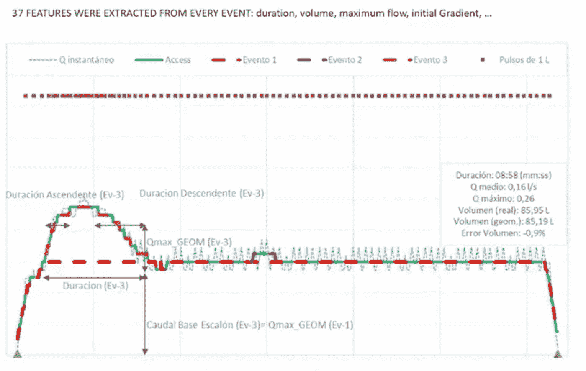
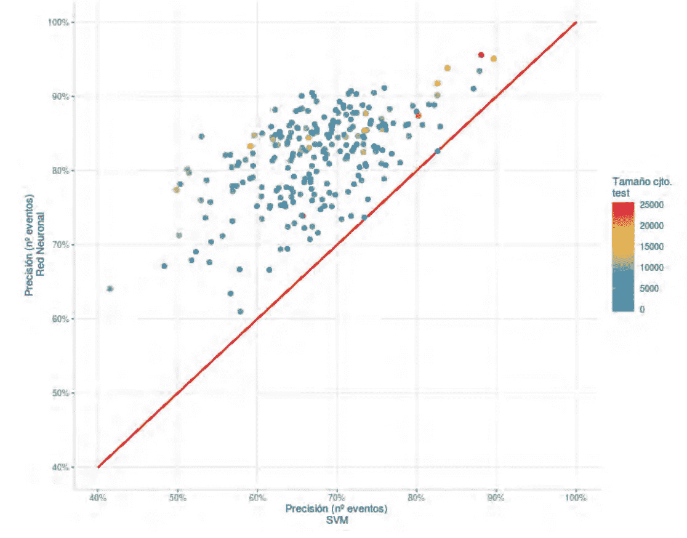
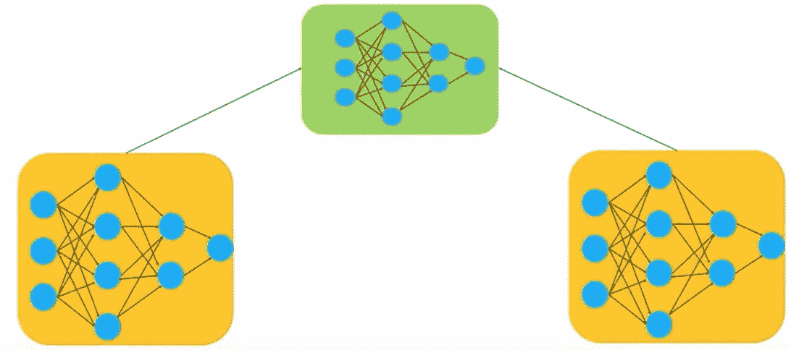
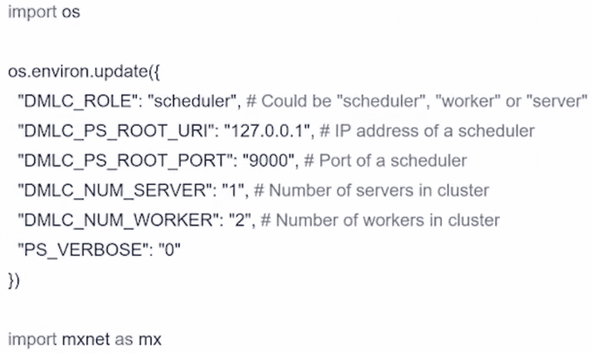

# 2017 年西班牙大数据的 5 个收获

> 原文：<https://towardsdatascience.com/5-takeaways-from-big-data-spain-2017-56ce76670233?source=collection_archive---------6----------------------->

我最近有机会参加 2017 年西班牙大数据大会，这是欧洲关于大数据、人工智能、云技术和数字化转型的三大会议之一。于 2017 年 11 月 16 日、17 日举行。演讲者来自谷歌、优步、亚马逊、脸书、Spotify 和其他顶级公司，讨论范围从最先进的大数据基础设施到深度学习，从区块链到贝叶斯推理。由于会谈是在 4 个平行的轨道上进行的，我将只写一个摘要和我所参加的那些会谈的要点。在文章的最后，你会发现我对这次会议的 5 点看法。

> 披露者:我是一名数据科学家，主要兴趣是人工智能，其次是 ML 模型服务、大规模数据分析和软件工程。因此，我对我决定参加的会议有偏见的选择。

# 5 个关键要点

> TL；大卫:对于那些喜欢浏览阅读材料，花不超过 1-2 分钟的人来说，这里是从这两天的谈话和对话中获得的 5 个关键点:

1.  **主动学习**(人在循环中)一旦人工智能出现在工人日常任务的最前沿，它就会在这里停留下来
2.  **强化学习**应用在电子游戏上只是冰山一角。我们将很快看到 RL 利用深度学习在生产中应用于许多现实世界的问题。
3.  **自动机器学习**即创建机器学习工具，这些工具可以创建能够解决任务的机器学习模型，这是一个相关的趋势。数据科学家将能够更加敏捷，专注于重复性较低的任务。
4.  深度学习正在大量进入时间序列**预测**。不同工具的混合被证明能够产生很好的结果来对堆叠/多模态信号中的事件进行分类。
5.  **流**似乎是现在数据工程中真正的交易，我们几乎再也听不到关于批处理的消息了。所有的数据管道目前都是围绕流构建的，每个人都在转换或最近转换到 kappa 架构，其中流通常是主要元素/焦点。

# 第一天

## 人在循环中:管理团队的设计模式——Paco Nathan(奥莱利学习小组主任)

[Paco Nathan](https://medium.com/u/ed409c5b95e3?source=post_page-----56ce76670233--------------------------------) 提出了以下(复杂的)研究问题:非 AI 专家能否基于实例而非代码教会机器执行复杂的工作？

在过去的几十年里，大数据(1997 年)+大计算(~2006 年)+大模型(~2009 年)的混合创造了一个人工智能可以集成到真实产品的环境。但是等式中缺少了一个组成部分:人类平等。于是，**主动学习** (human on the loop)被引入，概括来说就是半监督学习的一个特例。其背后的基本思想是，当算法对某些预测不太有信心时(即边缘情况)，获得人类的帮助。与监督学习相比，主动学习的优势在于前者需要更少的人工标记数据，因为它能够处理路由决策(自动化)。

在媒体领域有一个利基，这个垂直领域不包括尖端的人工智能技术。示例:

*   (教程)视频的抄本
*   用人工生成的本体扩充知识。
*   上下文消歧

使用主动学习的公司:CrowdFlower(激活收集数据的人群，以反馈自我报告准确度低于特定阈值的 ML 模型)，Stitch Fix(产品个性化)，Clara Labs(半自动投标)，B12(自动商业设计，仅最后一英里人类)。

基于人在回路的设计模式，人工智能专业知识可能会从销售、营销和客户服务团队中产生，这些团队对客户的需求有着至关重要的见解。

资源:

*   nb transom(【https://github.com/ceteri/nbtransom】T2)是一个在 Jupyter 笔记本中编程读/写单元格的工具，它预测了 Jupyter 中即将到来的协作特性。O'Reilly 用于管理机器学习管道的笔记本。
*   prodigy([https://prodi.gy/](https://prodi.gy/))是一个由主动学习驱动的注释工具，用于帮助标记与实体识别、意图检测或图像分类相关的示例。

外卖理念:

> 一旦人工智能在工人的日常任务中占据重要位置，主动学习(以人为本)将会继续存在。这并不意味着取代员工，而是借助人类的专业知识来利用人工智能。这就是为什么大团队开始成为大数据+大计算+大模型公式的一部分。

## 合作愉快:超越 JVM w/Spark 的大数据——Holden Karau，提交人 Apache Spark，Google

魅力四射且广为人知的[霍尔登·卡劳](https://medium.com/u/5e502786e0a2?source=post_page-----56ce76670233--------------------------------)吸引了所有人的注意力，他以“我们都应该友好相处，我们都有同样的记忆错误”“这个演讲包含了很多关于猫的图片，如果你不喜欢猫的，那你现在就来错地方了:)”开始。

Holden 分享了对大数据生态系统当前状态的务实观察，以及大多数数据处理工具都构建在 JVM 上，而数据科学库通常用 Python 实现的事实。PySpark 通常被使用，但是它在设计上有一些严重的性能障碍。

那么，如何弥合这两个世界之间的差距呢？Apache Arrow 是目前最有希望将数据从 JVM 中取出的解决方案。其他一些项目，如[阿帕奇光束](https://beam.apache.org/)或[达斯克](https://dask.pydata.org/en/latest/)也值得关注。

外卖理念:

> 像我们这样的 PySpark 用户应该密切关注 Apache Arrow，它承诺未来会有性能改进。其次，尽快学会如何使用 Dask。

## 深度强化学习:星际争霸学习环境——Gema parreo Piqueras，数据科学家，BBVA

gema.parreno.piqueras 的这个演讲是最有趣的一个。不幸的是，所有会谈的时间跨度都是一样的，而且非常有限，在这种情况下，我错过了一个多小时的时间来从展示的项目中获得更多的见解。

作为一个主题介绍，强化学习是一种机器学习算法，它允许软件代理和机器自动确定特定上下文中的理想行为，以最大化其性能。

Gema 强调，代理人自动玩的视频游戏只是概念的简单证明。强化学习有许多日常应用，如试图在人体器官内生存的人工细菌、库存管理中的运输时间减少、制造中关于物体处理的知识等。

> 我们必须考虑人类和机器的合作

试错法:代理人必须尝试许多行动，并找到优化报酬收集的方法。**债权转让问题**:一个行为的结果可能不会在该行为之后立即出现。在这类问题中，**时间**是一个非常重要的因素，因为回报可能在长期出现(需要规划)。

实时决策涉及在**开发**和**探索**之间的基本选择，前者旨在根据当前信息做出最佳决策，后者从根本上引入更多数据，帮助代理更好地了解环境。这是一种基本的权衡，因为最好的长期战略可能需要做出短期牺牲。最棒的是:收集足够的信息来做出最好的整体决策。

[https://arxiv.org/pdf/1708.04782.pdf](https://arxiv.org/pdf/1708.04782.pdf)

强化学习的目标是通过从环境中学习来最大化一种叫做行为的策略。越深入，策略越大。星际争霸 2 已经作为 RL 环境发布。向代理人提出具有挑战性的政策是非常复杂的。 **Atari-net** 是第一个基线，是一个简单的架构改编，成功地用于迷你游戏上的 Atari 基准和 DeepMind 实验室环境。由于可以采取大量可能的行动，所以需要使用神经网络。引入了空间政策，这是一种完全不同的范式:不再是“向右走，向上走，做点什么”之类的决策。

[https://arxiv.org/pdf/1708.04782.pdf](https://arxiv.org/pdf/1708.04782.pdf)

Gema 为《星际争霸 2》AI workshop 2017(暴雪+ DeepMind)做出了贡献，展示了一个脚本化的代理人，在带有执政官单位的“幻觉 SC2 地图”中运行，以复杂的方式探索地图，并尽可能早地产生幻觉，从而获得了最先进的分数:

有趣的资源:[https://github.com/soygema](https://github.com/soygema)。Gema 正在建立一个关于“pySC2 迷你游戏社区策划列表”的社区。

外卖理念:

> 视频游戏上的强化学习只是人工智能领域即将到来的第一步。因此，围绕如何提高 agent 在复杂环境中的性能(使用 DL)，仍需要做大量的研究。

## 关系型是新的大数据——米格尔·Á·安吉尔·法哈多和丹尼尔·多明格斯，Geoblink

这个演讲一开始就清晰而全面地回顾了数据库的历史、定理以及我们是如何到达那里的，为什么 NoSQL 出现了，它到底意味着什么，它解决了什么问题。然后认为，由于过去几年在分布 RDBMS 方面所做的改进，SQL 赶上来了，现在是解决与 NoSQL 所解决的同类问题的一个重要的替代方法。Citus 或 PostgresXL 等支持分发 PostgreSQL 的项目是值得考虑的新兴参与者。

作为 FindHotel 的大量 PostgreSQL 用户，尝试其中一种解决方案无疑是我们必须探索的一个想法，以便解决我们当前的扩展问题。

有趣的资源:[https://www.citusdata.com/](https://www.citusdata.com/)和[https://www.postgres-xl.org/](https://www.postgres-xl.org/)

## 使用 GPU、Kubernetes、Istio 和 TensorFlow 在 AWS 上从头构建 Google 的 ML 引擎——Chris Fregly，PipelineAI 创始人兼研究工程师

PipelineAI 专注于数据科学管道的末端，即将数学**模型投入生产**。克里斯声称要“逆转将模型投入生产的谷歌云 ML 系统”，为“企业中的每一个实时预测提供标准的运行时间”。他们不是第三方服务，他们可以在任何云系统中部署他们的服务。他们的技术基于现在流行的 Kubernetes 和 istio.io。

[Chris Fregly](https://medium.com/u/353ee16d2e35?source=post_page-----56ce76670233--------------------------------) 提出了“生产/服务第一”的思想:从笔记本电脑持续部署。他指出，目前的最新研究可以在[这里找到](https://github.com/PipelineAI/pipeline)、 [TensorFlow Lite](https://www.tensorflow.org/mobile/tflite/) 和 [Nvidia Tensor-RT](https://developer.nvidia.com/tensorrt) 。

根据客户需求的不同，所提出的解决方案是非常多样的，但主要思想是将 bin 烧入 docker 中，这是使模型可执行所需要的一切。这允许很容易地改变运行时类型(GPU 可能没有 CPU 快)。模型可以使用卡夫卡主题的数据。从笔记本直接部署是可能的，加速了团队的迭代时间。回滚是非常容易的。费用也很重要:它们提供了跨云的自动转换(AWS 到 GC，反之亦然),以便在任何时候都能获得最好的交易。

我们发现这是一个热门话题，例如，在 FindHotel，我们正在构建自己的框架来包装我们的数据科学家的 ML 代码，并将其转化为生产就绪的 API。但是，这需要从头开始做大量的工作，我们不具备像 PipelineAI 这样的项目所提供的所有功能和灵活性。

外卖理念:

> N 现在，数据科学在实际生产环境中的影响力越来越大，重要的是允许数据科学家比以往任何时候都更快地迭代，通过提供笔记本电脑来一键部署模型，将流量转移到获胜模型，通过在任何给定时刻选择最便宜的云提供商来削减成本，即时查看和监控实时预测，对实时流数据进行无限模型再培训等。

## 走向生物学似是而非的深度学习——IBM 数据科学家尼古拉·曼切夫

尼古拉致力于人类水平的性能研究。问题是人类的大脑是否像人类一样工作。NNs 的主力是反向传播，但人脑中正在发生完全不同的事情:早期层的突触变化应该取决于下游层的连接。但是没有证据表明这种过程发生在新皮层。“学习过程，就其目前的形式而言，并不是一种合理的学习模式”。

认知科学表明，真正像人类一样学习和思考的机器将不得不超越当前的工程趋势，无论是在学习什么和如何学习方面。尼古拉揭示了赋能 AI 有 3 个主轴:1。建立支持解释和理解的世界因果模型，而不仅仅是解决模式识别问题；2.物理学和心理学直觉理论的基础学习，以支持和丰富所学知识；第三。利用组合性和学会学习来快速获取知识，并将其概括到新的任务和情况中。

有人提出了一些修复方法，从大脑中学习如何改进最先进的神经网络。一些例子是使用多隔室神经元[GLR17] 通过去除突触重量转运[LCTA14] 和*来使用*局部反向传播。首先，神经网络通常运行在大量的标记数据上，但大脑几乎一直在以无监督的方式学习，并且只需要很少的例子就能很好地概括。其次，知识转移允许使用类似的已知问题的解决方案来解决未知的问题。关于这第二点，已经进行了一些研究，使用 NNs 从玩游戏的人学习短时间，然后允许机器继续玩游戏(也称为模仿演员的方法)；结果比深度 Q-网络好得多。**

人工智能在人类很快学会的任务中非常失败的非常有趣的例子:Atari 的冻伤游戏(当需要临时延长计划以确保代理人可以完成子目标时，人工智能有麻烦)和人物挑战(需要大量的例子才能表现良好)。

你可以找到神经科学借用的许多更有趣的机制，如经验回放、工作记忆、高效学习、幻觉、规划等。你应该看看 *HKSB17，神经科学启发的人工智能*[http://www . cell . com/neuron/pdf/s 0896-6273(17)30509-3 . pdf](http://www.cell.com/neuron/pdf/S0896-6273(17)30509-3.pdf)和*建造像人一样学习和思考的机器*[https://arxiv.org/pdf/1604.00289.pdf](https://arxiv.org/pdf/1604.00289.pdf)

外卖理念:

> 神经科学是理解和帮助人工智能更快发展的关键，反之亦然。理解和模仿人脑背后增强人类知识和学习的机制将激励我们追踪人工智能的未来发展。

## 大数据，大质量？——Irene gonzálvez 技术产品经理@ Spotify

艾琳讲述了他们如何确保 Spotify 的数据质量，此前她了解到这一“艰难之路”(2015 年一个充满事故的艰难夏天)的重要性。他们达到了 Kafka 和 Hadoop 的极限，数据几乎晚了一天才到达。

在 Spotify，他们将数据质量理解为“在特定环境下服务于其目的的数据”。深入挖掘，高质量的数据具有以下特征:

1.  及时:数据在指定的 SLO 中可供使用。
2.  正确性:就某些规格而言，数据是正确的。
3.  完整性:解决某个业务案例所需的所有数据都是可用的。
4.  一致性:不同系统之间的所有数据都是同步的。

Spotify 内部开发了一些工具来处理数据质量:

1.  DataMon:当数据不符合指定的 SLO 时，向管道所有者和工程师发出警报。它监控端点(保存生成的数据和消费的数据的存储)、组件(元数据、后端、库……)和系统(前两者的组合)。它有助于检测延迟数据的上游依赖性。它提供了有关数据事件、联系人、附加文档等信息

DataMon from Spotify

2.数据计数器:收集来自不同数据处理框架(如数据流或 Hadoop)的指标。这帮助他们迁移到谷歌云。向两个系统添加了指标以检测一致性(两个平台上的数据计数相等)。它可以帮助检测欺诈者(同时播放更多的播放列表)。

Data Counters

3.MetriLab。数据计数器上的规则(如果播放的播放列表增加 X%…)。这个工具允许非常简单的异常检测。他们拒绝使用 ML，因为他们想使用可解释的算法，降低误报率。

Spotify 数据团队的下一步是什么？构建用于异常检测的 algo 库(ML4ALL)。提供“即插即用”更多算法的基础设施。提供调整算法的参数建议。Spotify 端策略:1。使用指标来了解数据集何时符合“良好”质量。2.确定哪些数据集质量好。

外卖创意:

> 从大处着眼:了解您组织的痛点。从小处着手，从现在开始:学会分清轻重缓急。数据质量不是附加物:洞察力只能和数据一样好。
> 
> 到 2025 年，数据将增长 10 倍(163 zb/年)。关键数据 20%和超关键数据 10%。

**流 SQL 的基础——学会爱上流&表理论——Tyler aki dau，高级软件工程师@ Google**

由于 Apache Beam 是我们正在密切关注的项目，并且可能会考虑在某个时候改进我们当前的 kappa 架构，因此我们非常期待这次谈话。

该演示给出了一些有见地的想法，即表和流非常相似，可以互换使用:表是静止的数据，可以转换为流，而流是运动的数据，可以变成表。事实上，这就是发生在 MapReduce 和许多其他数据处理系统中的情况。

Apache Beam 在很大程度上依赖于这一理论来提供一个 SDK，允许您编写一个独特的管道来处理两种模式下的数据:批处理或流。可能不是我们现在可以利用的解决方案，但肯定是我们会关注的项目。

外卖理念:

> 表和流非常相似，可以互换使用。

**懒人数据科学，自动机器学习——Diego Hueltes，Python 工程师@ RavenPack**

在本次演讲中， [J. Diego Hueltes](https://medium.com/u/137d229a13a0?source=post_page-----56ce76670233--------------------------------) 介绍了一些工具，帮助数据科学家避免浪费时间和精力做重复性的工作。通常，重复的任务发生在数据清理和模型验证之间。有数以千计的函数和参数需要置换，必须尝试找出它们的最佳组合，使模型得分最大化。有一些工具可以帮助自动化这条管道的一部分，如、 [Auto-Sklearn](https://github.com/automl/auto-sklearn) 、Auto-Weka、Machine-JS 和 DataRobot 等等。

Typical ML pipeline

通常，该工具基于遗传算法、贝叶斯优化、元学习和集成模型构建。这些工具还允许指定自定义配置设置，因此由于数据科学家的直觉/先验知识，排列的数量会减少。

 [## HTML5 遗传算法两足步行机

### 基因突变概率基因突变量冠军复制马达噪音回合长度动画质量模拟…

rednuht.org](http://rednuht.org/genetic_walkers) 

当然，仍然有很多限制:这些库是非常新的，不稳定的，并且有很多功能仍有待实现。它们运行起来非常昂贵，因为即使它们使用技术来优化尝试的排列数量，它们仍然需要大量的试错迭代来收敛，它们不能并行执行，并且缺乏人类直觉来知道下一步要尝试什么。因此，不建议将大数据集与此工具一起使用，因为执行各种假设检验需要大量时间。

在 FindHotel，我们曾经短暂地尝试过这些工具中的一种。当给定一小部分数据，问题被很好地定义并且数据是干净的(例如 Kaggleish csv)时，它们真的很有帮助。在识别机会时，这种理想的环境与我们相去甚远:我们的数据非常稀疏，我们有大量的数据，在考虑评估者之前，数据清理是必不可少的。我们正密切关注这项技术，因为我们确信，在某个时候，我们将接受它们的使用。

有趣的资源:[http://rednuht.org/genetic_walkers/](http://rednuht.org/genetic_walkers/)和[http://rednuht.org/genetic_cars_2/](http://rednuht.org/genetic_cars_2/)

外卖理念:

> 自动机器学习是一个活跃的研究领域，我们可以预见好的项目是开源的。这些工具根本代替不了数据科学家，在大数据集上表现很差。它们还不能并行化。另一方面，他们可以帮助 DS 找到对于一个新问题应该采取的最合适的初始步骤。

# 第二天:

**水终端使用检测的深度学习用例——数据科学研究@ Treelogic 的负责人 Roberto Díaz 和研究员@ Treelogic 的 joséAntonio sánchez**

Roberto 和 José Antonio 介绍了一个有趣的挑战，他们使用神经网络来解决这个问题。他们的客户 Canal de Isabel II 是西班牙最大的水分销商，希望了解水的需求，以制定更好的管理政策。计量传感器可以安装在每个设备上，但这将非常昂贵和复杂。该解决方案依赖于安装一个主计量系统(大多数房屋已经有一个)，并使用数学模型模拟所有设备的需水量。

Feature Extraction, Treelogic

他们得到的数据来源包括 9 年中 1500 万个小时，总计 3500 万个事件。数据以一种混合的方式被标记:一边是由操作员手动对水事件进行分类，另一边是一种特别的算法。这样做是因为操作员只能在 1 小时内标记 1 周的数据。为了将时间序列水表脉冲转换为事件，他们使用了移动平均数的移动平均数。然后，他们建立了机器学习模型来对这些事件进行分类。对于这项任务，SVM 和神经网络进行了评估。他们不能使用预先训练的网络，因为没有人公开发布过为此目的训练的网络的权重。

从图中可以看出，他们的结论是 NN 在 8 个可能的标签中均优于 SVM。平均而言，对于 1L 精密计数器，SVM 产生 67.41%的准确度，而神经网络具有 81.78%的准确度。对于 0.1L 米，结果分别为 84.78%和 91.19%。

有趣的资源:[https://www . canaldeisabel segunda . es/es/galeria _ ficheros/communication/documentacion/public aciones/cuaderno 25 _ idi . pdf](https://www.canaldeisabelsegunda.es/es/galeria_ficheros/comunicacion/documentacion/publicaciones/Cuaderno25_IDi.pdf)

外卖理念:

> 机器学习和更具体的神经网络可以成功地应用于水需求及其特征的建模，帮助建立更好的管理政策和水消费模式评估。一旦有足够的训练数据，深度学习就可以实现很高的准确性。

**Apache MXNet 分布式培训深度讲解— Viacheslav Kovalevskyi，软件开发工程师@亚马逊深度学习**

我只会引用这个牛逼的演讲中的一句话:“分布式培训就像并发编程。能不要就不要！”但是，如果您确实需要它，因为您肯定会遇到瓶颈，那么具有多机集群模式的 Apache MXNet 可能是您的解决方案，本演示是一个很好的起点。

[Viacheslav Kovalevskyi](https://medium.com/u/a056291dd5ff?source=post_page-----56ce76670233--------------------------------) 介绍了一个培训示例，展示在 AWS 中启动 MXNet 集群并开始解决建模问题是多么容易。给出的示例包括使用具有非常低的学习率参数的线性回归来拟合一行数据点(出于示例的目的),并使用两个工人来分布模型。

Model Parallelism

Data Parallelism

MXNet 仅支持数据并行，有 3 个主要逻辑组件:

1.  Scheduler:负责启动集群本身并确保集群可以开始训练的逻辑实体。不安排作业，它只是设置群集。
2.  工人:存储模型，负责训练模型，并向服务器发送更新。如果我们想使用分布式计算进行训练，则需要 2 个或更多。
3.  服务器:又名 PS-lite/kv store/parameter servers…它的主要功能是存储整个模型本身。通常 1 个就足够了，除非模型很大。

How to start a component in MXNet

启动集群的组件之间的通信过程:服务器请求将调度程序添加到集群。调度程序确认收到消息。工作进程请求将调度程序添加到群集。当所有服务器和工作线程都请求添加到集群时，调度程序会确认聚合。每个逻辑实体都说“我已经到达障碍”；当这种情况发生时，意味着所有的组件都准备好了。然后，调度程序会宣布训练可以开始了。训练进行时，调度程序进入睡眠状态。

有趣资源:[https://github . com/blog-kovalevskyi-com/distributed _ training _ presentation](https://github.com/blog-kovalevskyi-com/distributed_training_presentation)

外卖理念:

> 像 *MXNet* 这样的加速库提供了强大的工具来帮助开发者开发 GPU 和云计算的全部功能。了解集群中组件的基本知识非常重要，尤其是关于参数服务器(也称为 KVStore)的知识。

**深度学习时间序列分析的最新进展—** 首席数据科学家贾维尔·Ord·奥涅兹

在我看来，这个演讲是今年西班牙大数据大会上最有趣的演讲之一。Javier 展示了他对基于卷积和 LSTM 递归单元的活动识别的通用深度框架的研究。他成功展示了基于卷积和 LSTM 递归层组合的深度架构的优势，以执行可穿戴传感器的活动识别。这个新的框架在日常活动分类的机会数据集上优于以前的结果。

虽然 CNN 可以发现足够的特征，但循环 LSTM 细胞是允许人们区分类似手势并执行比标准 CNN 更好的分割特征的基础。

Architecture of the DeepConvLSTM

与每个片段相关联的类别对应于在该间隔期间已经观察到的手势。F-measure 用于评估模型，并将其与 CNN 基线进行比较。

基线 CNN 方法往往会犯更多的错误，并且很难对手势的边界做出清晰的决定。它很难定义手势的起点和终点。总体而言，建议的 DeepConvLSTM 模型的性能比基准模型高 5%左右。

有趣资源:[https://github.com/sussexwearlab/DeepConvLSTM](https://github.com/sussexwearlab/DeepConvLSTM)

外卖理念:

> CNN 是非常好自动特征创建器，它捕捉特定的显著模式，并充当特征检测器。诸如 LSTM 的递归层可以学习从 CNN 提取的特征的时间动态。因此，深度 CNN 和 LSTMs 之间的混合在多模态时间序列问题(如可穿戴活动识别)中产生了最先进的性能。

您可以在以下 YouTube 播放列表中观看 2017 年西班牙大数据大会上录制的所有演讲:[https://goo.gl/DdeQYQ](https://goo.gl/DdeQYQ)

[给我留言](https://www.linkedin.com/in/eherreros/)如果你有任何意见或者想在马德里喝杯咖啡讨论 AI，如果你想在 Kaggle 合作或者如果你只是想建议我谈谈。