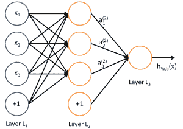
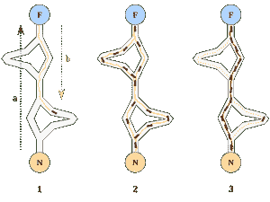
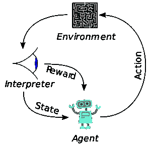

# 大自然母亲激发人工智能的 5 种方式

> 原文：<https://towardsdatascience.com/5-ways-mother-nature-inspires-artificial-intelligence-2c6700bb56b6?source=collection_archive---------3----------------------->

人工智能的世界有很多事情要感谢它在我们今天的技术景观中的存在。人类不仅花费了数十年的研究来完善数学计算，使这些非常复杂的学习算法发挥作用，而且在这段时间里，我们比我们自己的物种看得更远，作为在我们的星球上创造下一代智能存在的灵感。大自然母亲，以及它所包含的一切，已经深深扎根于人工智能的工作中——并且会一直存在下去。

大卫·爱登堡爵士的野生动物纪录片难道不令人难以置信吗？它们对地球上众多居民的行为和属性进行了令人难以置信的高清晰度描述，并让我们了解他们如何融入自然生态系统，并共同努力，以使我们的星球繁荣昌盛——让它成为地球。虽然我不是大卫·爱登堡爵士，但我还是要带你们去看一部我自己的野生动物纪录片。问题中的明星生物不是别人，正是那些直接受大自然启发的人工智能算法。但首先，我需要向你们介绍两个算法概念。搜索/寻路和预测建模。

# 搜索(寻路)算法

搜索算法本质上是一种程序，旨在找到到达目标的最佳/最短路线。例如，旅行推销员问题是一个典型的搜索优化问题，给你一个城市列表和这些城市之间的距离。你必须为旅行推销员寻找最短的路线，同时访问每个城市一次，以最大限度地减少旅行时间和费用(确保你回到出发城市)。这个问题的实际应用是送货卡车。想象一下，伦敦有 100 个人在网上订购，所有的箱子都被装进一辆货车。快递员(比如说……DPD)现在必须计算从仓库交付这些包裹(最终返回仓库)的最有效路线(平衡距离/所用时间),以确保公司在交付过程中尽可能少地浪费时间和金钱。

# 预测建模算法

今天，预测模型是所有炒作的地方。各地的数据科学家都在高呼“神经网络！”在他们舒适的办公大楼的屋顶上，像谷歌这样的公司正试图用这些复杂的小“人工大脑”的不同变体来解决世界问题。本质上，预测模型使用统计学来预测结果。你经常听到数据科学家试图解决两种预测建模问题，回归和分类。回归是寻找两组变量之间相关性的黑暗艺术，而分类是确定数据集属于不同集合的概率的过程。

# 5 种受生物启发的学习算法

# 1.人工神经网络

Feed Forward Neural Network — the most basic type of Neural Network.

## 算法类型:预测建模

## 生物灵感:认知脑功能(神经元)

## 用例:情感分析、图像识别/检测、语言校正、机器人

让我们从其中最常见的人工智能(AI)算法开始。神经网络是被称为机器学习的人工智能子类的一部分。它们被设计和建造为在神经元水平上模仿大脑功能，与轴突和树突相互作用，以便通过系统传递信息，从而通过一系列“层”产生预测输出。每一层都提供了额外的数据表示层，并允许您对最复杂的问题进行建模。

神经网络可能是使用最广泛的机器学习算法，也是迄今为止数据科学和机器学习的最热门趋势。这个概念最初在 1958 年取得成果，被称为感知机，后来由 Geoffrey Hinton 完善，并由谷歌和脸书等公司推广。神经网络可用于解决广泛的问题类型，包括自然语言处理和视觉识别。这种监督学习算法可以支持回归和分类问题，其使用示例可以在常规消费产品中找到，包括智能手机和联网的家庭设备。

# 2.遗传算法

Reproduction of individuals in a Genetic Algorithm

## 算法类型:搜索/寻路

## 生物灵感:适者生存/进化(细胞繁殖)

## 用例:数据挖掘/分析、机器人、制造/设计、流程优化

为了解决搜索问题，遗传算法在连续几代的一系列个体中采取“适者生存”的类似进化的方法。每一代都包含一群模仿我们在 DNA 中看到的染色体的字符串。群体中的每个个体代表搜索空间中的一个点，因此每个个体都是可能的候选解。为了改进解的群体，我们让个体经历一个进化过程。

*   种群中的每个个体都会为资源和配偶而竞争。
*   在每次竞争中最成功的个体(通常)会比那些表现不佳的个体产生更多的个体。
*   来自更“理想”候选人的基因在群体中传播，所以那些好父母通常会产生具有更大潜力的后代。

# 3.群体/集体智慧

Example of Ant Colony Optimisation — a type of collective intelligence algorithm.

## 算法类型:搜索/寻路

## 生物灵感:蚁群/鱼群/鸟群

## 使用案例:机器人，视频游戏人工智能，制造业，路线规划

蚁群优化和粒子群优化是两种最常见的算法，符合“集体智能”概念的界限。在一个基本层面上，正在讨论的算法都利用了多个工作代理。每一个工作主体都表现出非常基本的行为，这些行为集体(作为一个群体)一起工作，产生更复杂的、紧急的行为，以解决问题。

蚁群优化(ACO)与粒子群优化(PSO)非常不同。两者都旨在实现突现行为，但以两种不同的方式进行。像真正的蚁群一样，蚁群算法利用信息素的气味来引导个体智能体走上最短路径。最初，在问题空间中初始化随机信息素。个体代理将开始遍历搜索空间，并在途中散发信息素气味。在每个时间步中，信息素将以一个确定的速率衰减。单个智能体根据他们前面的信息素气味的强度做出决策，以便遍历搜索空间。特定方向上的气味越强烈，就越有可能向那个方向传播。最著名的解决方案将会是具有最强信息素气味的解决方案。

粒子群优化算法更关注群体的整体方向。许多单个代理被初始化，并且它们以随机的方向开始。在每个时间步，每个代理都需要决定是否改变方向。该决定将基于最佳已知解决方案的方向(称为 pbest/全局最佳)、最佳最近邻的方向(局部最佳)以及当前行进方向。新的旅行方向通常是所有这些价值观的良好“妥协”。

# 4.强化学习

Agent Behaviour within a Reinforcement Learning Environment.

## 算法类型:预测建模

## 生物灵感:经典条件反射

## 用例:视频游戏、控制自动驾驶汽车、生产线软件、金融系统

强化学习(RL)以心理学为基础，其过程让人想起经典的条件作用，支持对主体采取的有利行动提供积极的数字响应的想法。与流行的经典条件作用例子相比，学习强化学习的概念通常更容易；巴甫洛夫的狗。这是 19 世纪 90 年代进行的一项研究，当时俄罗斯心理学家伊凡·巴甫洛夫正在观察狗对喂食的反应。一篇解释这个问题的优秀文章可以在这里找到。本质上，如果一个 RL 代理采取了一个好的行动，朝着完成要求的任务迈出了一步，它会被给予一个数字奖励。代理将使用策略进行学习，例如:最大化每一步的回报。将原始输入应用到算法中允许代理开发它自己对问题的感觉，以及如何以最有效的方式解决它。

RL 算法与其他机器学习技术(如神经网络)配对是很常见的。这通常被称为深度强化学习。当一个 RL 代理做出一个特定的决定时，神经网络经常被用来估计给予它的奖励。[现在是谷歌公司的 Deep Mind](https://deepmind.com/blog/deep-reinforcement-learning/) 已经在这个领域取得了很大的进展，它使用深度 Q 学习方法来处理更常见的问题(例如一个算法能够在没有帮助的情况下玩完整个雅达利游戏库，并在“围棋”游戏中击败世界冠军本身)。他们现在正在采用这种方法，以便能够处理更复杂的游戏，如星际争霸 2。

作为参考，Q 学习是强化学习算法的无模型版本。它可以用来寻找任何有限马尔可夫决策过程的最优行动选择策略。在程序初始化时，每个动作-值对的 Q 值由开发者定义，并由 RL 算法在每个时间步更新。下图是更新 Q 操作-值对的公式示例。

Q Learning Value Update Equation

# 5.人工免疫系统

Components of an Artificial Immune System

## 算法类型:预测建模

## 生物灵感:免疫系统

## 用例:安全软件、自主导航系统、调度系统、故障检测软件

免疫系统是一种通过产生免疫反应来保护身体免受物质和病原微生物侵害的系统。人工免疫系统(AIS)是自适应系统，受理论免疫学和应用于解决问题的观察免疫功能的启发。人工智能是生物启发计算和自然计算的一个子领域，与机器学习和人工智能有联系。人工智能通常有多种算法:

*   克隆选择
*   树突细胞
*   否定选择
*   人工免疫识别

像生物免疫系统一样，人工免疫系统能够将系统内的所有“细胞”分类为“自体”或“非自体”细胞。分布式智能任务组用于对所有细胞采取行动。参与免疫的两种最重要的细胞是 B 细胞和 T 细胞(对你我来说是白细胞)。t 细胞有三种类型:一种类型激活 B 细胞，一种类型结合并摧毁外来入侵者，最后一种类型抑制自身免疫问题。b 细胞负责产生抗体，抗体是一种与抗原(一种有毒/外来物质)结合的特定蛋白质。人工免疫系统通常用于通过监控入侵检测来防御网络攻击，并且通常被集成到企业级软件中。与本文中提到的其他算法不同，关于这个主题的免费在线学习材料非常有限，并且可能是最不发达的。

# 让我们总结一下…

所以我举了 5 个例子来说明大自然是如何激励我们的研究和提高我们的技术的。还有许多受生物启发的算法影响着我们的人工智能系统，所以请在评论区分享你的经验和我错过的知识。

我是一名健身运动员&软件工程师，对健美和机器学习充满热情。我经营着自己的博客和网站，在那里我讨论这些话题，甚至更多。我提供了我的 Github 资源库的链接，这样你就可以看到我正在进行的项目和社交媒体账户(脸书、Instagram、Twitter 等)。)所以你可以跟着我健身改造。

# [http://lukealexanderjames.com/](http://lukealexanderjames.com/)

如果你喜欢你所读的，请考虑按住鼓掌按钮一会儿！