# 我如何通过 6 个简单的步骤将人体动作分类器的验证准确率提高到 80%

> 原文：<https://towardsdatascience.com/6-steps-to-quickly-train-a-human-action-classifier-with-validation-accuracy-of-over-80-655fcb8781c5?source=collection_archive---------11----------------------->

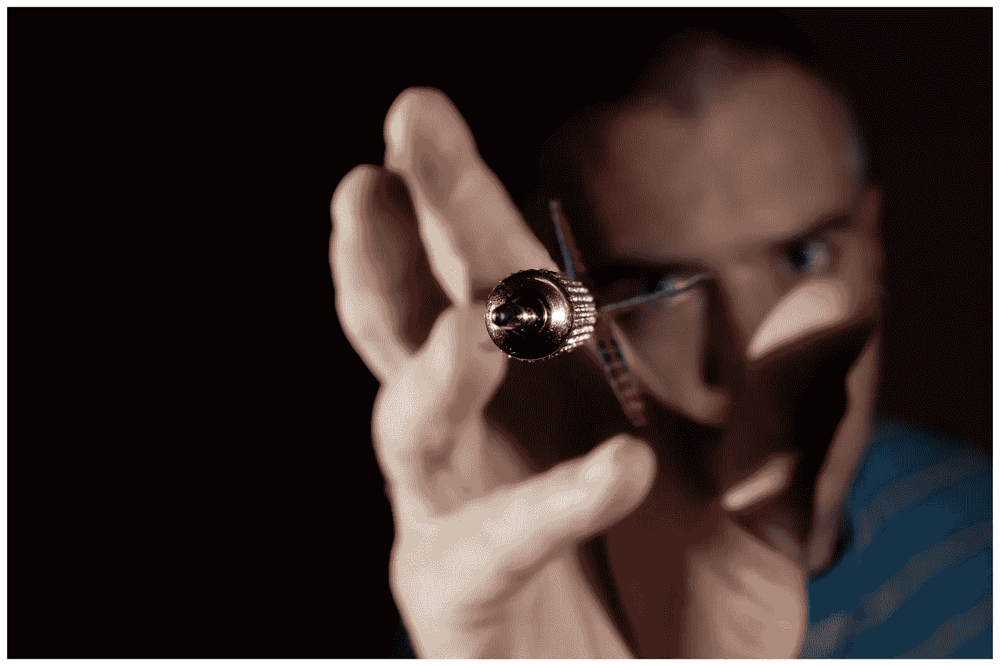

Photo by [RichFL](https://pixabay.com/en/users/RichFL-644541/) from [pixabay](https://pixabay.com/)

你们中有多少人是拖延大师？🙌如果你是，你来对地方了。

在这篇文章中，我想和大家分享一些我在担任数据科学家期间学到的技巧和诀窍，以及我如何用它们来快速增强我的模型。我将通过采用在德克萨斯大学达拉斯分校的多模态人体动作数据集( [UTD-MHAD](https://www.utdallas.edu/~kehtar/UTD-MHAD.html) )上执行人体动作分类的集成方法来演示这一点。该集合实现了 0.821 的验证准确度，这与基线论文的 0.672 的准确度相比是显著的改进。

# 背景(问题)

我的任务是在 UTD-MHAD 应用数据融合来建立一个模型，对 27 种不同的人类行为进行分类，像所有拖延症大师一样，我把它留到了最后一周才开始做。*最大压力=最高生产率！*

UTD-MHAD 是从 Kinect 摄像头和一个可穿戴惯性传感器收集的开放数据集。该数据集包含由 8 名受试者(4 名女性和 4 名男性)执行的 27 个动作，每个受试者重复每个动作 4 次。在去除 3 个损坏的序列之后，数据集剩下 861 个数据序列。数据集包含 4 种数据形态，即:

1.  RGB 视频(时空)
2.  深度视频(时空)
3.  骨骼关节位置(时空)
4.  惯性传感器信号(时间)

所有 4 种设备都进行了时间同步，并存储在中。阿维和。分别为 mat 格式。

## 任务:击败 0.672 的基线精度

该数据集来自一篇论文( [C.Chen，2015](https://www.researchgate.net/publication/279191574_UTD-MHAD_A_Multimodal_Dataset_for_Human_Action_Recognition_Utilizing_a_Depth_Camera_and_a_Wearable_Inertial_Sensor) )，该论文使用了协同表示分类器(CRC)，其验证精度为 0.672。这是根据训练-验证分割计算的，其中受试者 1、3、5、7 用于训练，受试者 2、4、6、8 用于验证，这也是我必须打破的基线准确度！

一切都被点燃了，我立即去网上开始寻找过去的代码和教程。在网上呆了大约 30 分钟后，我很快意识到没有可重用的代码！*压力水平增加*。我突然意识到，我必须从头开始做这件事。我迅速拿出笔和笔记本，开始制定我的策略。

# 密码

【https://github.com/notha99y/Multimodal_human_actions 

# 6 个步骤概述

1.  [了解数据](#01cb)
2.  [快速原型](#8d80)
3.  [绩效指标](#4de3)
4.  [将你能自动化的部分自动化，然后将你的培训送到谷歌实验室](#a17d)
5.  [搜索网页并与同事讨论以获得灵感](#fc19)
6.  [集合你的模特](#176c)

# 第一步:理解数据

在你开始做任何事情之前，知道你在处理什么是很重要的。在这种情况下，最好的办法就是出图！我使用了 NumPy、SciPy 和 Matplotlib 库来有效地实现这些。下面是进行网球挥杆的受试者的深度、骨骼和惯性数据的曲线图。

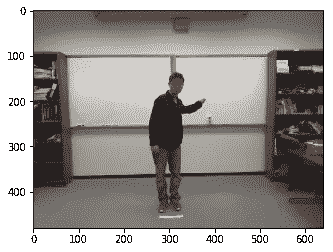

Video screenshot of a Tennis Swing

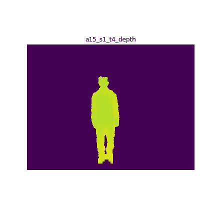

Depth videos of a Tennis Swing

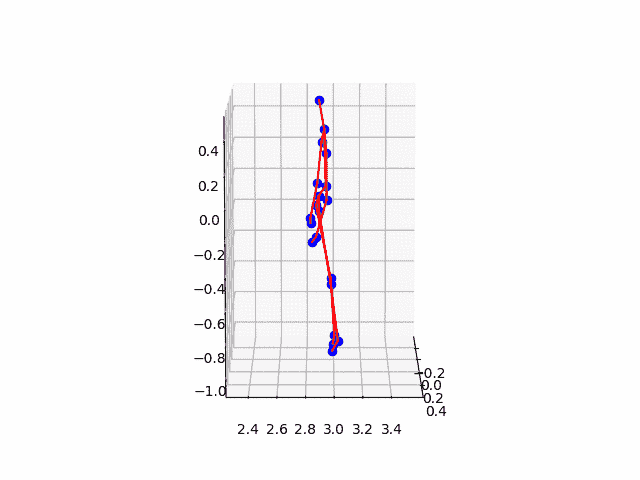

Skeleton joint positions of a Tennis Swing

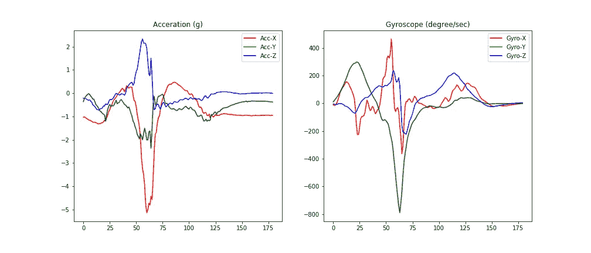

Inertial sensor signals of a Tennis Swing

所以现在我们已经绘制了它们，我们必须将它们转换成合适的格式来支持我们的模型。我的选择是 NumPy 数组。在这篇文章中，我将主要关注使用骨骼和惯性数据。对于 RGB 和深度视频，在创建 VideoDataGenerator 时需要特别小心，以便从磁盘中读取它们，因为它们太大，无法加载到内存中。

骨架和惯性数据具有变化的周期，并且对于惯性传感器来说，具有变化的幅度。直方图是显示这些分布的有效方法。

## 周期分布

Period Distribution of Inertial sensor data

这并不奇怪，因为这些是由不同的受试者执行的不同动作。这个实验也没有具体说明一个特定的动作应该如何进行，所以我猜想受试者只是根据他们自己的经验来执行这个动作。

拥有这些变化的周期是行不通的，因为我们的模型需要一个固定的输入形状。我们有两个策略来处理这个问题:

1.  将所有信号填充至最大长度 326
2.  将信号重新采样至 180°的平均周期

## 振幅分布

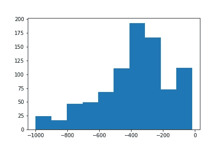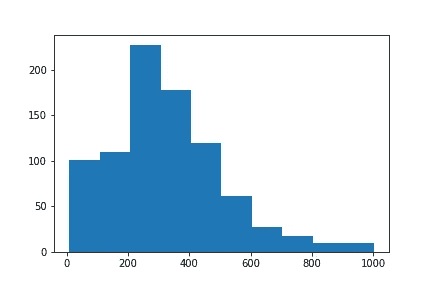

Amplitude Distribution of 3-axial Gyroscope data (min on the left, max on the right)

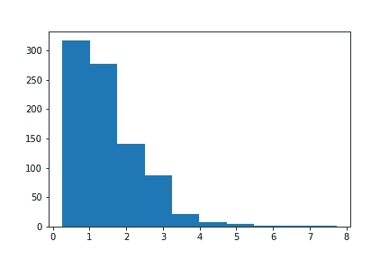

Amplitude Distribution of 3-axial Accelerometer data (min on the left, max on the right)

振幅的分布非常类似于长尾。由于幅度不影响输入数据的形状，我们可以选择不对其应用任何预处理技术。否则，诸如均值-方差归一化之类的归一化技术可以应用于预处理。

[*回到概述*](#7343)

# 第二步:快速原型

正如精益创业方法所宣扬的，“失败得快，失败得便宜”。下一步是构建一个允许快速迭代的轻量级模型。用 Python 编写的高级神经网络包装器 Keras 将是这项任务的首选框架。Keras 允许一种干净、极简的方法，让你只用几行代码就能构建巨大的深度学习模型。您可以看到回购中的代码实现是多么容易。另外，我们也将使用它与 Tensorflow 后端。

首先，我们只从惯性数据开始。由于数据是 6 个通道的序列(加速度计的 3 轴+陀螺仪的 3 轴)，我们要建立的第一个模型是一个简单的 LSTM ( [S. Hochreiter 等人，1997](https://www.mitpressjournals.org/doi/10.1162/neco.1997.9.8.1735) )，它有 512 个隐藏单元的 LSTM 单元。

Minimalist Keras Code to implement the Simple LSTM model

Network Diagram of Simple LSTM model

[*回总览*](#7343)

# 第三步。性能指标

随着模型的创建，我们现在需要一个可靠的反馈系统来通知我们模型的执行情况。因为这是一个具有良好平衡的类别分布的分类任务，所以准确度将足以作为唯一的性能度量，而不需要计算精确度、召回或 F1 分数。

为了查看我们的模型是否过度拟合，我们还可以得到训练验证准确性损失图。还可以绘制一个 27 类混淆矩阵，以查看哪些行为经常被误归类为另一种行为。

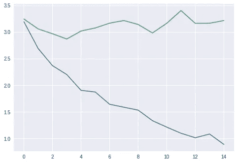

Loss (Left) Accuracy (Right) plots of the Training (Blue) and Validation (Green) set of the Simple LSTM

从精度损失图中，我们可以看到，我们的模型在非常早的时期过拟合，在第 4 个时期后，我们的验证精度达到稳定。在 epoch 15，我们得到了一个验证精度约为 0.238 的模型，这与我们必须打破的基线 0.672 相差甚远。

这表明我们要么改变策略，要么应用更多的正则化技术，如丢弃层。

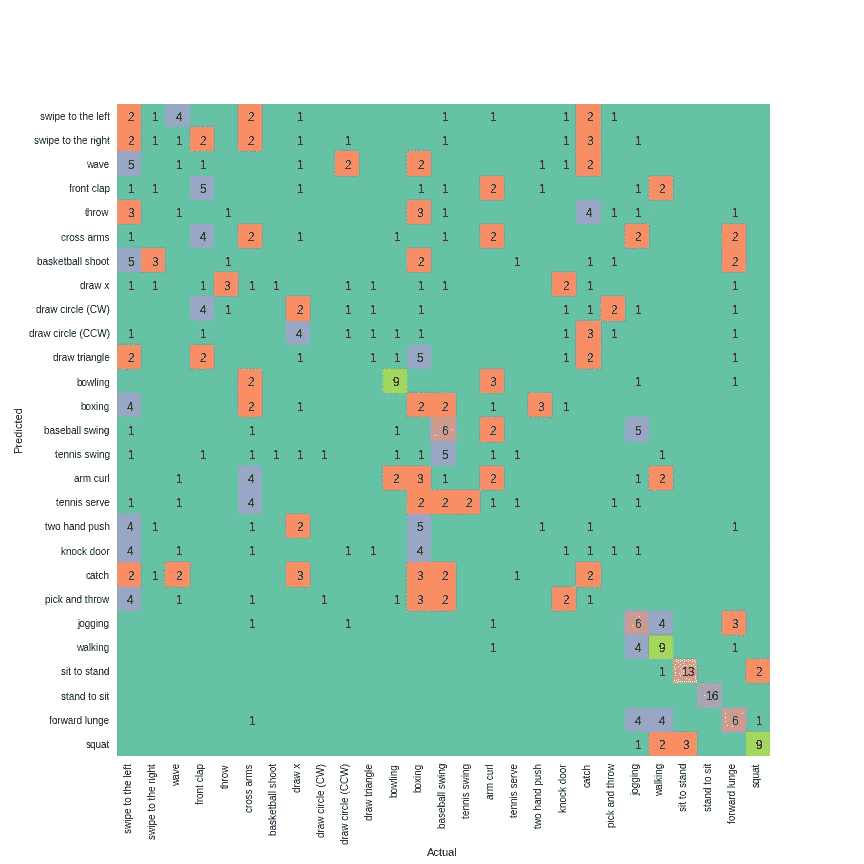

Confusion matrix of the Simple LSTM model on Inertial data

哦天哪！这个混淆矩阵看起来像一个扫雷游戏的截图！唯一可取的是“站着坐着”和“坐着站着”这两个动作，模型分别正确预测了 16 次(满分)和 13 次。其他 25 个动作表现很差。

在我们给自己施加压力之前，让我们后退一步，看看我们迄今为止都做了些什么。

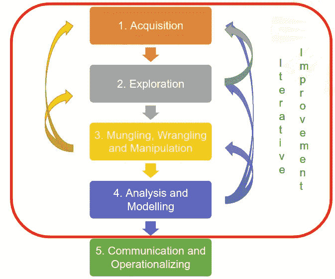

Data Science Pipeline (adapted from Practical Data Science Cook Book)

我们刚刚完成了上述流程图中从步骤 1 到步骤 4 的一次完整迭代，我们得到了 0.238 的第一次验证精度。这并不理想，但却是一个很好的开端。我们已经为自己建立了一个高度迭代的数据科学管道，在这里我们可以有效地探索、构建和评估我们的项目。询问任何从业者，他们都会同意数据科学是一个高度迭代的旅程。

有了这个基础，我们现在可以发挥创造力，尝试不同的东西来改进我们的模型。我不想让你们看到我尝试的所有不同的试验，所以在接下来的部分，我将向你们展示我使用这个迭代管道发现的所有关键结果。

## 预处理

通过这个管道，我还发现，与零填充相比，将序列重新采样到 180 的平均值会导致更好的收敛。振幅的标准化不会导致模型性能的明显改善，因此我们将跳过它以防止不必要的计算。

[*回到概述*](#7343)

# 第四步。将你能做到的部分自动化，并把你的训练传送到 Google Colab

因为我们很可能经常重复某些步骤，所以花些时间自动化它们是值得的。我们可以将某些经常使用的代码转换成脚本，并对它们进行功能抽象。你不那么未来的自己会非常感激你这样做。

## Keras 回调

对于试图涉足深度学习的人来说，Keras 回调是最好的事情之一。它们是自动化模型训练的工具，我将分享 3 个我最喜欢的回调，它们在我的各种项目中极大地帮助了我。

首先是**张量板**。这允许 Keras 保存事件日志文件，该文件在训练期间不断更新，并且可以由 TensorBoard 读取和查看。这允许对你的模型训练进行实时、图形化的可视化，我强烈推荐它作为一种替代方案，而不是仅仅从 Keras 的`model.fit()`输出中查看它。

二、**模型检查点**。这允许您的 Keras 模型将权重保存到给定的文件目录中。有一些有用的论点，如`monitor`和`save_best_only`，让你可以控制你希望 Keras 如何减轻你的体重。

最后但同样重要的是，**提前停止**回调。拥有这个可以让 Keras 根据你指定的条件停止你的训练。对于我的例子，如下所示，我设置了`min_delta=0`和`patience=5`。这意味着，如果 Keras 发现模型的验证精度在 5 个时期后没有增加，它将停止训练。

有了这三个回调，我们可以安全地离开我们的模型训练，去吃午饭了。

Useful Keras Callbacks

## 谷歌联合实验室

众所周知，训练深度学习模型是一个非常 GPU 密集型的过程。幸运的是，[谷歌合作实验室](https://colab.research.google.com/)免费提供了强大的 TPU 内核！对于那些负担不起强大的 GPU 的人，可以考虑将你的培训转移到 Google Colab。Google Colab 还提供了一个熟悉的类似 Jupyter 笔记本的界面，使用起来非常直观。它也安装在你的 Google Drive 上，所以你可以很容易地将你的数据读入 Colab。重量和日志也可以很容易地保存。

[*回到概述*](#7343)

# 第五步。在网上搜索，并与同事讨论以获得灵感

在第 2-4 节中完成了快速原型制作和评估的半自动流程后，是时候获得灵感并找到创造性的方法来提高我们模型的验证准确性了。谷歌不同的搜索词，或去门户网站如谷歌学术，科学直接和 Pubmed 可以给我们提供见解。与同事谈论你的问题会给我们带来意外的“发现”时刻。

我和一个正在进行自然语言处理(NLP)项目的同事聊天，这个项目给了我尝试双向 LSTM (BLSTM)的灵感。BLSTM 反转原始隐藏层并将它们连接起来，允许一种形式的生成性深度学习，从而使输出层同时获得来自过去和未来状态的信息。仅仅是加了一层 BLSTM，就让我的验证准确率翻倍到了 0.465。

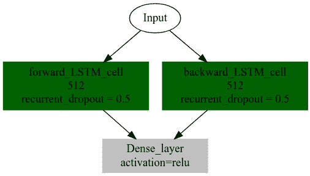

Network Diagram of Bi-Directional LSTM model

Network Diagram of Conv LSTM model

## conv·LSTM 模型

当我为特征提取添加卷积层时，主要的突破出现了。由于输入数据是 1D 信号，该模型使用一系列 1D 卷积和 1D 最大池层来提取更高维度的潜在特征，然后将它们馈送到捕获时间信息的 2 个 LSTM 单元。然后，LSTM 单元的输出变平，在添加带有 softmax 激活的密集层以对所有 27 个动作进行分类之前，我们附加了一个丢失率为 0.5 的丢失层。

这使我的惯性数据验证精度达到 0.700，这是我们第一次超过 CRC 模型基线 0。对于我们的所有模型，我们使用 AdamOptimizer([d . p . Kingma et al . m 2014](https://arxiv.org/abs/1412.6980))，其
学习率为 1e-4，β1 为 0.9，β2 为 0.999。我们使用 Xavier Glorot 初始化器( [X. Glorot et at)初始化我们的可训练参数。，2010](http://proceedings.mlr.press/v9/glorot10a/glorot10a.pdf) )并将我们的批量大小设置为 3，以允许我们的模型更好地泛化( [E. Hoffer 等人，2017](https://arxiv.org/abs/1705.08741) )。

## UNet LSTM 模型

UNet ( [O. Ronneberger et al .，2015](https://arxiv.org/abs/1505.04597) )是一个完全卷积的神经网络(FCNN)，在收缩和扩张路径上几乎是对称的。在收缩路径中，输入 was 通过一系列卷积和最大池来馈送，增加了特征图并降低了图像的分辨率。这增加了“什么”而减少了“哪里”。在扩展路径中，低分辨率的高维特征通过卷积核被上采样。在此操作过程中，要素地图被缩减。UNet 的一个新颖特征是，它将收缩路径中的高维特征连接到扩展层的低维特征映射。类似地，我将从卷积网络中提取的特征添加到 2 个 LSTM 单元中，平坦化输出，并附加一个丢失率为 0.5 的丢失层，最后是一个带有 softmax 激活的密集层，以对所有 27 个动作进行分类。我在下面的附录中附上了网络图。

UNet LSTM 模型在惯性数据上实现了 0.712 的验证精度。

[*回到概述*](#7343)

# 第六步。集合你的模型

conv·LSTM 和 UNet·LSTM 在验证数据上表现都很好，我们可以通过取平均值来合并他们的 softmax 输出。这立即将验证准确度提高到 0.765！

对于大多数监督学习问题，集成方法往往优于单模型方法。目前认为这是因为它具有穿越假设空间的能力。一个集成能够导出一个更好的假设，该假设不在其构建的单个模型的假设空间中。

根据经验，当模型中存在多样性时，集成往往会产生更好的结果( [L. Kuncheva 等人，2003](http://machine-learning.martinsewell.com/ensembles/KunchevaWhitaker2003.pdf) )。从下面显示的混淆矩阵中，我们可以看到 Conv LSTM 能够更好地拾取向右滑动和下蹲等动作，而 UNet LSTM 能够更好地拾取篮球投篮和画 x 等动作。这表明在这两个模型之间存在模型差异，并且确实如此，通过将它们组合在一起，我们得到了从 0.700 和 0.712 到 0.765 的验证精度！

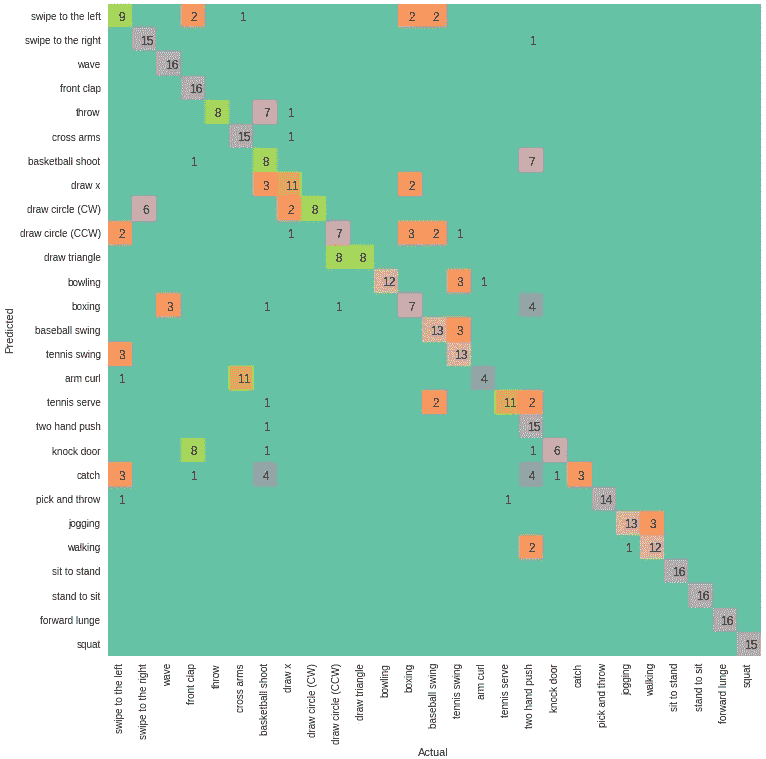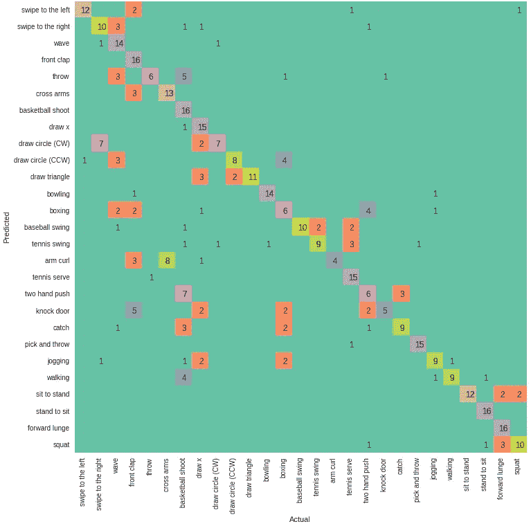

Confusion Matrices of Conv LSTM (left) and UNet LSTM (right) on Inertial data

下面是我用来创建合奏的方程式。有关代码实施，请参考回购协议。

Average of the softmax output for the Conv LSTM and UNet LSTM

Softmax output for an action j

## 结合骨架数据

为了达到标题中承诺的 80%的验证准确性，我添加了骨架数据，并将其重采样为 180 个单位的周期。将其与 6 通道惯性数据融合后，我们得到(N，180，66)的输入形状，其中 N 是样本数。所有验证准确度的表格汇编如下。

Summary of Validation Accuracy of the Different Models

瞧，我们的最佳性能模型的混淆矩阵显示如下，验证精度为 0.821。

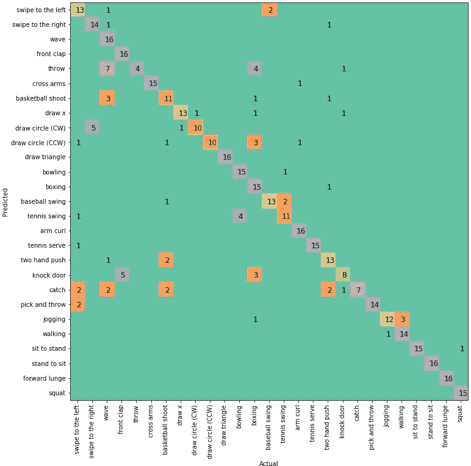

Confusion Matrix of Ensemble on Inertial + Skeleton data

[*回到概述*](#7343)

# 摘要

恭喜你一路走到了这里！如果您完全遵循了这些步骤，您将会成功地构建您自己的集合人体动作分类器！

## 模型动物园

*   [简单的 LSTM](#bd18)
*   [双向 LSTM](#8031)
*   conv LSTM
*   [UNet LSTM](#5fc1)

## 一些关键要点

*   绘图是理解数据的一种快速简单的方法
*   数据科学是一个高度迭代的过程
*   尽你所能实现自动化
*   合奏是让我们训练有素的模特发挥最大作用的快捷方式
*   使用谷歌 Colab 来提高你的训练速度
*   Keras 是深度学习模型快速原型化的首选框架

如果你准备接受挑战，并且觉得 0.821 还不够，你可以阅读下面的小节来改进你的模型。

## 还能做些什么

## A.过度装配问题

在我们的训练中，早期的过度适应似乎是我们面临的主要挑战。我们尝试添加漏失层和集合，使我们的模型更加通用，但我们还可以走得更远。当我们的模型试图学习可能没有用的高频特征时，往往会发生过度拟合。添加零均值高斯噪声和所有频率中的数据点可能会增强我们的
模型的学习能力。同样，即使是相同的活动，不同科目的时间顺序也有很大差异。使用时间缩放和转换来执行数据扩充将增加训练数据的量，从而允许我们的模型更好地概括。

另一方面，我们的模型还可以进一步调整，以降低其复杂性，以及过度拟合的风险。随着最近的神经架构搜索论文如 NAS ( [B. Zoph 等人，2016](https://arxiv.org/abs/1611.01578) )、NASnet ( [B.Zpoh 等人，2017](https://arxiv.org/abs/1707.07012) )和 Efficient-NAS ( [H. Pham 等人，2018](https://arxiv.org/abs/1802.03268) )获得牵引力，我们也可以尝试应用它们，因为这也是一项分类任务。

## B.RGB 与深度数据的数据融合

我们玩了惯性，我们在最后添加了骨架，以获得更多信息来找到我们需要数据的模型。为了更好地推动我们的模型，我们必须找到将它与深度和 RGB 数据融合的方法。这将允许更多的输入训练变量从中学习和提取特征，从而提高验证的准确性。

## C.尝试其他集成学习技术

我们可以尝试更高级的集成学习方法，如 Boosting 和 Bagging，而不是简单的平均。

*特别感谢* [*【莱米】*](https://towardsdatascience.com/@raimibinkarim) *和* [*德里克*](https://medium.com/@derekchia) *对本文的校对和反馈。*

*随时通过*[*Twitter*](https://twitter.com/rahjaytee)*，*[*LinkedIn*](https://www.linkedin.com/in/renjietan/)*与我联系！*

*如果你对我参与过的其他项目感兴趣，可以随时访问我的*[*Github*](https://github.com/notha99y)*！*

# 附录

Network Diagram of UNet LSTM model