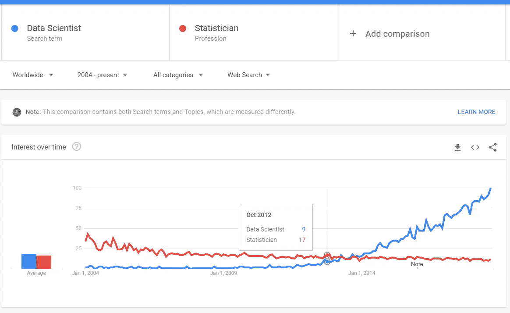
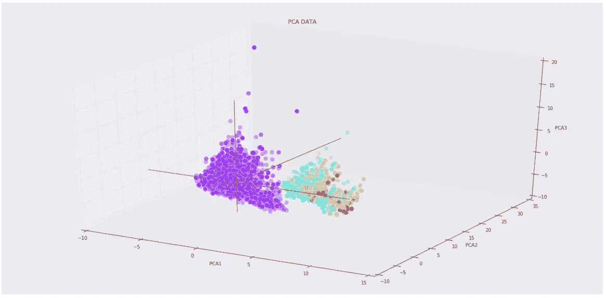

# 7 为想学习数据科学的人提供的资源

> 原文：<https://towardsdatascience.com/7-resources-for-those-wanting-to-learn-data-science-a89e25d1b55e?source=collection_archive---------10----------------------->

有时候你只需要一点动力就能开始。以下是对我有效的方法。

Src: [https://tinyurl.com/y7bgtyjo](https://tinyurl.com/y7bgtyjo)

数据科学是通过与计算机、数学、人打交道而获得的多种技能和经验的自然结果...有些人会在多年的经历中自然地发展这些技能。我的数据科学之旅始于 14 年前(我将在 2022 年 11 月更新这篇文章)，因此我决定汇编 7 大资源，我认为这是点燃我对该领域的兴趣和理解的第一步。下面的资源将产生处理所涉及的*数据*和*科学*所需的兴趣和直觉。这不是一个明确的指南，因为有多种方法可以让你成为数据科学家，但以下是对我有用的方法。

Source: [https://timoelliott.com/blog/](https://timoelliott.com/blog/)

# 一点背景知识

> [“数据科学”的关键词不是数据，而是科学——Jeff Leek](https://simplystatistics.org/2013/12/12/the-key-word-in-data-science-is-not-data-it-is-science/)

约翰·霍普金斯大学彭博公共卫生学院教授杰夫·莱克(Jeff Leek)5 年前写道:“数据科学的关键词不是‘数据’；是‘科学’。只有当数据被用来回答一个问题时，数据科学才有用。这是等式的科学部分。这种数据科学观点的问题在于，它比关注数据大小或工具的观点要难得多。计算数据集的大小并说‘我的数据比你的大’或者说‘我能在 Hadoop 中编码，你能吗？’而不是说，‘我有一个非常难的问题，我能用我的数据回答它吗？’。"

数据科学是古老的。John Graunt 在天气凉爽的时候做了这件事。真的很酷。正是在十五世纪的[小冰期](https://www.britannica.com/science/Little-Ice-Age)，他开发了第一批使用概率模型的人口学著作之一。到 1960 年，这一学科已经非常成熟，被称为 [*数据学*](https://dl.acm.org/citation.cfm?doid=365719.366510) *，*，但直到 2012 年《哈佛商业评论》发表了文章《[数据科学家:21 世纪最性感的工作](https://hbr.org/2012/10/data-scientist-the-sexiest-job-of-the-21st-century)》后，这一术语和工作才变得越来越流行。关于这个主题的大量在线课程将在两年后推出。谷歌趋势显示了一些有趣的东西:尽管“统计学家”一词自 2004 年以来呈下降趋势，但在 HBR 的文章发表后，“数据科学家”一词出现了更强的积极趋势，当在线课程增加时，它得到了提振。

[https://trends.google.com/trends/explore?date=all&q=Data%20Scientist,%2Fm%2F0c_xl](https://trends.google.com/trends/explore?date=all&q=Data%20Scientist,%2Fm%2F0c_xl)

考虑到这一点，我需要澄清一点:数据科学家不是统计学家，他们也不会取代统计学家(反之亦然)，但对统计和数学的真正兴趣是正确的数据科学的关键。

*Img source:* [*https://towardsdatascience.com/introduction-to-statistics-e9d72d818745*](/introduction-to-statistics-e9d72d818745)

# 你喜欢列表吗？

简而言之，这 7 种资源是:

1.  列纳德·蒙洛迪诺所著《酒鬼之行》
2.  机器学习课程，由斯坦福大学创建，由[吴恩达博士](https://medium.com/u/592ce2a67248?source=post_page-----a89e25d1b55e--------------------------------)教授
3.  《数学思维导论》,也是斯坦福大学的，由基思·德夫林教授
4.  编码
5.  对数学的不带偏见的评论
6.  人
7.  *有兴趣的话题*

这个列表既不是按时间顺序排列的，也不是按高潮顺序排列的。许多这样的事情会同时发生，第 4 到第 7 项几乎肯定会成为你作为数据科学家的日常工作的一部分。

# 让我们进入细节…

**酒鬼的走路姿势**

多年前(2009 年？)当我得到这本书作为秘密圣诞礼物时，我并没有留下深刻的印象，但它却是我一直最喜欢的书之一。

根据亚马逊的产品描述,*是关于理解随机性对我们生活的影响，并“揭示了阻止我们理解从选股到品酒的一切事物的心理错觉”。*

*它启发我认识到一个人是多么容易成为*机遇*的受害者，并理解为什么解释导致某一事件发生的所有因素比预测类似事件何时或是否会再次发生要简单得多。*

*从分析的角度来看，这本书显示了预测模型的重要性，并展示了统计分析背后的历史，还显示了数据如何可以用来回答困难的问题，以及这些问题中的一些如何将仍然没有答案。我记得这是我第一次接触“数据科学”。*

*同样风格的另一本好书:[赖以生存的算法:人类决策的计算机科学](http://Algorithms to Live by: The Computer Science of Human Decisions)。*

**

*Representation of a random walk. Src: [http://cu.t-ads.org/python-intro-02-random-walk/drunkard/](http://cu.t-ads.org/python-intro-02-random-walk/drunkard/)*

***机器学习***

*这是斯坦福大学在 Coursera 上提供的课程，是许多机器学习的入门课程。它是我的。本课程有趣、简洁，并提供良好的理论基础。*

*它首先给你一个线性代数的关键概念的修订，并教你基本的 Matlab(或 Octave)编程。将介绍一元回归的最初概念。本课程的后续部分将带你了解有趣的部分，如主成分分析和神经网络，但如果你认真地通过适当的复习、参加测验和掌握课程之外的概念来学习，这肯定会培养你的直觉，并教会你关键的人工制品和机器学习中使用的数学。本课程将帮助你建立坚实的基础，并为你学习更高级的概念做好准备。*

**

*Example slide from the course. Source: [https://tinyurl.com/ybupqzzb](https://tinyurl.com/ybupqzzb)*

***数学思维入门***

*早在 2008 年，我在大学选修了离散数学，我非常喜欢它！它教会你用数学和逻辑来思考，用数学来表达。在大学期间，我在这门课程上表现得非常好……尽管如此，我还是决定利用斯坦福大学通过 Coursera 提供的这门课程来复习核心概念和提高技能。这门课程涵盖了我在第一学期所看到的部分内容，并且提高了我的分析思考能力。对很多人来说，它很容易成为一种新的范式，因为课程中提出的数学思维与普通的推理过程有很大的不同，尤其是普通书面语言的推理过程。此外，最后几节课在数学验证方面会变得相当具有挑战性。不可避免地，这会让你想学一门新的口语。*

***你不会介意学习这种“新语言”，因为批判性思维对数据科学至关重要**。本课程的一个重要补充(或无痛替代)是掌握常见谬误的概念，以在探索性数据分析或从数据中获得洞察力等过程中避免或检测它们。这里有一个谬误列表。*

*综上所述，我相信一个优秀的数据科学家会对“数学思维”产生兴趣，以了解如何交流数学概念，并在必要时将思想表达为方程，或者将数学方程表达为无懈可击的可执行步骤。**在我面对的许多场合，知道如何建立一个逻辑论证比方法和数学正确更重要。**事实上，与我共事过的最好的数据科学家知道如何构建论点，并掌握口才艺术。*

 *[## 逻辑谬误总表

### utminers.utep.edu/omwilliamson/emgl1311

utminers.utep.edu](http://utminers.utep.edu/omwilliamson/ENGL1311/fallacies.htm)* **

*Dilbert listing some common components in fallacies. Src: [https://tinyurl.com/y97w2oej](https://tinyurl.com/y97w2oej)*

***编码***

*首先，不管你的职业选择是什么，你都应该学会如何编码。它在许多领域都很有用，可以让你的生活变得更加方便和有趣！*

*的确，我们可能不再需要任何关于预测或聚类的更简单的数据科学例程的编码，因为诸如 [Alteryx](https://medium.com/u/14c3615546ef?source=post_page-----a89e25d1b55e--------------------------------) 、 [Azure Studio](https://azure.microsoft.com/en-gb/services/machine-learning-studio/) 、[datatai ku](https://medium.com/u/27e43843bc9f?source=post_page-----a89e25d1b55e--------------------------------)、 [H2O.ai](https://medium.com/u/1106097412c6?source=post_page-----a89e25d1b55e--------------------------------) 或 [Knime](https://www.knime.com/about) 等平台大大减少了编码工作。**然而，编码和通用框架方面的专业知识仍将是(并且在很长一段时间内)保持信心、生产力和精确度的重要资产，这将带来可维护的工作流**，特别是在处理大量数据或机器学习的实时应用程序或开发新模型时。*

*开始时，您的典型问题是“我如何将这个 csv 读入数据框？我如何做简单的可视化？如何将所有分类值转换成数值？我该如何处理这个多索引数据集？”然后，在某个时候，你会进展到这样的事情“这个优化器的学习率的批量大小的选择会导致一个好的损失吗？”或者甚至像“使用 KL-Divergence 来评估这个模型有意义吗？”或者“在这种情况下，我应该使用正常-正常-反伽马共轭吗？”*

**

*A simple command with Seaborn can help you build nice visualisations (own source)*

*幸运的是，你有大量的选择来处理这些问题和挑战:更有经验的人和可靠的在线论坛(比如 Pytorch 的社区论坛，它很棒)。*

*就编程语言而言，我推荐 Python 入门，因为它易于学习，在数据科学家中很受欢迎，并且有大量的库，如 Pandas、Numpy 和 Matplotlib，用于处理数据准备、争论和可视化，还有像 Tensorflow 这样的框架，除了许多好处外，它还允许您毫无争议地利用 GPU 处理。*

*我在 2022 年回顾这篇博客，我也相信 JAX 是一个很好的学习框架。*

*另一个常见的途径是通过 R(编程语言)。是的，对于你来说，用 Python 进入“数据科学”可能需要更长的时间，而 R 将带你进入统计建模，而不用费什么周折。另一方面，Python 将让您更好地理解数据科学之外以及其他编程语言(如 C++或 Java)中常用的编程原则。无论你选择哪一个，你都会很好。*

***编辑**:现在是 2020 年。我现在成了茱莉亚(【https://julialang.org/】)的粉丝*

***编辑**:现在是 2022 年。我不再使用朱莉娅(！)*

*另一个很好的资源是 Gareth James 的《统计学习及其应用介绍》。这本书可以在链接中公开获得，它涵盖了 R 编程的统计概念。如果线性代数让你感到害怕，这将是一个挑战(你将在第 10 页上面对它)。无论您做出何种选择，您都需要…*

***…一篇不带偏见的数学评论***

*我在大学里努力学习，成绩非常好，但直到 2013 年——或多或少，当我决定在未来的某个时候攻读硕士学位时——我才意识到有多少基本概念已经过时和无力。因为我很想考上硕士，所以我决定在对数学一无所知的情况下学习，这样我就可以回到基础，而不会为此感到难过。有趣的是:我是从看儿童减法和加法的视频开始的。*

*几周后，我转向了数据科学和机器学习的基石:高等线性代数、微积分和概率论。尽管这并不是所有类型的数据科学家最终都需要的(只有优秀的数据科学家才需要！)，理解例如主成分分析实际上在做什么是极其有用的。理解数据科学背后的数学至少可以在你讲故事的过程中给你很大的帮助。*

**

*Plot of 2 clusters upon 3 Principal Components (own source). Maths intuition helps in interpreting this*

***编辑**:现在是 2020 年，我强烈推荐[https://www . coursera . org/specializations/mathematics-machine-learning](https://www.coursera.org/specializations/mathematics-machine-learning)*

*编辑:现在是 2022 年，我强烈建议一直学习数学。我正在冒险进入生命科学领域的贝叶斯概率建模中更复杂的主题。太牛逼了。*

***人***

*数据科学可能需要你坐下来，键入看似无穷无尽的代码行，并在任何有见地的输出之前(或者直到你的交叉熵损失函数输出一个接近于零的数字)进行数周或数月的功能工程。一个人如果不能解释至少在高层次的理解上正在做什么以及为什么这样做，就不能充分享受它的美。最重要的是，你首先需要对你试图解决的问题有一个清晰的定义，如果你不和别人交流，你可能会做出错误的假设。*

*与人良好互动将是你作为数据科学家职业生涯的最大推动力之一。在过去的许多年里，不同的人帮助我发现了更聪明的方法来完成我的工作，做出职业决策，应对大公司的政治挑战…一个单独工作的数据科学家可能会错过这个职业中最好的东西。*

*假设你是一名在电子商务公司工作的数据科学家，他向你简要介绍了“欺诈性信用卡交易的突然增加”。尽管你可能已经知道了一些方法，但你仍然对这个问题毫无头绪。一个新手的错误是直接进入分类或聚类模型，仅仅因为“欺诈”这个词诱使你这样做…探索性数据分析可以在开始时帮助你，但关键问题仍然没有答案:分析什么，从哪里开始，最终目标是什么，以及如何衡量你的工作的影响。你可能最终会发现原来的问题实际上是最新网站版本中的一个 bug，这是你不需要花里胡哨的数据科学著作就能发现的。*

*显然，一个人在特定领域越有经验，就越容易通过支持数据来准备、建模和可视化问题，并提出解决方案来提高生产率或效率。不可避免的是，即使是最资深的数据科学家也必须在人们面临新挑战时与他们交谈。*

*从更有经验的人(无论是在技术领域还是在商业领域)那里获取想法真的很有用，在很多情况下是一条很大的捷径。您还可以结识来自各个角落的人，分享经验，参加黑客马拉松和聚会，因为世界上大多数主要城市都会举办这种活动。关键的想法是交流、学习和分享，绝对没有理由被孤立。*

***感兴趣的话题***

***编辑 2022:** 结合我作为数据科学家的职业生涯，我发现的第一个感兴趣的话题是“非正统和正统经济学”。这是哲学和数学，我真的很喜欢它。现在我最感兴趣的是生命科学(基因组学、蛋白质组学和生物科学)和基础数学方法。感兴趣的主题可能会随着时间的推移而改变，但我意识到对给定主题的兴趣对于数据科学家来说至关重要。你对一个话题越感兴趣，就越容易成为一名优秀的数据科学家。听起来显而易见，但我花了几个月的时间在一个我讨厌的主题上做数据科学家…我做得很好，但成本很高，因为我没有兴趣在工作之外阅读这个主题。另一方面，在我的空闲时间，我一直在呼吸、进食和观察生物数据和概率图形模型……在我目前的工作中，这产生了很大的不同。*

*当我开始我的职业生涯时，对经济学的强烈兴趣“弹射”到我的第一份工作中，因为我知道我在说什么，我知道如何进行分析和建立模型来解释我所理解的东西。多年来，我的兴趣领域转移到生物学，今天我必须表达自己并建立关于生物系统而不是经济系统的模型。如果你想开始，选择一个感兴趣的话题作为起点会有很大的不同。*

***编辑**:现在是 2020 年，自从 2018 年写完这篇博客后，我开始在其他领域冒险，比如自然语言处理、计算机视觉甚至强化学习。*

**

*Data Science is more than algorithms. Src: [https://xkcd.com/1831/](https://xkcd.com/1831/)*

# *一般想法*

*选择一个地方开始可能会令人生畏，今天我们有太多的选择和无数像这样的帖子。2018 年我最初写这个帖子的时候，数据科学已经很热但是没有 2022 年那么热。回到 2009 年，当我开始这段旅程时，很难做出决定和获得建议，所以我希望这些经历可以帮助你找到一些资源来开始。*

***如果你想成为一名伟大的数据科学家，我的“秘诀”是:***

1.  *选择一个感兴趣的话题(化学、经济、生物、游戏、体育……)，并对此进行大量思考。了解一下。小心点。做梦吧。*
2.  *通过 LinkedIn 和与你分享兴趣话题的人联系，见面…问你的朋友他们是否认识这个领域的人。与教授、研究人员联系。向他们提问，从“如何在这个领域起步”到如何作为一名数据科学家处理问题。*
3.  *熟悉在你感兴趣的主题中用来解决问题的模型、数学和方法。这些模型试图解决的问题是什么:是数据质量的问题，是预测未来的事情，还是对事情进行分类？现有模型的局限性是什么？*

# *想听更多关于数据科学和人工智能的知识吗？*

*在推特[和媒体](https://twitter.com/brtrentini)[上关注我，我会开始更频繁地分享和发布这些话题](http://www.medium.com/@brunotrentini)*