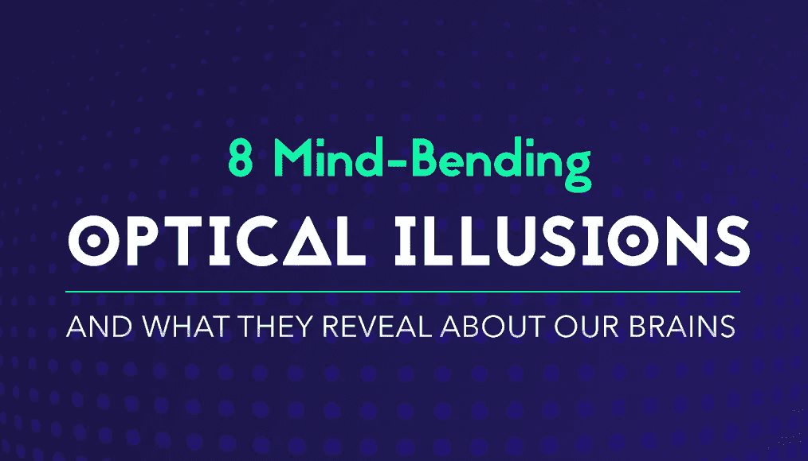
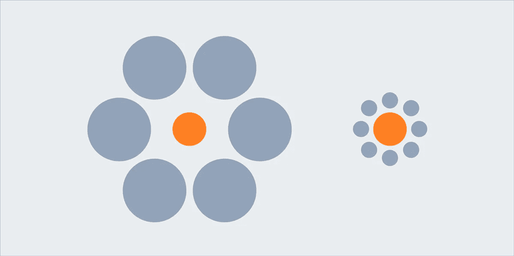
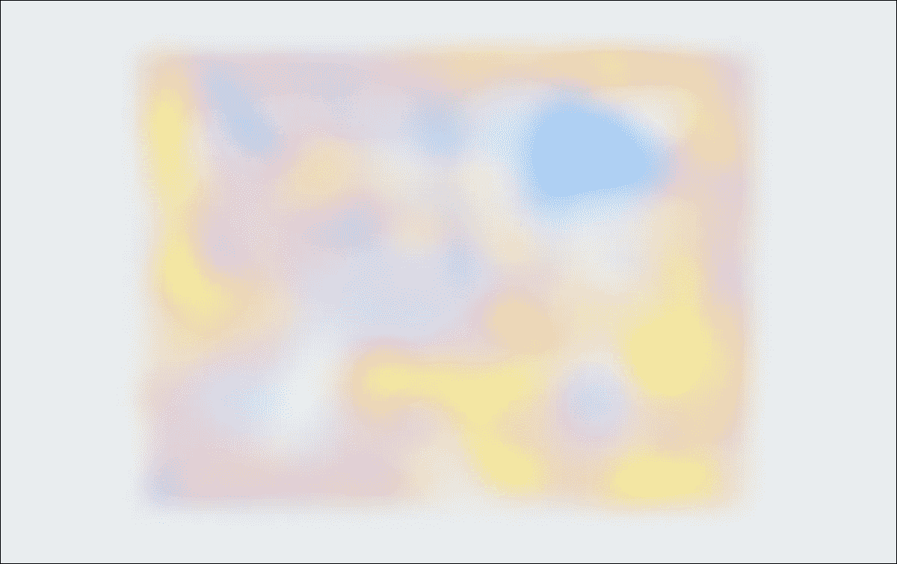
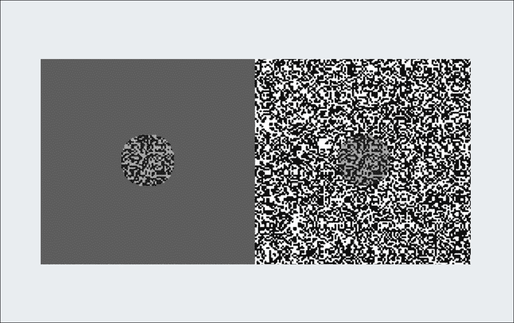
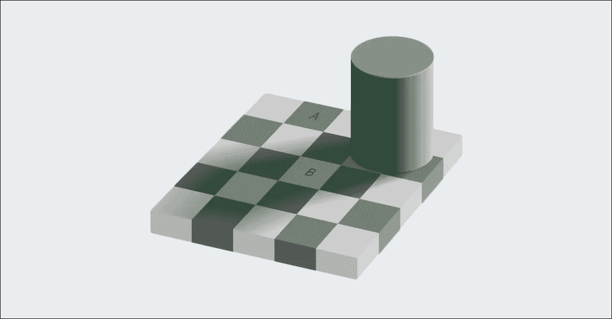
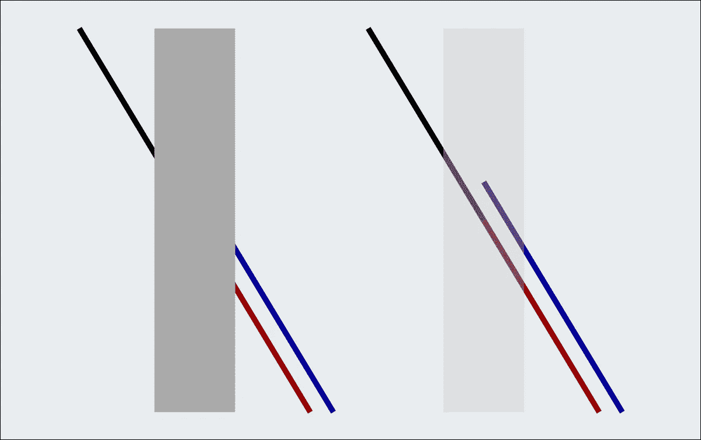
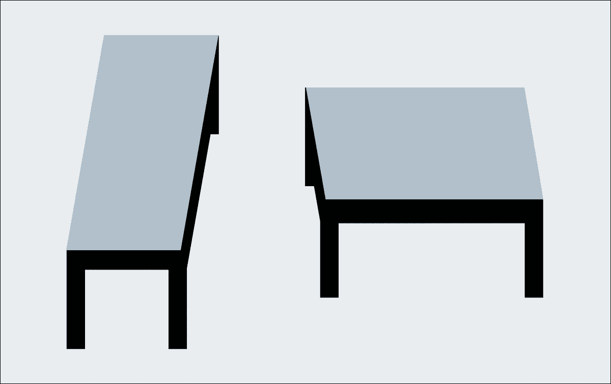
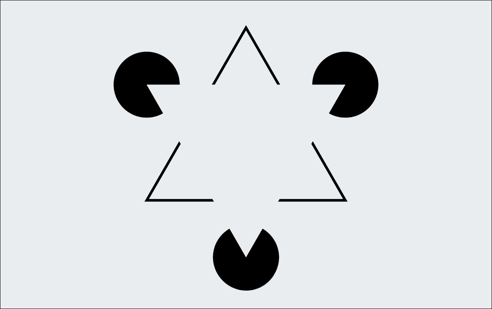
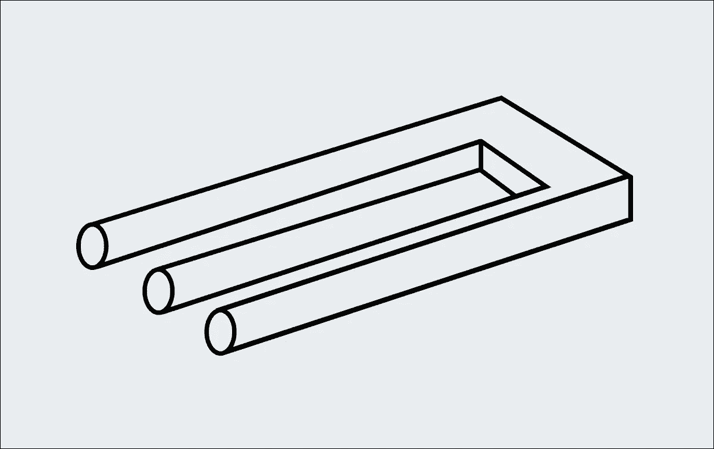

# 8 种令人迷惑的视错觉(以及它们揭示了我们大脑的工作方式)

> 原文：<https://towardsdatascience.com/8-mind-bending-optical-illusions-and-what-they-reveal-about-how-our-brains-work-f065b3164803?source=collection_archive---------1----------------------->

他们说“眼见为实”，但你真的能相信你所看到的吗？

以这个著名的光学实验为例:橙色的圆圈对你来说大小一样吗？

[Source: BrainHQ](http://www.brainhq.com/brain-resources/brain-teasers/titchener-circles)

如果你认为右边的圆圈看起来更大，你并不孤单。其实大部分人都是这样的。现在你应该已经猜到了，这两个圆的大小是一样的。

最佳视错觉挑战我们对现实的感知:此刻看似真实的东西最终是假的。如果我们挑战自己，进一步思考，你就会明白信息——比如视觉输入——毫无意义。是我们对信息的处理赋予了它意义。

我们通过学习如何看来看。我们的大脑已经进化到可以识别模式，通过与现实世界的互动来建立联系。这是生存本能。用著名的神经科学家[博·洛托](http://beaulotto.com/)、[的话说，“大脑实际上并没有进化到看世界的方式……大脑进化到看它有用的世界。”](http://blog.visme.co/best-optical-illusions/#)

大脑如何以一种有用的方式适应视觉？无需深究视觉科学理论，如 [Baysian 模型](https://en.wikipedia.org/wiki/Bayesian_approaches_to_brain_function)，定义我们如何看的一个简单事实是，我们的大脑在每种视觉情况下不断定义和重新校准“标准”。

因此，当视觉情境偏离我们大脑所知的“标准”时，视错觉是我们大脑对异常视觉体验做出反应的结果。换句话说，我们的大脑会“行动起来”，做出看似“不恰当”的解释。

# 视错觉是如何工作的？

虽然找到一个共同的理论来解释所有类型的错觉将是"[理论家的梦想](http://www.livescience.com/4950-key-optical-illusions-discovered.html)，"流行的学术解释认为认知错觉是"[大脑用来解释或阅读感官信号的知识被误用的结果](http://www.richardgregory.org/papers/knowl_illusion/knowledge-in-perception.pdf)"

> 我们的大脑已经进化到储存一个“规则手册”,这个“规则手册”根据过去的感官经验来描述物体应该如何看/感觉/闻。例如，我们将木纹纹理与木质表面联系起来，甚至当我们看到带有木质图案设计的光滑塑料表面时，我们也倾向于应用这一知识。

人类也不是唯一看到视错觉的人。大黄蜂对颜色的感知是出了名的，尽管它们的基本调色板由[绿色、蓝色和紫外线、](http://www.bumblebee.org/bodyEyehtm.htm)组成，而不是红色、绿色和蓝色。

在博·洛托博士对大黄蜂的实验中，他证明了大黄蜂的大脑——类似于人类的大脑——不以绝对的方式对颜色信息进行编码，而是通过真实世界进行学习。如果我们把大黄蜂的生活环境设计成黄色花朵中灰色是最蓝的，那么依靠蓝色花朵生存的大黄蜂就会转向灰色花朵。

这些科学实验有力地提醒我们，我们根据大脑如何组织其元素(如形状、大小、颜色和空间关系)来“看到”物理世界。现在，事不宜迟，让我们来看看我们在网上找到的一些最好的视错觉，以及它们揭示了我们视觉感知中的盲点。

# 最佳视错觉

# 1.特克斯勒效应

[Source: Mighty Optical Illusions](https://www.moillusions.com/troxlers-fading-optical-illusion/)

盯着上面模糊图像的中心，不要眨眼。几秒钟后，你看到了什么？图像开始变淡了吗？

这种被称为[特克斯勒效应](https://en.wikipedia.org/wiki/Troxler%27s_fading)的视觉现象，由瑞士医生伊格纳斯·保罗·维塔尔·特克斯勒于 1804 年首次发现，揭示了我们的视觉系统如何适应感官刺激。这是由于我们的神经元停止对不变的刺激做出反应——在这种情况下，背景中的静态模糊图像——导致图像从我们的意识中消失。

# 2.丘博错觉(亮度)

[Source: Wikimedia](https://upload.wikimedia.org/wikipedia/commons/7/7e/Chubbillusion.gif)

Chubb 错觉是由 Charles Chubb 及其同事 Sperling 和 Solomon 在 20 世纪 80 年代末首次发现的，当时他们通过将低对比度的视觉对象放置在各种背景上来实验感知对比度。

正如你在上面的图像中看到的，当纹理对象被放置在一个简单的灰色背景上时，它似乎比相同的对象被放置在一个高对比度的纹理背景上时有更多的对比度。

对这种常见视觉错误的一种解释是“[不完全透射](https://www.ncbi.nlm.nih.gov/pubmed/11506656)”，这是一种大脑需要为视觉感知导航模糊的情况，例如当透过雾或从远处看东西时。当没有光线照射在视网膜上时，我们的大脑试图通过做出不完美(通常不准确)的解释来确定物体的真实颜色或对比度，例如当低对比度物体在灰色背景上时。

# 3.棋盘格阴影错觉(对比)

[Source: MIT](http://web.mit.edu/persci/people/adelson/checkershadow_illusion.html)

在这个著名的视错觉中，标有 A 的方块看起来比 B 暗很多，对吧？但事实上，它们都是灰色的。如果你不相信我，点击[这个链接](http://web.mit.edu/persci/people/adelson/checkershadow_proof.html)看证明。

阿德尔森的[棋盘阴影错觉](https://en.wikipedia.org/wiki/Checker_shadow_illusion)是我们的视觉系统不能绝对感知的经典例子。在这里，棋盘上视觉解释的情况是复杂的:有光进入表面，然后有圆柱体投射的阴影，阴影下有亮和暗的方块。

正如 Adelson 所解释的那样，大脑如何确定正方形 A 和 B 的颜色涉及到几个变量，使用过去关于对比度和阴影的经验作为参考点。在这里，明亮和黑暗的方块以及柔和的阴影的接近会欺骗大脑做出错误的判断。

但对阿德尔森来说，这种错觉证明了我们视觉系统的有效性，而不是它的缺陷，因为它通过分解视觉信息成功地构建了意义。

# 4.丁香追逐者(彩色)

[Image Source](http://www.michaelbach.de/ot/col-lilacChaser/index.html)

盯着图片中央的十字看 20 秒钟左右，你会看到一个绿点绕着圆圈跑，或者一个绿点绕着圆圈转，似乎抹去了灰色背景上的洋红色点。如果你移动你的眼睛，洋红色的点会再次出现。

[淡紫色追逐者](https://en.wikipedia.org/wiki/Lilac_chaser)，也被称为“吃豆人”错觉，主要是“[负视网膜残像](http://www.michaelbach.de/ot/col-lilacChaser/index.html)的影响，当我们的感知系统适应填充中性背景上互补色调的“残像”留下的间隙时，就会出现这种情况。在这种情况下，淡紫色点的消失会产生互补色(绿色)的余像。

格式塔效应促成了一个绿色圆盘飞行的视觉现象。过了一会儿，大脑开始整合连续的残像，转而感知一个单独的飞行物体。我们将在后面深入探讨格式塔效应。

# 5.波根多夫错觉(几何)

[Via New Optical Illusions](http://www.newopticalillusions.com/kids-optical-illusions/the-poggendorff-illusion/)

看左图:黑线好像和蓝线排成一条线了吗？实际上，黑线和红线是一条线，如右图所示。

以 1860 年首次描述这种错觉的德国物理学家约翰·波根多夫命名的[波根多夫错觉](https://en.wikipedia.org/wiki/Poggendorff_illusion)揭示了我们的大脑如何感知深度和几何形状，但这种视错觉的原因尚未得到充分解释。

虽然到目前为止，没有任何理论能够令人满意地解释这种视觉错误，但普遍的看法是，我们的大脑试图用 3D 属性来解释 2D 图像，并扭曲了线条之间的深度。如果你想了解更多，这里有一个[完整的网站](http://www.soapsheet.com/TrialSite/Home.html)致力于 Poggendorff 错觉。

# 6.谢泼德表(尺寸)

当你看上面的两张桌子时，它们的大小和形状是否有很大的不同？你会相信这两个桌面一模一样吗？如果没有，看看这个[动画插图](http://www.michaelbach.de/ot/sze_shepardTables/)自己看吧。

美国心理学家罗杰·谢泼德在他的著作《心灵景象》(1990 年)中首次提出了这种简单而惊人的视觉错觉，进一步证明了我们的视觉系统在很大程度上受到我们对外部世界的体验的影响，因此有时会干扰现实。

在这个错觉中，感知错误是由于我们的大脑忍不住对 2D 的图片进行 3D 解释，并由于透视缩小而感知到非常不同的大小:物体在距离上越近，在我们的视网膜上就越大。

# 7.卡尼萨三角形(格式塔效应)

[Image Source](http://optical-illusions.wikia.com/wiki/Kanizsa_Triangle)

如果你还没有看到由吃豆人的边组成的三角形，我肯定看到了。不存在的三角形看起来也比背景亮，尽管它们的亮度相同。

由意大利心理学家 Gaetano Kanizsa 推广的这种错觉揭示了我们是如何在视觉感知中寻求封闭的。一些最好的视错觉是基于这样的原理:我们的大脑被训练来填补形状和线条之间的空隙，并将空白空间视为物体，即使根本没有物体。

换句话说，Kanizsa 的三角形是一个恰当的例子，我们的视觉感知是由经验形成的，而不仅仅依赖于感官输入。

# 8.不可能三叉戟(不可能的物体)

[Image Source](http://brainden.com/impossible-objects.htm)

仔细看:在叉子的末端，三个叉子奇迹般地变成了两个。你越看它，它就变得越不可能。这是怎么发生的？

[通常被认为是在 1965 年 3 月的《疯狂杂志》封面上首次亮相的原创图形艺术，不可能的三叉戟](https://en.wikipedia.org/wiki/Impossible_trident)也被称为魔鬼的叉子、不可能的叉子或 blivet。这些线条在末端连接在一起，创造出一种尖头的错觉。因为我们的大脑倾向于从平面的 2D 图像中重建三维图像，这就产生了深度错觉。

# 轮到你了

无论你是想用视觉来强化你的信息，还是用图像来阐述复杂的想法，理解视觉感知背后的过程对于成为一个更好的视觉传达者来说都是至关重要的。点击这里阅读更多关于[如何成为更好的视觉思考者](http://blog.visme.co/unlock-creativity-visual-thinking/)或者点击这里[有效地讲述视觉故事](http://blog.visme.co/unlock-creativity-visual-thinking/)。

你在网上找到的最好的视错觉是什么？你有更多在这里看不到的惊人例子吗？在下面的评论区和我们分享你的想法。

*本帖* [*原版*](http://blog.visme.co/best-optical-illusions/) *最早出现在 Visme 的* [*视觉学习中心*](http://blog.visme.co/) *。*