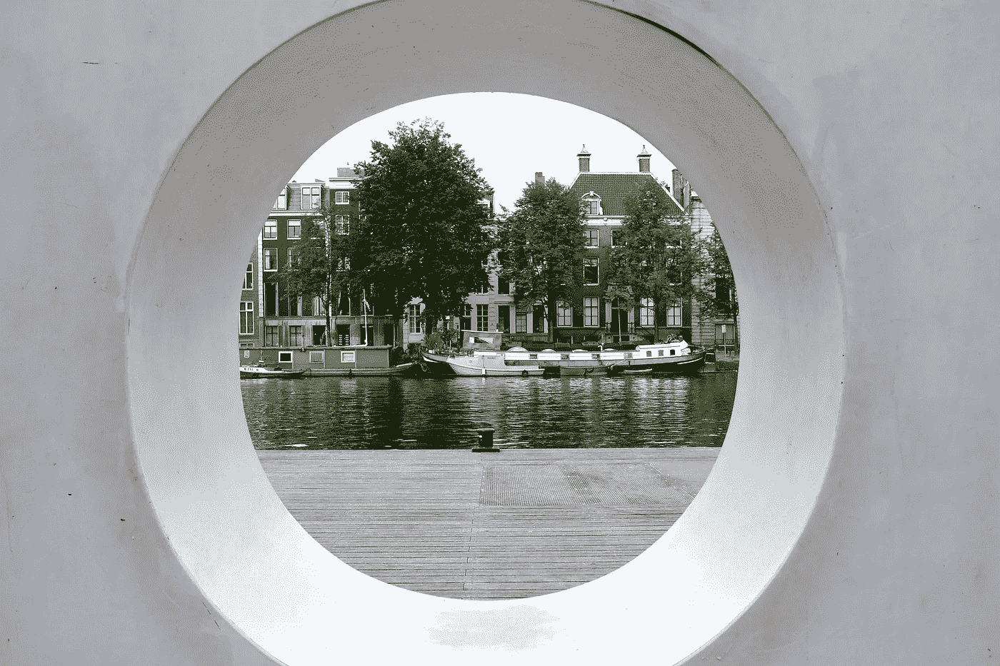
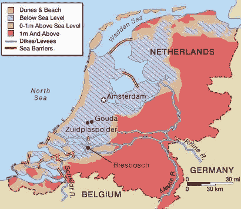

# 8 年过去了，阿姆斯特丹仍然是智能城市的领头羊

> 原文：<https://towardsdatascience.com/8-years-on-amsterdam-is-still-leading-the-way-as-a-smart-city-79bd91c7ac13?source=collection_archive---------1----------------------->

instagram.com/fetherico

# 欧洲的创业之都是科技和创新的中心

阿姆斯特丹有 1281 座桥。对于我们大多数人来说，这似乎是一个相当容易被抛弃的事实，但对于阿姆斯特丹智能城市倡议来说，这是一个巨大的飞跃。因为直到今年，我们都不知道有多少座桥。

32 个地区部门覆盖了超过 12，000 个数据集，您可以开始明白为什么了。由于没有收集所有信息的中央枢纽，共享统计数据是繁忙的政府部门没有时间或资源去做的事情。

现在，阿姆斯特丹拥有了城市数据，这是其智能城市引擎的燃料。

# 是什么让阿姆斯特丹与众不同

阿姆斯特丹的特别之处在于，它将城市数据开源。每个人都可以访问这些信息，任何人都可以向集合中添加更多的数据集。城市数据可以在网上获得，很容易搜索、下载或链接到你自己的系统。

# 大城市需要适应

目前世界人口的 50%居住在城市。到 2050 年，这一数字预计将增加到 70%——这将包括在此期间全球总人口增长约 20 亿人。在阿姆斯特丹这样的城市，大部分基础设施都来自宗教改革时期，必须进行改造，以确保首都的道路、住房、服务和生活质量得到改善。与此同时，城市必须变得更加可持续，以避免空气污染的增加和进一步加剧气候变化。

2016 年 4 月，阿姆斯特丹获得欧洲创新之都奖。今年，荷兰在 2017 年全球创新指数中跃升 5 位，排名第 3。而且没有减缓的迹象。

# 简史

Image: expeditieaarde.blogspot.nl

*   自 1200 年以来，荷兰 15-20%的土地已经被周围的海洋、湖泊、沼泽和湿地开垦
*   这个国家只有 50%的地方高于海平面 1 米以上
*   27%在海平面以下，这个地区有五分之一的人口

阿姆斯特丹市位于海平面以下 2 米。和所有早期文明一样，水赋予了城市生命。生产和运输货物的能力对荷兰的生存一直至关重要。它仍然是世界第八大出口国，贸易占该国国内生产总值的 82.5%。

市民们一直都意识到与水的关系是多么脆弱，荷兰习惯于利用技术来应对无时不在的洪水风险。在过去，如果你不妥善照料你的庄稼，维护灌溉系统、堤坝、防洪堤和障碍物，你邻居的庄稼也会遭殃。在许多方面，这项公约现在仍然适用。这些尊重、合作和社区的原则已经延续了几个世纪，这就是为什么今天的阿姆斯特丹仍然是精明的基础设施和创新的典范。

# 我的邻居应用程序(MijnBuur)

这一框架的一个例子是涵盖荷兰每一套公寓的“业主协会”法。虽然每个人都拥有自己独立的公寓，但大楼里的每个人都必须合作维护、清洁和保证整个建筑的安全。这通常是通过按月收取服务费来实现的，这意味着，如果你邻居的淋浴器漏水，损坏了你的天花板，你可以向该基金申请资金。

MijnBuur 应用程序建立在这种睦邻关系之上。你与你的邻居直接相连，他们可以提醒你任何危险，他们需要的东西或他们想做的任何事情。目的是让公民更有社会责任感，在不涉及市政当局的情况下解决纠纷。该项目应该节省资金，同时也改善社区关系——并通过向政府提供关于首都居民之间共同问题的有用数据来塑造未来的政策。

# 挖掘技术文化

*   荷兰是欧洲人口最稠密的国家，也是世界上人口最稠密的国家之一——每公里 4.88 人
*   在阿姆斯特丹，这一数字上升到每公里 4439 人——目前阿姆斯特丹的人口超过 82 万
*   再加上每年 1400 万游客…

……你可以明白为什么政府热衷于创造尽可能多的创新机会。商业部门和阿姆斯特丹政府都积极尽最大努力吸引顶级技术和创新人才，并通过国际人才活动、Startupbootcamp 和为阿姆斯特丹编码等计划留住他们。

数字平台用户产生的数据往往比所提供的服务更有价值。通过将阿姆斯特丹的城市数据开源，通常为企业保留的经济价值被返还给市民，让他们重新投资于解决城市问题的创新解决方案。

而且不仅仅是免费数据。阿姆斯特丹已经有了强大的数字基础设施和 ICT 生态系统。荷兰拥有欧盟最快的互联网。对创业公司的支持无处不在。无论是接触经验丰富的创业交流、现代的共同工作空间、世界闻名的加速器和孵化器，还是介绍首都的许多风险资本家、天使和投资者。

2016 年，阿姆斯特丹的初创公司筹集了 1.94 亿€，占整个荷兰初创公司总资金的 76%。Lumos Global 是一家提供清洁廉价太阳能的公司，筹集了其中的近一半资金。提醒人们，可持续发展和社会企业家精神仍然是这座城市的最大愿望。

# 阿姆斯特丹智慧城市倡议(ASC)

自 2009 年提出概念以来，ASC 已经推动了 80 多个旨在让城市更智能的试点项目。在一个早期项目中，研究和统计部直接进入首都的各个政府部门，直接获取数据。

利用保险公司的统计数据和治疗费用的信息，他们发现一些抑郁症患者比例高的地区没有得到相应水平的护理。该市向一项教育计划投入了更多资金，该计划针对那些拒绝接受治疗或不愿承认自己患病的人，并增加了接受医疗护理的人数。

# 无塑料河流

这个试点项目不仅强调了收集信息的重要性，还强调了组织和分享信息的重要性。在最近一次无塑料河流的马拉松比赛中，设计师安妮·玛丽克·埃维琳斯、萨斯基亚·斯图德和弗朗西斯·杰罗恩·祖特利用石油和疏浚行业共有的原则创造了“伟大的泡沫屏障”。这个简单的想法是在河底放一根带孔的管子。通过泵入空气，你创造了一个“气泡屏障”，阻止塑料漂浮在河中，并将废物引导到河岸进行收集。对于像阿姆斯特丹这样拥有复杂开放运河系统的城市来说，这是一项无价的创新。这种方法很便宜，可以很容易地应用到世界各地的其他水道，为每年倾倒入海洋的 800 万吨塑料提供了一种解决方案。

Van Plestik 通过收集收集的废塑料并将其转化为 3D 打印机的建筑材料，将这一解决方案向前推进了一步。这些打印机可以为各种应用创造高质量和负担得起的塑料物品。Van Plestik 是 StartupAmsterdam 开展的一项名为“住宅创业”的计划的一部分。

# 创业阿姆斯特丹

2015 年阿姆斯特丹市和 250 名科技行业利益相关者的合作。目的是统一和扩大阿姆斯特丹的启动系统，并建立一个生态系统。

我们的目标是成为创业公司的一站式商店，将他们与关键人物、导师、投资者、技术人才和新客户联系起来。在他们的网站上，你可以搜索招聘信息、寻找合作空间、查看活动日历、阅读相关新闻文章、查看大学课程、加入包括 80 多家企业在内的社区网络，并获得联络人员的支持。

在 Eli5，我们使用该系统与智能城市规划者联系，测试我们最新的数字产品，与类似的公司建立联系，寻找人才，然后通过组织聚会和实习来回馈该系统，与那些刚刚进入行业的人分享我们的方法和经验。例如，今年我们想测试我们的在线提议工具，并很快找到了愿意给我们反馈的自由职业者团体。然后作为交换，我们免费提供软件给他们。

在短短两年内，该项目巩固了阿姆斯特丹作为欧盟科技中心的地位。在很短的时间内，他们已经:

*   建立了一个公司网络
*   创建了 Launchpad Meetups 来连接企业和创业公司
*   发起阿姆斯特丹资本周，将创业公司与资本联系起来
*   创办了创业学院，包括 BSSA (B.Startup School Amsterdam)和成长部落学院
*   协办国际创业训练营
*   将编码课程引入学校课程

# 常驻启动

StartupAmsterdam 支持的举措之一是政府孵化器 Startup in Residence。

每年，市政府都会评估人们关注的问题，并利用城市数据为初创公司创造一系列需要解决的社会挑战。通过这样做，他们利用了阿姆斯特丹巨大的创业文化以及他们雇佣的有才华的应用程序、平台和软件开发人员。

阿姆斯特丹任何时候都有 1500-2000 家创业公司，与创意人员和开发人员合作可以大大加快创新进程。这也意味着市民可以直接参与他们城市的未来。

如果解决方案证明是成功的，阿姆斯特丹市将投资于该公司或成为他们的启动客户。与市政当局合作为初创企业获得城市专家及其网络的支持提供了一个独特的机会。该计划几乎支持了本文中提到的所有应用。

2015 年的试点计划产生了五个可行的项目，包括一个鼓励居民分类垃圾的应用程序，以及一个帮助游客离开酒店和住宿的应用程序，还通过提供阿姆斯特丹鲜为人知的景点 Wyzer 的信息来更均匀地分散游客。

# Wander 的 Wyzer 应用程序

这个应用程序的聪明之处在于，它有助于让人们远离人迹罕至的道路，同时改善他们对这座城市的体验。该应用程序连接到一个指南针，而不是地图，所以你仍然朝着正确的方向前进，但可以探索不同的路线到达那里。他们称之为“模糊导航”。该应用程序突出了“隐藏的宝石”,供您沿途发现。所以当你回到家，你会有一个比大多数游客更独特的故事要讲——当地人对减少拥堵感到高兴。

这项技术使用地图、GPS 和旅游数据，然后依靠一些社区合作向用户推荐最佳去处。

# 阿姆斯特丹高级都市解决方案研究所(AMS)

AMS 是由代尔夫特大学、瓦赫宁根大学和麻省理工学院构思的，以响应城市对实际城市问题开发大都市解决方案的建议呼吁。成立研究所意味着研究，更重要的是，可以进行小规模的测试。相对廉价的应用程序和平台可以快速验证想法，并创建可行的实时数据和分析。

AMS 是一个项目的一部分，该项目旨在摆脱 Wyzer 等应用程序使用的传统公共数据形式，并研究产生大规模地理社会数据的方法。这是从传感器、GPS 设备和手机中挖掘出来的。然而，这种信息更以人为本，也受益于以前未开发的来自社会媒体、LoRa 网络和开放数据门户的社区信息。

2016 年 6 月，荷兰成为世界上第一个拥有全国范围的 LoRa 网络以促进物联网的国家。因此，它是测试这种新型数据的完美实验室。

# 大城市数据的优势

AMS 最雄心勃勃的项目之一是社会城市数据实验室。研究人员和开发人员正在为“大城市数据的获取、丰富、整合、分析和可视化”构建最先进的技术。

如果你能从大量市民中实时收集关于挑战和不满的知识，那么城市规划者和决策者将会了解得更多。不可避免地，这意味着该政策将更有效地服务于社区，提高生活质量。

# 社交玻璃

社会城市数据实验室的成果之一是社会玻璃。这个基于网络的平台利用实时城市大数据分析和预测来创建“人类景观的反映”。

通过使用高级词汇语义分析词义及其之间的关系，并将结果与机器学习相结合，该团队可以确定公众的状况、情绪、欲望——几乎任何情绪。

当你开始用地理定位数据和市政当局的其他公开数据来交叉参考时，你就可以开始建立模式和绘制城市的情绪。因此，如果一个本地事件正在扰乱居民，周围的社会数据可以帮助指导规划者解决问题。或者，如果博物馆的长队打扰了游客，该平台可以发送警报，告诉其他人避开该景点，直到它不那么繁忙。

科学并不完美。社交帖子的特点和内容多种多样，缺乏结构，可能会有偏见和模糊不清。人工智能需要一些时间来学习识别模式和验证数据。但是，通过进一步让市民参与到智慧城市计划中来，阿姆斯特丹在下一步就有了优势。

# 未来:智慧城市 3.0

智慧城市的第一次迭代非常注重技术。像 IBM 和思科这样的大公司经常被批评有太大的影响力，并推动城市采用他们还没有适当使用的基础设施的技术。

阿姆斯特丹的首席技术官 Ger Baron 在接受《麻省理工斯隆管理评论》采访时表示，“每一家来这里告诉我们它是如何工作的公司，他们都是错的，因为他们不知道一个城市是如何工作的……人们认为它是如何工作的和它是如何工作的之间有很大的差异”。当他开始创建一个全市范围的数据清单时，这一点变得更加明显，他意识到没有人有一个完整的、经过整理的首都桥梁数据。那些管理这座城市几个世纪的人也没有完全理解它。巴伦的部分工作是确保企业利益不会压倒市民利益，当一个城市急于变得更聪明时，这种情况经常发生。

智慧城市 2.0 的特点是由城市本身而不是技术提供商引领。该版本侧重于提高居民和游客的生活质量，并与市民协商设计工具，以确保解决方案符合他们的需求。这就是阿姆斯特丹对创业计划(Startups in Residence)所做的事情，它完全基于人们所关心的问题来设定挑战。

下一个阶段是公民共同创造。智慧城市 3.0 仍然需要由技术和城市来实现，但将由人民和社区来领导。像修理咖啡馆或工具借阅图书馆这样的计划已经在阿姆斯特丹开始实施，通常由公众单独管理，为公众服务。应用程序 Verbeterdebuurt 字面意思是“改善邻里关系”,为阿姆斯特丹人提供了一种便捷的方式来强调问题并提出改变建议。它有 GPS 功能，可以上传图片以节省冗长描述的时间。

居民可以比管理员更快地发现城市的需求。通过合作，他们通常也能更快地找到解决方案。如果政府不再将市民视为顾客或服务的接受者，而是让他们成为城市的共同创造者，阿姆斯特丹将继续变得更聪明。只要它继续建设宽带、无线和物联网基础设施。最重要的是，城市数据得到了维护。