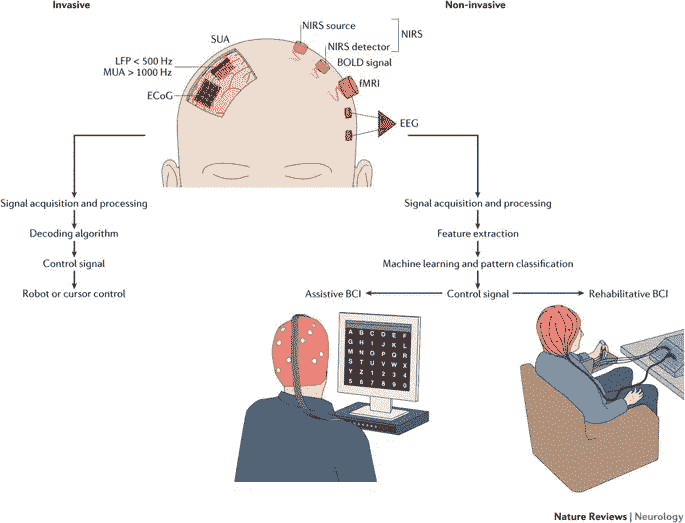
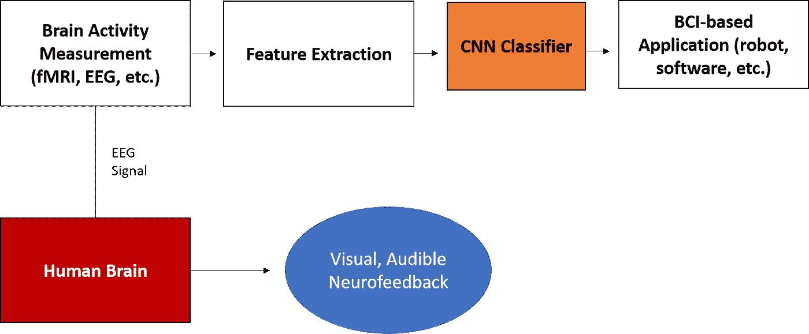

# 脑机接口和卷积神经网络初学者指南

> 原文：<https://towardsdatascience.com/a-beginners-guide-to-brain-computer-interface-and-convolutional-neural-networks-9f35bd4af948?source=collection_archive---------0----------------------->

## 简单并附有定义。

[Futurist / Humanist Gerd Leonhard](https://thefuturesagency.com/2018/06/02/the-most-important-future-principles-illustrated-futurist-humanist-gerd-leonhard/)

# 路标

**Part 1:** *脑机接口与 AI +研究论文大图*

**第 2 部分:**
深入解释与 BCI 一起使用的神经网络

大脑能否通过脑机接口(BCI)技术直接与人工智能、机器人和其他大脑连接，以超越我们人类的局限性？

对一些人来说，这是我们生存的必需品。事实上，我们需要成为电子人才能在人工智能时代发挥作用。

# **定义**

> **脑-机接口(BCI):** 仅通过大脑活动使用户能够与计算机交互的设备，这种活动通常通过脑电图(EEG)来测量。
> 
> **脑电图(EEG):** 通过放置在头皮表面的电极记录大脑产生的电活动的首选生理方法。
> 
> **功能磁共振成像(fMRI):** 通过检测与血流相关的变化来测量大脑活动。
> 
> **功能性近红外光谱** ( **fNIRS** ):使用近红外光谱(NIRS)进行功能性神经成像。使用 fNIRS，通过与神经元行为相关的血液动力学反应来测量大脑活动。
> 
> **卷积神经网络(CNN):** 一种用于图像识别和处理的人工神经网络，专门用于处理像素数据。
> 
> **视觉皮层:**大脑皮层的一部分，接收和处理来自眼睛的感觉神经冲动

# **历史**

《卫报》记者莎拉·马希说:“脑机接口(BCI)并不是一个新想法。已经有各种形式的 BCI，从放在你头顶上测量大脑信号的设备到植入你大脑组织的设备。”([来源](https://www.theguardian.com/technology/2018/jan/01/elon-musk-neurotechnology-human-enhancement-brain-computer-interfaces))

大多数脑机接口最初是为医疗应用开发的。Tellart 的首席设计师 Zaza Zuilhof 表示，“大约 22 万名听力受损者已经从耳蜗植入中受益，耳蜗植入可以将音频信号转化为电脉冲，直接发送到他们的大脑。”([来源](https://www.core77.com/posts/72957/When-Brain-Computer-Interfaces-Go-Mainstream-Will-Dystopian-Sci-Fi-Be-Our-Only-Guidance))

**[这篇文章名为《脑机接口简史》](http://www.brainvision.co.uk/blog/2014/04/the-brief-history-of-brain-computer-interfaces/)**给我们提供了许多与 BCI 历史有关的信息。事实上，文章说“在 20 世纪 70 年代**，对脑机接口的研究在加州大学开始，这导致了大脑-计算机接口这一表达的出现。BCI 研发的重点仍然是神经假体的应用，这有助于恢复受损的视觉、听觉和运动。20 世纪 90 年代中期,标志着人类第一个神经假体装置的出现。BCI 并不准确地解读思想，但当你以某种方式思考时，它能探测到大脑辐射能量的最小变化。BCI 识别大脑中特定的能量/频率模式。**

**【2004 年 6 月【Matthew Nagle 成为第一个植入 cyber kinetics BrainGate BCI 的人，标志着该领域的一项重大发展。**

**2004 年 12 月，Jonathan Wolpaw 和纽约州卫生部沃兹沃斯中心的研究人员提交了一份研究报告，展示了使用 BCI 控制电脑的能力。在这项研究中，患者被要求戴上一顶包含电极的帽子，以捕捉来自运动皮层的脑电图信号，运动皮层是大脑控制运动的一部分。**

**BCI 在控制应用方面有着悠久的历史:光标、瘫痪的身体部位、机械臂、电话拨号等。**

**最近，埃隆·马斯克(Elon Musk)进入了这个行业，宣布向 Neuralink 投资 2700 万美元，这是一家旨在开发一种 BCI 的风险投资公司，该公司根据人工智能改善人类沟通。Regina Dugan 介绍了脸书的计划，该计划将改变 BCI 技术的游戏规则，提高数字通信的效率。"**

**根据[约翰·托马斯](https://ieeexplore.ieee.org/author/37085770394)、[托马兹·马斯奇克](https://ieeexplore.ieee.org/author/38193752000)、[尼尚特·辛哈](https://ieeexplore.ieee.org/author/37085349729)、[蒂尔曼·克鲁格](https://ieeexplore.ieee.org/author/37684148100)、[贾斯汀·道韦尔斯](https://ieeexplore.ieee.org/author/37269552600)“一个 BCI 系统有四个主要组成部分:信号采集、信号预处理、特征提取和分类。”([来源](https://ieeexplore.ieee.org/document/8122608))**

# ****这有什么关系？****

**埃塞克斯大学脑机接口博士后研究员 Davide Valeriani 说:“人类和技术的结合可能比人工智能更强大。例如，当我们基于感知和推理的结合来做决定时，神经技术可以用来改善我们的感知。这有助于我们应对一些情况，比如从安全摄像头看到非常模糊的图像，不得不决定是否干预。”([来源](https://observer.com/2017/04/elon-musk-wants-to-merge-man-and-machine-artificial-intelligence-eeg-neurotechnology/)**

# **这些脑机接口*实际上*能做什么？**

**对于 Zaza Zuilhof 来说，这取决于你问谁，以及你是否愿意接受手术。“为了这个思想实验的目的，让我们假设健康的人只会使用不需要手术的非侵入性脑机接口。既然如此，目前主要有两种技术，fMRI 和 EEG。第一种需要一个巨大的机器，但第二种，通过像 Emotiv 和 Neurosky 这样的消费耳机，实际上已经可以为更普通的观众所用。”([来源](https://www.core77.com/posts/72957/When-Brain-Computer-Interfaces-Go-Mainstream-Will-Dystopian-Sci-Fi-Be-Our-Only-Guidance))**

****

**[Source](https://www.nature.com/articles/nrneurol.2016.113)**

**然而，BCI 也可以成为健康人的一种有前途的交互工具，在多媒体、虚拟现实或视频游戏领域以及许多其他潜在应用中有几个潜在的应用。**

**Davide Valeriani 说，“脑电图硬件对用户来说是完全安全的，但记录的信号非常嘈杂。此外，到目前为止，研究实验室主要集中在使用它来了解大脑和提出创新应用，而没有任何商业产品的后续行动……但这将会改变。([来源](https://theconversation.com/elon-musk-wants-to-merge-man-and-machine-heres-what-hell-need-to-work-out-75321))**

**马斯克的公司是最新的。其“神经花边”技术包括在大脑中植入电极来测量信号。这将允许获得比脑电图质量更好的神经信号——但这需要手术。最近，他表示，需要脑机接口来确认人类对人工智能的优势。"([来源](https://theconversation.com/elon-musk-wants-to-merge-man-and-machine-heres-what-hell-need-to-work-out-75321))**

**这个技术还是很危险的！事实上，我们制造了计算机，并且确切地知道它们如何工作以及如何“修改”它们。然而，我们并没有制造大脑，我们仍然不知道它们是如何工作的。更不用说如何安全成功地“入侵”它们了。我们已经取得了很大的进步，但还不够。**

# **你的大脑现在是如何工作的，以及未来会发生什么**

**简单来说，你的大脑分为两个主要部分:**

*   **边缘系统**
*   **新大脑皮层。**

**边缘系统负责我们的原始欲望，以及那些与生存有关的欲望，如进食和繁殖。我们的新大脑皮层是最高级的区域，它负责逻辑功能，使我们擅长语言、技术、商业和哲学。**

**人类大脑包含大约 86 个称为神经元的胆神经细胞，每个细胞都通过称为轴突和树突的连接器与其他神经元相连。每当我们思考、移动或感觉时，神经元都在工作。事实上，大脑产生大量的神经活动。基本上，从一个神经元到另一个神经元的微小电信号在起作用。**

**有许多信号可以用于 BCI。这些信号可以分为两类:
-尖峰信号
-场电位**

**我们可以检测这些信号，解释它们，并使用它们与设备进行交互。**

****

**Cortext 的机器学习顾问鲍里斯·鲁德林克(Boris Reuderink)表示，“脑机接口的一个更大的问题是，大脑信号很弱，非常多变。这就是为什么很难训练一个分类器，并在第二天使用它，更不用说在不同的主题上使用它了。”([来源](https://www.quora.com/What-is-a-good-machine-learning-project-involving-brain-computer-interfaces))**

**为了插入神经带，一根包含卷起来的网状物的微小的针被放置在颅骨内。该网状物然后被注射并在注射时被揭开，包围大脑。**

**人工智能或机器学习已经受到极大关注，用于开发 BCI 应用来解决几个领域中的困难问题，特别是医疗和机器人领域。AI/ML 已经成为 BCI 系统最有效的工具。( [**来源**](http://www.wikicfp.com/cfp/servlet/event.showcfp?eventid=82608&copyownerid=88612) **)****

****

**下面让我们试着详细阐述一下这些方面。这些方面都有各自的研究领域。**

****信号产生**
产生这些大脑信号有两种方式:**

****

****据**[**Sjoerd Lagarde**](https://www.quora.com/profile/Sjoerd-Lagarde)**Quintiq 的软件工程师**“主动产生信号的好处是信号检测更容易，因为你对刺激有控制权；比如当他们出现的时候。如果你只是在读取受试者的脑电波，这就更难了。”**

****信号检测**
检测大脑信号有不同的方法。最著名的是脑电图和功能磁共振成像，但也有其他的。脑电图测量大脑的电活动，功能磁共振成像测量大脑中的血流。这些方法各有其优缺点。一些具有更好的时间分辨率(它们可以在大脑活动发生时检测到)，而另一些具有更好的空间分辨率(它们可以精确定位活动的位置)。**

**这个想法对于其他类型的测量技术来说基本上是一样的。**

****信号处理**例如，当使用脑电图时，像磨牙这样的事情会显示在数据中，还有眼球运动。这种噪音需要过滤掉。**

**该数据现在可用于检测实际信号。当受试者主动产生信号时，我们通常会意识到我们想要检测的信号类型。一个例子是 P300 波，这是一种所谓的事件相关电位，当出现不频繁的任务相关刺激时就会出现。这种波动将在您的数据中显示为一个大的峰值，您可能会尝试机器学习的不同技术来检测这样的峰值。**

****信号转导**
当你在数据中检测到了感兴趣的信号，你想以某种对某人有帮助的方式使用它们。例如，受试者可以使用 BCI 通过想象的运动来控制鼠标。这里你会遇到的一个问题是，你需要尽可能有效地使用你从受试者那里得到的数据，同时你必须记住，BCI 氏症可能会出错。目前的 BCI 相对较慢，偶尔会出错(例如，计算机认为你想象的是左手运动，而实际上你想象的是右手运动)。"([来源](https://www.quora.com/How-do-current-brain-computer-interfaces-work))**

**在神经带的例子中，它将自己与人脑整合在一起。它在人和机器之间创造了完美的共生关系。**

**这两个部分相互共生。一个人工智能层或第三界面可以位于它们之上，将我们插入一个非常新的先进的世界，并使我们能够与我们的人工智能机器人朋友保持一致。**

**这种连接可以让我们获得更多的记忆存储，惊人的机器学习能力，是的，不需要说话就可以与他人进行心灵感应式的交流。**

> **“你有一个你自己的机器延伸，以你的电话、电脑和所有应用程序的形式存在。。。迄今为止，你比 30 年前的美国总统拥有更多权力和能力，”埃隆·马斯克说**

# ****BCI 的种类****

**《富有同情心的人工智能》的作者阿米特·雷(Amit Ray)表示:“最复杂的脑机接口是“双向”脑机接口，它既可以记录神经系统，也可以刺激神经系统。
*脑机接口可分为三大类:***

****

**在侵入性技术中，必须使用特殊的设备来捕获数据(脑信号)，这些设备通过关键的手术直接插入人脑。在半侵入式中，设备被插入到人类大脑顶部的头骨中。一般来说，非侵入性被认为是最安全和低成本的设备类型。然而，由于头骨的阻碍，这些设备只能捕捉到“较弱”的人脑信号。大脑信号的检测是通过放置在头皮上的电极实现的。**

**有几种方法可以开发无创的脑机接口，如 EEG(脑电图)、MEG(脑磁图)或 MRT(磁共振断层成像)。基于脑电图的脑机接口是研究 BCI 最受欢迎的类型。EEG 信号在控制信号中被处理和解码，这是计算机或机器人设备容易感知的。处理和解码操作是构建高质量 BCI 的最复杂的阶段之一。特别是，这项任务非常困难，以至于科学机构和各种软件公司不时地组织竞赛来为 BCI 创建 EEG 信号分类。**

# **卷积神经网络和 BCI**

**CNN 是一种基于视觉皮层的人工智能神经网络。它能够通过前向和后向传播优化每个滤波器的权重参数，从输入数据中自动学习适当的特征，以最小化分类错误。**

**人类的听觉皮层是以分层组织的方式排列的，类似于视觉皮层。在层级系统中，当感觉信息流经系统时，一系列的大脑区域对感觉信息执行不同类型的计算。早期区域或“初级视觉皮层”对颜色或方向等简单特征做出反应。后期阶段实现更复杂的任务，如对象识别。**

**使用深度学习技术的一个优点是它需要最少的预处理，因为最佳设置是自动学习的。关于 CNN，特征提取和分类被集成到单个结构中并被自动优化。此外，人类受试者的 fNIRS 时间序列数据被输入到 CNN。由于卷积以滑动显示方式进行，CNN 的特征提取过程保留了 fNIRS 获得的时间序列数据的时间信息。**

****

**[Source](https://amitray.com/brain-computer-interface-compassionate-ai/)**

**然而，BCI 研究中最大的问题之一是大脑信号的非平稳性。这个问题使得分类器很难在信号中找到可靠的模式，导致不良的分类性能。"([来源](https://amitray.com/brain-computer-interface-compassionate-ai/))**

# **你如何从零开始了解 BCI？**

**[航空航天工程博士生 Hosea Siu](https://www.quora.com/profile/Hosea-Siu) 表示，“对于直接的‘大脑’接口，你需要一组脑电图电极，对于周围神经系统接口，你需要肌电图电极。**

**一旦你能把数据输入电脑，你就需要做一些信号调节。比如过滤你要寻找的信号频率，过滤掉环境噪音(在美国，电线产生的 60 赫兹噪音很常见……)。**

**之后，你需要考虑你实际上想要让系统做什么。当你想到蓝色时，你需要它来检测你的脑电图模式的特殊变化吗？或者当你移动手指时，你需要它来检测你的肌电图的变化吗？电脑呢？它应该运行一个程序吗？键入一些文本？**

**想想你将如何标记你的数据。计算机最初如何知道一个特定的信号是有意义的？**

**这是监督学习。选择您喜欢的分类方法，获取大量标记数据，并训练您的系统。您可以使用交叉验证等方法来检查您训练的模型是否在做您认为它们应该做的事情。**

**做完这些，你可能会有一个看起来像脑机接口的东西。"([来源](https://www.quora.com/How-can-I-start-learning-about-brain-computer-interface-from-scratch))**

# **在哪里可以找到脑机接口上机器学习的数据集？**

**您可以在以下网站找到几个公开的脑电图数据集:**

*   **[免费脑电图数据库免费 ERP 数据公开可用](http://sccn.ucsd.edu/~arno/fam2data/publicly_available_EEG_data.html)**
*   **[柏林脑机接口](http://bbci.de/)**

**人工智能和强化学习与神经接口技术的最新进展以及各种信号处理方法的应用，使我们能够更好地理解并利用大脑活动与计算机和其他设备进行交互。**

# ****了解更多信息****

*   **[https://www . the guardian . com/technology/2018/Jan/01/elon-musk-neuro technology-human-enhancement-brain-computer-interfaces](https://www.theguardian.com/technology/2018/jan/01/elon-musk-neurotechnology-human-enhancement-brain-computer-interfaces)**
*   **[https://www . core 77 . com/posts/72957/When-Brain-Computer-Interfaces-Go-Mainstream-Will-Dystopian-Sci-Fi-Be-Our-Only-Guidance](https://www.core77.com/posts/72957/When-Brain-Computer-Interfaces-Go-Mainstream-Will-Dystopian-Sci-Fi-Be-Our-Only-Guidance)**
*   **[http://www . brain vision . co . uk/blog/2014/04/the-brief-history-of-brain-computer-interfaces/](http://www.brainvision.co.uk/blog/2014/04/the-brief-history-of-brain-computer-interfaces/)**
*   **[https://ieeexplore.ieee.org/document/8122608](https://ieeexplore.ieee.org/document/8122608)**
*   **[https://observer . com/2017/04/elon-musk-wants-to-merge-man-and-machine-artificial-intelligence-EEG-neuro technology/](https://observer.com/2017/04/elon-musk-wants-to-merge-man-and-machine-artificial-intelligence-eeg-neurotechnology/)**
*   **[https://medium . com/dx lab-design/how-will-brain-computer-interfaces-change-your-life-aa 89 b 17 c 3325](https://medium.com/dxlab-design/how-will-brain-computer-interfaces-change-your-life-aa89b17c3325)**
*   **[https://team.inria.fr/potioc/bci-2/](https://team.inria.fr/potioc/bci-2/)**
*   **[https://pdfs . semantic scholar . org/5088/ab 0900 ef7d 06023796 f 651 f 4 ee 5 fa 0 FB 36 a 0 . pdf](https://pdfs.semanticscholar.org/5088/ab0900ef7d06023796f651f4ee5fa0fb36a0.pdf)**
*   **[https://www . quora . com/What-a-good-machine-learning-project-containing-brain-computer-interfaces](https://www.quora.com/What-is-a-good-machine-learning-project-involving-brain-computer-interfaces)**
*   **https://www . quora . com/How-do-current-brain-computer-interfaces-work**
*   **[https://amitray . com/brain-computer-interface-体恤-ai/](https://amitray.com/brain-computer-interface-compassionate-ai/)**
*   **[https://www . quora . com/How-can-I-start-learning-about-brain-computer-interface-from scratch](https://www.quora.com/How-can-I-start-learning-about-brain-computer-interface-from-scratch)**