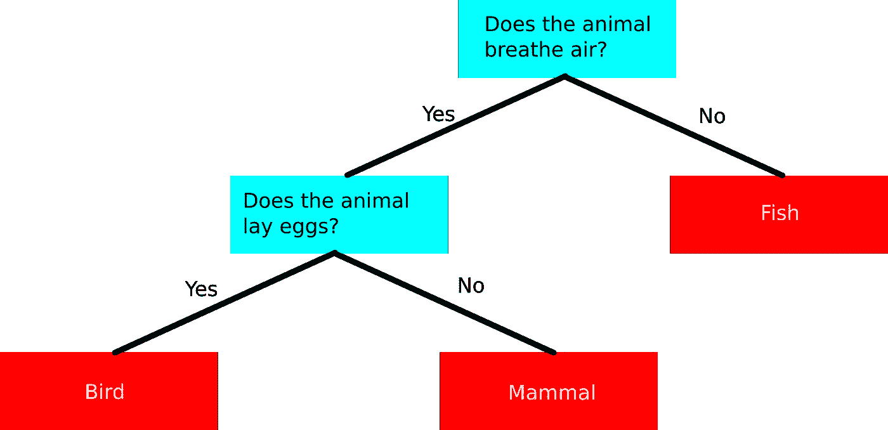

# 决策树分类初学者指南

> 原文：<https://towardsdatascience.com/a-beginners-guide-to-decision-tree-classification-6d3209353ea?source=collection_archive---------3----------------------->

决策树是最流行的机器学习算法之一，但也是最强大的。本文将从非技术角度解释它们是如何工作的。

它们如此强大的原因之一是因为它们很容易被可视化，因此人类可以理解正在发生的事情。想象一个流程图，其中每一层都是一个带有是或否答案的问题。最终一个答案会给你一个最初问题的解决方案。那是一棵决策树。每个人都下意识地使用决策树来完成最琐碎的任务。机器学习中的决策树利用这种能力，并将其放大，以便能够人工执行复杂的决策任务。

很多时候，很难理解机器学习算法是如何做出决定的，这使得它们无法用于许多场景。对于可能需要对决策提出异议的情况，尤其如此，例如在刑事司法系统、卫生行业和战略性商业决策中。对于面向客户的机器学习算法来说，这甚至是一个更重要的因素，因为根据 GDPR，客户有“[权利获得解释](https://mimin.al/blog/5b04495bdc2f1b001eb46889)。决策树的人类理解能力是一个主要的优势。

决策树分析数据集，以构建一组规则或问题，用于预测类别。让我们考虑一个由许多不同动物和它们的一些特征组成的数据集。这些特征可以用来预测他们的阶级。如果我们拿一只鹰和一头大象来说，一个能把这两种动物分开的问题会是‘这种动物有两条腿吗？’或者可能是“这只动物体重在 500 公斤以下吗？”。对这两个问题中的任何一个回答“否”都会导致大象的分类，而“是”会导致鹰的分类。

可以建立这些规则来创建一个可以对复杂情况进行分类的模型。为了扩展动物分类的例子，考虑需要将选择的动物分类为哺乳动物、鸟类、鱼类的场景。查看可视化决策树，了解如何使用两个简单的问题来拆分数据。

这些简单的问题一个接一个地分层，允许对各种各样的动物进行分类。这就是决策树的力量。现在，如果我们给训练好的决策树一个新的动物，比如一只狗，它会对它进行分类。狗会呼吸空气吗？是的。狗会下蛋吗？不。因此模型会将其归类为哺乳动物，正确答案！

当一个人构建决策树时，问题和答案是基于他们的逻辑和知识的。在数据科学中，这些规则的创建通常由算法控制，该算法通过分析整个数据集来学习要问哪些问题。为了将这放入上下文中，我们将回到动物的例子，算法将查看所有的动物，以找出所有不呼吸空气的动物，并注意到它们都是鱼。这在数学上将数据集按其类别进行分割。这创造了强大的算法，可以以任何人都可以理解的方式将新数据分类。

决策树在作为整体使用时会变得更加强大。集成是结合决策树创建更强大模型的聪明方法。这些集成创造了最先进的机器学习算法，在某些情况下可以胜过神经网络。两种最流行的集成技术是随机森林和梯度推进。

感谢您的阅读。请查看我的下一篇文章[深度学习初学者指南](/a-beginners-guide-to-neural-networks-deep-learning-c17273a24409)。或者，如果你对数据科学初学者指南或人工智能应用于商业的更多文章感兴趣，请访问 [Miminal](https://miminal.com/) 。