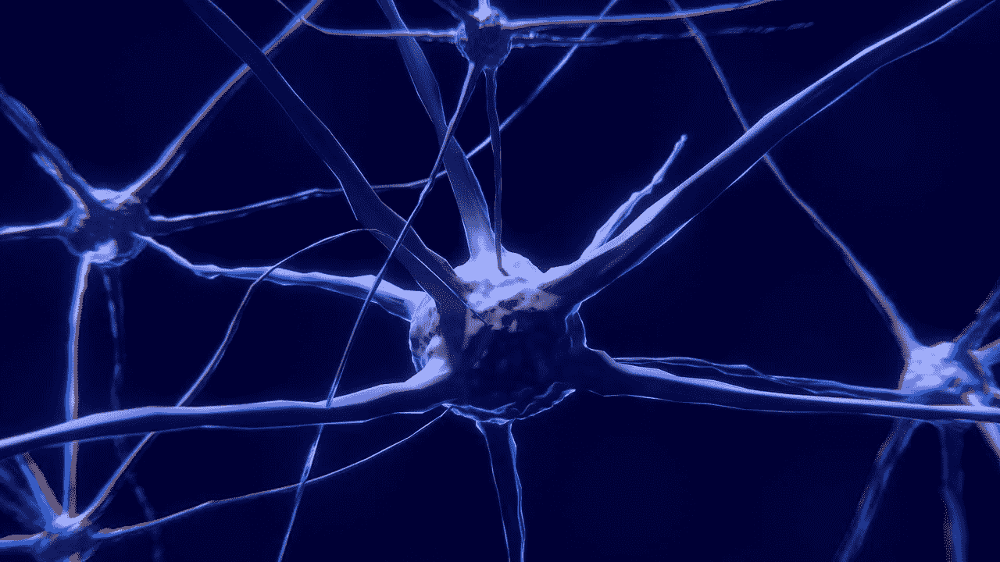
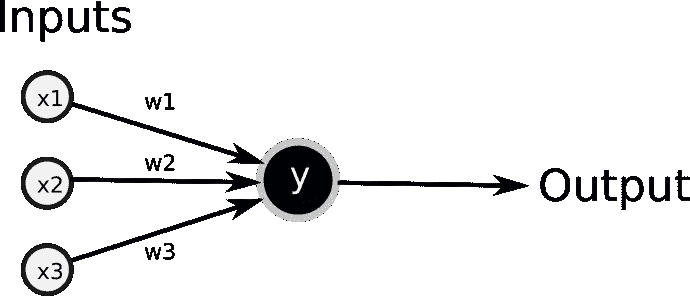

# 神经网络初学者指南(深度学习)

> 原文：<https://towardsdatascience.com/a-beginners-guide-to-neural-networks-deep-learning-c17273a24409?source=collection_archive---------11----------------------->

神经网络是一项突破性的技术，从未停止让我惊讶。就像一般的机器学习一样，它们正越来越多地融入我们的生活，而我们许多人却没有意识到。它们可能非常复杂，很难理解它们是如何做出决定的。顾名思义，他们设计背后的灵感来自于我们每天都拥有和使用的东西；大脑。

神经元是大脑的组成部分，当单独研究时，它们并不复杂。两个神经元通过突触连接，电脉冲通过突触从一个神经元传递到另一个神经元。如果电脉冲达到一定的强度，突触就会激活，将电脉冲传递给下一个神经元。

Perceptron

人工神经网络以非常相似的方式工作。左边的图像显示了最简单的神经网络，一个单层神经网络，称为感知器。它显示了一个节点(y ),输入(x1，x2，x3)进入该节点。每个输入都有一个权重(w1，w2，w3)。节点 y 获取每个输入，并将其值乘以权重。这种加权产生了神经网络最强大的功能之一，通过使用不同的强度权重来评估不同级别的输入。让我们用一个例子来更清楚地理解这一点。假设神经网络将预测我和一个朋友今晚是否会打网球。节点的输入可以是:

1.  我的朋友有空吗？是或否
2.  天气预报说今晚是晴天吗？是或否
3.  法院有空吗？是或否

如果这三个问题的答案都是肯定的，那么结果将是“是的，让我们打网球吧！”每个输入都根据其重要性被赋予一个权重。在这个例子中，很明显，朋友和球场是非常重要的输入，如果这两个答案中的任何一个是否定的，我和我的朋友将不打网球，那么这些权重将非常高。天气预报是晴天不太重要，因为如果是阴天甚至是毛毛雨，我们仍然可以打网球。

神经网络需要数学形式的“是”和“否”,因此神经网络的输入为“是”, 1 表示“是”, 0 表示“否”。每个输入通过将其值乘以其权重传递给节点 y。然后，节点将所有值相加。如果总数高于某个阈值，则返回 yes。如果总数低于，那么它将返回一个否。这是它的决定！

在提供输入和结果的许多不同的例子上训练一个神经网络。这允许网络学习其权重，以提供具有最佳可能精度的整体模型。例如，如果我对这三个问题的答案训练一个神经网络，如果我和我的朋友在过去的一年里每天都打网球，它将学会预测我们是否会打得很准确。这是一个非常基本的例子，神经网络还有很多我没有讨论的特性，比如隐藏层和反向传播。请继续关注更多深入神经网络工作的文章。

如果您对神经网络以及如何将它们应用于业务流程感兴趣，请访问 [Miminal](https://mimin.al/) 。Miminal 为希望利用人工智能的力量但缺乏内部能力或专业知识的公司提供定制的数据科学解决方案。