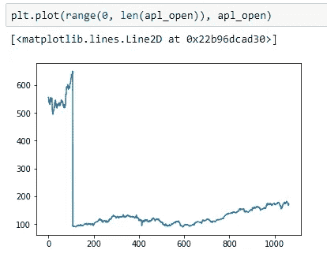
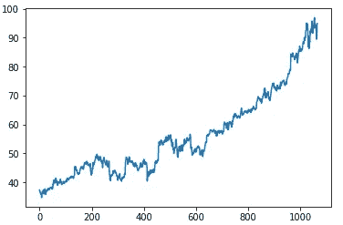
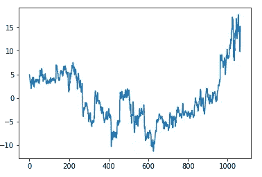
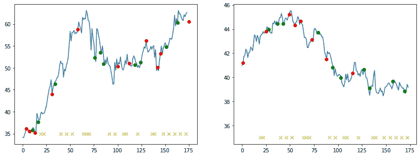
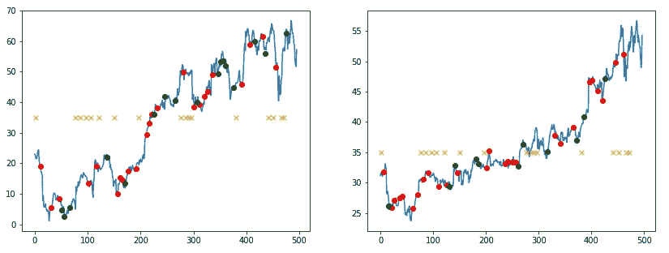
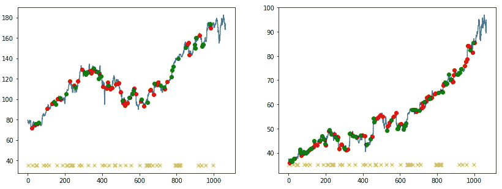

# 为股票交易制作一个深刻的演员-评论家机器人的浮躁指南

> 原文：<https://towardsdatascience.com/a-blundering-guide-to-making-a-deep-actor-critic-bot-for-stock-trading-c3591f7e29c2?source=collection_archive---------3----------------------->

技术分析就像一厢情愿的想法和复杂的数学一样。如果数字中有一个真实的趋势，不管特定股票的基本面如何，那么给定一个足够的函数逼近器(…就像一个深度神经网络)，强化学习应该能够找出它。

这里有一个有趣的，也许是有利可图的项目，我试图这样做。我与 RL 合作不到六个月，仍然在搞清楚事情，但在为几个基本游戏制作人工智能学习器后，时间序列股票市场数据是我脑海中的首要问题。

这并不容易，这篇文章记录了我的过程和一路上犯的错误，而不是写一篇文章把我自己作为一个解决问题的专家。有很多。


Reinforcement learning is The Good Place

请注意，如果你对 RL 完全陌生，你可能会从阅读我之前关于深度 Q 学习的文章中受益。这个有点不一样，但也是从更高的层次出发，有更多的隐性知识。

如果你只是想跳到代码/笔记本，这里是，但是记住:过去的表现并不能保证未来的结果。

# 设置问题

我从 RL 中学到的一件事是，框定问题对成功非常重要。我决定让我的机器人:

*   会得到一笔启动资金
*   将学会在给定的时间间隔结束时最大化其投资组合(股票和现金)的价值
*   在每个时间点，可以买卖股票，也可以什么都不做
*   如果它买的比它现有的钱多，挤兑就结束了；如果它卖出的比它拥有的多，这一轮就结束了。它必须学会游戏规则，以及如何玩好游戏。

为了让事情易于管理，我决定只投资一对可能有点相关的股票:AAPL 和 MSFT。最初，我希望机器人能够选择在每个时间步购买或出售多少股票，这使我陷入了“连续行动空间”强化学习的兔子洞。在一个离散的空间中，给定一个当前状态，机器人可以知道它的每个离散动作的值。空间越复杂，训练越辛苦；在一个连续的空间中，动作的范围呈指数增长。为了简单起见，我暂时降低了我的目标，这样人工智能在每个时间步长只能买卖一只股票。

像往常一样，我们有一个机器人的神经网络和一个对机器人的行动做出反应的环境，根据机器人的行动有多好，每一步都返回一个奖励。

在继续下一步之前，这里有一个队长明显的专业提示:*单元测试一切随你去！尝试同时调试一个环境和一个人工智能(“或者我只需要训练它更长时间或者调整超参数？!")可能有点像噩梦。*

# 准备数据

[Quandl](https://www.quandl.com/) ，一个数据平台，让获取股票数据变得真正容易；如果您超出了免费限额，您也可以快速注册一个免费的 API 密钥:

```
msf = quandl.get('WIKI/MSFT', start_date="2014-01-01", end_date="2018-08-20")
```


It returns a nice Pandas dataframe

我不会讲述所有繁琐的数据准备步骤，您可以在我的笔记本中跟随。但我确实想指出至少不跳过粗略的 EDA(探索性数据分析)的价值——我起初没有发现我选择的日期范围对 AAPL 来说有很大的不连续性。



我发现，在 2014 年 6 月 9 日，苹果股票以 1:7 的比例被分割。因此，我简单地将该日期之前的所有数据除以 7，以保持一致。

另一件重要的事情是从数据中去除趋势。起初，我没有这样做，我的人工智能只是学会了通过在早期购买股票并持有直到游戏结束来最大化其回报，因为有一个普遍的上升趋势。没意思！此外，AAPL 和 MSFT 有非常不同的手段和 stddev 的，所以这就像要求人工智能学习交易苹果(双关语！)和橘子。

显然，有几种不同的方法可以消除这种趋势；我用的是 SciPy 的信号处理模块。它用线性逼近器拟合数据，然后从实际数据中减去估计数据。例如，MSFT 是从:



收件人:



你可以看到在转换之后，有一些负的股票价值是没有意义的(比免费的好！).我处理这个问题的方法是，给所有输入数据加上一个常量，使其变为正值。

最后要注意的是，我把两个股票价格都当作一个连续的数组。在上面的图表中，您可以看到 100“天”的数据，但是由于周末和节假日的原因，实际的时间段会更长。为了简单起见，我在这个项目中完全忽略了时间的现实，但在现实世界中，我相信它们是重要的。

让我们暂时抛开训练/测试分离的问题；等我回头再来说，你就明白为什么了。

# 演员兼评论家 RL

我从 Q-learning 转向 trader bot 的实现，有两个原因:

*   大家都说演员-评论家更好；和
*   这实际上更直观。忘记贝尔曼方程，只是使用另一个神经网络来计算状态值，并优化它，就像你优化主要的行动选择(又名策略，又名演员)神经网络一样。

事实上，政策网络和价值网络可以作为两个不同的线性层，位于一个主要的“理解世界”神经网络之上。

代码非常简单，用伪代码表示如下:

```
For 1..n episodes:
  Until environment says "done":
    Run the current state through the network
    That yields:
      a set of "probabilities" for each action
      a value for how good the state is Sample from those probabilities to pick an action Act upon the environment with that action
    Save the state, action, reward from environment to a buffer Adjust each saved reward by the value of the terminal state
  discounted by gamma each timestep Loss for the episode is the sum over all steps of:
    The log probability of the action we took * its reward
    The value of that action compared to what was expected Propagate the loss back and adjust network parameters
```

你可以看到 A-C 并没有试图优化行动的选择——我们从来不知道客观上正确的行动会是什么——而是:

*   每个行动的确定程度，给定其产生的回报
*   给定状态下，对每个奖励的惊讶程度

随着网络对给定动作越来越确定( *p - > 1* )，损耗减少( *ln(p) - > 0* )，并且它学习得更慢。另一方面，被取样的不太可能的行为意外地带来了巨大的回报，却产生了更大的损失。这在反推/梯度下降中导致优化器增加将来不太可能的动作的概率。

在我的 A-C 实现中，基于[官方 PyTorch 代码](https://github.com/pytorch/examples/blob/master/reinforcement_learning/actor_critic.py)，该策略没有ε贪婪的方面(“随着概率的降低，采取随机行动而不是你的最佳猜测，以鼓励探索行动空间”)。相反，我们根据概率从政策网络的输出中取样，所以总有很小的几率会选择一些不太可能的行动。

此外，奖励信号在馈入梯度下降之前会受到轻微扰动，因此反向传播不仅会完美地追踪局部最小值，还会导致一些轻微错误的权重更新，从而在输出端放大，导致选择意外的操作。我认为这也是一种正规化。在我的实现中，我让扰动是一个随机的小量，它在每个训练步骤上都不同；从经验上看，这比每次只添加相同的小常数更有效。将来，随着网络开始融合，我可能会随着时间的推移调整数量。

我最终选定的网络并不复杂，只是我使用递归层可能是个错误，原因我们将会谈到:

环境代码和大部分训练循环代码不是很有趣的样板文件；有兴趣的话，在 Github 上的[笔记本里。](https://github.com/tomgrek/RL-stocktrading)

# 国家，和一些失误

我最终选择的状态是一个向量，由以下部分组成:

```
[AAPL holdings, 
MSFT holdings, 
cash, 
current timestep's AAPL opening price, 
current timestep's MSFT opening price, 
current portfolio value, 
past 5 day average AAPL opening price, 
past 5 day average MSFT opening price]
```

这当然不是我尝试的第一件事！起初，我手工设计了一些功能:许多不同的移动平均线，最高价和最低价，等等。后来，我放弃了这种想法，认为递归层能够自己找出这些特性。


“Look away, look away … these RL methods will wreck your evening, your whole life and your day” — fellow blunderer Count Olaf from A Series Of Unfortunate Events. Actor Neil Patrick Harris has no critics!

你看，我想让人工智能学习买入信号和卖出信号的基本原理，而不仅仅是学习反刍时间序列。因此，每次重置环境时，我都将其设置为从不同的随机时间步长开始，并使用不同的随机步幅遍历数据，并将“完成”定义为未来不同的随机步数。

虽然我认为这是正确的方法，但不幸的是，这使得 RNN 基本上不可能学到任何有用的东西，因为它每次都不知道自己在系列中的位置。所以我放弃了不同的起点、步幅和序列长度，在所有的训练中保持不变。

将来我一定会保留手工制作的特色；虽然从理论上讲，RNN 可能能够解决这些问题，但训练时间可能会非常长。

# 结果

大多数时候，机器人学会了不欺骗自己或让自己破产，并且能够获得可观的利润:这里你可以看到 36%的回报(根据它训练的数据)。


(Here, 0.36 means 36% profit)

(初始投资组合价值平均约为 3000 英镑，因此 4000 英镑的奖励代表着 36%的涨幅。)这个机器人也学会了规则:除了一次，它没有让自己破产，也没有试图出售更多股份。这是它在一段训练数据上的样子:



Red: BUY, Green: SELL, Yellow Cross: do nothing

# 修补以获得更好的结果

我学到的一件重要的事情是，如果不同的状态产生相同的回报，它会使训练变得复杂，并减缓收敛。这里有一个有用的窍门:

> 在奖励中加入时间因素。随着时间的推移，不杀死游戏的行动越来越有价值；或者说，代理在其环境中持续的时间越长，它得到的回报就越多。

我对代理人的行动给予了一点积极的奖励，对他什么也没做给予了一点消极的奖励。因此，像“购买 AAPL”这样的行为在序列中的任何时候都可能产生+0.1 的回报。但我们最终希望机器人继续前进，直到序列结束，而不会破产，我通过混合时间元素来鼓励这一点，即从奖励中减去剩余的步骤数。“购买 AAPL”还有 50 步，可能产生-49.9 的回报；有 49 步的奖励将是-48.9(更好)，以此类推。

虽然这有助于它学会生存更长时间，但我感到困惑的是，为什么我的机器人似乎只会学会*或*生存、*或*收益最大化，却很难学会两者兼而有之。**原来设计奖励是相当困难的！**步进奖励需要平衡机器人存活的时间和它获得的收益。我用的确切公式是笔记本里的[。](https://github.com/tomgrek/RL-stocktrading)

一些其他的经验发现:

*   与所有的负面奖励相比，通过增加好的奖励来弥补好的奖励的稀少。
*   计算奖励时，没有必要从最终价值中减去投资组合的起始价值。你可以免费得到这个，因为机器人总是试图优化更高。
*   一旦机器人达到最大值，它就开始振荡；此时，你最好停止训练。
*   训练的理想地点似乎是在一半时间到达终点状态和一半时间未能到达终点状态之间的“边缘”。

# 训练/测试分割

此时，一切看起来都很好，您希望在不同时间范围的股票数据上测试该模型，以确保它具有良好的泛化能力。毕竟，我们希望将来能够在我们的 Robinhood 交易账户上部署这一功能，并赚很多钱。

接下来我做的是把时间更早的回溯到 2012 年，抓取从那时到现在的股票数据；然后，我将它分成大约 2/3 的列车，并保留最后 1/3 用于测试。

不幸的是，在考虑趋势后，这两只股票在 2012-2016/17 年期间都经历了下滑，如果你还记得，当时市场被认为是相当波动的。这使得机器人很难学会如何盈利。(根据我使用的 2014 年至 2018 年的原始数据，简单地购买一只股票并持有它是一个非常好的策略)。

为了帮助机器人，我将步幅设置为 1，将序列长度设置为训练数据的长度，这样它就有尽可能多的序列数据进行训练。现在，有足够多的动作奖励对被处理，在 CPU 上继续处理太慢了，所以通过添加 5 个`.cuda()`语句，我能够将大部分工作转移到 GPU 上。

现在，你可以想象机器人为了获得有意义的奖励而走到大约 1000 步序列末尾的机会。从随机开始，它必须按照它甚至还不知道的规则来玩，并且不要走错一步。即使它这么做了，对我们来说也没什么用，除非它在那段时间里做了一些交易并获利。几个小时的训练时间的浪费证实了这不是一个可行的方法。

为了让它真正发挥作用，我必须发现并应用我认为是一个廉价的技巧:

> 放松对代理人学习规则的要求；让它在一个非常容易的环境中训练，在那里它不会死，并在连续的训练期间增加难度。

就我在这里创造的金融环境而言，这并不太难。我只需要用大量 AAPL 和 MSFT 的股票和一大笔现金来启动这个代理。训练它一段时间，然后降低起始股份/现金，再训练一次，以此类推。最终它学会了尊重规则。

机器人没有训练过的测试数据的结果不是很好。我认为，如果是这样的话，每个人都已经这样做了，我们将不再有一个正常运作的市场。


It has, however, learned to follow the rules

这是它的“交易策略”之一，用图表表示。红色代表买入，绿色代表卖出，左边是 AAPL，右边是 MSFT。黄色十字是机器人选择不采取行动的时间点。



这是一个更长期的数据，显示了原始的、未转换的股价背景下的买入和卖出。如你所见，相当混乱。



我对 RL 作为通用优化器的潜力很感兴趣，它可以学会自己运行，但事实上它很难很好地工作——特别是在像交易这样的高熵环境中。

至此，我的悲哀和错误的故事结束了。我们没有变得富有，但我们确实找到了最先进的人工智能技术，而且这两件事肯定会随着时间的推移而被证明是相关的！