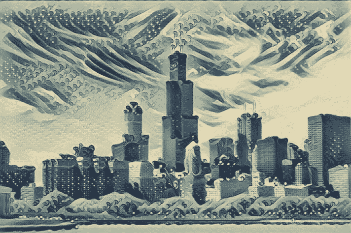
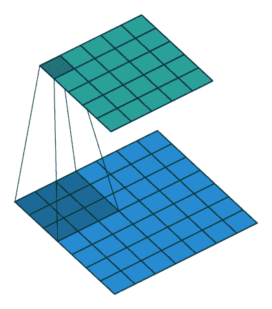
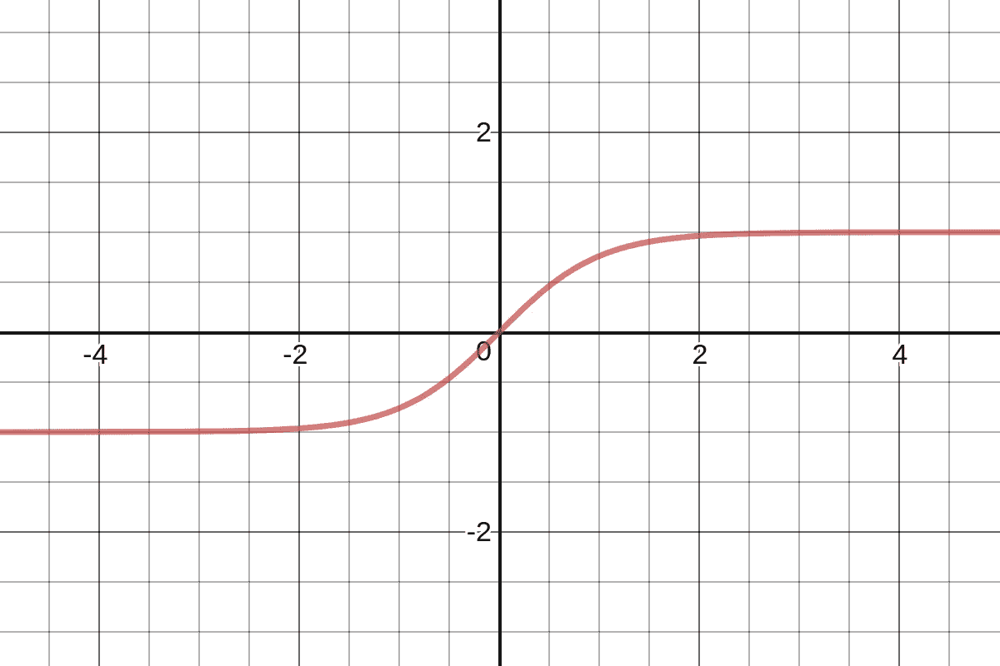
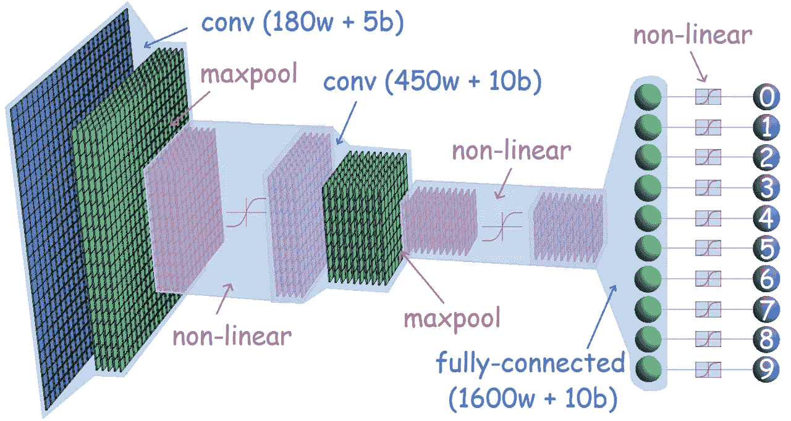
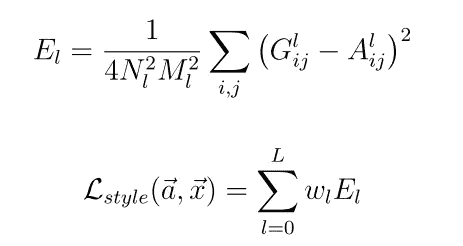
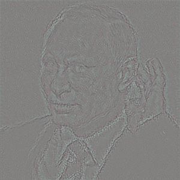
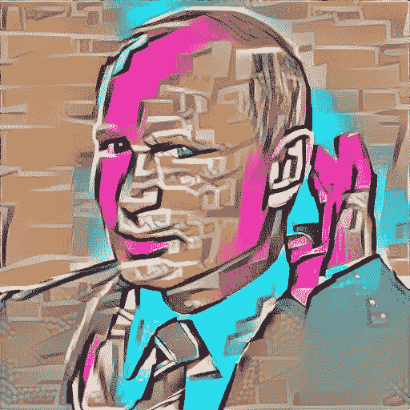
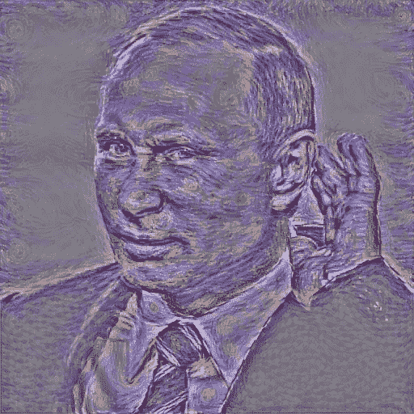
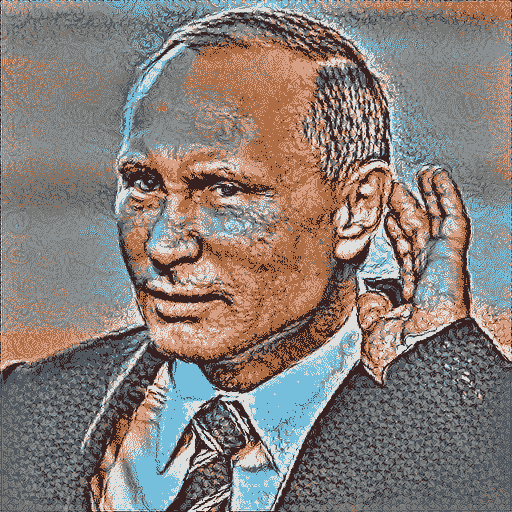

# 神经风格迁移简介

> 原文：<https://towardsdatascience.com/a-brief-introduction-to-neural-style-transfer-d05d0403901d?source=collection_archive---------2----------------------->

2015 年 8 月，一篇名为《艺术风格的神经算法》的论文问世。当时，我刚刚开始深度学习，我试图阅读这篇论文。我不能理解它。所以我放弃了。几个月后，一款名为 Prisma 的应用程序发布了，人们为之疯狂。如果你不知道 Prisma 是什么，它基本上是一个允许你将著名画家的绘画风格应用到自己的照片上的应用程序，并且结果在视觉上相当令人满意。它不同于 Instagram 滤镜，insta gram 滤镜只在色彩空间中对图片进行某种变换。它要复杂得多，结果也更加有趣。这是我在网上找到的一张有趣的照片。

现在，一年后，我学到了很多关于深度学习的知识，我决定再读一遍这篇论文。这次我理解了整篇论文。如果你熟悉深度学习的方法，这实际上是很容易读懂的。在这篇博文中，我主要介绍了我对这篇论文的看法，并试图用更简单的术语向与我一年前处境相同的人(即深度学习领域的初学者)解释神经类型转移。我确信，一旦你看到神经类型转移的结果并理解它是如何工作的，你会对未来的前景和深度神经网络的力量更加兴奋。

基本上，在神经风格转移中，我们有两个图像-风格和内容。我们需要从样式图像中复制样式，并将其应用于内容图像。所谓风格，我们基本上是指图案、笔触等。

为此，我们使用预训练的 VGG-16 网。最初的论文使用 VGG-19 网，但我无法为 TensorFlow 找到 VGG-19 权重，所以我用 VGG-16。实际上，这(使用 VGG-16 而不是 VGG-19)对最终结果没有太大影响。产生的图像是相同的。

那么直观地说，这是如何工作的呢？

为了理解这一点，我将向您介绍一下 ConvNets 是如何工作的。

ConvNets 基于卷积的基本原理工作。比方说，我们有一个图像和一个过滤器。我们在图像上滑动滤波器，将滤波器覆盖的输入的加权和作为输出，通过 sigmoid 或 ReLU 或 tanh 等非线性变换。每个滤波器都有自己的一组权重，在卷积运算期间不会改变。这在下面的 GIF 中有很好的描述

这里，蓝色网格是输入。您可以看到滤波器覆盖的 3x3 区域滑过输入(深蓝色区域)。这种卷积的结果称为特征图，由绿色网格表示。

这是 ReLU 和 tanh 激活函数的图表

ReLU activation function

Tanh activation function

因此，在 ConvNet 中，输入图像与几个滤波器进行卷积，并生成滤波器映射。这些滤波器图然后与一些更多的滤波器卷积，并且产生一些更多的特征图。这一点通过下图得到了很好的说明。

在上图中，您还可以看到术语“最大池”。maxpoollayer 主要用于降维。在最大池操作中，我们简单地在图像上滑动一个大小为 2x2 的窗口，并将窗口覆盖的最大值作为输出。这里有一个例子-

现在这里有一些很酷的东西。仔细观察下图，检查不同图层的特征地图。

你一定注意到了——较低层的贴图寻找低层次的特征，如线条或斑点(gabor 过滤器)。随着我们向更高层发展，我们的功能变得越来越复杂。直观地说，我们可以这样想——较低的层捕捉低层次的特征，如线和斑点，上面的层建立在这些低层次的特征上，并计算稍微复杂的特征，等等…

因此，我们可以得出结论，ConvNets 开发了特征的层次表示。

这个属性是风格转移的基础。

现在记住——在进行风格转换时，我们不是在训练一个神经网络。相反，我们正在做的是——我们从一个由随机像素值组成的空白图像开始，通过改变图像的像素值来优化成本函数。简单地说，我们从空白画布和成本函数开始。然后，我们迭代地修改每个像素，以便最小化我们的成本函数。换句话说，在训练神经网络时，我们更新我们的权重和偏差，但在风格转移中，我们保持权重和偏差不变，而是更新我们的图像。

为了做到这一点，我们的成本函数正确地表示问题是很重要的。成本函数有两项——风格损失项和内容损失项，下面将对这两项进行解释。

# **内容丢失**

这是基于具有相似内容的图像将在网络的较高层中具有相似表示的直觉。

*P^l* 是原始图像的表示， *F^l* 是在层 *l* 的特征图中生成的图像的表示。

# **风格丧失**

这里， *A^l* 是原始图像的表示， *G^l* 是层 *l* 中生成的图像的表示。 *Nl* 是特征地图的数量 *Ml* 是图层 *l* 中展平后的特征地图的大小。 *wl* 是赋予层 *l* 风格损失的权重。

所谓风格，我们基本上是指捕捉笔触和模式。因此，我们主要使用较低层，它捕捉低级特征。这里还要注意 gram 矩阵的使用。一个向量的克矩阵*X***是***X . X _ 转置*。使用 gram matrix 背后的直觉是，我们试图捕捉较低层的统计数据。
不过，你不一定非要使用 Gram 矩阵。一些其他的统计方法(比如均值)已经被尝试过了，而且效果也很好。****

# ****总损失****

****

**其中*α*和*β*分别是内容和风格的权重。它们可以被调整以改变我们的最终结果。**

**所以我们的总损失函数基本上代表了我们的问题——我们需要最终图像的内容与内容图像的内容相似，最终图像的风格也应该与风格图像的风格相似。**

**现在我们要做的就是把这个损失降到最低。我们通过改变网络本身的输入来最小化这种损失。我们基本上从一个空白的灰色画布开始，并开始改变像素值，以尽量减少损失。任何优化器都可以用来最小化这种损失。这里，为了简单起见，我使用了简单的梯度下降。但是人们已经利用亚当和 L-BFGS 在这个任务上取得了相当好的结果。**

**这个过程在下面的 GIF 中可以看得很清楚。**

****

**这是我的一些实验结果。我对这些图像(512x512px)进行了 1000 次迭代，这个过程在我装有 2GB 英伟达 GTX 940MX 的笔记本电脑上花费了大约 25 分钟。如果你在 CPU 上运行它，时间会长得多，但如果你有一个更好的 GPU，时间会短得多。我听说在 GTX 泰坦上 1000 次迭代只需要 2.5 分钟。**

************

**如果你希望获得一些关于卷积神经网络的深入知识，请查看斯坦福 CS231n 课程。**

**这就是你自己的神经类型转移。去吧，实施吧，玩得开心！！
下次见！**

**如果你想了解更多关于神经类型转移及其用例的信息，可以看看 Fritz AI 关于神经类型转移的[优秀博文](https://www.fritz.ai/style-transfer/)。该博客还包含额外的资源和教程，以帮助您开始您的第一个神经风格转移项目。**