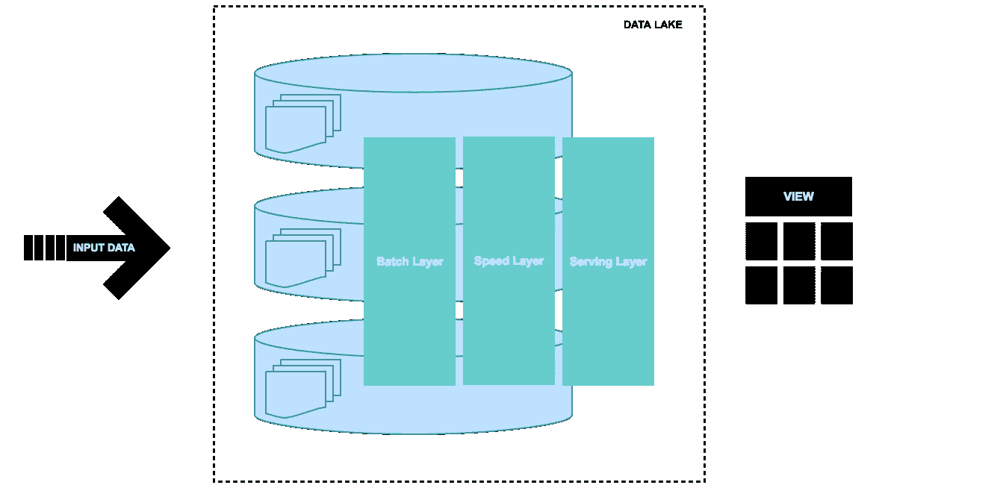
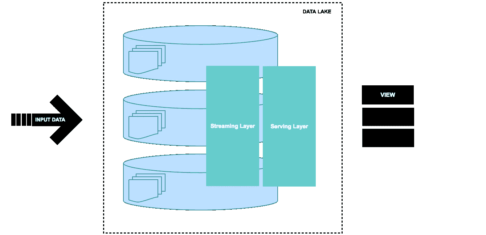

# 两种数据处理架构简介— Lambda 和 Kappa 用于大数据

> 原文：<https://towardsdatascience.com/a-brief-introduction-to-two-data-processing-architectures-lambda-and-kappa-for-big-data-4f35c28005bb?source=collection_archive---------2----------------------->

B ig 数据、物联网(IoT)、机器学习模型和其他各种现代系统正在成为今天不可避免的现实。各行各业的人们已经开始将与数据存储和服务器的交互作为他们日常生活的一部分。因此，我们可以说，以最佳方式处理大数据正成为企业、科学家和个人的主要兴趣领域。例如，为实现某些业务目标而启动的应用程序，如果能够有效地处理客户提出的查询并很好地服务于他们的目的，将会更加成功。这种应用程序需要与数据存储进行交互，在本文中，我们将尝试探索两种重要的数据处理架构，它们是各种企业应用程序(称为 Lambda 和 Kappa)的主干。


社交媒体应用程序、基于云的系统、物联网和无休止的创新热潮的快速增长，使得开发人员或数据科学家在启动、升级企业应用程序或对其进行故障排除时做出精心计算的决策变得非常重要。尽管使用模块化方法来构建应用程序具有多种优势和长期益处，这一点已经被广泛接受和理解，但是对选择正确的数据处理架构的追求仍然在许多与现有和即将出现的企业软件相关的提议前面打上问号。尽管目前全球有各种各样的数据处理架构，但让我们详细研究一下 Lambda 和 Kappa 架构，并找出它们的独特之处，以及在什么情况下应该优先选择哪一种。

## **λ架构**

Lambda 架构是一种数据处理技术，能够以高效的方式处理大量数据。这种体系结构的效率以增加吞吐量、减少延迟和忽略错误的形式变得显而易见。当我们提到数据处理时，我们基本上使用这个术语来表示高吞吐量、低延迟和以接近实时的应用为目标。这也将允许开发者在基于事件的数据处理模型中以代码逻辑或自然语言处理(NLP)的形式定义增量规则，以实现稳健性、自动化和效率，并提高数据质量。此外，数据状态的任何变化对系统来说都是一个事件，事实上，作为对运行中的事件的响应，可以发出命令、查询或期望执行增量过程。

事件源是使用事件进行预测以及实时存储系统中的变化的概念。系统状态的变化、数据库中的更新或事件可以理解为变化。例如，如果有人与网页或社交网络个人资料进行交互，则页面查看、喜欢或添加为好友请求等事件会触发可以处理或丰富的事件，并将数据存储在数据库中。

数据处理处理事件流，大多数遵循领域驱动设计的企业软件使用流处理方法来预测基本模型的更新，并存储不同的事件，作为实时数据系统中预测的来源。为了处理系统中发生的大量事件或增量处理，Lambda 架构通过引入三个不同的层来实现数据处理。Lambda 架构由批处理层、速度层(也称为流层)和服务层组成。

## 1.批量层

新数据源源不断地输入数据系统。在任何情况下，它都被同时输送到配料层和速度层。任何到达数据系统批处理层的新数据流都是在数据湖之上进行计算和处理的。当数据存储在数据湖中时，使用数据库，如内存数据库或长期持久数据库，如基于 NoSQL 的存储 batch layer 使用它来处理数据，使用 MapReduce 或利用机器学习(ML)来预测即将到来的批处理视图。

## 2.速度层(流层)

速度层使用在批处理层完成的事件源的成果。在批处理层中处理的数据流导致更新 delta 过程或 MapReduce 或机器学习模型，流层进一步使用这些模型来处理馈送给它的新数据。速度层提供基础丰富过程的输出，并支持服务层减少响应查询的延迟。顾名思义，速度层具有较低的延迟，因为它只处理实时数据，计算量较小。

## 3.服务层

来自批处理层的批处理视图形式的输出和来自速度层的近实时视图形式的输出被转发到服务层，服务层使用这些数据来满足临时的未决查询。

下面是 Lambda 架构模型的基本示意图:



Lambda Architecture

让我们将其转化为一个函数方程，它定义了大数据领域中的任何查询。这个等式中使用的符号称为 Lambda，Lambda 架构的名称也是从同一个等式中产生的。对于熟悉大数据分析花絮的人来说，这个功能广为人知。

```
Query = λ (Complete data) = λ (live streaming data) * λ (Stored data)
```

该等式意味着，通过在速度层的帮助下以批处理和实时流的形式组合来自历史存储的结果，可以在 Lambda 架构中满足所有与数据相关的查询。

**Lambda 架构的应用**

Lambda 架构可以部署在以下数据处理企业模型中:

*   用户查询需要使用不可变的数据存储在特定的基础上提供服务。
*   需要快速响应，系统应该能够处理新数据流形式的各种更新。
*   不应删除任何存储的记录，并且应允许向数据库添加更新和新数据。

Lambda 架构可以被认为是接近实时的数据处理架构。如上所述，它可以承受故障，并允许可伸缩性。它使用批处理层和流层的功能，并不断向主存储器添加新数据，同时确保现有数据保持不变。Twitter、网飞和雅虎等公司正在使用这种架构来满足服务质量标准。

## Lambda 架构的利弊

## 赞成的意见

*   Lambda 架构的批处理层通过容错分布式存储管理历史数据，即使系统崩溃也能确保低错误率。
*   这是速度和可靠性的良好平衡。
*   容错和可扩展的数据处理体系结构。

## 骗局

*   由于涉及全面的处理，它会导致编码开销。
*   重新处理每个批处理周期，这在某些情况下是无益的。
*   用 Lambda 架构建模的数据很难移植或重组。

## **卡帕建筑**

在 2014 年，Jay Kreps 发起了一场讨论，他指出了 Lambda 架构的一些差异，这些差异进一步将大数据世界引向了另一种替代架构，这种架构使用较少的代码资源，并且能够在某些使用多层 Lambda 架构似乎有些奢侈的企业场景中运行良好。

Kappa 架构不能作为 Lambda 架构的替代品，相反，它应被视为在批处理层的主动性能不需要满足标准服务质量的情况下使用的替代方案。这种体系结构在不同事件的实时处理中有其应用。这是 Kappa 架构的基本示意图，显示了该数据处理架构的两层操作系统。



Kappa Architecture

让我们将 kappa 架构的操作顺序转化为一个函数等式，该等式定义了大数据领域中的任何查询。

```
Query = K (New Data) = K (Live streaming data)
```

这个等式意味着所有的查询都可以通过在速度层对实时数据流应用 kappa 函数来满足。它还表示流处理发生在 kappa 架构中的速度层。

## **卡帕架构的应用**

社交网络应用的一些变体、连接到基于云的监控系统的设备、物联网(IoT)使用优化版本的 Lambda 架构，该架构主要使用速度层与流层相结合的服务来处理数据湖中的数据。

Kappa 架构可以部署在以下数据处理企业模型中:

*   多个数据事件或查询被记录在一个队列中，以迎合分布式文件系统存储或历史。
*   事件和查询的顺序不是预先确定的。流处理平台可以随时与数据库交互。
*   它具有弹性和高可用性，因为系统的每个节点都需要处理数 TB 的存储来支持复制。

上面提到的数据场景是通过耗尽 Apache Kafka 来处理的，Apache Kafka 速度极快，具有容错性和水平可伸缩性。它允许一个更好的机制来管理数据流。对流处理器和数据库的平衡控制使得应用程序能够按照预期执行。Kafka 将有序数据保留更长时间，并通过将它们链接到保留日志的适当位置来满足类似的查询。LinkedIn 和其他一些应用程序使用这种风格的大数据处理，并获得保留大量数据的好处，以满足那些仅仅是彼此副本的查询。

## 卡帕建筑的利与弊

## **优点**

*   Kappa 架构可用于开发在线学习者的数据系统，因此不需要批处理层。
*   只有当代码改变时才需要重新处理。
*   它可以使用固定内存进行部署。
*   它可以用于水平可伸缩的系统。
*   由于机器学习是在实时基础上进行的，因此需要的资源更少。

## **缺点**

缺少批处理层可能会导致数据处理过程中或更新数据库时出错，这需要使用异常管理器来重新处理数据或进行协调。

## **结论**

简而言之，在 Lambda 和 Kappa 架构之间的选择似乎是一种权衡。如果您寻求一种在更新数据湖方面更可靠，以及在设计机器学习模型以稳健的方式预测即将发生的事件方面更有效的架构，您应该使用 Lambda 架构，因为它获得了批处理层和速度层的优势，以确保更少的错误和速度。另一方面，如果您希望通过使用较便宜的硬件来部署大数据架构，并要求它有效地处理运行时发生的独特事件，则选择 Kappa 架构来满足您的实时数据处理需求。