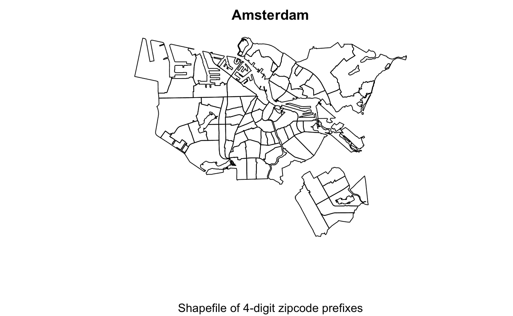
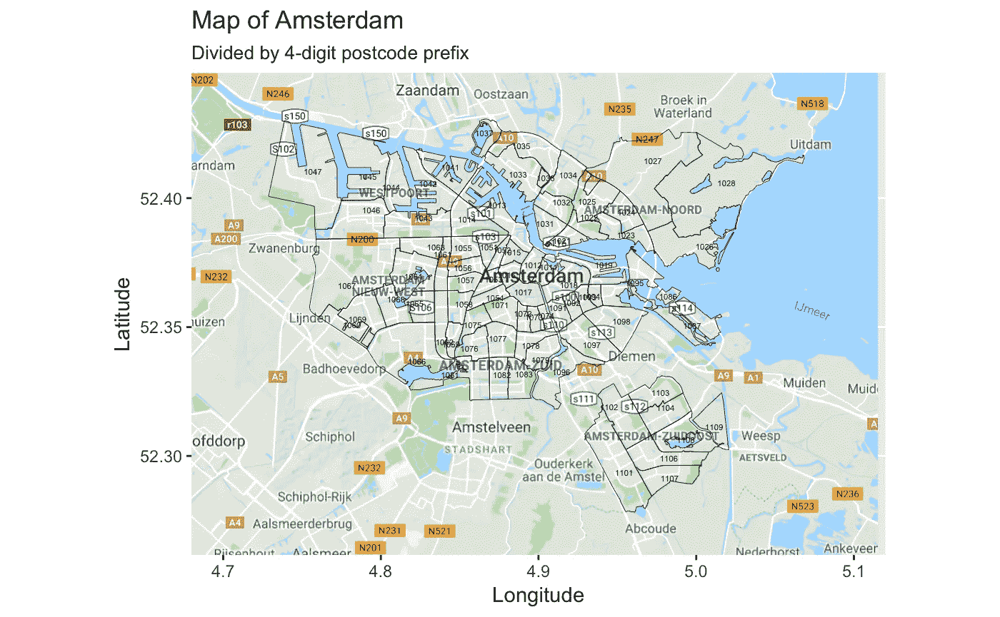
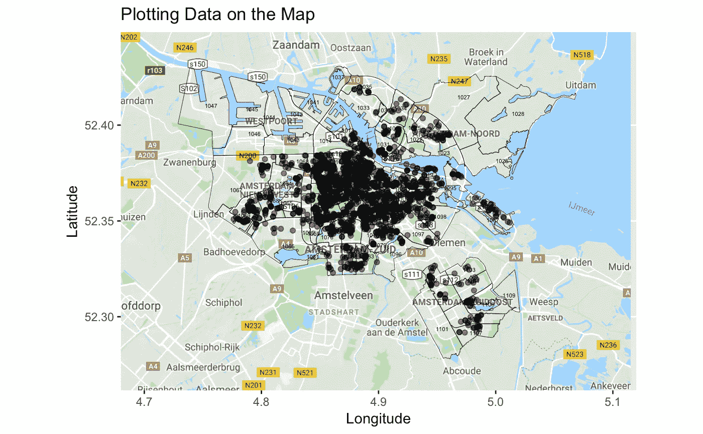
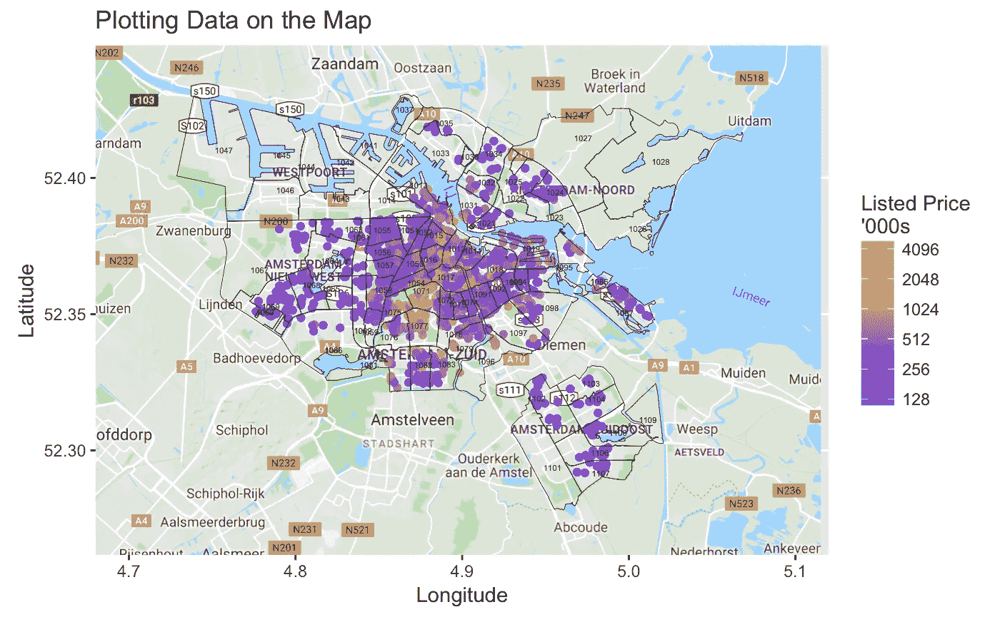
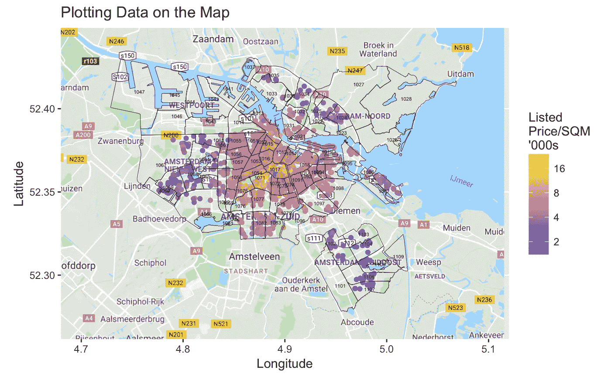
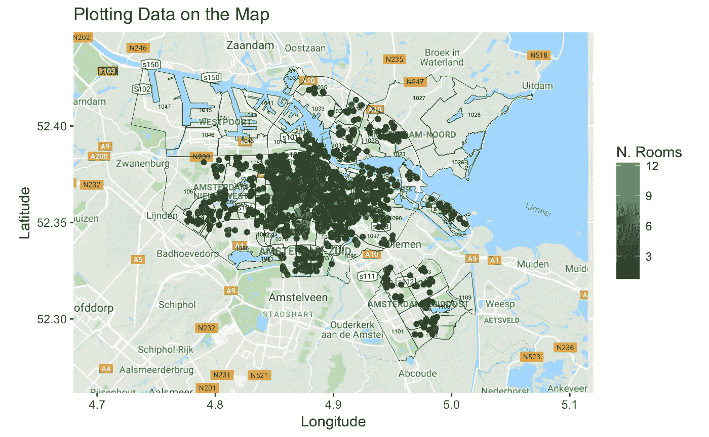
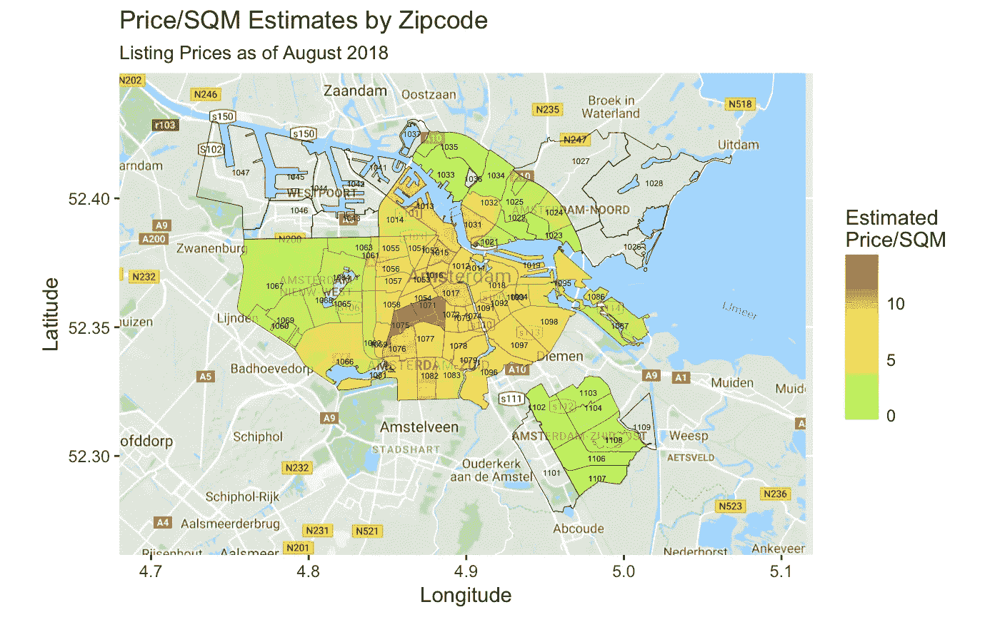
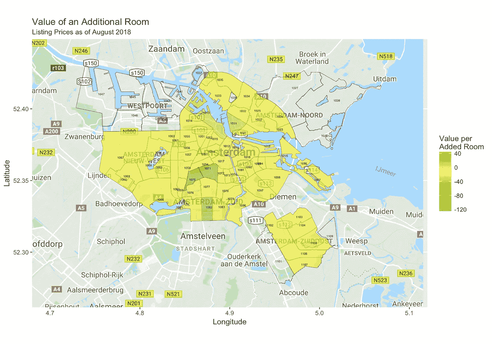
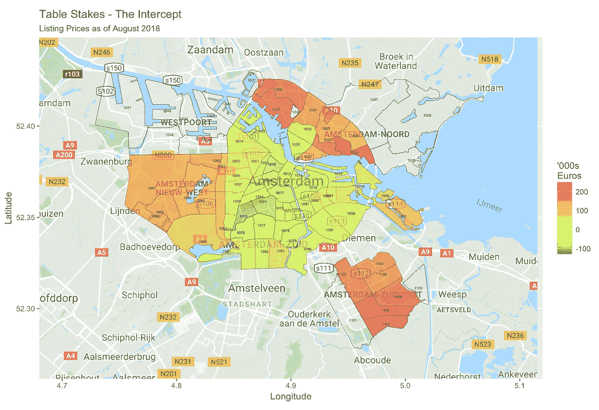
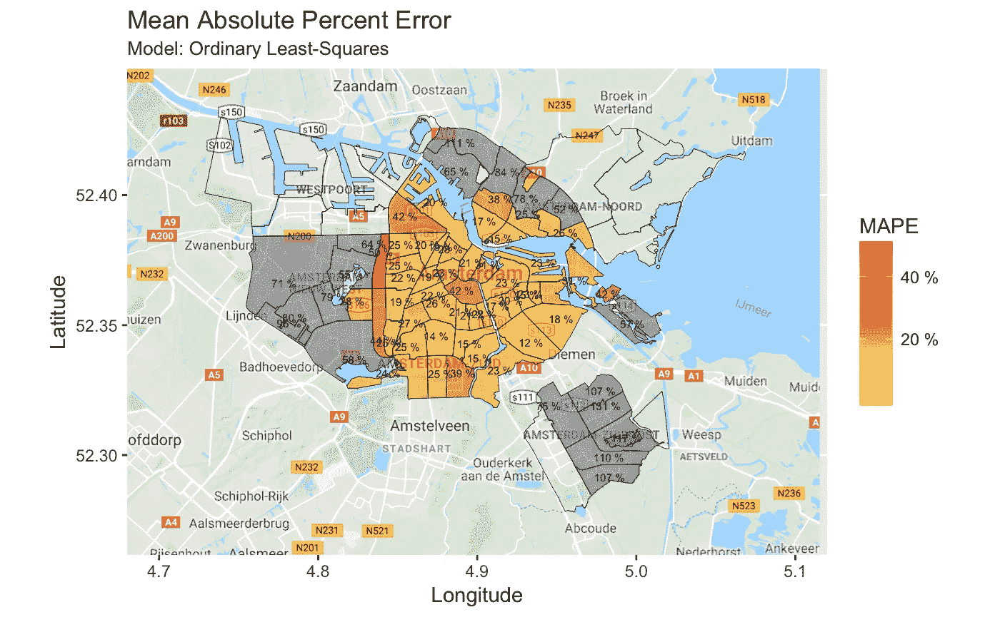

# 阿姆斯特丹住宅的地图探索

> 原文：<https://towardsdatascience.com/a-cartographic-exploration-of-housing-in-amsterdam-aa2573be41eb?source=collection_archive---------14----------------------->

上周，我花了一些时间研究我从网上获得的房价数据，并在这个系列的第一篇文章中得到了一些非常好的反馈。我收到的最常见的请求之一是给这些数字中的故事添加一些背景。如果用我们都熟悉的术语来表述，就更容易理解了，所以在地图上标出我的发现似乎是合理的下一步。

# 制作地图

这就是阿姆斯特丹市的样子，如果你把除了邮政编码之间的界限之外的一切都剥开的话:

市政府做得非常好，为各种各样的用例提供了这样的公开数据。如果你好奇，我*强烈推荐*去[看看](https://maps.amsterdam.nl/open_geodata/)他们能提供什么。将你在他们网站上找到的数据与一些更熟悉的谷歌地图结合起来，会产生一幅更清晰的画面:

# 地理编码

有一些免费的方法可以将地址转换成纬度和经度。我的首选方法是使用 R 和 Google Maps API，它们免费提供给像我这样的爱好者。你每天只能编码 2500 个地址，否则就要付出代价了。幸运的是，我们的数据只有 1800 行——没问题。这就是我们的房子在地图上的样子。

它看起来并不特别令人兴奋，所以让我们通过*询问价格*来着色，作为简单的第一步:

这并没有告诉我们太多，因为整个城市的房子都很贵。我们可以看到，在冯德尔公园附近的市中心可能会有一些非常昂贵的房子，但除此之外，我们真的没有看到任何重大的主题出现。如果我们看看每个人最喜欢的指标— *价格/平方米—* 看看是否有更清晰的画面出现，会发生什么？

有趣的是，同样一群非常昂贵的房子再次出现，但这次我们看到市中心的大片区域也变得更加明亮。这些住宅大多位于老城区的中环，以及离冯德尔公园最近的地方。这是有道理的，因为城市中更令人向往和更有历史意义的部分，无论大小，购买起来都会更贵。

但是这种每平方米价格的差异能解释我们的亮点和镇上其他地方的差异吗？也许另一个原因是这些房子的面积更大？我们通过标绘每处房产的房间数量来找出答案。我们再次看到了同一个亮点，就在冯德尔公园的南边:

从这三幅图中我们可以得出结论，城市的昂贵部分也是我们发现最大的房屋(按房间数)和每平方米最高标价的地方。它还强调了为什么我们选择使用房间的大小*和数量*来预测我们模型中的价格。太棒了。

# 系数

我们关心系数，因为它们告诉我们预测者和价格之间的关系。我们已经知道价格随地理位置而变化，所以让我们在我们的模型中画出地理位置的变化。混合效应模型为我们提供了每个邮政编码的不同估计值，因此我们可以对邻近地区进行相互比较。对于每一个，我们得到固定效应和随机效应的混合，得到我们的模型系数(b1、b2 和截距)如下:

> 价格= b1 *平方米+B2 *房间+截距

首先，让我们看看每平方米价格的系数(b1):

与我们之前看到的点状图一致，看起来 1075 和 1071 邮政编码是阿姆斯特丹最贵的地区。镇上这一带的房子令人印象深刻，而且非常昂贵。同样，约旦和哈勒默布尔特的面积每平方米也很贵。这是明信片照片拍摄的地方，弯曲的老房子排列在运河两岸。城镇的郊区描绘了一幅不同的画面，最低的价格出现在 zuidoost 和 noord 地区。镇上的这些地方比较新，游客较少，因此价格也更实惠。

然而，在考察额外房间(b2)的价值时，我们看到了一个有趣的模式:

房间数量的增加会导致房屋成本的增加，但这只是在某些地方。我们之前看到的同样昂贵的邮政编码实际上对于房间变量有一个*负(绿色)*系数。在其他条件不变的情况下，一个额外的房间似乎会降低这些地区的房屋价值*。*

为什么会这样？一种可能的解释是，城市的昂贵地段被高档人士占据，而这些高档人士更喜欢在他们的家中拥有更大、更高档的房间。想象两个相同的 200 平方米的房产，一个有 7 个房间，一个有 8 个房间。根据定义，有 8 个房间的酒店必须有较小的房间。对这些地区来说，越大似乎越好。

另一方面，市中心亮起了黄橙色的灯光，在这里，给一栋 100 平方米的房子增加一个额外的房间可能会使其挂牌价格增加多达 4 万欧元。这可能有很多原因，但我认为这可能是由于旅游业。城市的这一部分是每个游客都想去的地方，而找到安置这些人的地方是很昂贵的。也许能在一个小空间里容纳很多人是件好事？

在考虑房间数量和增加的平方米空间的价值后，截距就是我们加到最后得到的总标价。当它是正数时，我们可以假设任何大小的房子对一个潜在的买家来说都是有价值的。相反，负截距意味着价格/平方米和房间必须*抵消*足以弥补它。在这种情况下，我们看到城市的边缘都有大约 10 万欧元或以上的截距。这弥补了模型估计的每平方米价值要低得多的事实。

另一方面，城市的昂贵部分有负截距。为了克服这一点，房子必须更大，并有更高的*平方米*系数。这与我们之前绘制房屋图时看到的一致。

# 关于模型性能的说明:

在上一篇文章中，我们建立了不同变量之间的关系，并开始对阿姆斯特丹的住房状况有了更全面的了解。

我们已经可以说明不同的社区如何可以获得非常不同的价格，并表明它是房子的大小和地理位置的函数。这个项目中使用的混合效果模型非常有用，因为它们允许我们的模型在接近现实的方式上具有灵活性。凭借他们的设计，我们可以在每个邮政编码中获得量身定制的估计，同时仍然可以建立一个模型来解释我们在整个城市中的信息。

为了说明这一点，我生成了一些图表，根据它们在预测中产生的误差量进行了颜色编码。回想一下，*普通最小二乘法* (OLS)模型没有考虑任何关于住宅位置(邮政编码)的信息，并且假设大小和房间的重要性在整个城市是一致的。我们知道这是一个天真的假设，我们可以看到模型的表现有多差。平均绝对百分比误差*(MAPE)到处都是，从大约 10%到超过 130%不等。*

**

*Gray areas indicate zip codes where MAPE exceeds 50%*

*很明显，该模型已经学会将其预测建立在它所看到的大部分房屋的基础上，这些房屋大多位于市中心。这最终真的损害了它对城镇边缘房屋的预测的可靠性。没有阴影的区域不在我们的数据中，所以我们不能估计它们的误差。*

*然而，如果我们假设每一个邻域都是不同的，并允许模型有一点弹性，它会对自己的预测更有信心。当我们以与之前相同的方式绘制误差时，模型的改进是显而易见的:*

**

*值得一提的是，这些模型都不是为了预测目的，也没有针对维持集进行验证。因此，它们更适合分析系数，而不是进行预测或预报。任何对建立这样一个模型感兴趣的人都应该根据地面事实对其进行适当的交叉验证。然而，我认为这是这种方法的灵活性和可解释性的一个有趣的例子。*

# *展望未来:*

*我不太确定接下来该何去何从。我肯定会继续在阿姆斯特丹寻找一个家。我爱这座城市，也爱住在这里的人们。挑战仍然是找到这里房产的实际销售价格。在此之前，我可能会继续向模型中添加一些其他公开可用的数据，以尝试提高性能。\_(ツ)_/*

*目前，我已经将我的 scraper 代码的大部分放在了一个 [github](https://github.com/mtoconnor3/funda) 库中，供任何好奇的人自己尝试。很丑，但是很管用。这篇文章还涉及了相当多的 r 处理和绘图工作。如果我有时间让这些脚本更易读的话，我会试着把它们也放在那里。*