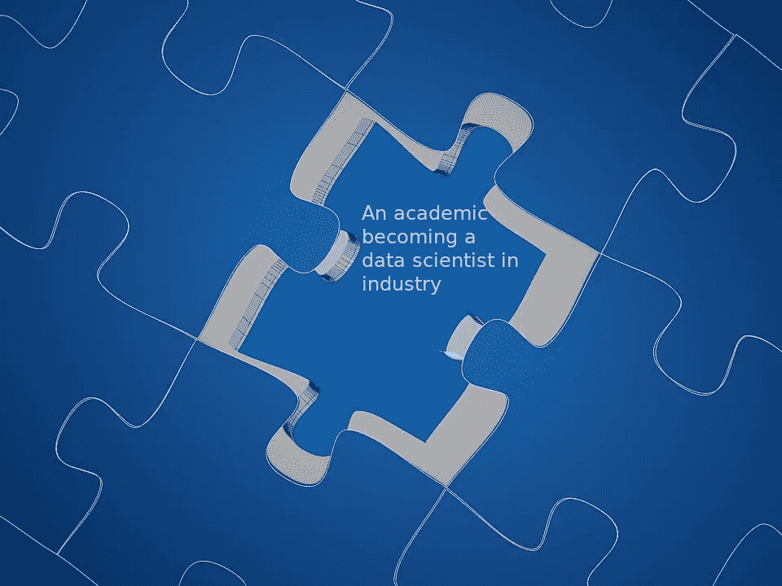

# 学者成为数据科学家的案例

> 原文：<https://towardsdatascience.com/a-case-for-academics-becoming-data-scientists-821e83ea1284?source=collection_archive---------14----------------------->

今年早些时候，我离开了学术界，仅仅过了一个周末，我就从终身助理教授变成了一名数据科学家。不，那不是因为我讨厌学术界。我喜欢它，并在那种环境中茁壮成长。我职业的改变是由于在两个国家之间的移动。像几个已经完成或想要完成这一转变的人一样，我也有疑问。我很担心。Medium 和 LinkedIn 福音书宣称“学者还没有为行业做好准备”或“我不会为数据科学职位雇用学者，原因如下”这让我既愤怒又害怕(相信我，有几篇这样的帖子！).

然而，在成为软件行业的数据科学家几个月后，我实际上得出了一个不同的结论。

I think academics actually fit well in the industry!

是的，我说的是学术界人士(即在学术界工作的人。不是学生)正好可以“融入”行业工作。由于有太多对学者及其技能的曲解(通常来自从未做过学者的人)，我想我应该提出一些观点，说明为什么我认为学者很容易适合行业数据科学职位。这篇文章就是关于这个的。

在我开始之前，有三个免责声明:

*   我的观察是专门针对来自科学和工程背景的学者的，他们精通计算机编程，通常要么刚刚完成博士学位，要么在他们的博士后职业生涯中(博士后、助理教授及以上)希望转向软件/技术行业的数据科学工作。
*   我说的是一种可能性——所以，我并不是在宣扬所有的学者都应该被雇佣，因为他们自动适合。
*   我写的不是一份经过充分研究的报告。我正在写下星期五晚上我的想法。

让我从陈述显而易见的事情开始。学术界和工业界是有区别的**。**我将选择与我的帖子最相关的两个:

*   工业界所做的研究专注于开发一个可以被其他人部署和使用的解决方案，然后数据科学家继续解决下一个问题。在学术界，我们通常会花几个月甚至几年的时间来逐步优化同一个问题，并创造出越来越多新颖的解决方案。**也就是说，关注点和激励结构是不同的——这并不意味着那些做增量优化的人不能为未来的产品做快速的原型开发或者为整个项目生命周期做贡献。**
*   良好的工程实践、编写干净的代码、林挺代码、版本控制等在学术环境中并不被重视。然而，这也取决于教授/研究小组负责人，我认为这正在发生变化(至少在我密切关注的研究领域——NLP、机器学习等)。例如，看看 Allen NLP 团队关于如何按照良好实践编写研究代码的这个演示。此外，我认为如果一个人在其他方面技术上适合某个角色，这些是很容易获得的。

(好吧，还有很多其他的差异，比如钱。但我必须在某个地方停下来)。

在我看来，这些都不是不可逾越的分歧。他们存在只是因为他们是两种不同的职业。这不像从外科医生变成房地产顾问。这就像在 It 工作的不同领域之间移动(举个极端的例子，从银行业到消费电子)。人类是地球上适应性最强的生物。如果我们愿意在人工智能(AGI)上下赌注，而不愿意面试一位自己申请了一个行业职位的学者——那我们的大脑肯定有线路功能障碍。在简历筛选或面试后，你可能会认为学术简历不合适，但我们看到的 90%的非学术简历也是如此！如果 100 个人申请一份工作，其中可能有 10 个学者。假设我们最终做了一个 15 人的电话筛选(仍然很多)。这意味着，有太多的非学术简历不符合了！

**我认为学术界非常适合这个行业的三个原因:**

*   **快速学习新的概念/想法并适应它**:学术研究(不管是好是坏)只奖励站在前沿的人。如果一个新的想法出现了，在下一次大型会议/杂志上就会有 100 个跟进的想法出现。这就是他们的运作方式。因此，如果你是一名学者，你必须在很少或没有监督的情况下快速学习和开展工作。本质上，你被训练快速学习新东西。这在进行快速原型制作、从一个问题转移到另一个问题、比较和评估技术状态以及开发满足需求的解决方案的行业中非常方便。
*   组织和时间管理:博士主要是一项孤独的练习。获得博士学位后，在学术工作中，你通常会在多个项目之间周旋，而且很多时候，会有多项教学任务。你在工作中可以做许多不同类型的活动(见 [Philip Guo 关于这个话题的精彩文章](http://www.pgbovine.net/time-management.htm))。这会让你在时间管理上变得有条理和有效率。因此，即使你从未听说过 trello 或敏捷或 scrum 或其他什么，你也可能需要 1-2 个小时来理解并转向这些东西！
*   **领导力**:通常情况下，如果你是博士后，你将不得不自己做很多事情，同时，你可能会被要求指导年轻的学生，教学，寻求资金等。如果你是一名助理教授，你可以做所有这些事情，但是可能会有更多的自主权。作为一名独立的学术研究者(在美国，我就是其中之一)就像维持一个小规模的创业公司。你应该寻找资金，完成工作，雇佣研究助理，指导学生，建立团队等等。如果你还在读博后的前 5 年，研究管理和行政职责不会完全吞噬你。所以，你还是要做很多实际工作。当你开始在这个行业工作时，所有这些基本上使你已经是一个有经验的工人了。所有这些领导技能也会转移。如果所有这些工作描述对你来说听起来不可思议，那么请看这篇关于教授工作生活的文章，以及他的关于成为教授的经济学的文章，作者是菲利普·郭。因此，一名被聘为数据科学家的学者甚至在加入之前就已经超越了“初级”角色！

**福音书作者认为学术不适合的典型原因**(以及为什么我认为这只是自信的无知):

*   *声明:他们不知道现实世界在发生什么(*我的评论:学者如果不跟随外界，真的无法在学术界生存！)
*   *声称:他们没有任何实践经验*(我的评论:正如我之前提到的，大多数博士后学者在日常生活中做大量的实践工作+其他“高级”工作，如指导、管理、规划等。所以，正如我之前提到的，如果你雇佣了一个学者，你实际上得到了一个奖金！)
*   *声称:他们不知道如何遵循良好的软件工程实践*(我的评论:这不是火箭科学！如果他们还不知道，他们将在工作中获得知识！)
*   *声明:他们倾向于花数年时间解决同一个问题*(我的评论:这是他们的工作性质，不是他们的天性！！)
*   *声称:聪明人就是进不了学术界。他们“工作”。*(我的评论:嗯，实际上我认为转行后我找到了更好的工作生活平衡)。

**所以，*我认为有很多错误的信息在传播——一个相当聪明、勤奋、有组织、努力工作的学者没什么好担心的，只要他们不失去自信并愿意适应*。我相信这是数据科学工作的好时机，尽管有这些反对者，但学者可以成为软件工程团队中优秀的数据科学家。**

当然，该说的都说了，该做的都做了——我说的只有在以下情况下才成立:

*   这位学者以一种潜在的面试官能很快理解的方式展示自己
*   这位学者确实符合这项工作的要求
*   他们愿意随着工作的性质而改变
*   他们一般都有成功的欲望。

在过去的几个月里，我喜欢我正在做的工作，以及工作环境。我试图让自己融入当地的数据科学家和研究人员社区，并开始为更多初级数据科学家提供指导。我确实怀念教学、学术研究的乐趣以及从事跨学科项目的工作。但到目前为止，我喜欢做一名数据科学家。

更新:我没有提到另一个重要因素——一个好的雇主和他们提供的工作环境。我不应该错过它——但是，正如 LinkedIn 评论中正确指出的那样，它在我迅速适应行业和对成为数据科学家的总体积极感觉中发挥了重要作用！

由于这篇文章已经很长了，我不想触及我认为学者在申请数据科学家职位和准备面试时需要做的工作(想起来了，任何人！不仅仅是学术！)，有哪些属于“数据科学家”头衔的工作等等。我会试着写一篇关于这个的文章。感谢你能活到现在！