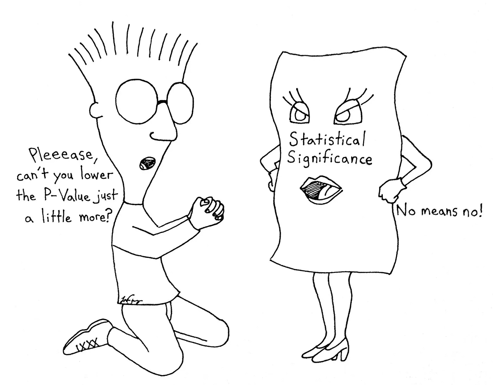
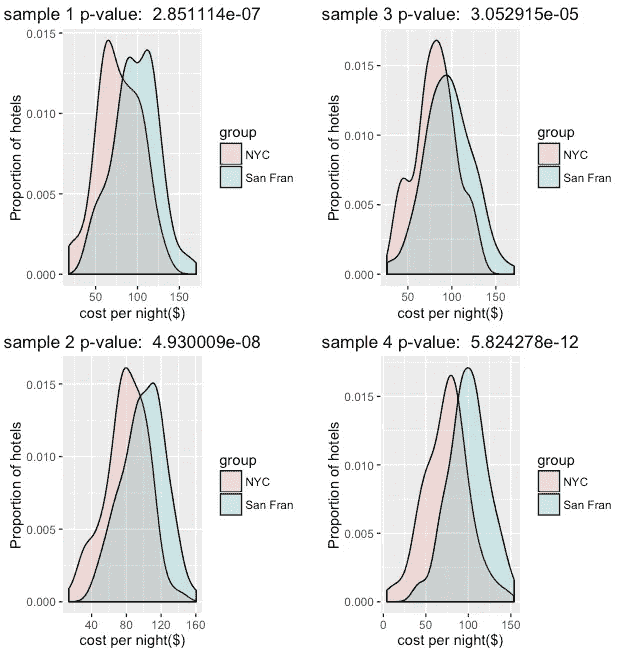
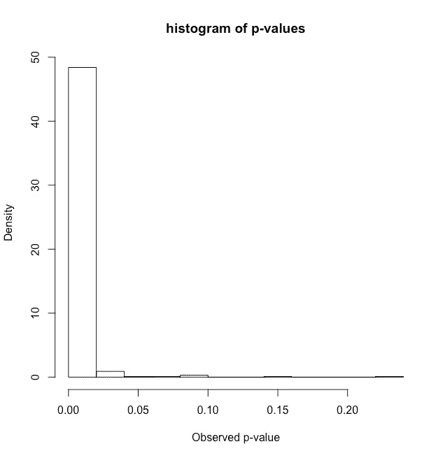
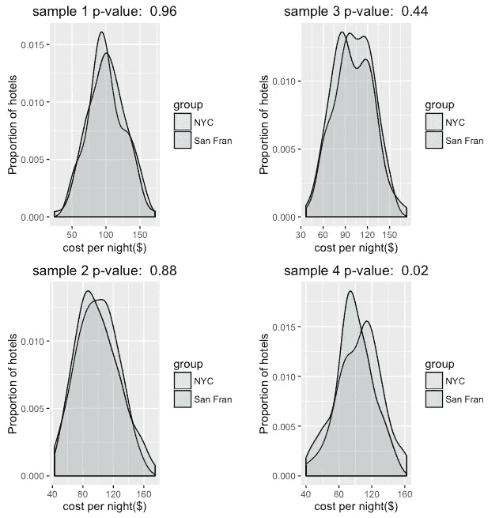
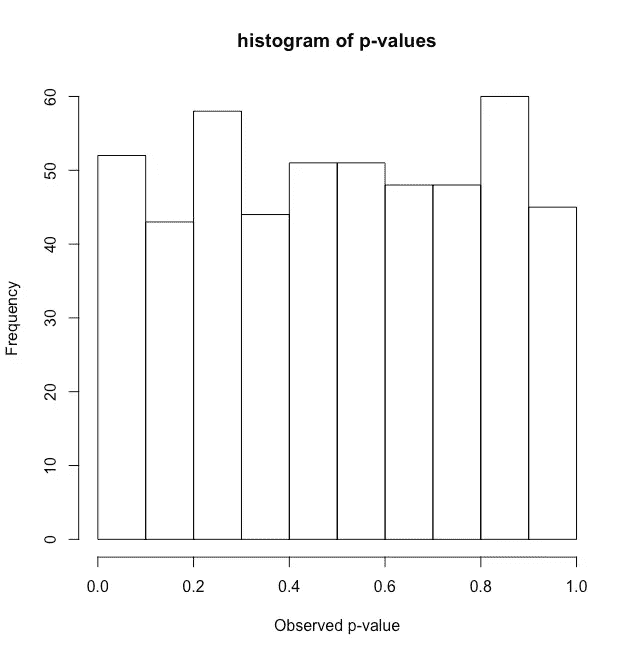

# p 值的问题是

> 原文：<https://towardsdatascience.com/a-case-study-of-the-p-value-f0d708861334?source=collection_archive---------3----------------------->

[http://1.bp.blogspot.com/-m1ucuiGYiw0/UNaULkQ0IYI/AAAAAAAAARk/OTDIBDI7Ydo/s1600/photo+(2).JPG](http://1.bp.blogspot.com/-m1ucuiGYiw0/UNaULkQ0IYI/AAAAAAAAARk/OTDIBDI7Ydo/s1600/photo+(2).JPG)

像大多数人一样，我曾经认为统计学是我应该尽量避免的一种瘟疫。然而，我作为一名医学研究人员的时间改变了我的观点，因为我意识到准确的统计数据在做出可靠和可重复的结论时是多么重要。幸运的是，我接触了一位教授，他改变了我对 p 值的看法。他这样做是向我展示了它是如何误导人的，我希望与你分享。

让我们考虑一下[学生的 t 检验](https://en.wikipedia.org/wiki/Student%27s_t-test)，这是一个决定两组数据是否不同的程序。例如，一家公司可能想知道他们的产品是男性还是女性购买的多，一位医生想知道他们的病人在接受治疗后是否改善了症状，或者一群朋友正在计划他们的下一次度假，并想知道纽约市或旧金山的酒店价格是否更高。

让我们考虑一下最后一个例子。我们的**假设**是**酒店价格和我们去的城市有关系。**我们的**无效假设**是酒店的价格和它所在的城市没有关系**。假设该数据遵循正态分布，让我们模拟一些数据。我们假设四个最好的朋友统计了旧金山 100 家酒店的每晚价格，发现平均价格为 100 美元，变动幅度为+/-25 美元(n=100，u=100，sd=25)。**

这四个朋友在直方图中绘制了结果分布，并覆盖了密度图。请注意，每位朋友都观察到了不同的酒店价格分布，这取决于他们查看的酒店。也许朋友 2 的品味更昂贵，而朋友 4 更节俭。然而，当我们比较两个分布时，考虑这对 p 值意味着什么是很重要的？

假设这四个最好的朋友对纽约市的酒店重复了这一过程，并试图通过完成 t 检验来确定哪个城市的酒店更贵。有两种情况会发生。案例 1:两个城市的酒店价格不同或者案例 2:没有区别。

对于**案例 1，**假设朋友们收集了纽约 100 家酒店的数据，发现他们平均每晚花费 80 美元，标准差为 25 美元。完成学生的 t 检验并计算 p 值，朋友们比较他们的发现。

考虑到他们极小的 p 值，四个朋友都认为纽约 **的**酒店比旧金山便宜。重要的是，所有四个朋友根据他们收集的数据得到了不同的 p 值。**假设这些朋友真的很受欢迎，并且有 500 个额外的朋友计划加入他们的旅行。**

如果他们都完成了这个分析并记录了他们的 p 值，我们可以预期在左边看到的 p 值分布。尽管我们通常会得到低于 0.05 阈值的 p 值，但也有朋友得到高于 0.05 的 p 值的时候。在这种情况下，这位朋友会得出结论，酒店价格之间没有差异，即使有差异。令人震惊！

更令人担忧的是，让我们来看看**案例 2** ，数据显示**纽约和旧金山的酒店价格没有差别**。

在这里，四个朋友中有三个会认为酒店价格没有差别。然而，第四个朋友得到的 p 值低于 0.05，他会认为有差别，尽管实际上没有差别。谁知道呢？也许这会引起一场大的争吵，他们也不会再是朋友了…这真让人难过。

在这三个朋友与第四个朋友解除好友关系之前，他们决定咨询另外 500 个朋友，比较他们的 p 值。

他们**震惊**地发现，当酒店价格没有差异时， **p 值实际上是随机的！**虽然大多数朋友会得出相同的结论，但有一组人会得出结论认为存在差异……尽管实际上并没有差异。

回想一下，p 值的正确解释是

> **假设空值为真，p 值量化了在当前观察点或超出当前观察点看到数据点的概率**。

基本上，您可以计算出您预期数据位置的 95%置信区间。如果您观察到一个超出这些界限的值，这是意料之外的，因为它在数据的最大 5%之内，并且支持您的零假设。如果您希望对变化更加宽容，您可以计算 97.5%的置信区间，并且只允许 p 值为 0.025 的观察值不同意您的假设。对抗变化无常的 p 值的最好方法是增加你重复的次数，看看你的 p 值是上下波动还是一直保持在低位。[这里](https://marcon-laforet.shinyapps.io/P-value_Distribution_T-test/)我编写了一个交互式可视化程序，允许您更改两个分布的参数，并查看最终的 p 值分布。如果你想阅读更多，我推荐这篇[论文](https://www.nature.com/articles/nmeth.3288)。重新生成它的代码可以在[这个](https://github.com/mlafore3/the_problem_with_p_values)库中找到。

[https://pixabay.com/en/crowd-lego-staff-choice-selector-1699137/](https://pixabay.com/en/crowd-lego-staff-choice-selector-1699137/)