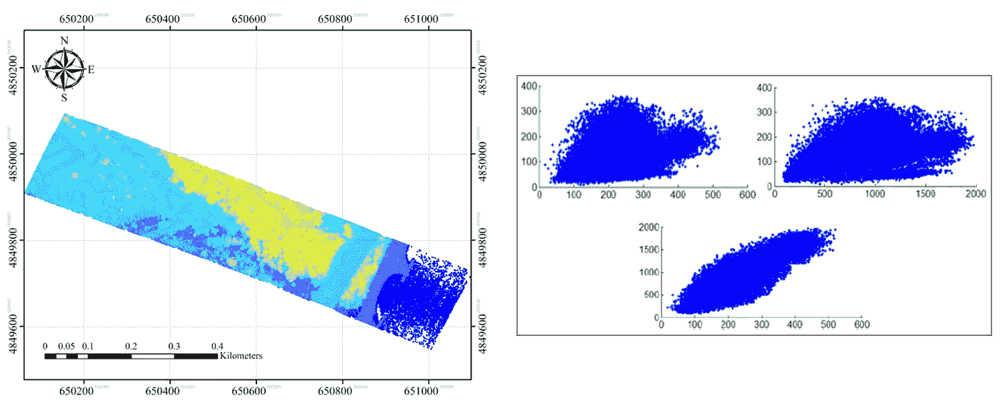
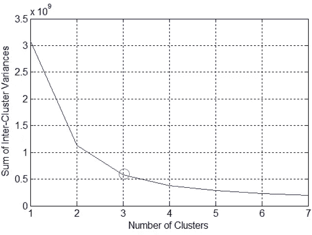

# 多光谱激光雷达数据聚类的 K-Means 和 EM 方法比较

> 原文：<https://towardsdatascience.com/a-comparison-between-k-means-clustering-and-expectation-maximization-estimation-for-clustering-8c75a1193eb7?source=collection_archive---------2----------------------->

多年来，已经开发了几种类型的聚类算法。这些算法通常分为 4 个子类别(分割算法、分层算法、密度算法和基于模型的算法)。分割算法是最常用的算法，因为它们简单而直观。分区算法将数据分成几个分区，并根据某种标准对它们进行评估。相比之下，基于模型的算法为数据集中的每个分类假设一个统计模型，条件是假设的模型最适合该分类。作为对激光雷达数据进行分类的研究项目的一部分，我研究了用于树种分类的分区算法和基于模型的聚类算法之间的异同。我使用 K-means 和期望最大化估计作为上面两个类别的样本算法。这篇博文将会用一些很酷的视觉效果总结我的发现，但是如果你对更多的技术细节感兴趣，你可以在这里找到完整的调查。

# k 均值

K-means 聚类可能是大多数人在开始机器学习课程时遇到的第一个无监督学习算法之一。它易于使用和直观。然而，如果我们沉迷于 K-means 背后的概率理论，很明显，该算法对数据的分布做出了非常一般的假设。K-means 算法试图在聚类间方差之和最小化的优化标准下检测数据集中的聚类。因此，K-均值聚类算法产生数据中已识别聚类状态的最小方差估计(MVE)。

该算法背后的直觉在于，平均而言，从聚类质心(𝜇𝑘)到聚类内的元素的距离在所有识别的聚类中应该是均匀的(这是我们稍后将看到的缺点)。尽管该方法在检测同质聚类时工作良好，但是由于其优化函数中固有的关于聚类的球形性质的简单假设(即，它假设所有聚类具有相等的协方差矩阵)，该方法不可避免地存在缺点。

# 期望最大化估计

期望最大化(EM)是另一种流行的聚类算法，尽管有点复杂，它依赖于最大化可能性来找到数据集中底层子群体的统计参数。我不会深入 EM 背后的概率理论。如果你有兴趣，你可以在这里阅读更多[。但是简单总结一下，EM 算法在两个步骤(E 步骤和 M 步骤)之间交替。在 E 步骤中，该算法试图使用统计参数的当前估计来找到原始似然性的下限函数。在 M 步骤中，该算法通过最大化下限函数(即确定统计参数的 MLE)来寻找这些统计参数的新估计。因为在每一步我们最大化下界函数，所以该算法总是产生比前一次迭代更高可能性的估计，并最终收敛到最大值。](https://www.researchgate.net/project/ITC-Delineation-Multispectral-LiDAR/update/5b6dbc4d3843b00244054a40)

那么是什么让 EM 比 K-means 更特别呢？与 K-means 不同，在 EM 中，聚类不限于球形。在 EM 中，我们可以约束算法以提供不同的协方差矩阵(球形、对角线和通用)。这些不同的协方差矩阵反过来允许我们控制聚类的形状，因此我们可以检测数据中具有不同特征的子群体。

*Cluster Analysis: Original Data (left), k-means (middle), EM (right) (Illustration by Chire)*

您可能已经注意到，在上图中，数据包含异常值，显示为黄色点。这两种算法都没有检测异常值的能力，因此我们必须对数据进行预处理，以减轻检测到的聚类中的异常值的影响。尤其是 EM，由于对协方差矩阵没有约束，因此它往往对异常值的存在很敏感。

# 泰坦激光雷达数据集

现在我们对 EM 的工作有了一些基本的了解，我们可以谈谈一些结果了。我从 Optech 的 Titan 传感器获得了一个多光谱激光雷达数据集，它有 3 个通道(532 纳米，1064 纳米和 1550 纳米)。该数据集是在多伦多斯卡伯勒上空收集的，飞行高度为 1500 米。为了对树种进行分类，我使用阈值技术对数据进行了预处理，去除了所有非树木覆盖类型。

*LiDAR scan (Right Image) Titan multispectral LiDAR intensity data plotted in the spectral domain (Top Left: 1550 nm spectral band on the Vertical-Axis vs. 532 nm spectral band on the Horizontal-Axis, Top Right: 1550 nm spectral band on the Vertical-Axis vs. 1064 nm spectral band on the Horizontal-Axis, Bottom: 1064 nm spectral band on the Vertical-Axis vs. 532 nm spectral band on the Horizontal-Axis).*

数据集还包含异常值，这些异常值在预处理阶段被删除。因为我已经实现了 K-means，所以我使用离群点去除聚类(ORC)方法从数据集中过滤离群点。

# **集群**

使用上述 3 个光谱特征中的数据，我初步确定了数据集中的最佳聚类数。分区和基于模型的算法有一个主要缺点，即数据集内的聚类数需要由用户提供(基于密度的算法没有这个问题，但是需要指定其他阈值)。为了确定最佳的集群数量，我对一系列集群运行了 k-means 算法，并记录了每个分区的*误差平方和(SSE)* 。

*Inter Cluster Variance for different number of clusters determined using k-means clustering. The red circle indicates the optimal number of clusters for the dataset.*

然后，我使用图的渐近性质来挑选数据集中的最佳聚类数(这是基于我的主观解释，但是我发现 *SSE* 在 3 个聚类之后表现得相当渐近)。

我运行了 k-means 和 EM 算法的不同变体来获得以下聚类。对于 EM 算法，我主要关注协方差矩阵的三种配置(球形、对角线和完全填充(或通用))。

*K-means (Left) vs EM with Spherical Covariance Matrix (Right)*

*EM with Generic Covariance Matrix (Left) vs EM with Diagonal Covariance Matrix (Right)*

我发现 k-means 的结果最接近 EM 算法的球形变体，这正是我们所期望的。EM 的对角线变体允许每个聚类具有不同的大小，而通用协方差矩阵另外给予每个聚类在特征空间中不同的方向。

虽然通用协方差矩阵允许在检测数据中的不同亚群体时有更大的灵活性，但它肯定不是没有问题。在我疯狂编程期间，我在使用完全填充的协方差矩阵时遇到了一些收敛问题。我发现，由于协方差较大，解有时很容易发散。当我测试更高维度的数据集(即超光谱图像)时，情况尤其如此。具有全协方差模型的 EM 的收敛性问题并不新鲜；由于需要估计大量的参数，收敛到一个正确的解决方案也可能非常缓慢。

总之，EM 算法为流行的 k-means 提供了一个强大的替代方法，对聚类的特征有更好的控制。然而，EM 算法，像 k-means 一样，也产生次优解。换句话说，不能保证算法将产生最适合底层子群体的模型(即聚类)。