# 在深度学习中通过真实世界的应用转移学习的综合实践指南

> 原文：<https://towardsdatascience.com/a-comprehensive-hands-on-guide-to-transfer-learning-with-real-world-applications-in-deep-learning-212bf3b2f27a?source=collection_archive---------0----------------------->

## 用知识转移的力量进行深度学习！

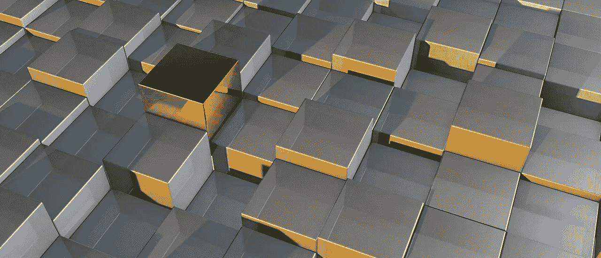

Source: Pixabay

# 介绍

人类有跨任务传递知识的天生能力。我们在学习一项任务时获得的知识，我们以同样的方式用来解决相关的任务。任务越相关，我们就越容易转移或交叉利用我们的知识。一些简单的例子是，

*   知道如何骑摩托车⮫学习如何骑汽车
*   知道如何演奏古典钢琴⮫学习如何演奏爵士钢琴
*   了解数学和统计⮫学习机器学习


在上述每个场景中，当我们试图学习新的方面或主题时，我们不会从头开始学习一切。我们从过去学到的知识中转移和利用我们的知识！

到目前为止，传统的机器学习和深度学习算法一直被设计为孤立工作。这些算法被训练来解决特定的任务。一旦特征空间分布发生变化，就必须从头开始重建模型。迁移学习是克服孤立的学习范式，利用从一项任务中获得的知识来解决相关任务的思想。在本文中，我们将全面介绍迁移学习的概念、范围和实际应用，甚至展示一些实际例子。更具体地说，我们将涉及以下内容。

*   **迁移学习的动机**
*   **理解迁移学习**
*   **迁移学习策略**
*   **深度学习的迁移学习**
*   **深度迁移学习策略**
*   **深度迁移学习的类型**
*   **迁移学习的应用**
*   **案例研究 1:具有数据可用性约束的图像分类**
*   **案例研究 2:具有大量类别和较少数据可用性的多类别细粒度图像分类**
*   **转移学习优势**
*   **转移学习挑战**
*   **结论&未来范围**

我们将把迁移学习视为一个通用的高级概念，它始于机器学习和统计建模的时代，然而，在本文中，我们将更专注于深度学习。

> **注意:**所有案例研究将逐步涵盖代码和输出的细节。这里描述的案例研究及其结果完全基于我们在编写本书时实施和测试这些模型时进行的实际实验: [**用 Python 进行迁移学习**](https://github.com/dipanjanS/hands-on-transfer-learning-with-python) (细节在本文末尾)。

鉴于网络上的信息过载，本文旨在尝试涵盖理论概念，并在一个地方展示深度学习应用的实际动手示例。所有的例子都将包含在 Python 中，使用 keras 和 tensorflow 后端，这是老手或刚开始深度学习的人的完美匹配！*对 PyTorch 感兴趣？请随意转换这些例子并联系我，我会在这里和 GitHub 上展示你的作品！*

# 迁移学习的动机

我们已经简单地讨论过，人类不会从头开始学习所有的东西，也不会利用和转移他们以前学习领域的知识到新的领域和任务中。鉴于对 [***真正的人工智能***](https://en.wikipedia.org/wiki/Artificial_general_intelligence) 的狂热，数据科学家和研究人员认为迁移学习可以进一步推动我们朝着[](https://en.wikipedia.org/wiki/Artificial_general_intelligence)*的方向前进。事实上， [*吴恩达*](https://en.wikipedia.org/wiki/Andrew_Ng) ，知名教授和数据科学家，一直与谷歌大脑、百度、斯坦福和 Coursera 有联系，最近在 NIPS 2016 上给出了一个惊人的教程，名为[***‘使用深度学习构建 AI 应用的基本要素’***](https://media.nips.cc/Conferences/2016/Slides/6203-Slides.pdf)*，他提到**

> **监督学习之后——迁移学习将是 ML 商业成功的下一个驱动力**

**推荐有兴趣的乡亲们去看看 NIPS 2016 的 [*他的有趣教程*](https://www.youtube.com/watch?v=wjqaz6m42wU) 。**

**事实上，迁移学习并不是 21 世纪 10 年代才出现的概念。神经信息处理系统(NIPS) 1995 年研讨会*学会学习:归纳系统中的知识巩固和转移*被认为为该领域的研究提供了最初的动力。从那以后，*学会学习*、*知识巩固*、*归纳迁移*等术语就和迁移学习互换使用了。不变的是，不同的研究人员和学术文本从不同的背景下提供定义。Goodfellow 等人在他们的名著*深度学习*中提到了泛化背景下的迁移学习。它们的定义如下:**

> **在一种情况下学到的东西被用来在另一种情况下提高概括能力。**

**因此，关键的动机，尤其是考虑到深度学习的背景，是这样一个事实，即解决复杂问题的大多数模型需要大量的数据，考虑到标记数据点所花费的时间和精力，为监督模型获取大量的标记数据可能非常困难。一个简单的例子是 [***ImageNet 数据集***](http://image-net.org/index) ***，*** ，它拥有数百万张属于不同类别的图像，这要归功于从斯坦福开始的多年努力！**

**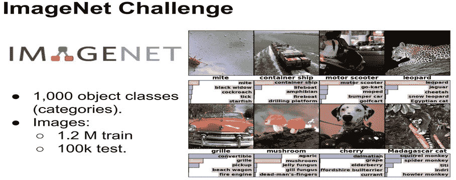**

**The popular ImageNet Challenge based on the ImageNet Database**

**然而，为每个领域获取这样的数据集是困难的。此外，大多数深度学习模型都非常专门针对特定领域甚至特定任务。虽然这些可能是最先进的模型，具有非常高的准确性，并超越了所有基准，但它只会在非常特定的数据集上使用，当用于新任务时，性能最终会大幅下降，而新任务可能仍然与它接受训练的任务相似。这形成了迁移学习的动机，它超越了特定的任务和领域，并试图了解如何利用来自预训练模型的知识，并使用它来解决新问题！**

# **理解迁移学习**

**这里要记住的第一件事是，迁移学习并不是一个新的概念，它对于深度学习来说是非常具体的。建立和训练机器学习模型的传统方法与使用遵循迁移学习原则的方法之间存在明显的差异。**

****

**Traditional Learning vs Transfer Learning**

**传统的学习是孤立的，纯粹基于特定的任务、数据集和在其上训练单独的孤立模型而发生。没有保留可以从一个模型转移到另一个模型的知识。在迁移学习中，您可以利用以前训练的模型中的知识(特征、权重等)来训练新的模型，甚至解决新任务中数据较少的问题！**

**让我们借助一个例子来理解前面的解释。假设我们的任务是在一家餐馆的限定区域内识别图像中的物体。让我们将这个任务在其定义的范围内标记为*。给定此任务的数据集，我们训练一个模型并对其进行调整，使其在来自同一域(餐馆)的看不见的数据点上表现良好(一般化)。当我们没有足够的训练样本来完成特定领域的任务时，传统的监督 ML 算法就会失效。假设，我们现在必须从公园或咖啡馆的图像中检测物体(比方说，任务 ***T2*** )。理想情况下，我们应该能够应用为 ***T1*** 训练的模型，但在现实中，我们面临着性能下降和不能很好概括的模型。这种情况的发生有多种原因，我们可以将其统称为模型对训练数据和领域的偏好。***

**迁移学习应该使我们能够利用以前学习的任务中的知识，并将它们应用到更新的相关任务中。如果我们对于任务*有明显更多的数据，我们可以利用它的学习，并且对于任务*(其具有明显更少的数据)概括这种知识(特征、权重)。在计算机视觉领域中的问题的情况下，某些低级特征，例如边缘、形状、拐角和强度，可以在任务之间共享，从而实现任务之间的知识转移！此外，正如我们在前面的图中所描述的，当学习新的目标任务时，来自现有任务的知识作为额外的输入。****

## ***形式定义***

***现在让我们来看看迁移学习的正式定义，然后利用它来理解不同的策略。在他们的论文[、、](https://www.cse.ust.hk/~qyang/Docs/2009/tkde_transfer_learning.pdf)中，潘和杨用领域、任务和边际概率提出了一个理解迁移学习的框架。该框架定义如下:***

***一个域， ***D*** ，定义为由特征空间、**【ꭕ】**和边际概率、***p(χ)***组成的二元元组，其中***χ***为样本数据点。因此，我们可以在数学上把定义域表示为 ***D = {ꭕ，**p(χ)}******

****

**这里的**表示如上所述的特定向量。另一方面，一个任务， ***T*** 可以定义为标签空间的二元元组， ***γ*** ，以及目标函数，***【η***。从概率的角度，目标函数也可以表示为***P(γ|χ)***。****

****

**因此，有了这些定义和表述，我们可以如下定义迁移学习，这要感谢 Sebastian Ruder 的一篇优秀文章。**

****

## **情节**

**基于我们之前的定义，现在让我们来看看涉及迁移学习的典型场景。**

****

**为了更清楚地说明术语 ***领域*** 和 ***任务*** 之间的区别，下图试图用一些例子来解释它们。**

**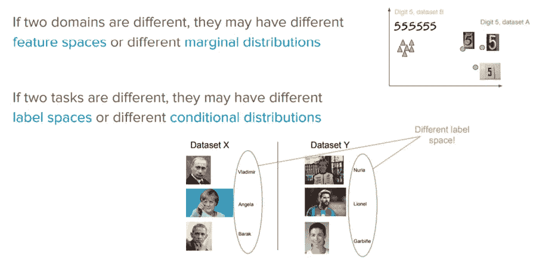**

## **关键要点**

**正如我们到目前为止所看到的，迁移学习就是在目标任务中利用源学习者的现有知识的能力。在迁移学习过程中，必须回答以下三个重要问题:**

*   ****转什么:**这是整个流程的第一步，也是最重要的一步。为了提高目标任务的绩效，我们试图寻找关于哪部分知识可以从源转移到目标的答案。当试图回答这个问题时，我们试图确定知识的哪一部分是源特定的，以及源和目标之间的共同点。**
*   ****何时转移:**有些情况下，为了转移知识而转移知识可能会比改善任何事情都更糟糕(也称为负迁移)。我们应该致力于利用迁移学习来提高目标任务的绩效/结果，而不是降低它们。我们需要小心什么时候转移，什么时候不转移。**
*   ****如何转移:**一旦回答了*什么*和*何时*，我们就可以继续确定跨领域/任务实际转移知识的方法。这涉及到对现有算法和不同技术的更改，我们将在本文后面的部分中讨论。此外，为了更好地理解如何转移，最后列出了具体的案例研究。**

**这应该有助于我们定义迁移学习可以应用的各种场景和可能的技术，我们将在下一节讨论。**

# **迁移学习策略**

**有不同的迁移学习策略和技术，可以根据领域、手头的任务和数据的可用性来应用。我非常喜欢我们之前提到的关于迁移学习的论文中的下图， [*迁移学习调查*](https://www.cse.ust.hk/~qyang/Docs/2009/tkde_transfer_learning.pdf) *。***

**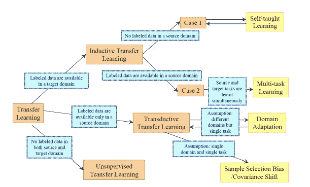**

**Transfer Learning Strategies**

**因此，根据上图，迁移学习方法可以根据所涉及的传统 ML 算法的类型进行分类，例如:**

*   ****归纳迁移学习:**在这个场景中，源域和目标域是相同的，但是源任务和目标任务是不同的。这些算法试图利用源域的归纳偏差来帮助改进目标任务。根据源域是否包含标记数据，这可以进一步分为两个子类别，分别类似于多任务学习和自学学习。**
*   ****无监督迁移学习:**这种设置类似于归纳迁移本身，重点是目标领域的无监督任务。源域和目标域相似，但任务不同。在这种情况下，标记的数据在任一域中都不可用。**
*   ****直推式迁移学习:**在这种情景中，源任务和目标任务有相似之处，但对应的域不同。在此设置中，源域有许多标记数据，而目标域没有。这可以进一步分类为子类别，指的是特征空间不同或边际概率不同的设置。**

**我们可以在下表中总结上述每种技术的不同设置和场景。**

****

**Types of Transfer Learning Strategies and their Settings**

**上一节讨论的三个迁移类别概述了迁移学习可以应用的不同环境，并对其进行了详细研究。要回答在这些类别之间传递什么的问题，可以采用以下一些方法:**

*   ****实例转移:**将知识从源领域重用到目标任务通常是一个理想的场景。在大多数情况下，源域数据不能直接重用。相反，源域中的某些实例可以与目标数据一起重用，以改善结果。在归纳迁移的情况下，如戴和他们的合作者的 AdaBoost 等修改有助于利用来自源域的训练实例来改进目标任务。**
*   ****特征表示转移:**这种方法旨在通过识别可以从源域利用到目标域的良好特征表示，来最小化域差异并降低错误率。根据标注数据的可用性，可对基于要素制图表达的传输应用监督或非监督方法。**
*   ****参数转移:**这种方法基于相关任务的模型共享一些参数或超参数的先验分布的假设。与同时学习源任务和目标任务的多任务学习不同，对于迁移学习，我们可以对目标域的损失应用额外的权重来提高整体表现。**
*   ****关系型知识转移:**与前面三种方法不同，关系型知识转移试图处理非 IID 数据，比如非独立同分布的数据。换句话说，数据，其中每个数据点都与其他数据点有关系；例如，社交网络数据利用关系知识转移技术。**

**下表清楚地总结了不同迁移学习策略之间的关系以及要迁移什么。**

****

**Transfer Learning Strategies and Types of Transferable Components**

**现在让我们利用这种理解，了解迁移学习如何应用于深度学习的环境中。**

# **面向深度学习的迁移学习**

**我们在上一节中讨论的策略是可以应用于机器学习技术的一般方法，这使我们产生了一个问题，迁移学习真的可以应用于深度学习的环境中吗？**

****

**深度学习模型是又被称为 ***归纳学习*** 的代表。归纳学习算法的目标是从一组训练样本中推断出一个映射。例如，在分类的情况下，模型学习输入要素和类标签之间的映射。为了让这样的学习器能够很好地对看不见的数据进行归纳，它的算法使用了一组与训练数据的分布相关的假设。这几组假设被称为 ***感应偏置*** 。归纳偏差或假设可以由多个因素来表征，例如它所限制的假设空间和通过假设空间的搜索过程。因此，这些偏差会影响模型在给定任务和领域中学习的方式和内容。**

****

**Ideas for deep transfer learning**

*****归纳迁移技术*** 利用源任务的归纳偏差来辅助目标任务。这可以通过不同的方式来实现，例如通过限制模型空间来调整目标任务的归纳偏差，缩小假设空间，或者在来自源任务的知识的帮助下对搜索过程本身进行调整。下图直观地描述了这一过程。**

**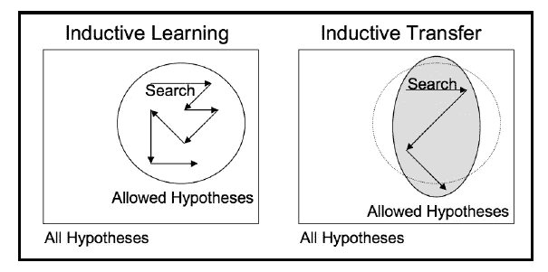**

**Inductive transfer (Source: Transfer learning, Lisa Torrey and Jude Shavlik)**

**除了归纳迁移，归纳学习算法还利用贝叶斯和分层迁移技术来帮助改进学习和目标任务的执行。**

# **深度迁移学习策略**

**深度学习近年来取得了长足的进步。这使我们能够解决复杂的问题并取得惊人的成果。然而，这种深度学习系统所需的训练时间和数据量要比传统的 ML 系统多得多。有各种各样的深度学习网络，它们具有最先进的性能(有时与人类的性能一样好，甚至更好)，已经在计算机视觉和自然语言处理(NLP)等领域进行了开发和测试。在大多数情况下，团队/人员共享这些网络的详细信息，供他人使用。这些预先训练的网络/模型形成了深度学习背景下迁移学习的基础，或者我喜欢称之为 ***【深度迁移学习】*** 。让我们看看深度迁移学习的两个最流行的策略。**

## **现成的预训练模型作为特征提取器**

**深度学习系统和模型是分层的架构，在不同的层学习不同的特征(分层特征的分层表示)。然后，这些层最终连接到最后一层(在监督学习的情况下，通常是完全连接的层)，以获得最终输出。这种分层架构允许我们利用预训练的网络(如 Inception V3 或 VGG ),而无需其最终层作为其他任务的固定特征提取器。**

**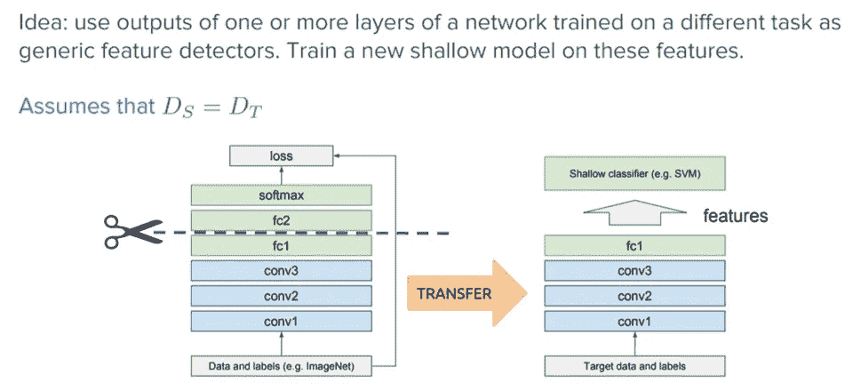**

**Transfer Learning with Pre-trained Deep Learning Models as Feature Extractors**

> **这里的关键思想是仅利用预训练模型的加权层来提取特征，而不是在为新任务训练新数据的过程中更新模型层的权重。**

**例如，如果我们在没有最终分类层的情况下使用 AlexNet，它将帮助我们根据隐藏状态将新领域任务中的图像转换为 4096 维向量，从而使我们能够利用来自源领域任务的知识从新领域任务中提取特征。这是使用深度神经网络执行迁移学习的最广泛使用的方法之一。**

**现在可能会出现一个问题，这些预先训练好的现成功能在不同任务中的实际效果如何？**

**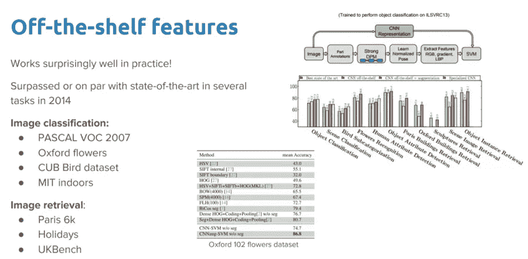**

**在现实世界的任务中，它看起来确实工作得很好，如果上表中的图表不是很清楚，下面的图应该会使事情更加清楚，关于他们在不同的基于计算机视觉的任务中的表现！**

**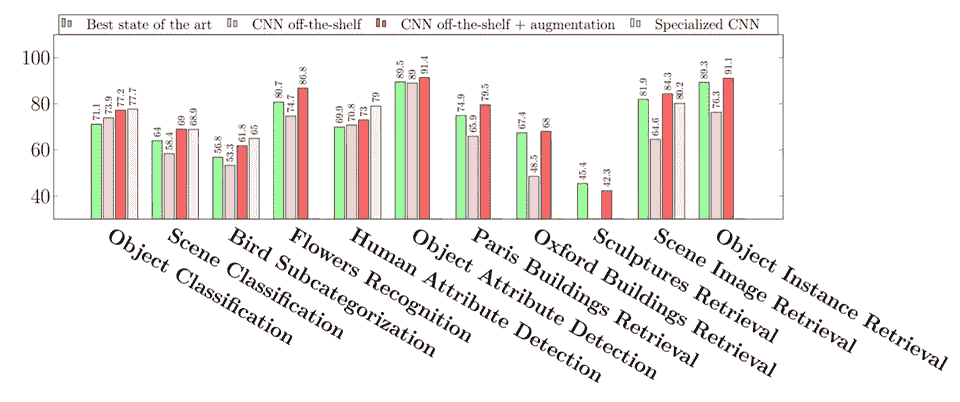**

**Performance of off-the-shelf pre-trained models vs. specialized task-focused deep learning models**

**根据上图中的红色和粉红色条，您可以清楚地看到，预训练模型的功能始终优于非常专业的以任务为重点的深度学习模型。**

## **微调现成的预培训模型**

**这是一个更复杂的技术，我们不仅替换最后一层(用于分类/回归)，而且我们还选择性地重新训练一些先前的层。深度神经网络是具有各种超参数的高度可配置的架构。正如前面所讨论的，最初的层被认为是捕捉一般的特征，而后来的层更关注手边的特定任务。下图描述了一个人脸识别问题的例子，网络的初始低层学习非常一般的特征，而高层学习非常特定的任务特征。**

****

**利用这种洞察力，我们可以在重新训练时冻结(固定权重)某些层，或者微调其余层以满足我们的需要。在这种情况下，我们利用网络整体架构方面的知识，并使用其状态作为我们再训练步骤的起点。这反过来帮助我们用更少的培训时间获得更好的表现。**

****

## **冻结还是微调？**

**这就给我们带来了一个问题，我们应该冻结网络中的图层以将其用作特征提取器，还是也应该在此过程中微调图层？**

****

**这应该给我们一个很好的视角，让我们了解这些策略是什么，以及何时应该使用它们！**

## **预训练模型**

**迁移学习的一个基本要求是要有在源任务中表现良好的模型。幸运的是，深度学习世界相信分享。他们各自的团队已经公开分享了许多最先进的深度学习架构。这些跨越了不同的领域，例如计算机视觉和 NLP，这是深度学习应用中最受欢迎的两个领域。预训练模型通常以模型在被训练到稳定状态时获得的数百万个参数/权重的形式被共享。每个人都可以通过不同的方式使用预先训练好的模型。著名的深度学习 Python 库 keras 提供了下载一些流行模型的接口。你也可以从网上获得预先训练好的模型，因为大多数模型都是开源的。**

*****对于计算机视觉*** ，可以利用一些流行的模型包括，**

*   **[VGG-16](https://www.kaggle.com/keras/vgg16/home)**
*   **[VGG-19](https://www.kaggle.com/keras/vgg19/home)**
*   **[盗梦空间 V3](https://arxiv.org/abs/1512.00567)**
*   **[异常](https://arxiv.org/abs/1610.02357)**
*   **[ResNet-50](https://www.kaggle.com/keras/resnet50/home)**

*****对于自然语言处理*** 任务，由于 NLP 任务的多变性质，事情变得更加困难。您可以利用单词嵌入模型，包括:**

*   **[Word2Vec](https://en.wikipedia.org/wiki/Word2vec)**
*   **[手套](https://nlp.stanford.edu/projects/glove/)**
*   **[快速文本](https://fasttext.cc/)**

**但是等等，还没完呢！最近，在自然语言处理的迁移学习方面有了一些很好的进展。最值得注意的是，**

*   **[谷歌通用句子编码器](https://arxiv.org/abs/1803.11175)**
*   **[谷歌的变压器(BERT)双向编码器表示法](https://arxiv.org/abs/1810.04805)**

**它们肯定很有前途，我相信它们很快会被广泛应用于现实世界。**

# **深度迁移学习的类型**

**关于迁移学习的文献已经经历了多次反复，正如本章开始时提到的，与迁移学习相关的术语一直被不严格地使用，而且经常互换。因此，有时很难区分*迁移学习*、*领域适应*和*多任务学习*。放心，这些都是有关联的，并试图解决类似的问题。总的来说，你应该总是把迁移学习看作一个一般的概念或原则，在这里我们将尝试使用源任务领域的知识来解决一个目标任务。**

## **领域适应**

**领域自适应通常指源领域和目标领域之间的边际概率不同的场景，例如***【p(xₛ】≠p(xₜ)***。源域和目标域的数据分布存在固有的偏移或漂移，需要调整以转移学习。例如，标记为正面或负面的电影评论的语料库将不同于产品评论情感的语料库。如果用于对产品评论进行分类，根据电影评论情感训练的分类器将看到不同的分布。因此，在这些场景中，领域适应技术被用于迁移学习。**

## **领域混淆**

**我们学习了不同的迁移学习策略，甚至讨论了从源到目标迁移知识的内容、时间和方式这三个问题。特别是，我们讨论了特征表征转移是如何有用的。值得重复的是，深度学习网络中的不同层捕获不同的特征集。我们可以利用这个事实来学习领域不变特征，并提高它们跨领域的可移植性。我们不允许模型学习任何表示，而是推动两个领域的表示尽可能地相似。这可以通过将某些预处理步骤直接应用于表示本身来实现。其中一些已经由孙、贾士丰和 Kate Saenko 在他们的论文*【】*【易域改编的回归】* 中讨论过。Ganin 等人也提出了这种对表示相似性的推动。艾尔。在他们的论文中， [*【神经网络的领域对抗训练】*](https://arxiv.org/abs/1505.07818) 。这种技术背后的基本思想是向源模型添加另一个目标，通过混淆领域本身来鼓励相似性，因此产生了领域混淆。***

## **多任务学习**

**多任务学习与迁移学习略有不同。在多任务学习的情况下，几个任务被同时学习，而不区分源和目标。在这种情况下，学习者一次接收关于多个任务的信息，与学习者最初不知道目标任务的迁移学习相比。下图对此进行了描述。**

**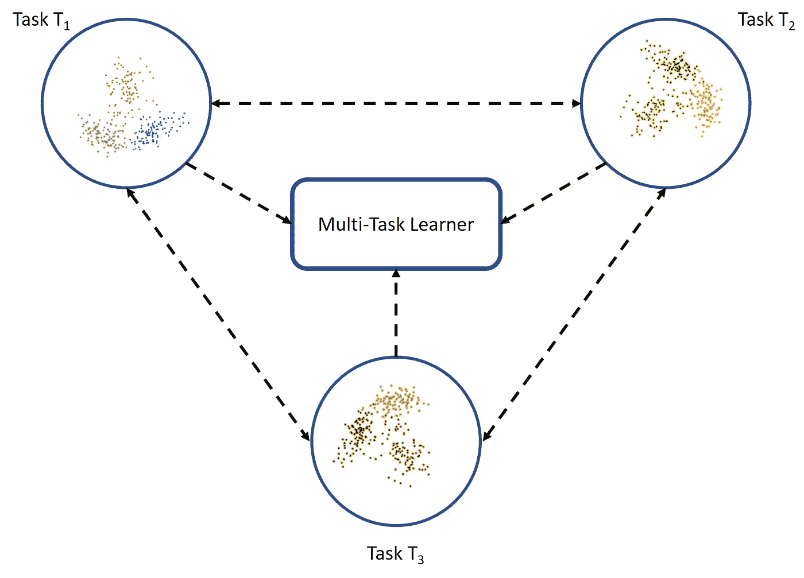**

**Multitask learning: Learner receives information from all tasks simultaneously**

## **一次性学习**

**深度学习系统天生就需要数据，因此它们需要许多训练样本来学习权重。这是深度神经网络的一个限制因素，尽管人类学习并非如此。例如，一旦给孩子看了苹果的样子，他们可以很容易地识别不同种类的苹果(用一个或几个训练例子)；而 ML 和深度学习算法却不是这样。一次性学习是迁移学习的一种变体，我们试图根据一个或几个训练例子来推断所需的输出。这在现实世界中很有帮助，在现实世界中，不可能为每个可能的类都标记数据(如果这是一个分类任务)，在现实世界中，可以经常添加新的类。飞飞和他们的合著者的里程碑式的论文 [*【一次学习的对象类别】*](https://ieeexplore.ieee.org/document/1597116/) ，被认为是创造了一次学习这个术语和这个子领域的研究。提出了一种基于贝叶斯框架的物体分类表示学习方法。这种方法后来得到了改进，并使用深度学习系统进行了应用。**

## **零射击学习**

**零射击学习是迁移学习的另一个极端变体，它依赖于没有标记的例子来学习一项任务。这听起来可能难以置信，尤其是当使用例子学习是大多数监督学习算法的内容时。零数据学习或零短期学习方法，在训练阶段本身进行巧妙的调整，以利用额外的信息来理解看不见的数据。在他们关于*深度学习*的书中，Goodfellow 和他们的合著者将零射击学习呈现为学习三个变量的场景，例如传统的输入变量 ***x*** ，传统的输出变量 ***y*** ，以及描述任务的附加随机变量 ***T*** 。从而训练模型学习 ***P(y | x，T)*** 的条件概率分布。零镜头学习在机器翻译等场景中很方便，在这些场景中，我们甚至可能没有目标语言的标签。**

# **迁移学习的应用**

**深度学习无疑是已经被用来非常成功地收获迁移学习的好处的算法的特定类别之一。以下是几个例子:**

*   ****NLP 的迁移学习:**当涉及到 ML 和深度学习时，文本数据呈现出各种各样的挑战。这些通常使用不同的技术进行转换或矢量化。已经使用不同的训练数据集准备了嵌入，例如 Word2vec 和 FastText。通过转移来自源任务的知识，它们被用在不同的任务中，例如情感分析和文档分类。除此之外，像通用句子编码器和 BERT 这样的新模型无疑为未来提供了无数的可能性。**
*   ****音频/语音的迁移学习:**类似于 NLP 和计算机视觉等领域，深度学习已经成功用于基于音频数据的任务。例如，为英语开发的自动语音识别(ASR)模型已经成功地用于提高其他语言(如德语)的语音识别性能。此外，自动说话人识别是迁移学习有很大帮助的另一个例子。**
*   ****用于计算机视觉的迁移学习:**深度学习已经非常成功地用于各种计算机视觉任务，例如使用不同 CNN 架构的对象识别和标识。在他们的论文中，Yosinski 和他们的合著者(https://arxiv.org/abs/1411.1792)介绍了他们的发现，即较低层如何充当传统的计算机视觉特征提取器，如边缘检测器，而最后几层则致力于特定任务的特征。**

****

**因此，这些发现有助于利用现有的最先进的模型，如 VGG，AlexNet 和 Inceptions，来完成目标任务，如风格转换和人脸检测，这些目标任务与这些模型最初训练的目标不同。现在让我们探索一些真实世界的案例研究，并建立一些深度迁移学习模型！**

# **案例研究 1:具有数据可用性约束的图像分类**

**在这个简单的案例研究中，将研究一个图像分类问题，其约束条件是每个类别的训练样本数量非常少。我们问题的数据集可以在 Kaggle 上获得，并且是最受欢迎的基于计算机视觉的数据集之一。**

## **主要目标**

**我们将使用的数据集来自非常流行的 [***狗对猫挑战赛***](https://www.kaggle.com/c/dogs-vs-cats/data) ***，*** ，我们的主要目标是建立一个深度学习模型，可以成功地识别图像并将其分类为*或 ***狗*** 。***

****

**Source: becominghuman.ai**

**用 ML 来说，这是一个基于图像的二元分类问题。在开始之前，我要感谢 *Francois Chollet* 不仅创建了令人惊叹的深度学习框架`**keras**`，还在他的著作[*【Python 深度学习】*](https://www.manning.com/books/deep-learning-with-python) 中谈到了迁移学习在现实世界中有效的问题。我以此为灵感，在本章中描绘了迁移学习的真正力量，所有结果都基于在我自己的基于 GPU 的云设置(AWS p2.x)中构建和运行每个模型**

## **构建数据集**

**首先，从数据集页面下载`**train.zip**`文件，并将其存储在您的本地系统中。下载完成后，将其解压缩到一个文件夹中。这个文件夹将包含 25，000 张狗和猫的图片；也就是说，每个类别有 12，500 个图像。虽然我们可以使用所有 25，000 张图片，并在它们的基础上建立一些不错的模型，但如果你还记得的话，我们的问题目标包括每个类别有少量图片的额外约束。为此，让我们构建自己的数据集。**

```
****import** **glob**
**import** **numpy** **as** **np**
**import** **os**
**import** **shutil****np.random.seed(42)****
```

**现在，让我们加载原始训练数据文件夹中的所有图像，如下所示:**

```
****(12500, 12500)****
```

**我们可以用前面的输出验证每个类别有 12，500 张图片。现在让我们构建更小的数据集，这样我们就有 3，000 张图像用于训练，1，000 张图像用于验证，1，000 张图像用于我们的测试数据集(两种动物类别具有相等的代表性)。**

```
****Cat datasets: (1500,) (500,) (500,)
Dog datasets: (1500,) (500,) (500,)****
```

**现在我们的数据集已经创建好了，让我们将它们分别写到磁盘的不同文件夹中，这样我们就可以在将来的任何时候访问它们，而不用担心它们是否存在于我们的主内存中。**

**由于这是一个图像分类问题，我们将利用 CNN 模型或 ConvNets 来尝试解决这个问题。我们将从头开始构建简单的 CNN 模型，然后尝试使用正则化和图像增强等技术进行改进。然后，我们将尝试并利用预先训练的模型来释放迁移学习的真正力量！**

## **准备数据集**

**在我们开始建模之前，让我们加载并准备数据集。首先，我们加载一些基本的依赖项。**

```
****import** **glob**
**import** **numpy** **as** **np**
**import** **matplotlib.pyplot** **as** **plt**
**from** **keras.preprocessing.image** **import** **ImageDataGenerator, load_img, img_to_array, array_to_img****%matplotlib inline****
```

**现在让我们使用下面的代码片段加载数据集。**

```
****Train dataset shape: (3000, 150, 150, 3) 	
Validation dataset shape: (1000, 150, 150, 3)****
```

**我们可以清楚地看到，我们有 3000 个训练图像和 1000 个验证图像。每幅图像的大小为`**150 x 150**`，有三个通道用于红色、绿色和蓝色(RGB ),因此赋予每幅图像`**(150, 150, 3)**`的尺寸。我们现在将缩放每张像素值在`**(0, 255)**`到`**(0, 1)**`之间的图像，因为深度学习模型在小输入值的情况下工作得非常好。**

**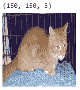**

**前面的输出显示了我们训练数据集中的一个样本图像。现在让我们设置一些基本的配置参数，并将我们的文本类标签编码成数值(否则，Keras 将抛出一个错误)。**

```
****['cat', 'cat', 'cat', 'cat', 'cat', 'dog', 'dog', 'dog', 'dog', 'dog'] [0 0 0 0 0 1 1 1 1 1]****
```

**我们可以看到，我们的编码方案将数字`**0**`分配给`**cat**`标签，将`**1**`分配给`**dog**`标签。我们现在准备建立我们的第一个基于 CNN 的深度学习模型。**

## **从零开始的简单 CNN 模型**

**我们将首先建立一个具有三个卷积层的基本 CNN 模型，结合最大池技术从我们的图像中自动提取特征，并对输出卷积特征图进行下采样。**

****

**A Typical CNN (Source: Wikipedia)**

**我们假设你对 CNN 有足够的了解，因此不会涉及理论细节。请随意参考我的书或网上任何解释卷积神经网络的资源！现在让我们利用 Keras 来构建我们的 CNN 模型架构。**

**前面的输出显示了我们的基本 CNN 模型摘要。正如我们之前提到的，我们使用三个卷积层进行特征提取。展平层用于展平第三个卷积层输出的`**17 x 17**`特征图的`**128**`。这被馈送到我们的密集层，以获得图像应该是一只***【1】***还是一只 ***猫(0)*** 的最终预测。所有这些都是模型训练过程的一部分，所以让我们使用下面利用`**fit(…)**`函数的代码片段来训练我们的模型。**

**以下术语对于训练我们的模型非常重要:**

*   **`**batch_size**`表示每次迭代传递给模型的图像总数。**
*   **每次迭代后，更新层中单元的权重。**
*   **总迭代次数总是等于训练样本总数除以`**batch_size**`**
*   **一个历元是指完整的数据集已经通过网络一次，即所有的迭代都是基于数据批次完成的。**

**我们使用 30 的`**batch_size**`,我们的训练数据总共有 3000 个样本，这表明每个时期总共有 100 次迭代。我们针对总共 30 个时期训练该模型，并因此在我们的 1，000 幅图像的验证集上验证它。**

```
****Train on 3000 samples, validate on 1000 samples
Epoch 1/30
3000/3000 - 10s - loss: 0.7583 - acc: 0.5627 - val_loss: 0.7182 - val_acc: 0.5520
Epoch 2/30
3000/3000 - 8s - loss: 0.6343 - acc: 0.6533 - val_loss: 0.5891 - val_acc: 0.7190
...
...
Epoch 29/30
3000/3000 - 8s - loss: 0.0314 - acc: 0.9950 - val_loss: 2.7014 - val_acc: 0.7140
Epoch 30/30
3000/3000 - 8s - loss: 0.0147 - acc: 0.9967 - val_loss: 2.4963 - val_acc: 0.7220****
```

**基于训练和验证准确性值，看起来我们的模型有点过度拟合。我们可以使用下面的代码片段来绘制模型的准确性和误差，以获得更好的视角。**

**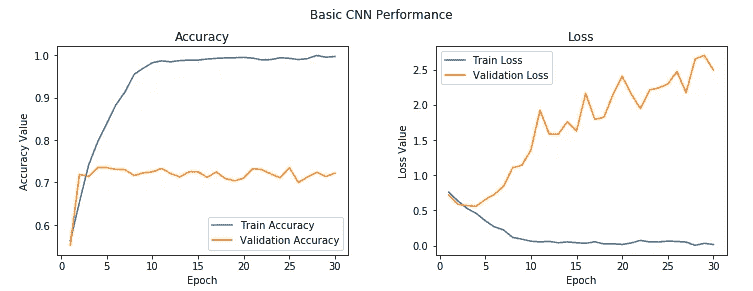**

**Vanilla CNN Model Performance**

**您可以清楚地看到，经过 2-3 个时期后，模型开始过度拟合训练数据。在我们的验证集中，我们得到的平均准确率大约是 **72%** ，这是一个不错的开始！我们能改进这个模型吗？**

## **正则化 CNN 模型**

**让我们改进我们的基本 CNN 模型，增加一个卷积层，另一个密集的隐藏层。除此之外，我们将在每个隐藏的密集层后添加`**0.3**`的 dropout 以实现正则化。基本上，退出是深度神经网络中一种强大的正则化方法。它可以分别应用于输入图层和隐藏图层。Dropout 通过将层中一小部分单元的输出设置为零来随机屏蔽这些单元的输出(在我们的示例中，是密集层中 30%的单元)。**

```
****Train on 3000 samples, validate on 1000 samples
Epoch 1/30
3000/3000 - 7s - loss: 0.6945 - acc: 0.5487 - val_loss: 0.7341 - val_acc: 0.5210
Epoch 2/30
3000/3000 - 7s - loss: 0.6601 - acc: 0.6047 - val_loss: 0.6308 - val_acc: 0.6480
...
...
Epoch 29/30
3000/3000 - 7s - loss: 0.0927 - acc: 0.9797 - val_loss: 1.1696 - val_acc: 0.7380
Epoch 30/30
3000/3000 - 7s - loss: 0.0975 - acc: 0.9803 - val_loss: 1.6790 - val_acc: 0.7840****
```

****

**Vanilla CNN Model with Regularization Performance**

**您可以从前面的输出中清楚地看到，我们仍然以过度拟合模型而告终，尽管这花费的时间稍长，并且我们还获得了大约 **78%** 的稍好的验证准确性，这是不错的，但并不惊人。模型过度拟合的原因是因为我们的训练数据少得多，并且模型在每个时期都看到相同的实例。解决这个问题的一种方法是利用图像增强策略，用现有图像的微小变化来增强我们现有的训练数据。我们将在下一节详细介绍这一点。让我们暂时保存这个模型，这样我们可以在以后使用它来评估它在测试数据上的性能。**

```
****model.save(‘cats_dogs_basic_cnn.h5’)****
```

## **图像增强的 CNN 模型**

**让我们通过使用适当的图像增强策略添加更多数据来改进我们的正则化 CNN 模型。由于我们以前的模型每次都是在相同的小样本数据点上训练的，它不能很好地概括，并在几个时期后结束了过度拟合。图像增强背后的思想是，我们遵循一个设定的过程，从我们的训练数据集中获取现有图像，并对它们应用一些图像变换操作，如旋转、剪切、平移、缩放等，以产生现有图像的新的、改变的版本。由于这些随机转换，我们每次得到的图像并不相同，我们将利用 Python 生成器在训练期间将这些新图像输入到我们的模型中。**

**Keras 框架有一个出色的实用程序`**ImageDataGenerator**`,可以帮助我们完成前面的所有操作。让我们为我们的训练和验证数据集初始化两个数据生成器。**

**在`**ImageDataGenerator**`中有很多选项可用，我们只是利用了其中的一些。请随意查看 [***文档***](https://keras.io/preprocessing/image/) 以获得更详细的观点。在我们的训练数据生成器中，我们接收原始图像，然后对它们执行一些转换来生成新图像。其中包括以下内容。**

*   **使用`**zoom_range**`参数以`**0.3**`的系数随机缩放图像。**
*   **使用`**rotation_range**` 参数将图像随机旋转`**50**`度。**
*   **使用`**width_shift_range**`和`**height_shift_range**`参数，按照图像宽度或高度的`**0.2**`因子，随机水平或垂直平移图像。**
*   **使用`**shear_range**` 参数随机应用基于剪切的变换。**
*   **使用`**horizontal_flip**` 参数随机水平翻转一半图像。**
*   **在我们应用任何前面的操作(尤其是旋转或平移)之后，利用`**fill_mode**`参数为图像填充新的像素。在这种情况下，我们只是用最近的周围像素值填充新像素。**

**让我们看看这些生成的图像可能是什么样子，以便您可以更好地理解它们。我们将从我们的训练数据集中选取两个样本图像来说明这一点。第一个图像是一只猫的图像。**

****

**Image Augmentation on a Cat Image**

**您可以在之前的输出中清楚地看到，我们每次都生成新版本的训练图像(带有平移、旋转和缩放)，并且我们还为它分配了一个 cat 标签，以便模型可以从这些图像中提取相关特征，并记住这些是猫。现在让我们看看图像增强是如何在一个样本狗图像上工作的。**

****

**Image Augmentation on a Dog Image**

**这向我们展示了图像增强如何有助于创建新图像，以及如何在这些图像上训练模型来帮助克服过度拟合。请记住，对于我们的验证生成器，我们只需要将验证图像(原始图像)发送给模型进行评估；因此，我们只缩放图像像素(在 0-1 之间),不应用任何变换。我们只对训练图像应用图像增强变换。现在，让我们使用我们创建的图像增强数据生成器来训练一个具有正则化的 CNN 模型。我们将使用与之前相同的模型架构。**

**我们在这里将默认学习速率降低了 10 倍，以防止模型陷入局部最小值或过度拟合，因为我们将发送大量带有随机变换的图像。为了训练模型，我们现在需要稍微修改我们的方法，因为我们正在使用数据生成器。我们将利用 Keras 的`**fit_generator(…)**` 函数来训练这个模型。`**train_generator**`每次生成 30 幅图像，因此我们将使用`**steps_per_epoch**`参数并将其设置为 100，以根据每个时期的训练数据在 3000 幅随机生成的图像上训练模型。我们的`**val_generator**`每次生成 20 幅图像，因此我们将`**validation_steps**`参数设置为 50，以在所有 1，000 幅验证图像上验证我们的模型准确性(记住，我们不是在扩充我们的验证数据集)。**

```
****Epoch 1/100
100/100 - 12s - loss: 0.6924 - acc: 0.5113 - val_loss: 0.6943 - val_acc: 0.5000
Epoch 2/100
100/100 - 11s - loss: 0.6855 - acc: 0.5490 - val_loss: 0.6711 - val_acc: 0.5780
Epoch 3/100
100/100 - 11s - loss: 0.6691 - acc: 0.5920 - val_loss: 0.6642 - val_acc: 0.5950
...
...
Epoch 99/100
100/100 - 11s - loss: 0.3735 - acc: 0.8367 - val_loss: 0.4425 - val_acc: 0.8340
Epoch 100/100
100/100 - 11s - loss: 0.3733 - acc: 0.8257 - val_loss: 0.4046 - val_acc: 0.8200****
```

**我们得到了大约 82% 的验证准确度，这比我们以前的模型几乎好了**4–5%**。此外，我们的训练精度与验证精度非常相似，表明我们的模型不再过度拟合。下面描述了每个历元的模型精度和损失。**

****

**Vanilla CNN Model with Image Augmentation Performance**

**虽然在验证准确性和损失方面存在一些尖峰，但总体而言，我们看到它更接近于训练准确性，损失表明我们获得了一个比我们以前的模型概括得更好的模型。让我们现在保存这个模型，这样我们就可以稍后在我们的测试数据集上评估它。**

```
****model.save(‘cats_dogs_cnn_img_aug.h5’)****
```

**我们现在将尝试利用迁移学习的力量，看看我们是否能建立一个更好的模型！**

## **利用预先训练的 CNN 模型进行迁移学习**

**当构建新模型或重用它们时，预训练模型以以下两种流行的方式使用:**

*   **使用预先训练的模型作为特征提取器**
*   **微调预训练模型**

**我们将在本节中详细讨论这两个问题。我们将在本章中使用的预训练模型是流行的 VGG-16 模型，由牛津大学的 [***视觉几何小组***](http://www.robots.ox.ac.uk/~vgg/research/very_deep/) 创建，该小组专门为大规模视觉识别构建非常深的卷积网络。**

**像 VGG-16 这样的预训练模型是在具有许多不同图像类别的巨大数据集(ImageNet)上已经预训练的模型。考虑到这一事实，该模型应该已经学习了特征的健壮层次，这些特征相对于由 CNN 模型学习的特征是空间、旋转和平移不变的。因此，该模型已经学习了属于 1，000 个不同类别的超过一百万个图像的特征的良好表示，可以充当适用于计算机视觉问题的新图像的良好特征提取器。这些新图像可能永远不会存在于 ImageNet 数据集中，或者可能属于完全不同的类别，但是模型应该仍然能够从这些图像中提取相关的特征。**

**这使我们能够利用预先训练的模型作为新图像的有效特征提取器，来解决各种复杂的计算机视觉任务，例如用较少的图像解决我们的猫和狗的分类器，甚至建立狗的品种分类器、面部表情分类器等等！在针对我们的问题释放迁移学习的力量之前，让我们简要讨论一下 VGG-16 模型架构。**

## **了解 VGG-16 模型**

**VGG-16 模型是建立在 ImageNet 数据库上的 16 层(卷积和全连接)网络，该数据库是为了图像识别和分类的目的而建立的。这个模型是由卡伦·西蒙扬和安德鲁·齐泽曼建立的，并在他们题为[*‘用于大规模图像识别的超深度卷积网络’*](https://arxiv.org/pdf/1409.1556.pdf)*的论文中提到。我推荐所有感兴趣的读者去阅读这篇文章中的优秀文献。下图描述了 VGG-16 模型的架构。***

****

**VGG-16 Model Architecture**

**您可以清楚地看到，我们共有使用`**3 x 3**`卷积滤镜的`**13**`卷积层，以及用于缩减采样的 max pooling 层，并且共有两个完全连接的隐藏层，每个层中有`**4096**`个单元，后面是一个密集的`**1000**`个单元层，其中每个单元代表 ImageNet 数据库中的一个图像类别。我们不需要最后三层，因为我们将使用我们自己的完全连接的密集层来预测图像是一只狗还是一只猫。我们更关心前五个模块，这样我们可以利用 VGG 模型作为有效的特征提取器。**

**对于其中一个模型，我们将通过冻结所有五个卷积块来将其用作简单的特征提取器，以确保它们的权重不会在每个时期后更新。对于最后一个模型，我们将对 VGG 模型进行微调，其中我们将解冻最后两个块(块 4 和块 5)，以便在我们训练自己的模型时，它们的权重在每个时期(每批数据)得到更新。在下面的框图中，我们展示了前面的架构，以及我们将使用的两种变体(基本特征提取器和微调),这样您可以获得更好的视觉效果。**

****

**Block Diagram showing Transfer Learning Strategies on the VGG-16 Model**

**因此，我们最关心的是利用 VGG-16 模型的卷积块，然后展平最终输出(来自特征图),以便我们可以将它馈送到我们自己的分类器的密集层中。**

## **作为特征提取器的预训练 CNN 模型**

**让我们利用 Keras，加载 VGG-16 模型，并冻结卷积块，以便我们可以将其用作图像特征提取器。**

****

**从前面的输出可以清楚地看到，VGG-16 模型的所有层都被冻结了，这很好，因为我们不希望它们的权重在模型训练期间发生变化。VGG-16 模型中的最后一个激活特征图(来自`**block5_pool**`的输出)为我们提供了瓶颈特征，然后可以将其展平并馈入完全连接的深度神经网络分类器。下面的代码片段显示了来自我们训练数据的样本图像的瓶颈特征。**

```
****bottleneck_feature_example = vgg.predict(train_imgs_scaled[0:1])
print(bottleneck_feature_example.shape)
plt.imshow(bottleneck_feature_example[0][:,:,0])****
```

**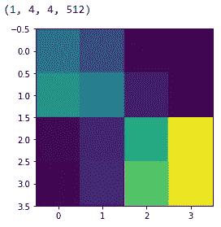**

**Sample Bottleneck Features**

**我们展平 vgg_model 对象中的瓶颈特征，使它们准备好被提供给我们的全连接分类器。在模型训练中节省时间的一种方法是使用该模型，从我们的训练和验证数据集中提取出所有特征，然后将它们作为输入提供给我们的分类器。现在让我们从我们的训练和验证集中提取出瓶颈特性。**

```
****Train Bottleneck Features: (3000, 8192) 	
Validation Bottleneck Features: (1000, 8192)****
```

**前面的输出告诉我们，我们已经为 3，000 幅训练图像和 1，000 幅验证图像成功提取了维度为`**1 x 8192**`的平坦瓶颈特征。现在让我们构建我们的深度神经网络分类器的架构，它将这些特征作为输入。**

**正如我们之前提到的，大小为 8192 的瓶颈特征向量充当我们的分类模型的输入。在密集层方面，我们使用与之前模型相同的架构。现在来训练这个模型。**

```
****Train on 3000 samples, validate on 1000 samples
Epoch 1/30
3000/3000 - 1s 373us/step - loss: 0.4325 - acc: 0.7897 - val_loss: 0.2958 - val_acc: 0.8730
Epoch 2/30
3000/3000 - 1s 286us/step - loss: 0.2857 - acc: 0.8783 - val_loss: 0.3294 - val_acc: 0.8530
Epoch 3/30
3000/3000 - 1s 289us/step - loss: 0.2353 - acc: 0.9043 - val_loss: 0.2708 - val_acc: 0.8700
...
...
Epoch 29/30
3000/3000 - 1s 287us/step - loss: 0.0121 - acc: 0.9943 - val_loss: 0.7760 - val_acc: 0.8930
Epoch 30/30
3000/3000 - 1s 287us/step - loss: 0.0102 - acc: 0.9987 - val_loss: 0.8344 - val_acc: 0.8720****
```

**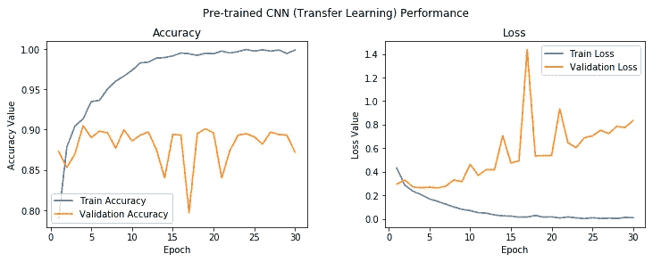**

**Pre-trained CNN (feature extractor) Performance**

**我们得到了一个验证准确率接近 88%的模型，几乎比我们的基本 CNN 图像增强模型提高了 5-6%，这是非常好的。不过，这个模型似乎有些过度拟合了。在第五个时期之后，模型训练和验证准确性之间存在相当大的差距，这在某种程度上表明模型在那之后对训练数据过度拟合。但总的来说，这似乎是目前为止最好的模式。让我们尝试在这个模型上使用我们的图像增强策略。在此之前，我们使用下面的代码将这个模型保存到磁盘。**

```
****model.save('cats_dogs_tlearn_basic_cnn.h5')****
```

## **预训练 CNN 模型作为图像增强的特征提取器**

**我们将利用以前使用的相同的数据生成器来训练和验证数据集。为了便于理解，构建它们的代码描述如下。**

**让我们现在建立我们的深度学习模型并训练它。我们不会像上次一样提取瓶颈特性，因为我们将在数据生成器上进行培训；因此，我们将把`**vgg_model**`对象作为输入传递给我们自己的模型。我们将学习率稍微降低，因为我们将训练 100 个纪元，并且不希望对我们的模型层进行任何突然的权重调整。请记住，VGG-16 模型的层仍然被冻结在这里，我们仍然使用它作为一个基本的特征提取器而已。**

```
****Epoch 1/100
100/100 - 45s 449ms/step - loss: 0.6511 - acc: 0.6153 - val_loss: 0.5147 - val_acc: 0.7840
Epoch 2/100
100/100 - 41s 414ms/step - loss: 0.5651 - acc: 0.7110 - val_loss: 0.4249 - val_acc: 0.8180
Epoch 3/100
100/100 - 41s 415ms/step - loss: 0.5069 - acc: 0.7527 - val_loss: 0.3790 - val_acc: 0.8260
...
...
Epoch 99/100
100/100 - 42s 417ms/step - loss: 0.2656 - acc: 0.8907 - val_loss: 0.2757 - val_acc: 0.9050
Epoch 100/100
100/100 - 42s 418ms/step - loss: 0.2876 - acc: 0.8833 - val_loss: 0.2665 - val_acc: 0.9000****
```

**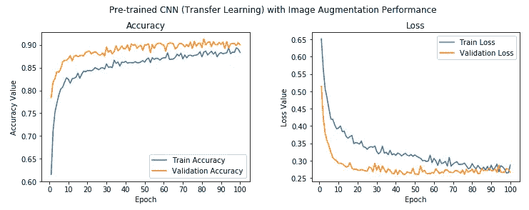**

**Pre-trained CNN (feature extractor) with Image Augmentation Performance**

**我们可以看到，我们的模型的整体验证精度为 **90%** ，比我们之前的模型略有提高，而且训练和验证精度也相当接近，表明模型没有过拟合。现在让我们将这个模型保存在磁盘上，以便将来对测试数据进行评估。**

```
****model.save(‘cats_dogs_tlearn_img_aug_cnn.h5’)****
```

**我们现在将微调 VGG-16 模型以构建我们的最后一个分类器，其中我们将解冻块 4 和 5，正如我们在前面的框图中所描述的那样。**

## **带有微调和图像增强的预训练 CNN 模型**

**我们现在将利用存储在`**vgg_model**`变量中的 VGG-16 模型对象，解冻卷积块 4 和 5，同时保持前三个块冻结。下面的代码帮助我们实现了这一点。**

****

**从前面的输出中可以清楚地看到，属于块 4 和块 5 的卷积和池层现在是可训练的。这意味着当我们传递每批数据时，这些层的权重也将随着每个历元中的反向传播而更新。我们将使用与先前模型相同的数据生成器和模型架构，并训练我们的模型。我们稍微降低了学习速率，因为我们不想陷入任何局部最小值，我们也不想突然更新可训练的 VGG-16 模型层的权重一个可能对模型产生不利影响的大因子。**

```
****Epoch 1/100
100/100 - 64s 642ms/step - loss: 0.6070 - acc: 0.6547 - val_loss: 0.4029 - val_acc: 0.8250
Epoch 2/100
100/100 - 63s 630ms/step - loss: 0.3976 - acc: 0.8103 - val_loss: 0.2273 - val_acc: 0.9030
Epoch 3/100
100/100 - 63s 631ms/step - loss: 0.3440 - acc: 0.8530 - val_loss: 0.2221 - val_acc: 0.9150
...
...
Epoch 99/100
100/100 - 63s 629ms/step - loss: 0.0243 - acc: 0.9913 - val_loss: 0.2861 - val_acc: 0.9620
Epoch 100/100
100/100 - 63s 629ms/step - loss: 0.0226 - acc: 0.9930 - val_loss: 0.3002 - val_acc: 0.9610****
```

**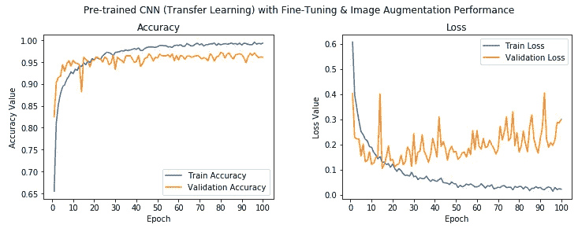**

**Pre-trained CNN (fine-tuning) with Image Augmentation Performance**

**从前面的输出中我们可以看到，我们的模型获得了大约 **96%** 的验证精度，这比我们之前的模型提高了 **6%** 。总体而言，该模型在验证准确性方面比我们的第一个基本 CNN 模型提高了 **24%** 。这真的说明了迁移学习是多么有用。我们可以看到，这里的精度值非常好，尽管模型看起来可能有点过度拟合训练数据，但我们仍然获得了很高的验证精度。现在让我们使用下面的代码将这个模型保存到磁盘上。**

```
****model.save('cats_dogs_tlearn_finetune_img_aug_cnn.h5')****
```

**现在让我们通过在我们的测试数据集上实际评估它们的性能来测试我们所有的模型。**

## **在测试数据上评估我们的深度学习模型**

**我们现在将评估我们到目前为止构建的五个不同的模型，首先在我们的测试数据集上测试它们，因为仅仅验证是不够的！我们还构建了一个叫做`**model_evaluation_utils**`的漂亮的实用模块，我们将使用它来评估我们的深度学习模型的性能。在开始之前，让我们加载必要的依赖项和我们保存的模型。**

**现在是最后测试的时候了，我们通过在测试数据集上进行预测来测试我们的模型的性能。在我们尝试进行预测之前，让我们先加载并准备我们的测试数据集。**

```
****Test dataset shape: (1000, 150, 150, 3)
['dog', 'dog', 'dog', 'dog', 'dog'] [1, 1, 1, 1, 1]****
```

**现在我们已经准备好了缩放数据集，让我们通过对所有测试图像进行预测来评估每个模型，然后通过检查预测的准确性来评估模型性能。**

## **模型 1:基本 CNN 性能**

****

## **模型 2:具有图像增强性能的基本 CNN**

****

## **模型 3:迁移学习——预训练 CNN 作为特征提取器的性能**

****

## **模型 4:迁移学习——预训练的 CNN 作为具有图像增强性能的特征提取器**

****

## **模型 5:迁移学习——具有微调和图像增强性能的预训练 CNN**

****

**我们可以看到，我们肯定有一些有趣的结果。每个后续模型都比前一个模型表现得更好，这是意料之中的，因为我们对每个新模型都尝试了更先进的技术。**

**我们最差的模型是我们的基本 CNN 模型，模型精度和 F1 分数约为 **78%** ，我们最好的模型是我们经过迁移学习和图像增强的微调模型，这使我们的模型精度和 F1 分数为 **96%** ，考虑到我们是从 3000 个图像训练数据集训练我们的模型，这真是令人惊讶。现在让我们画出最坏和最好模型的 ROC 曲线。**

**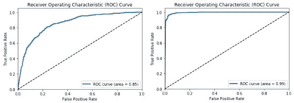**

**ROC curve of our worst vs. best model**

**这应该让你很好地了解预训练模型和迁移学习可以产生多大的影响，特别是在处理复杂问题时，我们有像更少的数据这样的限制。我们鼓励您用自己的数据尝试类似的策略！**

# **案例研究 2:具有大量类别和较少数据可用性的多类别细粒度影像分类**

**现在，在这个案例研究中，让我们升级游戏，让图像分类的任务更加激动人心。在之前的案例研究中，我们构建了一个简单的二进制分类模型(尽管我们使用了一些复杂的技术来解决小数据约束问题！).在这个案例研究中，我们将专注于细粒度图像分类的任务。与通常的图像分类任务不同，细粒度图像分类是指识别更高级别类别中不同子类的任务。**

## **主要目标**

**为了帮助更好地理解这项任务，我们将围绕 [**斯坦福狗**](http://vision.stanford.edu/aditya86/ImageNetDogs/) 数据集进行讨论。顾名思义，这个数据集包含了不同犬种的图像。在这种情况下，任务是识别这些狗的品种。因此，高层次的概念是狗本身，而任务是正确地分类不同的子概念或子类——在这种情况下，是品种。**

**我们将利用通过 [**Kaggle**](https://www.kaggle.com/c/dog-breed-identification/data) 可用[这里](https://www.kaggle.com/c/dog-breed-identification/data)可用的数据集。我们将只使用训练数据集，因为它已经标记了数据。该数据集包含大约 10，000 张 120 种不同犬种的标记图像。因此，我们的任务是建立一个细粒度的 120 类分类模型，对 120 种不同的犬种进行分类。绝对有挑战性！**

## **加载和浏览数据集**

**让我们通过加载数据和查看一批图像样本来看看数据集的样子。**

****

**Sample dog breed images and labels**

**从前面的网格中，我们可以看到在分辨率、照明、缩放级别等方面有很多变化，同时图像不仅仅包含一只狗，还包含其他狗和周围的项目。这将是一个挑战！**

## **构建数据集**

**让我们先看看数据集标签是什么样子的，以便了解我们正在处理什么。**

```
****data_labels = pd.read_csv('labels/labels.csv')
target_labels = data_labels['breed']****print(len(set(target_labels)))
data_labels.head()****------------------
120****
```

****

**我们接下来要做的是使用下面的代码为磁盘中的每个图像添加精确的图像路径。这将有助于我们在模型训练期间轻松定位和加载图像。**

****

**现在是准备我们训练、测试和验证数据集的时候了。我们将利用以下代码来帮助我们构建这些数据集！**

```
****Initial Dataset Size: (10222, 299, 299, 3)****Initial Train and Test Datasets Size: (7155, 299, 299, 3) (3067, 299, 299, 3)****Train and Validation Datasets Size: (6081, 299, 299, 3) (1074, 299, 299, 3)****Train, Test and Validation Datasets Size: (6081, 299, 299, 3) (3067, 299, 299, 3) (1074, 299, 299, 3)****
```

**我们还需要将文本类标签转换为一次性编码标签，否则我们的模型将无法运行。**

```
****((6081, 120), (3067, 120), (1074, 120))****
```

**一切看起来都井然有序。现在，如果您还记得之前的案例研究，图像增强是处理每类数据较少的一种好方法。在这种情况下，我们总共有 10222 个样本和 120 个类。这意味着，平均每堂课只有 85 张图片！我们使用来自`**keras.**`的`**ImageDataGenerator**`实用程序来完成这项工作**

**现在我们已经准备好了数据，下一步就是实际构建我们的深度学习模型！**

## **使用 Google 的 Inception V3 模型进行迁移学习**

**现在我们的数据集已经准备好了，让我们开始建模过程。我们已经知道如何从头开始构建深度卷积网络。我们也了解实现良好性能所需的微调量。在这项任务中，我们将利用迁移学习的概念。预训练模型是开始迁移学习任务所需的基本要素。**

**在这个案例研究中，我们将集中利用一个预先训练的模型作为特征提取器。我们知道，深度学习模型基本上是神经元互连层的堆叠，最后一层充当分类器。这种架构使深度神经网络能够捕捉网络中不同级别的不同特征。因此，我们可以利用这一特性将它们用作特征提取器。这可以通过移除最后一层或使用倒数第二层的输出来实现。倒数第二层的这个输出然后被馈送到另外一组层中，接着是分类层。我们将使用谷歌的 [**Inception V3 模型**](https://www.kaggle.com/google-brain/inception-v3/home) 作为我们的预训练模型。**

**基于前面的输出，您可以清楚地看到，Inception V3 模型非常庞大，有很多层和参数。让我们现在开始训练我们的模型。我们使用`**fit_generator(...)**`方法训练模型，以利用上一步中准备的数据扩充。我们将批量大小设置为`**32**`，并训练 15 个时期的模型。**

```
****Epoch 1/15
190/190 - 155s 816ms/step - loss: 4.1095 - acc: 0.2216 - val_loss: 2.6067 - val_acc: 0.5748
Epoch 2/15
190/190 - 159s 836ms/step - loss: 2.1797 - acc: 0.5719 - val_loss: 1.0696 - val_acc: 0.7377
Epoch 3/15
190/190 - 155s 815ms/step - loss: 1.3583 - acc: 0.6814 - val_loss: 0.7742 - val_acc: 0.7888
...
...
Epoch 14/15
190/190 - 156s 823ms/step - loss: 0.6686 - acc: 0.8030 - val_loss: 0.6745 - val_acc: 0.7955
Epoch 15/15
190/190 - 161s 850ms/step - loss: 0.6276 - acc: 0.8194 - val_loss: 0.6579 - val_acc: 0.8144****
```

**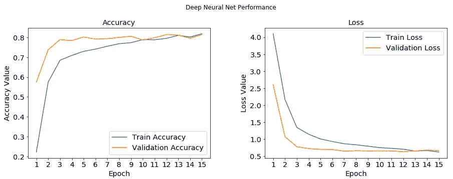**

**Performance of our Inception V3 Model (feature extractor) on the Dog Breed Dataset**

**该模型在仅仅 15 个时期内在训练集和验证集上实现了超过 80%的准确性，这是值得称赞的性能。右边的图显示了损失下降并收敛到大约`**0.5**`的速度。这是一个清晰的例子，说明迁移学习是多么强大而简单。**

## **在测试数据上评估我们的深度学习模型**

**训练和验证性能相当好，但是在看不见的数据上性能如何呢？因为我们已经将原始数据集分成了三个独立的部分。这里要记住的重要一点是，测试数据集必须经历与训练数据集相似的预处理。考虑到这一点，在将测试数据集输入函数之前，我们也要对其进行缩放。**

```
****Accuracy: 0.864
Precision: 0.8783
Recall: 0.864
F1 Score: 0.8591****
```

**该模型实现了惊人的 **86%** 准确率以及测试数据集上的 F1 分。考虑到我们刚刚用我们这边最少的输入训练了 15 个纪元，迁移学习帮助我们实现了一个相当不错的分类器。我们还可以使用下面的代码来检查每个类的分类指标。**

**我们还可以使用下面的代码以一种视觉上吸引人的方式可视化模型预测。**

**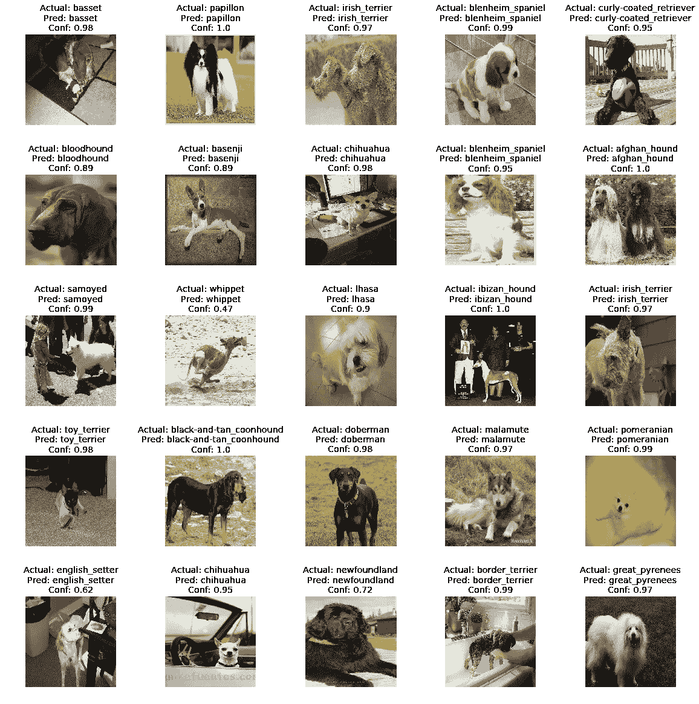**

**Model predictions on test data for dog breeds!**

**上图展示了模型性能的直观证明。正如我们所看到的，在大多数情况下，该模型不仅预测正确的狗品种，而且有很高的可信度。**

# **转移学习优势**

**在前面的章节中，我们已经以这样或那样的方式介绍了迁移学习的一些优点。通常，迁移学习使我们能够建立更强大的模型，这些模型可以执行各种各样的任务。**

*   **有助于解决具有多种约束的复杂现实问题**
*   **解决诸如很少或几乎没有标注数据可用性的问题**
*   **基于领域和任务，将知识从一个模型转移到另一个模型的容易程度**
*   **提供了一条在未来某一天实现人工智能的道路！**

# **转移学习挑战**

**迁移学习具有巨大的潜力，是现有学习算法普遍需要的改进。然而，有一些与迁移学习相关的问题需要更多的研究和探索。除了难以回答转移什么、何时转移和如何转移的问题之外，负转移和转移界限也提出了重大挑战。**

*   ****负迁移:**到目前为止，我们讨论的案例都是基于源任务的知识迁移来讨论目标任务的改进。迁移学习有时会导致成绩下降。负迁移是指知识从源到目标的迁移并没有带来任何改善，反而导致目标任务的整体绩效下降。负迁移可能有多种原因，例如源任务与目标任务没有足够的相关性，或者迁移方法不能很好地利用源任务和目标任务之间的关系。避免负迁移非常重要，需要仔细研究。在他们的工作中，Rosenstien 和他们的合作者根据经验展示了当源和目标太不相似时，蛮力转移如何降低目标任务的性能。Bakker 和他们的合著者的贝叶斯方法，以及其他探索基于聚类的解决方案以识别相关性的技术，正在被研究以避免负迁移。**
*   ****迁移界限:**迁移学习中量化迁移也很重要，它影响迁移的质量及其可行性。为了测量迁移的数量，Hassan Mahmud 和他们的合作者使用 Kolmogorov 复杂性来证明某些理论界限，以分析迁移学习和测量任务之间的相关性。伊顿和他们的合著者提出了一种新颖的基于图表的方法来衡量知识转移。对这些技术的详细讨论超出了本文的范围。鼓励读者使用本节中概述的出版物来探索这些主题的更多内容！**

# **结论和未来范围**

**这可能是我最长的一篇文章了，它全面地介绍了迁移学习的概念、策略、深度迁移学习的重点、挑战和优势。我们还介绍了两个实际案例研究，让您很好地了解如何实现这些技术。如果你正在阅读这一部分，通读这篇相当长的文章值得称赞！**

**迁移学习肯定会成为机器学习和深度学习在行业主流采用中取得成功的关键驱动因素之一。我绝对希望看到更多的预训练模型和创新的案例研究，它们利用了这一概念和方法。对于我未来的一些文章，你肯定可以期待下面的一些。**

*   **自然语言处理的迁移学习**
*   **音频数据的迁移学习**
*   **面向生成性深度学习的迁移学习**
*   **更复杂的计算机视觉问题，如图像字幕**

**让我们期待更多关于迁移学习和深度学习的成功故事，使我们能够建立更多智能系统，让世界变得更美好，并推动我们自己的个人目标！**

**以上所有内容都以某种形式摘自我最近的一本书，[](https://github.com/dipanjanS/hands-on-transfer-learning-with-python)**，这本书可以在 [**Packt**](https://www.packtpub.com/big-data-and-business-intelligence/hands-transfer-learning-python) 网站以及 [**Amazon**](https://www.amazon.com/Hands-Transfer-Learning-Python-TensorFlow-ebook/dp/B07CB455BF/ref=zg_bsnr_16977170011_71?_encoding=UTF8&psc=1&refRID=3VS8TYPZGN776BFEZJVG) 上找到。****

***[](https://www.amazon.com/Hands-Transfer-Learning-Python-TensorFlow-ebook/dp/B07CB455BF/ref=zg_bsnr_16977170011_71?_encoding=UTF8&psc=1&refRID=3VS8TYPZGN776BFEZJVG) [## 用 Python 实践迁移学习:实现高级深度学习和神经网络模型…

### 深度学习通过监督、非监督和强化学习简化到下一个级别，使用…

www.amazon.com](https://www.amazon.com/Hands-Transfer-Learning-Python-TensorFlow-ebook/dp/B07CB455BF/ref=zg_bsnr_16977170011_71?_encoding=UTF8&psc=1&refRID=3VS8TYPZGN776BFEZJVG) 

没有时间通读这本书或者现在没有时间？别担心，您仍然可以访问我们在 [***GitHub 库***](https://github.com/dipanjanS/hands-on-transfer-learning-with-python) 上实现的所有精彩示例和案例研究！

[](https://github.com/dipanjanS/hands-on-transfer-learning-with-python) [## dipanjanS/用 python 实践迁移学习

### 通过使用 Python 深度学习生态系统转移先前的学习来简化深度学习…

github.com](https://github.com/dipanjanS/hands-on-transfer-learning-with-python) 

非常感谢我的合著者[***Raghav***](https://www.linkedin.com/in/baliraghav)&[***Tamoghna***](https://www.linkedin.com/in/tamoghna-ghosh-3b741220)与我一起为这本书铺平了道路！

感谢 Francois Chollet 和他令人惊叹的书 [***【用 Python 进行深度学习】***](https://www.manning.com/books/deep-learning-with-python) 为本文中使用的一些示例提供了很多动机和灵感。

[](https://www.manning.com/books/deep-learning-with-python) [## 使用 Python 进行深度学习

### 我所见过的关于深度学习的最清晰的解释…阅读是一种享受。

www.manning.com](https://www.manning.com/books/deep-learning-with-python) 

有反馈给我吗？或者有兴趣与我一起从事研究、数据科学、人工智能甚至发表一篇关于[***TDS***](https://towardsdatascience.com/)的文章？可以在[**LinkedIn**](https://www.linkedin.com/in/dipanzan/)**上联系我。**

[](https://www.linkedin.com/in/dipanzan/) [## Dipanjan Sarkar —数据科学家—英特尔公司| LinkedIn

### 查看 Dipanjan Sarkar 在世界最大的职业社区 LinkedIn 上的个人资料。Dipanjan 有 6 份工作列在…

www.linkedin.com](https://www.linkedin.com/in/dipanzan/) 

感谢 [*Durba*](https://www.linkedin.com/in/durba-dutta-bhaumik-44532ab1/) 编辑本文。***