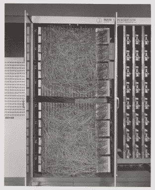

# 神经网络简史

> 原文：<https://towardsdatascience.com/a-concise-history-of-neural-networks-2070655d3fec?source=collection_archive---------0----------------------->

> “从我们个人设备内部贫瘠的土地上，传来了那些有朝一日将成为我们霸主的数字仆人偷偷哼唱的颂歌”
> 
> [人工智能冬季](http://aiwinter.bandcamp.com/)

毫不奇怪，神经网络的想法最初是作为大脑中神经元如何运作的模型出现的，被称为“连接主义”，并使用连接电路来模拟智能行为。1943 年，神经生理学家沃伦·麦卡洛克和数学家沃尔特·皮茨用一个简单的电路描绘了它。唐纳德·赫布(Donald Hebb)在他的著作《行为的组织》(The Organization of Behaviour，1949)中进一步发展了这一观点，提出神经通路在每次连续使用后都会加强，尤其是在倾向于同时放电的神经元之间，从而开始了量化大脑复杂过程的漫长旅程。

作为神经网络前身的两个主要概念是

*   “阈值逻辑”——将连续输入转换为离散输出
*   “赫比学习”(hebbian Learning)——一种基于神经可塑性的学习模式，由唐纳德·赫比(Donald Hebb)在其著作《行为的组织》(The Organization of Behaviour)中提出，通常用一句话来概括:“一起放电的细胞，连接在一起。”

两者都是在 20 世纪 40 年代提出的。在 20 世纪 50 年代，当研究人员开始尝试将这些网络转换到计算系统上时，第一个 Hebbian 网络于 1954 年在麻省理工学院成功实现。

大约在这个时候，康奈尔大学的心理学家弗兰克·罗森布拉特(Frank Rosenblatt)正致力于理解苍蝇眼中相对简单的决策系统，这些系统是苍蝇逃跑反应的基础和决定因素。为了试图理解和量化这一过程，他在 1958 年提出了感知机的概念，称之为 Mark I 感知机。这是一个具有简单输入输出关系的系统，以*麦卡洛克-皮茨*神经元为模型，由神经科学家沃伦·s·麦卡洛克和逻辑学家沃尔特·皮茨在 1943 年提出，以使用线性阈值门来解释大脑中复杂的决策过程。麦卡洛克-皮茨神经元接受输入，进行加权求和，如果结果低于阈值，则返回“0”，否则返回“1”。

A McCulloch-Pitts neuron

Mark I 感知器的优点在于，它的权重可以通过连续传递的输入来“学习”,同时最小化期望输出和实际输出之间的差异。

First known implementation of a Mark I Perceptron. The machine was connected to a camera that used 20×20 [cadmium sulfide](https://en.wikipedia.org/wiki/Cadmium_sulfide) [photocells](https://en.wikipedia.org/wiki/Photocell) to produce a 400-pixel image. The main visible feature is a patchboard that allowed experimentation with different combinations of input features. To the right of that are arrays of [potentiometers](https://en.wikipedia.org/wiki/Potentiometer) that implemented the adaptive weights.[[wiki](https://en.wikipedia.org/wiki/Perceptron#cite_note-bishop-2)]

一个主要的缺点？这种感知器只能学习分离线性可分的类，使得简单但非线性的异或电路成为不可逾越的障碍。

尽管使用机器学习来量化除大脑之外的决策系统出现了混乱和有些令人不满意的情况，但今天的人工神经网络只不过是这些感知机的几层。

大约在这个时候，神经网络开始迅速发展。1959 年，伯纳德·维德罗和马尔西安·霍夫在斯坦福开发了第一个成功应用于现实世界问题的神经网络。这些系统因使用了多种自适应线性元件而被命名为 ADALINE 和 MADALINE，后者是专门为消除电话线中的噪声而设计的，至今仍在使用(！).然而，这些人工神经元与感知器的不同之处在于它们返回的输出，在这种情况下是加权输入。

正如历史上人工智能技术的每一次小进步一样，这些早期的成功导致了对神经网络能力和潜力的越来越多的炒作，而研究人员却遇到了一个又一个的路障。在围绕这些“思维机器”的宣传达到高潮时，纽约时报发表了[这篇关于神经网络潜力的](http://www.nytimes.com/1958/07/08/archives/new-navy-device-learns-by-doing-psychologist-shows-embryo-of.html)文章，而这段视频也在大约同一时间发布。

就像之前的几次“千钧一发”一样，我们仍然没有像我们一直喜欢相信的那样(或者恐惧，取决于你如何看待它)接近喷出有意识的人造生命。出现的问题之一是运行这些网络所需的不切实际的长运行时间，因为这是 60 年代，除了它不能学习简单的布尔异或电路。

1969 年，随着麻省理工学院人工智能实验室创始人马文·明斯基和实验室主任西蒙·派珀特合著的《感知机》一书的出版，这一切都告一段落。这本书最终认为，罗森布拉特对神经网络的单一感知方法不能有效地转化为多层神经网络。基于最终输出来评估跨层分布的神经元的权重的正确相对值将花费若干次(如果不是无限次的话)迭代，并且将花费非常长的时间来计算。

明斯基在他的文章中阐述了神经网络的这些和其他问题，并有效地引导了更大的科学界，最重要的是资助机构得出结论，在这个方向上的进一步研究是没有结果的。这篇文章的影响是巨大的，在接下来的 10-12 年里，没有人在当时最大的研究机构中，也没有人在较小的研究机构中，承担任何以注定失败的神经网络为前提的项目。现在被称为“人工智能冬天”的时代开始了。

这十年漫长冬天的解冻始于 1982 年，当时 Jon Hopfield 在美国国家科学院提交了他的论文，该论文后来被称为 [Hopfield Net](http://www.scholarpedia.org/article/Hopfield_network) 同年，在美日合作/竞争神经网络会议上，日本宣布打算开始其第五代神经网络研究。这使得资金从一个害怕被抛在后面的国家的金库中重新开始流动。不久，美国物理研究所于 1985 年建立了“计算中的神经网络”年会，随后由电气和电子工程师协会(IEEE)于 1987 年召开了第一次神经网络国际会议。

然而，这是对自 60 年代以来就存在的概念的重大重新发现，帮助神经网络走出了它过早的坟墓。反向传播，一种自 60 年代以来由研究人员设计并持续发展到人工智能冬天的方法，是一种基于直觉的方法，随着人们在事件链中走得更远，它将每个事件的重要性降低。第一个看到它们在神经网络方面的潜力并解决如何将其转化为 MLP 氏症的问题的人是保罗·沃博斯，他部分受到了神经网络在人类思维中的应用以及弗洛伊德关于学分分配逆向流动的工作的启发，写了一篇博士论文阐述了它们的重要性。然而，直到 1985 年帕克在麻省理工学院发表了一份关于他的工作的报告，这项工作才被社区中的任何人注意到。只是在被 Rumelhart、Hinton 和 Williams 重新发现并在一个清晰而详细的框架中重新发表后，这项技术才在社区中引起了轰动。这些作者还在后来的[文本](http://psych.stanford.edu/~jlm/papers/PDP/Volume%201/Chap8_PDP86.pdf)中提到了明斯基在 1969 年的出版物中列出的具体缺点。

反向传播和梯度下降形成了神经网络的主干和动力。虽然梯度下降不断更新权重和偏差并将其移向成本函数的最小值，但反向传播通过权重和偏差来评估成本的梯度，梯度下降使用其大小和方向来评估权重和偏差参数的校正大小和方向。

A simple visual description of the movement towards the minima of a 2d function. The step-size of jump is determined by the value of the gradient at each point.

因此，到了 20 世纪 90 年代，神经网络肯定又回来了，这一次真正抓住了世界的想象力，并最终达到了它的期望，如果不是超越的话。然而，我们再次向人工智能提出同样的问题，并把我们所有人的恐惧投射到它身上，然而，我们再次[比我们想象的](https://www.technologyreview.com/s/546301/will-machines-eliminate-us/?utm_campaign=socialflow&utm_source=facebook&utm_medium=post)更远离向我们的数字霸主低头。

*如果你喜欢阅读这样的故事，并想支持我的写作，请考虑注册成为一名灵媒会员。每月 5 美元，你可以无限制地阅读媒体上的所有报道。如果你使用* [*我的链接*](https://medium.com/@Jaconda/membership) *注册，我会收到一点佣金。*