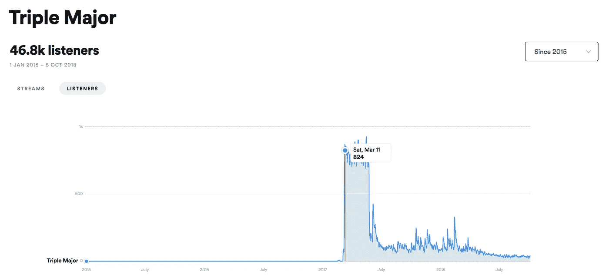
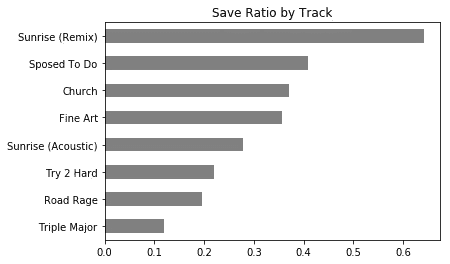
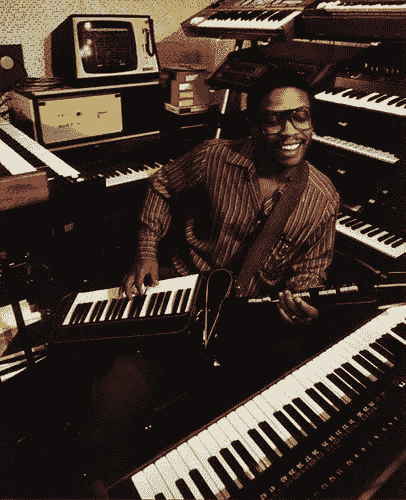
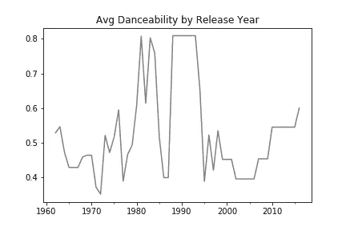

# FYK 和赫比·汉考的数据追溯

> 原文：<https://towardsdatascience.com/a-data-retro-on-fyk-and-herbie-hancock-93d92cc41e11?source=collection_archive---------12----------------------->

我的全职工作是一名数据工程师(我有[关于](https://medium.com/@kennyning/posing-as-a-data-engineer-261f665003a4)的想法)，但我也是一名活跃的音乐家。在过去的两年里，我作为嘻哈歌手，发行了 10 首歌曲。当我开始为我的下一个音乐项目集思广益时，我想知道:我的音乐是否有某些音质在 Spotify 上表现得更好？我是应该少说唱，多唱歌，还是根本不唱？我应该让我的音乐更有趣还是更情绪化？让我们看看通过 Spotify 的 API 和 Spotify for Artists 提供的数据能告诉我们什么。

# FYK

我的曲目中有很多数据可以直接从 [Spotify for Artists](https://artists.spotify.com/) 数据门户下载。首先，让我们来看看我所有时间流的热门曲目。

我基本上是昙花一现。我的歌，[三重大调](https://open.spotify.com/album/75aP1uSZaCaZZZeKABVVkT?si=8z38hIkLRA6FvSA8iwM-ug)有将近 140K 的流，而我的中值曲目有~300 的流。

虽然我很想说 Triple Major 如此成功的原因是因为它是一个直截了当的 BANGER(确实如此)，但它做得好的真正原因是因为 Kpop。我被 taste maker[Christina Choi](https://www.instagram.com/chrischoi86/)选中，她把这首歌放到了她的播放列表中，该列表拥有> 24 万粉丝(旁注:我实际上不是韩国人，但谁会去计算呢？？).在下图中，你可以看到由于这种放置和新粉丝的后续流而产生的大峰值。

这种消费实际上直接进入了《发现周刊》,而我有一段时间在这方面游刃有余。现在热度已经下降了一点，重复这一成功是一个挑战。播放列表的力量是真实的。

## 储蓄比率

因为我的信息流是多么的不均衡，我不能仅仅依靠信息流来衡量我的成功。相反，让我们看看每首曲目的**保存比率**(总保存数除以总唯一听众数)。这个概念更接近我作为一个艺术家想要最大化的东西:让人们对一首歌做出如此积极的反应，以至于他们保存了它。

[Sunrise (Remix)](https://open.spotify.com/album/5Rsua0CY0MFLi7bu5o3GGm?si=BVHSPc4WRySzt3DZA7Verg) ，一首有 rap 桥段的 r & b/pop 歌曲，保存率最高，也恰好是我最喜欢的一束歌。第二个是 [Sposed To Do](https://open.spotify.com/track/5YhJDsvPacYVY9UBGrif3n?si=31emLAuERkuThvK_Rl0xAA) ，这是一首罂粟原声歌曲，在我最后一次演出时，我惊讶地发现人们居然知道歌词。有趣的是，这看起来还不错。

## 音频功能与存储比率

下一个合乎逻辑的问题是，“这首歌有什么特别的品质使它更有可能被保存下来？”

我们可以通过 python [spotipy](https://github.com/plamere/spotipy) 库直接从 Spotify API 获取“音频功能”。[音频特征](https://developer.spotify.com/documentation/web-api/reference/tracks/get-audio-features/)用 0 到 1 的分数来表示一首歌曲的“可跳舞”或“活力”程度。

对于我的每一首曲目，我们来看看它们的音频特征，看看和保存率有没有关系。

每个点是一个轨迹，每个图表示给定音频特征(例如可跳舞性)和保存率之间的关系。这里唯一有点意思的关系是价，Spotify 的文档将其描述为:

> 从 0.0 到 1.0 的测量值，描述轨道所传达的音乐积极性。高价曲目听起来更积极(例如，快乐、愉快、欣快)，而低价曲目听起来更消极(例如，悲伤、沮丧、愤怒)。

我的音乐在效价和保存率之间有一个负的关系，这意味着我应该用更低的效价制作更多的音乐，即更悲伤的歌曲。我一直认为我是一个积极的歌手/说唱歌手，但也许是时候改变一下了。我是说，你更喜欢德雷克还是威尔·史密斯？

# 赫比·汉考

老实说，鉴于我的曲目很少，听的人也很少，很难从我自己的数据中得出任何真正的结论:(。让我们把这个框架应用到一个拥有令人难以置信的目录的艺术家身上:美国爵士钢琴家，**赫比·汉考**。

赫比的音乐生涯跨越了 50 多年，我认为他是所有活着的音乐家中最好的。虽然他可以说最出名的是他在爵士乐方面的创新，如《猎头》 (1973)，但其他人可能会提到他在米勒·戴维斯[第二大五重奏](https://en.wikipedia.org/wiki/Miles_Davis_Quintet#Second_Great_Quintet_(1964%E2%80%9368))(1964-68)，嘻哈经典 [Rockit](https://www.youtube.com/watch?v=GHhD4PD75zY) (1984)，或他 2007 年凭借 [River: The Joni Letters](https://open.spotify.com/album/3GwR5VxaMzB01ay6qIT3Yq?si=VoO7vOMMTuqwblJfih7rwQ) 获得格莱美年度专辑奖。时至今日，这位音乐变色龙已年近 80，但仍然活力十足。他的下一张专辑将主打当代嘻哈音乐，如肯德里克·拉马尔、雷猫和卡马西·华盛顿。

我强烈推荐阅读他的传记《可能性》。这个人以如此谦逊的方式讲述了惊人的故事，这在人类层面上和在音乐家层面上都激励了我。

让我们看看 Spotify 的 API 能告诉我们赫比惊人的职业生涯。

## 目录

赫比·汉考在 Spotify 上有多达 54 张专辑(包括录音室专辑和编辑/重新发行的专辑)。在他 50 多年的音乐生涯中，平均每年大约发行一张专辑。

从这张图表中我们可以看出，赫比在 70 年代是最多产的。特别是，他仅在 1979 年就发行了 5 张专辑。

大约在那个时候，我们也知道赫比·汉考开始更多地尝试他的电子爵士乐，其中包括一些我最喜欢的唱片，如 Head Hunters，Thrust 和 sunshine。也许我们可以使用之前介绍的音频特性来可视化这种效果。

如果我们看看赫比音乐的舞蹈性，我们可以看到它在 80 年代真正开始上升，因为他开始更倾向于迪斯科/电音。1986 年的大衰退是因为他在《午夜圆》电影原声带上的工作，但他在 1988 年用《完美机器》做了最后一张“可跳舞的”专辑，然后回归到一种更声学的声音。

势不可挡，对吧？如果你刚开始听 Herbie，也许他在 Spotify 上最受欢迎的 5 张专辑是很好的聆听灵感:

> 《九天之岛》( 1964 年)
> 
> 猎头(1973)
> 
> 处女航(1965 年)
> 
> 哈密瓜岛(1994)
> 
> 起飞(1962)

我很惊讶看到九天岛打败了猎头！虽然有些人可能会说这是因为 Spotify 的听众喜欢模态爵士乐而不是爵士放克(jazz-funk)，但这很可能是因为 Empyrean Isles 包含了哈密瓜岛的首张录音，可以说是赫比最著名的爵士乐作品，也是最值得播放的(是的，这是一个词)。受欢迎程度是最近流式传输的函数，因此受播放列表的影响很大。

**音频特性与流行度**

虽然有 Herbie 所有曲目的保存率是很好的，但这个数据是不公开的，所以我们必须坚持流行度。类似于我们对 FYK 所做的，让我们看看音频特征和流行度之间是否有任何明显的相关性:

对于更适合跳舞、更有活力、更高价的赫比音乐来说，似乎存在温和的正相关关系。这并不奇怪，因为流行音乐通常更有活力。

工具性与流行度呈轻度负相关。说来有趣，我好像发现大部分人都不喜欢纯器乐。这种效果似乎也适用于赫比。

这对赫比·汉考意味着什么？我认为这对他的下一个项目是个好兆头，该项目将由嘻哈音乐超级制作人 Terrace Martin 制作，并将邀请当代爵士乐/嘻哈音乐皇室成员如 Kendrick Lamar、Thundercat 和 Snoop Dogg。一张以歌手为特色的高能专辑听起来很符合他过去在 Spotify 上的表现。赫比实际上有工程背景，并在他的书中谈了很多关于拥有分析头脑的内容，所以我不会否认他已经完成了完全相同的分析…

# 说真的，基于数据的艺术家发展？

我认为流媒体时代的一大好处是发现新人才变得非常容易。我们正处于音乐推荐的黄金时代，每周都会发现一个新的最喜欢的艺术家，这并不罕见。

发现天才很容易，但将这种天才培养成职业艺术家却很难。这就是我认为有很多机会使用数据来了解历史上哪些创造性决策可行，哪些不可行的地方。最棒的是，这些信息对任何人都是公开的。即使你是一名独立艺术家，你也能接触到比你想象的更多的信息。虽然拥有一些数据会有所帮助，但我不认为这需要一个科学家用批判的眼光来处理你的音乐创作过程。我已经看到艺术家经理开始扩展他们的数据技能，但我认为我们艺术家也是时候进步了。

查看 [Jupyter 笔记本](https://github.com/kning/blog_posts/blob/master/notebooks/data-retro-fyk-herbie.ipynb)详细描述了这一分析，还有 FYK: