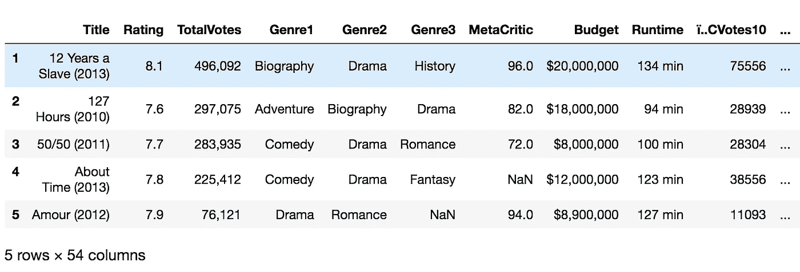

# 数据科学工作流

> 原文：<https://towardsdatascience.com/a-data-science-workflow-26c3f05a010e?source=collection_archive---------0----------------------->


Photo by Kevin Ku from Pexels [https://www.pexels.com/photo/coding-computer-data-depth-of-field-577585/](https://www.pexels.com/photo/coding-computer-data-depth-of-field-577585/)

Jupyter 笔记本可以在这里找到。

没有解决数据科学问题的模板。路线图会随着每个新数据集和新问题而变化。但是我们确实在许多不同的项目中看到类似的步骤。我想创建一个干净的工作流程，作为有抱负的数据科学家的榜样。我还想给与数据科学家一起工作的人一个易于理解的数据科学指南。

这是一个高层次的概述，概述中的每一步(以及几乎每一句话)都可以单独解决。许多书籍，如哈斯蒂和蒂布希拉尼的《T2 统计学习导论》和许多课程，如吴恩达在斯坦福大学的机器学习课程，更详细地探讨了这些主题。数据科学社区有大量的文献和资源。一定要深入任何你感兴趣的话题。

# 概述:

1.  目标
2.  导入数据
3.  数据探索和数据清理
4.  基线建模
5.  二次建模
6.  交流结果
7.  结论
8.  资源

最后，我想说这个过程不是完全线性的。随着你对数据了解的越来越多，你会跳来跳去，并发现新的问题需要解决。

我们开始吧！

# **1)目标**

你想解决的问题是什么？从等式中删除建模、评估指标和数据科学。你的公司面临的问题是什么？你想进一步了解什么？清楚地陈述你的问题是解决问题的第一步，没有一个清楚的问题，你会发现自己陷入了数据科学的兔子洞。

对于此工作流，我们将分析 IMDB.com 排名最高的电影。我想建立一个模型来预测 IMDB 电影评级的基础上，如预算，运行时间和网站上的投票功能。

# 2)导入数据

数据可以来自各种来源。您可以从本地计算机导入 CSV 文件，查询 SQL 服务器，或者使用 web scraper 从 Internet 上提取数据。我喜欢用 Python 库，**熊猫* *，导入数据。Pandas 是一个非常棒的开源数据分析库。我们还将在这个工作流程的数据清理步骤中使用 Pandas。

对于本例，我们将从本地机器导入数据。我将使用 Kaggle.com 用户 Sai Pranav 的数据集。该数据集的标题是“这十年排名靠前的英语电影”，它是在一个 CSV 文件中。

[](https://www.kaggle.com/saipranava/top-ranked-enlglish-movies-of-this-decade/data) [## 这十年排名最高的英语电影。

### 理解高收视率电影的成功。

www.kaggle.com](https://www.kaggle.com/saipranava/top-ranked-enlglish-movies-of-this-decade/data) 

```
import pandas as pd 
df = pd.read_csv(‘/Users/aakashtandel/Downloads/IMDB.csv’, index_col=0, encoding=’latin-1')
```

我想马上说，这个数据集非常小。观察次数相对较少。但是因为这只是一个示例问题，所以我可以继续。在工业界，你肯定会想要一个更大的数据集。

# 3)数据探索

现在我们已经将数据导入到 Pandas 中，我们可以检查数据帧的前几行。

```
df.head()
```



我喜欢一开始就做三个区分。这是监督学习还是非监督学习？这是分类问题还是回归问题？这是预测问题还是推理问题？

**监督或无监督学习**:有了监督学习，我们已经明确标注了因变量和自变量。因变量(我们的目标)是已知的。如果我们在看线性回归，我们的 *y* 变量是显而易见的。如果我们确实有一个明确标记的 *y* 变量，我们正在执行监督学习，因为计算机正在从我们明确标记的数据集学习。它正在学习我们的 *x* 变量和我们的 *y* 变量之间的关系。监督学习可以分解为回归和分类问题。无监督学习，我们没有一个明确的因变量。我们有一个 x 变量的特征矩阵，没有 y 变量。无监督学习问题可能涉及聚类和创建关联。在这篇概述中，我不会涉及集群，但是这是一个很好的学习技巧。此外，从数据探索的角度来看，无监督学习可能是有益的。

**分类或回归**:现在我们知道我们有一个监督学习问题，我们可以决定它是分类问题还是回归问题。我查看 *y* 变量，并确定该变量是连续变量还是离散变量。分类 *y* 变量属于分类设置，而连续数量变量属于回归设置。分类问题的一个例子是确定信用卡交易是否是欺诈性的。这是一个二元分类问题，因为每笔交易要么是欺诈性的，要么不是欺诈性的。回归问题的经典例子是根据平方英尺、卧室数量和地块大小等特征来确定房子的价格。

**预测或推断**:在预测设置中，我们希望我们的模型估计一个 *y* 值，给定各种特征。从上面的回归示例中，我们希望为我们的模型提供一栋 1500 平方英尺、两间卧室和一块 0.50 英亩土地的房子。然后我们的模型会预测房子价值 20 万美元。在推理设置中，我们想知道一个特征( *x* 变量)如何影响输出( *y* 变量)。我们可以看到当你给房子增加一个额外的卧室时，房子的价格是如何增加的。

在解决您的数据科学问题时，这三组问题可以提供很多指导。

在我们的示例中，我们将使用回归(监督学习)从元批评评级、预算、运行时间和投票中预测 IMDB 评级。

回到编码部分！让我们确定哪个变量是我们的目标，哪些特征是我们认为重要的。

我们的目标是标题为 Rating 的列，我们的功能是标题如下的列:MetaCritic、Budget、Runtime、VotesUS、VotesnUS 和 TotalVotes。我将删除本次分析不需要的所有列。

```
df = df[['Title', 'Rating', 'TotalVotes', 'MetaCritic', 'Budget', 'Runtime', 'VotesUS', 'VotesnUS']]
```

Pandas 和 Matplotlib(一个流行的 Python 绘图库)将帮助我们进行大部分的探索。**探索性数据分析(EDA)** 让数据科学家有机会真正了解他或她正在处理的数据。许多数据科学家发现自己后来又回到了 EDA 以及他或她在 EDA 中发现的发现。

在整个 EDA 过程中，我清理数据。来自真实世界的数据非常杂乱。但是，当我在 EDA 过程中工作并学习数据时，我会记下需要修改的地方，以便进行分析。**数据清洗**对我来说和 EDA 齐头并进。我在这两个阶段之间工作了相当长的时间，我经常发现自己又回到了这两个阶段。

我首先检查的是数据类型。以正确的格式获取所有值非常重要。这可能涉及到从字符串中剥离字符、将整数转换成浮点数或许多其他事情。

```
df.dtypesdf.TotalVotes = df.TotalVotes.str.replace(',', '')
df.TotalVotes = df.TotalVotes.astype(int)
# Total Votes column is ready.df = df[(df.Budget.str.contains("Opening") == False) & (df.Budget.str.contains("Pathé") == False)]
df.Budget = df.Budget.str.replace('[^\x00-\x7F]','')
df.Budget = df.Budget.str.replace(',', '')
df.Budget = df.Budget.str.replace('$', '')
df.Budget = df.Budget.astype(int)
# Budget column is ready.df.Runtime = df.Runtime.str.extract('(\d+)', expand=False)
# Runtime column is now ready.
```

**缺失值**和空值很常见。有时你有很大的矩阵，但里面的信息很少。这些被称为稀疏矩阵。处理缺失值和空值本身就是一个完整的主题。这个话题被称为**缺失数据插补**，我不能在这里深入探讨。一定要查找更多关于这个主题的信息，尤其是当你遇到稀疏矩阵的时候。出于我们的目的，我将简单地删除具有空值的电影。这并不总是最好的主意，但是在这个分析中我选择了这样做。

```
df = df.dropna()df.Runtime = df.Runtime.astype(int)
df.VotesnUS = df.VotesnUS.astype(float)
df.VotesUS = df.VotesUS.astype(float)
```

有许多不同的方法可以对你的数据进行 EDA。检查缺失值、检查数据类型和格式化数据只是冰山一角。寻找唯一值的数量。使用 Pandas describe 方法获得列的汇总统计信息。在数据分析过程的这个阶段，Pandas 是一个非常有用的工具，熟悉 Pandas 的数据清理对于任何数据科学家来说都是一个必不可少的工具。

EDA 的最后一部分是绘图。**绘图**非常重要，因为它允许你直观地检查你的数据。直方图、散点图和箱线图都可以用来提供对数据问题的另一层洞察。对于这个例子，我们将使用熊猫来创建一个散布矩阵。

```
import matplotlib.pyplot as plt
pd.plotting.scatter_matrix(df, figsize=(20,20))
plt.show()
```

在数据探索和清理阶段，我还执行**特征工程**。特征工程是从旧特征中构造新特征。特征工程的一些基本类型是从两个特征中创建交互变量或为时间序列分析创建滞后变量。特征工程是我将在这个工作流程中讨论的另一个主题，但它不应该被遗忘。

# 4)基线建模

作为一名数据科学家，你会建立很多模型。您将使用各种算法来执行各种各样的任务。你需要用直觉和经验来决定什么时候某些模型是合适的。作为一名职业经济学家，我更喜欢用**线性回归**来解决我的回归问题，用**逻辑回归**来解决我的分类问题。(我也倾向于使用 **kNN** 用于基线分类模型，使用 **K-Means** 作为我在无监督学习中的第一个聚类算法。)这些模型会给你一个可以改进的基线。

在 Kaggle 竞赛中，许多获胜者使用先进的**神经网络**、 **XGBoost** 或**随机森林**来解决数据科学问题。所有这些都将随后出现，应该会比线性回归和逻辑回归给我们带来更准确的预测。

**Scikit-Learn** 是一个 Python 的机器学习包，可以用于各种任务。我们可以使用 Scikit-Learn 进行建模(分类、回归和聚类)。它还可以用于降维(主成分分析)、模型选择(网格搜索、评估度量)和数据预处理。当您在 Scikit-Learn 中工作时，不同算法的建模基础是相似的。

在模型**预处理**期间，我们将从因变量中分离出我们的特征，全面扩展数据，并使用**训练-测试-分割**来防止我们的模型过度拟合。过度拟合是指当我们的模型过于紧密地跟踪我们的训练数据，并且当它被输入新数据时，它的表现不好。这意味着该模型不能很好地推广到新问题。该模型会拾取训练数据中的所有噪声，并记忆下来。创建训练-测试-分割有助于对抗过度拟合。此外，我们可以使用**交叉验证**来防止过度拟合。一定要自己查找更多关于交叉验证的信息。

```
y = df.Rating
X = df[['TotalVotes', 'MetaCritic', 'Budget', 'Runtime', 'VotesUS', 'VotesnUS']]
# We need to separate our feature matrix from our y variable for Sklearn.from sklearn.preprocessing import MinMaxScaler
cor_X = MinMaxScaler().fit_transform(X)from sklearn.model_selection import train_test_split
X_train, X_test, y_train, y_test = train_test_split(cor_X, y, test_size=0.2)
print (X_train.shape, y_train.shape)
print (X_test.shape, y_test.shape)
```

现在我们准备使用我们的模型。我们将**根据训练数据拟合**我们的模型。然后，我们将通过让**预测我们的 *X_test* 数据的** *y* 值来测试我们的模型。然后，我们可以**通过查看预测的 *y* 值与实际的 *y* 值相差多远来评估**我们的模型表现得有多好。

```
from sklearn import linear_model
lm = linear_model.LinearRegression()
model = lm.fit(X_train, y_train)
predictions = lm.predict(X_test)plt.scatter(y_test, predictions)
plt.xlabel('True y')
plt.ylabel('Predicted y')
plt.show()
# Graph print ('Score:', model.score(X_test, y_test))  # R-squared is the default metric used by Sklearn.
```

我们的模型表现得相当好。它能够达到 0.96 的 R 平方。这个评估指标 R 平方是一个拟合优度指标。它是我们的模型解释的我们的 *y* 变量的变化百分比。对于这个回归问题，我们也可以用均方根误差和调整的 R 平方来评估我们的模型。

模型**评估指标**很多。对于分类问题，常用的评价指标是**准确率**和 **ROC-AUC** 得分。评估您的模型是非常重要的，了解更多关于评估指标是明智的。

总的来说，我会谨慎对待这些结果。我们选择的特征很可能**共线**。基本上，共线性是指当你有非常相似的特征或者给我们关于因变量的相同信息时。共线性(完美共线性)的典型示例是一个以摄氏度为单位给出温度，另一个以华氏度为单位给出温度的要素。这些变量中有一个是多余的。VotesUS 和 VotesnUS(非美国投票)的特征可能非常相关。这可能是我们有如此高的 R 平方值的原因。幸运的是，我们将在第 5 部分使用非参数算法。

有几种方法可以对抗共线性，其中最基本的方法是删除一个投票变量。还有其他方法，比如代理变量，我们可以用来解决这个共线性问题。但是我们不会在这里讨论这些(我似乎经常这么说)。

```
lm.coef_
```

在讨论其他模型之前，我想先讨论一下线性模型的β系数。我们看到，美国以外的投票对 IMDB 评级产生了最大的积极影响。这种形式的推断可能不是一个好主意，因为我们不知道这些系数是否有统计学意义。如果你试图解决一个回归推理问题，我会推荐使用 Python 库 **Statsmodels** 。Statsmodels 的输出是一个 ANOVA 表加上系数及其相关的 p 值。

# 5)二次建模

你可以建立数百个模型，我有朋友花了大量的时间进行模型建立和模型调整。我将使用 Kaggle 最喜欢的一种方法，**随机森林**，而不是在这个场景中使用的每一个回归模型。随机森林模型是一个集合模型，它使用许多决策树来分类或回归。训练算法使用 bagging，这是引导和聚集的组合。随机森林算法还具有非参数化的优势。因为这不是一个模型教程(制作起来可能会很有趣)，所以我不打算深入这个算法的细节。让我们看看如何在 Scikit-Learn 中使用它。

```
from sklearn.ensemble import RandomForestRegressor
rf = RandomForestRegressor()
model = rf.fit(X_train, y_train)
predictions = rf.predict(X_test)print ('Score:', model.score(X_test, y_test))  # R-square is still the default for Sklearn.model.feature_importances_
```

哇哦。我们的随机森林模型比我们的线性回归模型表现更差。这是一个令人惊讶的结果。这向我们展示了像线性回归这样简单易懂的模型的力量。如果我们看看特征的重要性，我们可以看到这个随机森林模型与我们的线性回归模型一致，即美国以外的投票在预测 IMDB 评级方面非常重要。我们的数据集非常小，所以这个奇怪的结果可能是小数据集的产物。

或者，我们已经提到，我们的线性回归可能遭受高度共线性。在这种情况下，由于共线性问题，我会相信随机森林模型的结果，而不是线性回归的结果。

现在有一个完整的**参数调整的兔子洞**我们可以下去了。每个算法都有一组你可以优化的参数。对于我们的随机森林模型，我经常试验最大深度和学习率。但是正如您所知，这些参数是特定于您的建模算法的，所以我不会在这里深入讨论。我将提到**网格搜索**。网格搜索允许您改变模型中的参数(从而创建多个模型)，训练这些模型，并使用交叉验证来评估每个模型。Scikit-Learn 对此有一个 GridSearchCV。当您决定一次调优多个参数时，使用网格搜索可能会有好处。

现在怎么办？


Photo by energepic.com from Pexels [https://www.pexels.com/photo/architect-composition-data-demonstration-313691/](https://www.pexels.com/photo/architect-composition-data-demonstration-313691/)

# 6)交流结果

在我看来，你的数据科学项目可以有两个方向:数据科学产品和数据科学报告。

首先，你可以创建一个**数据科学产品**。让您的模型投入生产，这本身又是一个话题。首先，您需要将代码从 Jupyter 笔记本转移到脚本中。在大多数公司中，数据科学家将与软件工程团队一起编写代码。首先需要对模型进行酸洗，这可以通过 Scikit-Learn 的 Joblib 来完成。然后我们可以使用 Flask 和 Heroku 为您的模型创建一个应用程序。在本教程中，我选择放弃这种方法。开发数据科学产品是一项非常有用的技能，我本人正在深入研究这些过程。我鼓励你也这样做！

除了数据产品，您还可以创建一份**数据科学报告**。你可以用演示文稿向公司展示你的成果，并对整个过程进行技术概述。记住要记住你的听众。如果你要向一屋子的数据科学家展示结果，请详细说明。如果你在给销售团队提建议，在解释你的结果之前，不要花 45 分钟谈论通用逼近定理。对我来说，数据科学报告有点像迷你论文。你正在提交一篇论文，你的同事(和老板)会仔细审查，你需要为这篇论文辩护。

如果你的公司允许你发表结果，我会建议你把你的报告带到数据科学会议上。对于数据科学社区来说，关于您的项目的反馈总是一次很好的学习经历。如果你想看一些精彩的演示，可以看看 YouTube 上的 **PyData** 视频。此外，写一篇**博客文章**并将您的代码推送到 **GitHub** ，这样数据科学社区就可以从您的成功中学习。交流你的结果是科学过程的一部分，所以不要隐藏你的发现！

# 7)结论

我希望这个工作流程和迷你项目对有抱负的数据科学家和与数据科学家一起工作的人有所帮助。就像我提到的一百万次，有很多细节，我在这里掩饰。如果您有任何问题或意见，请告诉我！

# 8)资源

工作流程的想法来自威廉·沃尔夫(Platzi.com)和凯茜·奥尼尔和瑞秋·舒特的《做数据科学》。

*统计学习的要素*和*统计学习介绍*是很好的文本，可以提供我忽略的许多主题的更多细节。

电汇给布里斯·沃尔夫冈编辑。

Aakash Tandel

aakashtandel.com

[](https://github.com/aakashtandel) [## 阿克什·坦德尔(阿克什·坦德尔)

### aakashtandel 有 12 个可用的存储库。在 GitHub 上关注他们的代码。

github.com](https://github.com/aakashtandel)