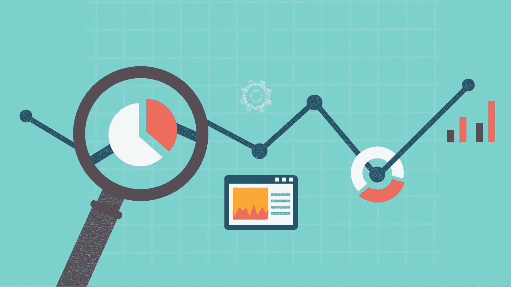
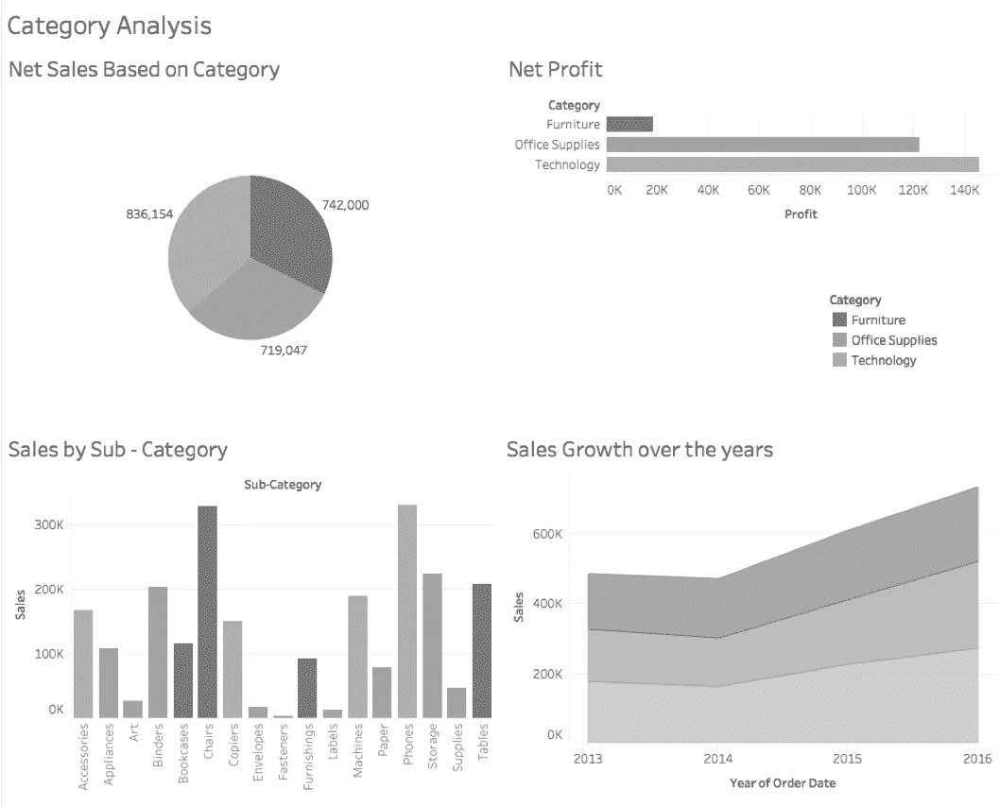
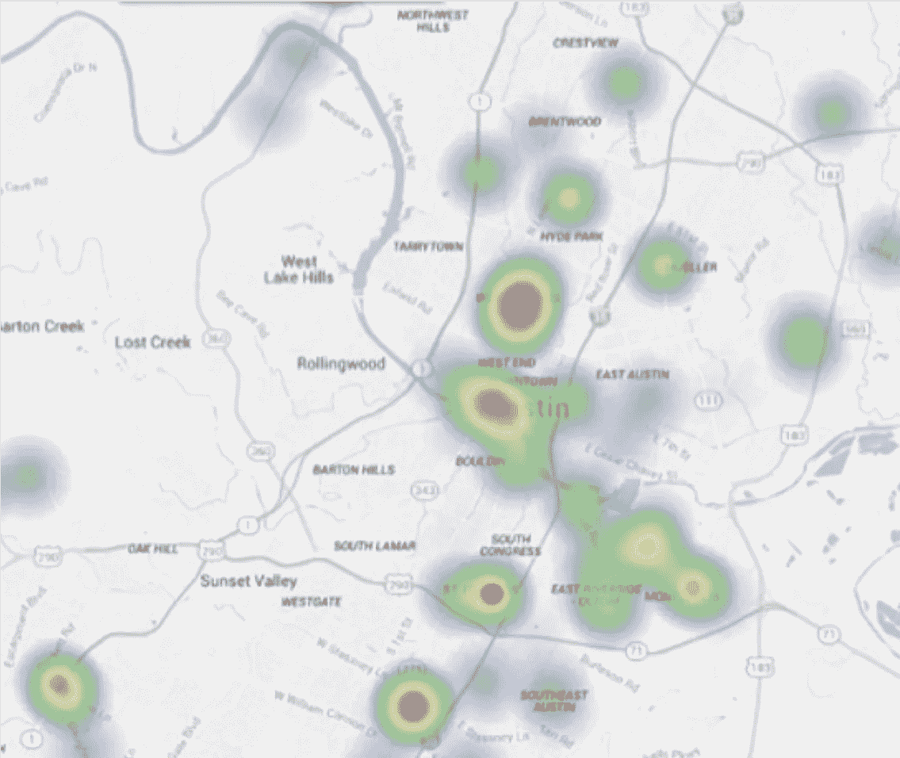

# 营销分析专家的一天

> 原文：<https://towardsdatascience.com/a-day-in-the-life-of-a-marketing-analytics-professional-83dd45f2e702?source=collection_archive---------3----------------------->

## 营销分析是一个多方面的，但往往被误解的做法。这里有一个例子来突出这个角色的多样性。

营销分析通常是任何世界级营销计划的基础。但是会议、采访和会谈让我明白，很少有人了解营销分析的世界。

一些人错误地将营销分析仅仅描述为数字分析——跟踪访问、点击和转化。是的，我们是这样做的，但这不是我们所做的全部。我听说有人把营销分析和市场调查混为一谈。*我和我的市场研究同事密切合作，但我通常不做研究。*有一次，有人愤怒地告诉我，我要为他们在 Spotify 上的广告负责。*我从未在 Spotify 工作过。*

我热爱我的工作的原因是，我的一天可以从简单的 SQL 编码到成熟的机器学习算法。我的角色是多样的，有影响力；我的分析推动数百万美元的决策。我有机会与每个人见面，从首席财务官到精力充沛的实习生。我观察整个生态系统的数据。我回顾每个产品领域的数据，深入研究产品行为、人口统计信息和文化趋势之间的关系。我将这项工作描述为应用计算社会科学。

为了提升这个价值，并揭示营销分析专业，我总结了“营销分析专业人员的一天”。项目和任务被压缩为 45 分钟的间隔，以确保我能够提供我经常处理的项目的代表性概述。

欢迎来到我作为营销分析从业者的一天。

—

**上午 7.30—运行资源密集型 SQL 查询。**

我喜欢早到。早餐，咖啡和 SQL 代码。数据库在早上运行最快，因为运行查询和消耗计算资源的分析师较少。我启动了一些需要大量计算能力的大型查询。*快跑，你这个甜数据库，你。*

**上午 8.15——电子邮件和管理。**

我的收件箱在嘲讽我。我支持全球各地的营销人员，所以我尽量早点查看收件箱，回答问题，尤其是来自 EMEA 同事的问题，他们刚刚结束一天的工作。

**上午 9 点—聚类分析。**

聚类时间。我拉起 R(统计软件)开始编码。我正在为基于教育的营销活动寻找产品的低于平均水平的用户。聚类是一种 ML(机器学习)技术，帮助我找到用户的“自然”分组。在这种情况下，我使用 ML 来确定“低于平均水平”的自然定义。我的 ML 工具根据特定的指标给出了从高到低的用户群。我接受低于平均水平的用户定义，这就是我的受众。

Cluster example; Source: CSSA

上午 9 点 45 分——咨询营销同事。

我与营销团队成员会面，帮助他们为即将到来的营销活动制定战略和方法。我们讨论潜在受众、关键绩效指标(KPI)、战略和预算。*很有趣。我喜欢创意和头脑风暴。*

**上午 10:30——查看仪表盘和趋势。**

回到我的办公桌，现在是“仪表板审查和电子邮件”时间。我为营销团队维护总共四个自动化仪表板。这些仪表板涵盖人口统计、营销绩效、区域数据细分和营销基准。我的目标是每两周发送一封简短的电子邮件，介绍仪表盘上的趋势。今天，我正在查看并通过电子邮件发送关于区域数据趋势仪表板的更新，查看特定国家的趋势，以帮助国内营销团队。

Tableau example; Source: Analytics Vidya

**上午 11.15 分—活动结果分析。**

结果时间。法国为期两个月的营销活动刚刚结束，团队正在寻找结果。我调出媒体印象文件开始分析。我们几乎所有的营销都是用测试和控制的形式来衡量的——测试受众接受营销，而类似的控制受众没有接受营销。我使用 SQL 和 R 来比较测试组和控制组的行为。我的目标是看看在产品行为指标上，各组之间是否有统计学上的显著差异。结果和学习进入总结报告卡文档以及我们的基准数据库。

**中午 12 点——与产品分析师会面。**

午餐会议。我会见了产品数据科学家，他们提供了他们看到的最新趋势和他们建立的新数据表。产品分析师负责理解特定产品领域的深层趋势和细微差别。他们还为自己的产品领域建立和维护关键数据表。作为一名营销分析师，我负责观察所有产品领域的相关性和相互作用。所以我依赖产品分析师的深入见解，并使用他们的各种数据表来衡量营销对用户行为的影响。我们谈论蜂巢表和趋势。 *#BigData*

**下午 12.45——构建机器学习工具的工作会议。**

我会见了我团队中的数据工程师。我们正在建立一个机器学习工具，它将自动化我们营销活动的各个部分，以帮助我们进行大规模测试和学习。这是一个令人兴奋的项目。我们花时间讨论算法，将我的 R 代码翻译成 Python，并计算出我们需要建立的数据库。科技爱好者团结起来。

**下午 1 点 30 分——预测投资回报率。**

回到我的办公桌。我的下一个项目专注于预测一个计划好的营销活动的投资回报率。目标是弄清楚这个活动是否值得投资。如果我开了绿灯，数百万美元将被投入，三个不同的团队将在这个项目上工作——所以我确保我仔细检查了我的数字。我会查看潜在覆盖范围、估计点击率和近似 CPAs(每次收购成本)等指标。我正在平衡快速回复和准确回复的需求。这种玩杂耍的行为是现代营销分析师的通病。我使用基准和多元回归来进行预测。

**下午 2 点 15 分——活动的地理测绘。**

位置，位置，位置。我将注意力转移到地理和制图上。一些队友已经获准在英国各地的城市创建一个“弹出式”活动计划。我已经在我们的规划和战略会议中预先选择了城市。现在，他们需要明确知道**他们应该在城市的什么地方举办活动。他们询问午餐时间人流量大的地点。我使用 R 中带有映射功能的位置数据(我喜欢使用传单映射 API)来创建按位置划分的步行交通热图。我找出前三个地点，发给营销团队。*我喜欢这个项目，我是一个喜欢热图的书呆子。***

Heat map example; Source: Stack Overflow

**3pm——撰写测量计划。**

接下来，我需要写营销活动的测量计划部分。所有营销活动计划都必须包括一个衡量部分，概述 KPI、二级指标、目标、目标受众、地理位置和衡量方法。如果有意识或情绪研究的成分，我的研究同事也会添加到这一部分。我们的组织拥有强大的测试和学习文化，因此分析和研究(如果适用)部门会签署所有营销计划。

**下午 3.45 分——第二轮邮件。**

一天快结束了。我会花点时间查看邮件，回答当天的问题，或者前几天的未决问题。我每天都会收到很多问题，随着时间的推移，我学会了在回答问题时要简洁直接。我尽可能地使用主动的声音。这几天我已经把邮件里的垃圾都删除了，因为时间不够了。我把闲聊留到面对面交谈和咖啡聚会时。

下午 4:30—回顾日本的数据趋势。

我今天的最后一次会议——我正在和我们的日本市场经理讨论行为趋势。他是一个充满激情、风趣的人，喜欢钻研数字。我试着每两个月会见一次国家营销经理，向他们汇报我在仪表盘上看到的最新情况。这也是一个很好的机会听取他们对重要问题、我可以提供额外见解的领域以及他们的推广计划的意见。我打开为日本制作的交互式仪表盘，我们聊起了数据。Tableau 是我处理小型数据集的“首选”,但它无法处理我使用的数据表，所以我还使用了一个内部仪表板工具，可以处理大型(*阅读:新标准*)数据集。

**下午 5.15——设置 SQL 查询通宵运行。**

我的一天就要结束了。我的最后一个任务是设置一些 SQL 查询在夜间运行，为明天的分析创建数据表。我通宵运行它们，因为人们回家后有更多的服务器资源可用。当您处理具有数十亿和数万亿数据行的表时，您需要所有您能争取到的服务器资源。

—

如你所见，营销分析专业远远不止点击和转化。这是仪表板、算法、编码和内部咨询的大杂烩。这种多样性是我喜欢这个职业的原因。星期很少是相同的。

希望这篇文章已经强调了营销分析中提供的一些多样性。哦……如果你正在考虑一个结合数据、多样性和影响力的职业，营销分析将是值得考虑的。