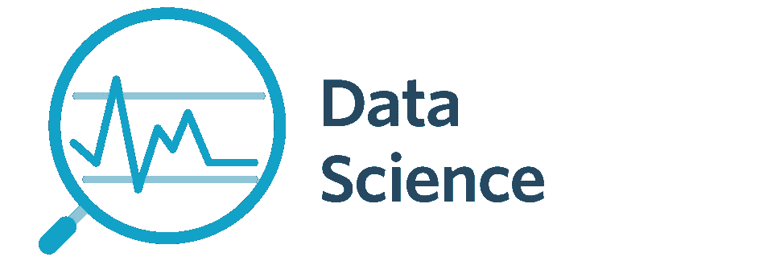
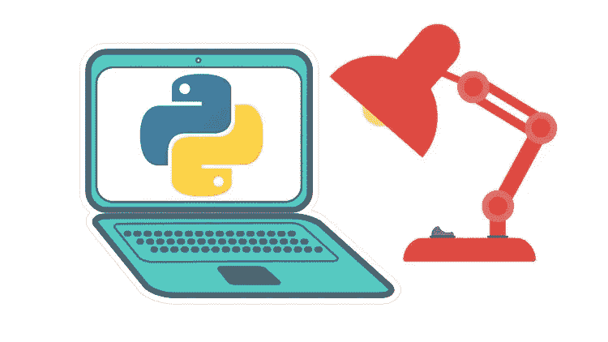
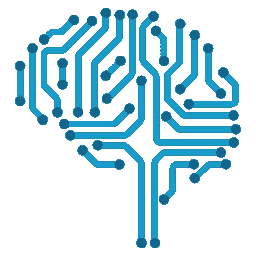
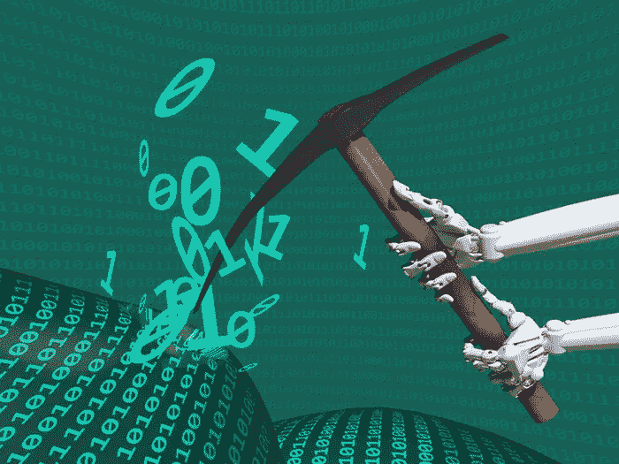
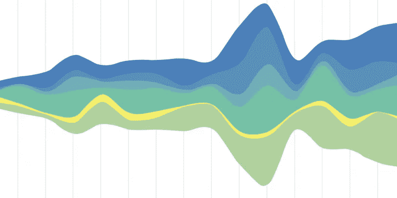

# 数据科学入门指南

> 原文：<https://towardsdatascience.com/a-definitive-guide-to-the-world-within-data-science-90300bf6330?source=collection_archive---------3----------------------->

# 目标

**这篇文章旨在探讨构成数据科学的主要概念和重点。**对于每一个概念，我希望有效地传达一个**的一般定义**，以及对其在该领域所扮演角色的充分的**解释。**以下列表反映了我将涉及的相关子主题:

*   **统计数据**
*   **线性代数**
*   **编程**
*   **机器学习**
*   **数据挖掘**
*   **数据可视化**

# 统计数字

## **什么事？**

《商业词典》将统计学定义为“数学的一个分支，涉及对数字事实的收集、分类、分析和解释，以便根据其可量化的可能性进行推断”。或者更简单的说，**统计学就是收集数字，看数字，从数字中得出结论。**

## **数据科学中的意义**

统计学在数据科学实践中有多种发挥作用的方式。这些实践对于解释数据和产生有趣的结果非常有帮助。

实验设计:如果你有一个问题，并且想要得到答案，不管你是否知道，你很可能会进行某种实验来寻找答案。这包括建立实验，处理样本大小，控制组，等等。

**频繁统计:**使用统计实践，如置信区间和假设检验，可以让你确定一个结果或数据点有多重要。能够从数据中计算重要性和其他重要信息将使你成为更强的数据科学家。

建模:回归和聚类等技术经常在数据科学中用于建模工作。无论你是想预测什么，在数据中找到更大的图景，还是理解数据背后的推理；有可能你最终会使用某种预测模型。

## **有多重要？**

这是事情变得有点模糊和意见开始变化的地方。为了更准确地回答这个问题，我建议我们将统计数据分成两组:**新的和旧的**。

回归和假设检验等旧的统计方法本质上是简单化的。虽然它们很有用，但许多杰出的数据科学家预测它们会越来越少被使用。说明随着我们的前进和统计技术的发展，这些概念可能会变得不那么重要。另一方面，像决策树和预测能力这样的新统计数据非常有用，并且经常被数据科学家使用。

话虽如此，**我仍然建议有抱负的数据科学家通过一般的统计理论和实践来工作。**即使你不会在日常工作中使用它们，它们仍然非常有助于帮助你进步到更高级的概念，你将在训练**分析思维时经常使用它们。**

## **资源**

[**数据科学和统计学有什么区别？**](http://priceonomics.com/whats-the-difference-between-data-science-and/) **:** 关于这两个领域区别的精彩解释。

[**数据科学与统计**](https://blog.mixpanel.com/2016/03/30/this-is-the-difference-between-statistics-and-data-science/) **:** 又一篇关于类似问题的伟大文章。

[**数据科学家使用统计数据的 7 种方式**](http://dataconomy.com/7-ways-data-scientists-use-statistics/) **:** 更详细地介绍了实施目的。

# 线性代数

## **什么事？**

我个人觉得[维基百科的](https://en.wikipedia.org/wiki/Linear_algebra)定义是最有帮助的:**线性代数是关于向量空间和这种空间之间的线性映射的数学分支**。这是一个很好的开始，但是我相信我们可以简化这个定义，让它不那么像教科书。

> ***简单来说，线性代数就是处理空间中直线东西的数学。***

## **数据科学中的意义**

以下是当今数据科学中线性代数的一些比较突出的用例:

**机器学习:**大量的机器学习策略与线性代数的各个方面联系在一起。仅举几个例子，有主成分分析、特征值和回归。**当您开始处理高维数据时尤其如此，因为它们往往会包含矩阵。**

**建模:**如果你想以任何方式对行为进行建模，你可能会发现自己在这样做之前需要使用一个矩阵来将样本分成子组，以便建立准确的结果。**这个法案要求你使用一般的矩阵数学，包括求逆、求导等等。**

**优化:**了解各种版本的最小二乘法对任何数据科学家都非常有用。**可用于降维、聚类等。**所有这些都在优化网络或投影中发挥作用。

你们中的一些人可能已经意识到矩阵和矩阵这两个词的重复，这不是巧合。矩阵是一般线性代数理论的一大部分。**矩阵上使用的这些概念在表和数据框上同样有效，这是数据科学中使用的两种基本结构。**

## **资源**

[**线性代数维基百科页面**](https://en.wikipedia.org/wiki/Linear_algebra#Educational_history) **:** 适合所有教科书式的东西。

[**线性代数有什么意义？**](https://www.quora.com/What-is-the-point-of-linear-algebra)**:**Quora 上的大线程，特别注意山姆·利希滕斯坦和丹·皮波尼的前两个回答。

[**一个好的数据科学家应该掌握线性代数的哪些概念？**](https://www.quora.com/What-concepts-of-linear-algebra-should-one-master-to-be-a-good-data-scientist?share=1) **:** 另一个优质 Quora 线程，姜黎黎的第一个回答特别有见地。

[**面向数据科学家的线性代数:**](http://www.analyticbridge.com/profiles/blogs/linear-algebra-for-data-scientists) 如果你正在寻找一个可以快速浏览基础知识的地方。

# 编程；编排

## **有多重要？**

如果你计划从事数据科学的职业，你将需要**学习如何编码，并且很好地编码**。这就是为什么这么多数据科学家有计算机科学背景的原因；这是个很大的优势。然而，如果你不够幸运，没有一些编程经验，那么不要担心，像生活中的大多数事情一样，**它可以自学**。

## 什么时候最重要？

我们已经确定，无论你在哪个领域，编程能力都是数据科学家的一项基本技能。尽管如此，通用脚本或命令并不是数据科学中编程真正繁荣的地方。通过编写自动化任务的程序，你不仅节省了以后的宝贵时间，还使你的代码更容易调试、理解和维护。

> ***一般来说，如果你不得不做一件事两次以上，你应该写一个脚本或程序来自动化它。***

## 我应该知道些什么？

让我们转到数据科学中与编程相关的一些关键技能。请记住，下面的列表**更侧重于实践技能**而不是具体实践(例如，时间管理技能，而不是右外连接)。

**开发:**如今，许多数据科学家被称为**“软件开发人员”**，尽管他们执行的任务与数据科学中的任务非常相似。当从事大型商业项目时，熟悉软件开发实践的数据科学家通常比学者更自在。

**数据库:**数据科学家在**不断地使用数据库。为了有效地工作，你需要有这方面的经验。随着面向 NoSQL 和云的数据库的增长，传统的 SQL 数据库急剧下降。然而，雇主仍然希望你对 SQL 命令和数据库设计实践有基本的了解。**

协作:协作是软件的关键。毫无疑问，你对这句古老的谚语很熟悉，**“一个团队的好坏取决于它最薄弱的环节”**。尽管这是老生常谈，但这也适用于任何数据科学团队。你的大部分工作将在小组中完成，因此你需要在与你的团队沟通以及维护关系方面得到提升，以最大限度地提高生产率。

## **重要实践**

如果你问任何软件开发人员或数据科学家，在工作场所编程最重要的方面是什么，他们肯定会用一个词，三个音节的答案来回答:**维护**。在工作场所，简单、可维护的代码几乎总是胜过复杂的 genius 代码。如果其他程序员不能理解你的代码是否足够好来扩展和维护它，那么你的代码最终是无关紧要的。有几种方法可以轻松提高代码的可维护性。它们如下所示…

**不要在代码中使用“硬”值:**使用变量和输入，它们本质上是动态的，会随着时间的推移而变化，而不是输入任何静态值。代码中的这个小变化将使您的工作更加轻松。

**坚持不懈地记录和注释你的代码:**让你的代码更容易理解的最有效的方法就是疯狂地注释。通过用简洁和信息丰富的轶事进行评论，你将会省去向你的同事解释你自己的无尽转换。

**重构你的代码:**记住，一旦你提交了一段代码，它不会就此结束。不断回顾你过去的工作，寻找优化它的方法，让它更有效率。

## **资源**

[**数据科学家的软件开发技能**](http://treycausey.com/software_dev_skills.html) **:** 这是对编程实践的重要软技能的极好概述。

[**所谓数据科学家的 5 个维度**](http://usblogs.pwc.com/emerging-technology/the-5-dimensions-of-the-so-called-data-scientist/) **:** 有趣的是，数据科学家可以扮演不同的角色。密切关注“编程专家”和“数据库专家”。

[**成为一名数据科学家所需的 9 项必备技能**](http://www.kdnuggets.com/2014/11/9-must-have-skills-data-scientist.html) **:** 这篇短文的“技术技能”部分提供了很好的信息。

# 机器学习

## **什么事？**

首先，机器学习是更广阔的人工智能领域的一部分。人工智能是约翰·麦卡锡在 1956 年创造的一个术语，最初定义为“制造智能机器的科学和工程”。在这个领域中，随着时间的推移，机器学习变得越来越重要。

> ***机器学习允许我们教会计算机如何给自己编程，这样我们就不必为某些任务编写明确的指令。***

## **两种类型**

机器学习可以分解成两种学习形式:**有监督的和无监督的**。

**监督学习:**今天大多数实用的机器学习都是使用监督学习来完成的。监督学习是算法从数据中学习的过程，产生预期的结果，然后由用户进行纠正，以便算法在下次运行时提高准确性。**因此，通俗地说，把计算机算法想象成学生，把你想象成老师，在需要的时候纠正它，并把它引向正确的方向。**

**无监督学习:**虽然这种类型的机器学习目前还没有多少实际用途，但它可以说是更有趣的分支。**无监督学习是让算法自己去发现和识别数据中的潜在结构。**

## **数据科学中的意义**

机器学习无疑是当今科技领域的一件大事。托尼·泰瑟和约翰·汉尼斯已经分别称之为**、**、**、**。比尔·盖茨在这个话题上也被引用过，他说**“机器学习上的一个突破抵得上十个微软”。**

随着自动驾驶汽车、图像分类和语音识别等著名应用的出现，人们可以很容易地看出所有关于机器学习的宣传是什么。这个领域正在迅速发展，所以现在就跟上潮流吧，否则就会被甩在后面。

## **资源**

[**什么是机器学习？**](https://www.quora.com/What-is-machine-learning-4)**:**Quora 上的好帖子，有几个略有不同的答案，旨在定义机器学习。

[**机器学习简史**](http://www.forbes.com/sites/bernardmarr/2016/02/19/a-short-history-of-machine-learning-every-manager-should-read/2/#5e6d3ef52cbd) **:** 再深入一点看看机器学习的历史。

[**有监督和无监督的机器学习算法**](http://machinelearningmastery.com/supervised-and-unsupervised-machine-learning-algorithms/) **:** 对机器学习算法类型的清晰、简明的解释。

[**机器学习的可视化**](http://www.r2d3.us/visual-intro-to-machine-learning-part-1/) **:** 轻松搞定我最喜欢的资源这件事。出色的可视化，带你了解机器学习是如何使用的。

# 数据挖掘

## **是什么？**

如果你已经仔细阅读了大量的在线数据科学资源，那么你可能已经见过“数据挖掘”这个术语了。但是这种做法到底是由什么组成的呢？看了各种资料后，我觉得最好这样描述:

> ***数据挖掘是探索数据以提取重要信息的过程。***

## **词汇表**

根据我的经验，**我遇到了数据挖掘中的许多其他主题，我认为了解这些主题会有所帮助。下面你会发现一个快速简单的数据挖掘俚语定义列表。请记住，区分它们可能会很棘手，因为它们都非常相似。**

**数据争论:**这是将数据从原始形式转换成更有用形式的行为。它通常由几个重要步骤组成，包括清理和解析成预定义的结构。

**数据争吵:**与上面显示的“数据争吵”完全一样。为什么我们需要两个术语来描述这个过程，我可能永远也不知道…

**数据清洗:**这是一个关键的步骤，包括从数据集中检测并纠正(或删除)损坏的、不准确的或缺失的值。

**数据抓取:**一种计算机程序读入来自另一个程序或网站(如 [Twitter](http://knightlab.northwestern.edu/2014/03/15/a-beginners-guide-to-collecting-twitter-data-and-a-bit-of-web-scraping/) )的数据的技术。

## **数据科学中的意义**

每个人都想做出令人敬畏的预测模型，并把令人瞠目结舌的可视化。然而，人们经常忽略的是，在你完成“看门人”的工作之前，这些事情都不会发生。纽约时报最近的一篇文章(将发布在参考资料中)发现**数据科学家花费大约 50%-80%的时间来收集和准备数据。**

这一严酷的现实需要传达给未来的数据科学家。在丰厚的基本工资和 21 世纪最性感工作的头衔之间，年轻的专业人士在不了解职业现实的情况下盯上了数据科学家的工作。

## **资源**

[**什么是数据挖掘？**](https://www.quora.com/What-is-data-mining)**:**Quora 上一个关于数据挖掘各种定义的好线程。

[**什么是数据角力？**](http://www.datawatch.com/what-is-data-wrangling/) **:** 简短阐述一下数据角力到底是由什么组成的。

[**“看门人的工作”是洞察的关键障碍**](http://www.nytimes.com/2014/08/18/technology/for-big-data-scientists-hurdle-to-insights-is-janitor-work.html?_r=0) **:** 这篇有趣的文章详细介绍了数据挖掘实践在数据科学领域的重要性。

# 数据可视化

## **什么事？**

数据可视化似乎比其他主题更容易理解。然而，我想你会意识到数据可视化并不像看上去那么简单。让我们从定义我们的主题开始，尽管这看起来有些多余。

> ***数据可视化是通过某种图片或图表传达数据或结果的行为。***

一个常见的误解是，视觉化最重要的部分是它看起来有多吸引人。虽然这非常重要，但这不是我们想要表达的意思。最终，我们的目标是以大脑最容易理解的方式交流你在数据中发现的见解。**根据 NeoMam Studios 的报道，研究人员发现，彩色视觉效果可以增加读者 80%的阅读意愿**

## **常见类型**

现在让我们来看看一些常见的可视化类型。请记住，这绝不是一份详尽的清单。相反，它只是我个人在有生之年遇到的一些最常见的二维可视化。所以给你:

**多维:**这些是处理多个变量的图形和图表。这是你将会看到的最常见的视觉化形式。一些例子包括:**饼图、直方图和散点图。**

**时间驱动:**所有这些可视化都使用时间作为有效交流数据的基线。这些都是在一段时间内传达变革的有力工具。一些例子包括:**时间序列、甘特图和弧形图。**

**地理空间:**正如人们可能猜测的那样，地理空间可视化都与位置有关。这些通常用于传达对特定领域或地区的见解。一些例子包括:**点分布图、比例符号图和等高线图。**

## **关键要素**

所有伟大的数据可视化都有一些共同的关键元素。下面你会发现一个我认为最重要的清单。

**信息:**这涉及到拥有准确一致的信息。如果数据不可靠，你的最终产品是什么并不重要。

你的视觉化应该有意义。它应该是以这样或那样的方式与一个项目或社会相关的东西。如果没人愿意看，制作一个视频还有什么意义呢？

**功能:**无论你在传达的信息多么详尽，你的工作就是让它简洁易懂。**将您的数据转换成对不一定是技术背景的人有用的形式的能力将被证明是非常重要的。**在职场上尤其如此。

吸引力:最后，你的形象需要总体上好看。它应该吸引人，并且赏心悦目。为了做到这一点，你将不得不考虑诸如平衡、颜色、稠度和尺寸等诸多因素。

## **数据科学中的重要性**

**无论你想专注于哪个领域，数据可视化技能对数据科学家来说都非常有用。**能够通过图像而不是文字有效地传达你的数据，会让你的信息更容易理解，反过来，**会让你有更大的机会影响你的工作。**

## **资源**

[**什么是好的数据可视化**](http://www.informationisbeautiful.net/visualizations/what-makes-a-good-data-visualization/) **:** 优秀的维恩图解释了优秀的数据可视化的组成部分。上面提到了一些，但是我仍然强烈建议你看一看。

[**杜克可视化简介**](http://guides.library.duke.edu/datavis/vis_types) **:** 贯穿杜克大学图书馆所见的所有数据可视化类型。

[**数据可视化 Quora 线程**](https://www.quora.com/topic/Data-Visualization) **:** 关于数据可视化通用话题的一些好问题供进一步阅读。

# 把它包起来

现在你可能已经意识到了，**数据科学是一个复杂的领域，由各种独特的子主题组成。**对于一名有抱负的数据科学家来说，更清楚地理解这些子主题是朝着正确方向迈出的重要一步。

感谢阅读！如果你喜欢这篇文章，请继续向鼓掌按钮展示你的爱。对更多的帖子感兴趣吗？请务必[关注我](https://twitter.com/conordewey3)并订阅下面的[我的简讯](https://www.conordewey.com/newsletter/)以接收任何新内容。想了解更多关于我和我在做什么，请查看我的网站。