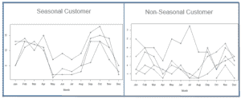
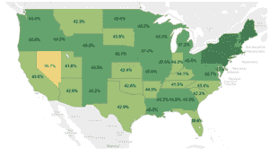

# 识别季节性客户的时间序列的不同用法

> 原文：<https://towardsdatascience.com/a-different-use-of-time-series-to-identify-seasonal-customers-8806f2a626b?source=collection_archive---------12----------------------->

我以前写过关于创造性地利用你的数据，使用细分来了解客户群。文章[此处](https://medium.com/@kristenkehrer/how-to-use-customer-segmentation-to-learn-f49e82b9a959)。在文章中，我提到了利用**任何可能相关的**数据。尝试识别具有季节性使用模式的客户是我提到的听起来很有趣的变量之一。由于我准备做另一个聚类分析，我决定解决这个问题。

这些是我最喜欢的数据科学问题类型。设计解决方案需要你跳出框框思考。基本上，我希望能够标记每个客户，无论他们是否表现出季节性模式，这将是第一步。稍后，我可能会进一步扩展这一点，以确定每个客户的“淡季”的开始。这将使我们能够更好地培养这些客户关系，并提供更加个性化的体验。

我是 Constant Contact 的数据科学家，我们为小型企业提供电子邮件营销解决方案。由于这是一个订阅产品，客户有不同的使用模式，我可以使用这些模式进行分析。

起初，我的假设是这些顾客中有很大一部分可能生活在一个有四个季节的地区。你知道，新英格兰的冰淇淋店冬天关门。经过进一步思考，如果我在寻找季节性的使用模式，这也将包括那些不一定受天气影响的季节性商业模式的人。在教育领域有账户的人会在暑假休假，这是季节性的。零售业全年都有相当稳定的使用量，但在圣诞节增加使用量的企业也呈现出季节性模式。因此，模型将确定哪些人是季节性的，这不仅仅是基于天气，也可能是基于业务类型。(或者可能有些人足够幸运，在年中无缘无故地随意休长假，我想确保我也能找到这些人，如果他们存在的话)。

为了进行这项分析，我按客户、按月汇总了每个客户至少两年的电子邮件发送模式。每个客户都有自己的时间序列。然而，有几个复杂的问题。有一个细节特别值得注意，客户可能会停止使用一两个月(或更长时间)。所以首先我必须写一些代码来填充这几个月的零。我不能指定我正在寻找一个每年的模式，但是在模型中只给出每年 8 个月的数据，我需要这些零。我使用 Python 找到了这些丢失的零，然后决定我想使用 R 来表示时间序列/确定是否存在季节性模式。我第一次使用 Python 中的 rpy2 包。从我想尝试的新包列表中检查一下。

我为 r 中的每个客户拟合了一个 TBATS 模型。这可能是多余的，因为 TBATS 旨在处理非常复杂(并且可能是多个)的季节性模式。然而，询问模型是否有每年的季节成分真的很简单。另外，TBATS 比其他方法对平稳性更具鲁棒性。

这是一个被模型确定为季节性的客户的图片，右边是一个明显不是季节性的客户，模型也同意这一点。

在我得到我的模型的输出后，我回去对这些客户的样子做了一个全面的分析。他们在东北部指数过高，而在西部和南部指数较低。

**季节性用户也更有可能自我报告处于如下行业:**

*   零售
*   体育和娱乐
*   非营利组织

**非季节性用户也更有可能自我报告处于这样的行业:**

*   汽车服务
*   财务咨询机构
*   医疗服务
*   保险

任期只有 2-3 年的客户比任期更长的客户更不可能是季节性的。这可能是由于几个不同的因素。也许只是还没有足够的数据来检测它们，也许他们在真正达到他们的大步之前需要一段时间来熟悉这个工具(涉及不同的使用模式)，或者也许他们真的不是季节性的。有更多的见解，但这是公司的数据😉

这是东北部季节性客户过度指数化的地图。利益相关者通常喜欢看到漂亮的地图。注:季节性和非季节性的比例不是 50/50。

目前，我们正在考虑在即将到来的细分中我们可能能够利用哪些数据(其中这个季节性变量将是一个候选变量。这可能包括来自 BigData 环境的信息或关系数据库中的任何信息。我们也在权衡获得一个特定变量的难度与我们从收集数据中可能获得的附加值。

我感到非常幸运，能够参与帮助我们了解客户的项目，这样当我们向他们传达信息时，我们可以更有针对性。没有什么比收到一个完全不了解你的公司的信息更糟糕的了。我发现这种工作令人兴奋，它让我有创造力，这对我很重要。

我希望你觉得这篇文章很有趣，也许有几个人会发现这也适用于他们自己的工作。我希望你有很多有趣的项目，让你感到鼓舞🙂

如果你想订阅我未来的文章，你可以在这里订阅。

*原载于 2018 年 7 月 3 日*[*【datamovesme.com*](https://datamovesme.com/2018/07/03/a-different-use-of-time-series-to-identify-seasonal-customers/)*。*