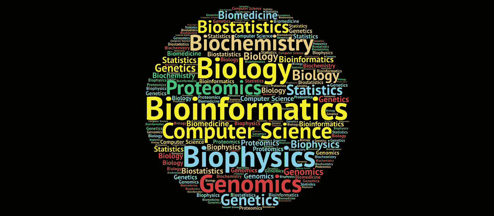
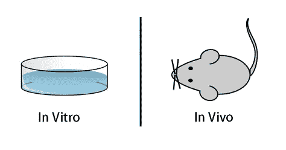
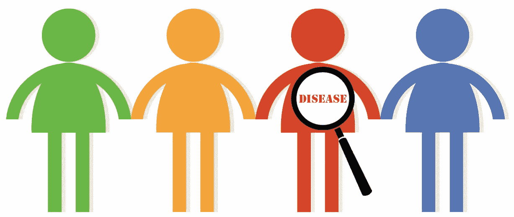

# 生物信息学入门

> 原文：<https://towardsdatascience.com/a-dummies-intro-to-bioinformatics-e8212ed7c09b?source=collection_archive---------0----------------------->

Bioinformatics and related fields

单词 ***生物信息学*** 在当今的科学世界中正在发生巨大的转变。这个词似乎由两部分组成，这两部分涉及两个不同的领域，**生物学**和**计算机科学**。大约一、二十年前，人们认为生物学和计算机科学是两个完全不同的领域。一个人将学习生物及其功能，而另一个人将学习计算机和基础理论。

让我们把详细的谈话留到以后。如果你对这个新兴领域毫无头绪，那你来对地方了。在这篇文章中，我将尽可能简单地解释这个领域，不会深入到生物学或计算机科学。

# 什么是生物信息学？

> **生物+信息学=生物信息学**

根据[维基百科](https://en.wikipedia.org/wiki/Bioinformatics)，

> **生物信息学**是一个跨学科领域，开发理解生物数据的方法和软件工具。作为一个跨学科的科学领域，生物信息学结合了计算机科学、统计学、数学和工程学来分析和解释生物数据。

随着生物分析中新概念、新理论和新技术的出现，科学家们在进行各种实验后收集了大量的数据。尽管数据量呈指数级增长，但手动分析它们变得不切实际。这是计算机科学技术与统计学、数学和工程学相结合的地方。计算技术被用来更准确和有效地分析这些大量的数据。因此，生物信息学可以被认为是解决生物学问题的数据科学领域。

# 过去和现在的实验

在生物信息学出现之前，生物实验只有两种方式。

1.  在一个活的有机体内部( ***在体内，*** 意为 ***在活的*** 在拉丁文中)
2.  在人工环境中( ***试管内*** ，拉丁文中的意思是 ***玻璃内*** )

In vitro and in vivo experiments (Image Source: [http://www.invivotransfection.com](http://www.invivotransfection.com))

生物信息学领域在 silico 上被认为是*(在 silicon 上的意思是**在拉丁文中的意思是*)，我们在一个硅片上，或者更准确地说是在一个微处理器上进行生物实验。计算机模拟方法的一个主要优点是，你可以在不使用任何动物或试剂的情况下进行模拟和实验。这将是动物权利活动家的好书。😊**

# **为什么要学生物信息学？**

**生物信息学已经成为生命科学和生物医学科学的重要交叉学科。如果你是一名生物学家，你会发现拥有生物信息学的知识可以让你的实验和研究受益匪浅。**

**目前的就业行业充满了具有生物信息学技能的人的空缺。科学杂志称，主要的制药、生物技术和软件公司正在寻求招聘具有生物信息学经验的专业人员，他们将在这些领域处理大量的生物和医疗保健信息。去 Indeed.com 的[看看生物信息学领域的几个工作机会。](https://www.indeed.com/q-Bioinformatics-jobs.html)**

**除了工作和职业要求，如果你热爱生物和计算机科学，那么这个领域很适合你。作为一个热爱生物学，目前正在学习生物信息学的计算机科学本科生，相信我这样说，你一定会热爱这个领域。**

# **生物信息学会学到什么？**

**首先，你必须学习一点生物学知识；**具体来说就是遗传学和基因组学**。这将包括研究基因、DNA、RNA、蛋白质结构等。**

**然后你将不得不学习**生物序列**(例如，在 DNA、RNA 和蛋白质中发现的序列)以及发现和分析其中各种模式的技术。你会遇到不同技术使用的各种算法。**

**因为您将处理大量的数据，所以很好地理解**统计**是至关重要的，因为您必须根据特定的需求来分析数据。因此，你也会学到很多关于统计学的知识。**

**当然，你会需要**编程**技能。r、Python 和 Bash 是最有用、最常用的编程语言。决定从哪个开始取决于你的目标。我选择了 Python。🐍您也可以使用其他语言，如 C/C++和 Java。**

**在对基本概念有了基本了解之后，你可以继续学习其他领域，如**结构生物信息学、** **系统生物学**和**生物网络**。**

# **生物信息学的应用**

**据[科学日报](https://www.sciencedaily.com/terms/bioinformatics.htm)报道，生物信息学正被用于许多不同的方面，包括 **DNA 序列**、**基因**、**蛋白质**和**进化建模**。我们不会深入讨论这些细节。**

**生物信息学的一个众所周知的应用是在**精准医学**和**预防医学**领域。在精准医疗中，针对个体患者的医疗保健技术正在相应地定制，包括治疗和实践。精准医疗不是治疗或治愈疾病，而是开发预防疾病的措施。这些领域的一些重点领域是**流感**、**癌症**、**心脏病**和糖尿病。人们已经开展了研究来识别病人身上的基因变化，这使得科学家们能够提出更好的治疗方法，甚至可能的预防措施。你可以从这篇由国家癌症研究所撰写的文章中了解更多关于生物信息学在癌症治疗中的作用。**

****

**Disease Identification**

**生物信息学的另一个重要应用是创造药物。我们可以使用计算工具来了解疾病，确定疾病的原因，并相应地使用合适的药物进行治疗，而不仅仅是治疗症状。**

**这是生物信息学的一些应用。使用生物信息学知识的情况更多，包括微生物学、基因技术和农业。**

# **最后的想法**

**我开始学习生物信息学已经有几个星期了，我对它非常感兴趣。我读了一些书，想推荐以下几本书。**

1.  *****假人生物信息学*** 作者 *Cedric Notredame 和 Jean-Michel Claverie***
2.  *****初学者生物信息学:基因、基因组、分子进化、数据库和分析工具*** 作者 *Supratim Choudhuri***
3.  *****Python 中的生物信息学编程:初学者实用教程*** 作者*鲁迪格-马库斯·弗莱格***
4.  *****利用 Python 进行生物信息学编程*** 采用*米切尔 l .模型***

**我认为这些书对初学者来说非常好。读完这些之后，你会对基本概念有一个很好的基础和理解，并且开始编程。**

**因为我对这个领域还很陌生，所以我想听听你的建议。😇**

**我希望你对生物信息学有一个基本的了解。**

**感谢阅读…！😃**