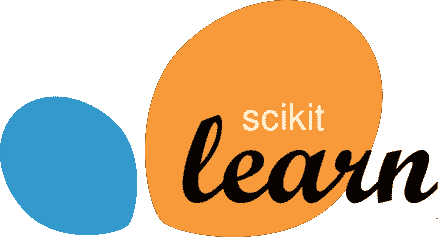

# 为 scikit-learn 模型提供服务的 Flask API

> 原文：<https://towardsdatascience.com/a-flask-api-for-serving-scikit-learn-models-c8bcdaa41daa?source=collection_archive---------0----------------------->



Scikit-learn 是一个直观而强大的 Python 机器学习库，使得训练和验证许多模型变得相当容易。Scikit-learn 模型可以被持久化([腌](http://scikit-learn.org/stable/modules/model_persistence.html))以避免每次使用时重新训练模型。您可以使用 [Flask](http://flask.pocoo.org/) 来创建一个 API，该 API 可以使用一个 pickled 模型基于一组输入变量提供预测。

在我们进入 Flask 之前，重要的是要指出 scikit-learn 不处理分类变量和缺失值。分类变量需要用[编码](http://scikit-learn.org/stable/modules/preprocessing.html#encoding-categorical-features)为数值。通常分类变量使用 [OneHotEncoder](http://scikit-learn.org/stable/modules/generated/sklearn.preprocessing.OneHotEncoder.html) (OHE)或 [LabelEncoder](http://scikit-learn.org/stable/modules/generated/sklearn.preprocessing.LabelEncoder.html) 进行转换。LabelEncoder 为每个分类值分配一个整数，并将原始变量转换为一个新变量，并用相应的整数替换分类变量。这种方法的问题在于，名义变量被有效地转换成顺序变量，这可能会欺骗模型，使其认为顺序是有意义的。另一方面，OHE 没有这个问题，但是它倾向于增加变换变量的数量，因为对于分类变量的每个值都会产生一个新的变量。

关于 LabelEncoder 需要知道的一件事是，转换将根据变量中分类值的数量而变化。假设您有一个值为“黄金”和“白金”的“订阅”变量。LabelEncoder 会将这些分别映射到 0 和 1。现在，如果您将值“free”添加到组合中，分配就会改变(free 编码为 0，gold 编码为 1，platinum 编码为 2)。因此，在预测时保留原始的 LabelEncoder 以备转换非常重要。

对于这个例子，我将使用[泰坦尼克号数据集](https://www.kaggle.com/c/titanic)。为了进一步简化，我将只使用四个变量:年龄、性别、上船和幸存。

```
import pandas as pd
df = pd.read_csv('titanic.csv')
include = ['Age', 'Sex', 'Embarked', 'Survived']
df_ = df[include]  # only using 4 variables
```

性别和从事是分类变量，需要转换。“年龄”有缺失值，通常是估算值，这意味着它被汇总统计数据(如中值或平均值)所替代。缺失值可能非常有意义，值得研究它们在现实应用程序中代表什么。这里我简单的用 0 代替 NaNs。

```
categoricals = []for col, col_type in df_.dtypes.iteritems():
     if col_type == 'O':
          categoricals.append(col)
     else:
          df_[col].fillna(0, inplace=True)
```

上面的代码片段将遍历 df_ 中的所有列，并将分类变量(数据类型为“O”)追加到 categoricals 列表中。对于非分类变量(整数和浮点数)，在本例中只有年龄，我用零代替 NaNs。用单个值填充 nan 可能会产生意想不到的后果，尤其是当您用来替换 nan 的值在数值变量的观察范围内时。因为零不是一个可观察到的合法的年龄值，所以我不会引入偏见，如果我用 40，我会的！

现在我们准备好 OHE 我们的分类变量。Pandas 提供了一个简单的方法 [get_dummies](http://pandas.pydata.org/pandas-docs/stable/generated/pandas.get_dummies.html) 为给定的数据帧创建 OHE 变量。

```
df_ohe = pd.get_dummies(df, columns=categoricals, dummy_na=True)
```

OHE 的好处在于它是决定性的。按照下面的 column_value 格式，为每个列/值组合创建一个新列。例如，对于“已装船”变量，我们将得到“已装船 _C”、“已装船 _Q”、“已装船 _S”和“已装船 _nan”。

既然我们已经成功地转换了数据集，我们就可以开始训练我们的模型了。

```
# using a random forest classifier (can be any classifier)
from sklearn.ensemble import RandomForestClassifier as rfdependent_variable = 'Survived'
x = df_ohe[df_ohe.columns.difference([dependent_variable])
y = df_ohe[dependent_variable]clf = rf()
clf.fit(x, y)
```

训练好的模特准备好被腌制了。我准备用 sklearn 的 joblib。

```
from sklearn.externals import joblib
joblib.dump(clf, 'model.pkl')
```

就是这样！我们坚持了我们的模式。我们可以用一行代码将这个模型加载到内存中。

```
clf = joblib.load('model.pkl')
```

我们现在准备使用 Flask 来服务我们的持久模型。

烧瓶非常简约。下面是启动一个裸机 Flask 应用程序所需的内容(在本例中是在端口 8080 上)。

```
from flask import Flaskapp = Flask(__name__)if __name__ == '__main__':
     app.run(port=8080)
```

我们必须做两件事:(1)当应用程序启动时，将我们的持久模型加载到内存中，以及(2)创建一个端点，该端点接受输入变量，将它们转换成适当的格式，并返回预测。

```
from flask import Flask, jsonify
from sklearn.externals import joblib
import pandas as pdapp = Flask(__name__)@app.route('/predict', methods=['POST'])
def predict():
     json_ = request.json
     query_df = pd.DataFrame(json_)
     query = pd.get_dummies(query_df)
     prediction = clf.predict(query)
     return jsonify({'prediction': list(prediction)})if __name__ == '__main__':
     clf = joblib.load('model.pkl')
     app.run(port=8080)
```

这只在理想情况下有效，在这种情况下，传入的请求包含分类变量的所有可能值。如果不是这样，get_dummies 将生成一个数据帧，其列数少于分类器的列数，这将导致运行时错误。此外，需要使用我们训练模型时使用的相同方法来替换数值变量。

列数少于预期的一个解决方案是保存来自培训的列列表。记住 Python 对象(包括列表和字典)是可以被腌泡的。要做到这一点，我将使用 joblib，就像我以前做的那样，将列的列表转储到一个 pkl 文件中。

```
model_columns = list(x.columns)
joblib.dumps(model_columns, 'model_columns.pkl')
```

因为我们有这个持久化的列表，所以我们可以在预测的时候用零替换丢失的值。我们还必须在应用程序启动时加载模型列。

```
@app.route('/predict', methods=['POST'])
def predict():
     json_ = request.json
     query_df = pd.DataFrame(json_)
     query = pd.get_dummies(query_df) for col in model_columns:
          if col not in query.columns:
               query[col] = 0 prediction = clf.predict(query)
     return jsonify({'prediction': list(prediction)})if __name__ == '__main__':
     clf = joblib.load('model.pkl')
     model_columns = joblib.load('model_columns.pkl')
     app.run(port=8080)
```

这个解决方案仍然不是万无一失的。如果您碰巧发送了不属于训练集的值，get_dummies 将产生额外的列，您将遇到错误。为了使这个解决方案有效，我们需要从查询数据帧中删除不属于 model_columns 的额外列。

GitHub 上有一个可用的解决方案[。](https://github.com/amirziai/sklearnflask/)