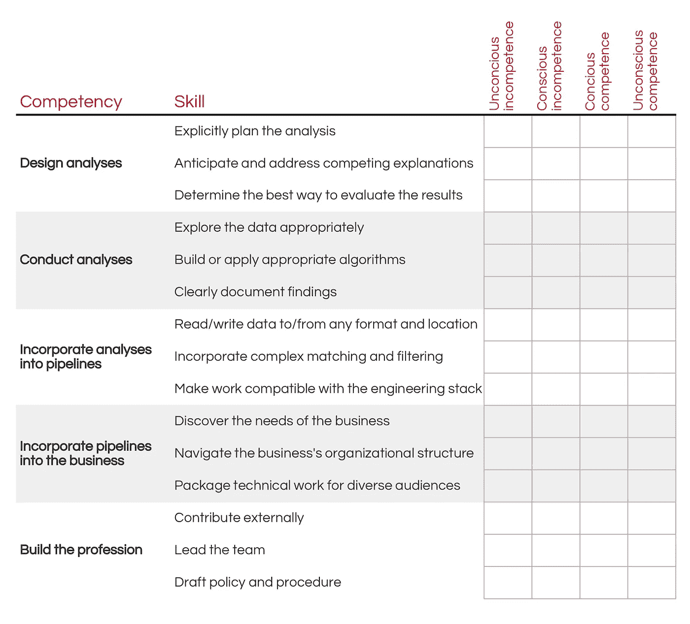
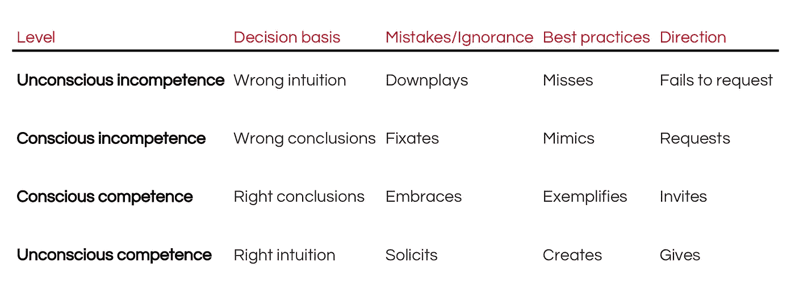
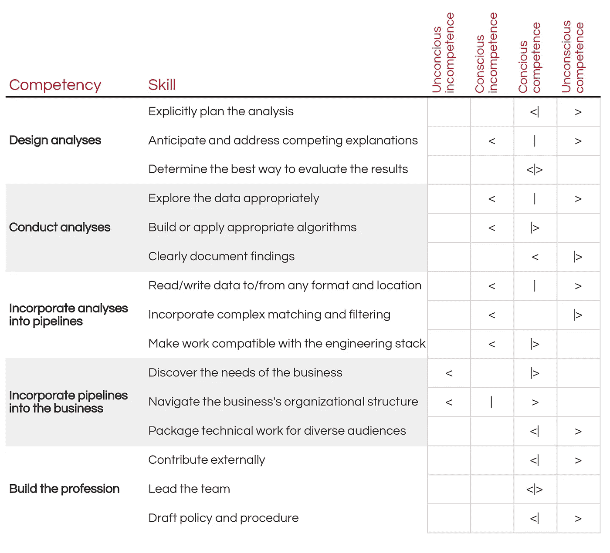

# 评估数据科学家能力的框架

> 原文：<https://towardsdatascience.com/a-framework-for-evaluating-data-scientist-competency-89b5f275a6bf?source=collection_archive---------1----------------------->

不乏[建议](http://dataconomy.com/2016/06/recruiters-hiring-managers-looking-data-scientist/) [讲解](https://resources.workable.com/lead-data-scientist-interview-questions) [如何](https://venturebeat.com/2017/11/30/what-ibm-looks-for-in-a-data-scientist/) [如何](https://www.forbes.com/sites/metabrown/2017/02/26/how-to-hire-a-data-scientist-5-donts-for-data-scientist-interview-questions/#5f7edb684eef) [聘请](https://www.techinasia.com/talk/hiring-managers-data-scientist-cv) [一个](http://firstround.com/review/how-to-consistently-hire-remarkable-data-scientists/) [数据](https://www.entrepreneur.com/article/283206) [科学家](https://www.cio.com/article/2377108/big-data/4-qualities-to-look-for-in-a-data-scientist.html)。我以前写过这个话题。大多数建议假设一个理想的数据科学家应该具备的技能或素质列表，并专注于如何对求职者拥有这些技能感到自信。我想更仔细地看看这份基本技能清单。标签是有问题的。例如，“统计学”通常被认为是数据科学家技能集的一个重要方面，但你会发现数据科学家更多地来自计算机科学背景，而不是统计学背景。因此，我们可能会创建一个“机器学习”维度来适应这种背景。因此，我们要么专注于两种实际上有很多重叠的不同技能，要么将它们归为“统计和机器学习”技能，这正好避免了这个问题。换句话说，数据科学家需要什么技能的问题是一个降维问题。

大多数降维的一个关键特征是关注正交性，我认为这也是大多数讨论所缺少的。数据科学家技能框架应该采用庞大、杂乱的数据科学家-数据科学家-技能矩阵，并尝试将其缩减为几个重叠最小的信息维度。这可能需要一些文字上的修饰，以避免使用已经加载的术语，但这在概念上是值得的。例如，我认为“编码能力”不属于技能框架，更不用说像 R 或 Python 这样的特定语言了。在设计良好的主题中展示所有技能的数据科学家应该理所当然地展示编码技能，因为公司有技术堆栈，数据科学家需要与技术堆栈集成的技能，以确保他们的工作是可重复和可扩展的。像编码这样的东西是一种手段，而不是目的，因此我认为它们不应该成为直接的目标。

我还应该提前声明，我坚信“数据科学家”的角色应该与“工程师”和“分析师”的角色分开。这就是我目前工作的角色，但我知道在许多其他组织中情况并非如此，包括我以前工作过的那些组织。我认为我现在的雇主说得对。即使在财务或其他业务考虑要求一个人担任两个或更多角色的情况下，我认为这也应该被视为一个人身兼数职，而不是数据科学家的帽子大到足以包含其他两个角色的标志。

我开始认为“好的数据科学”是在个人层面上不存在的东西:虽然单个团队成员都非常擅长某些技能，但建立强大的数据科学能力是任何一个人都无法完成的事情。我看到的大多数关于数据科学技能的讨论都没有明确承认这一点。我们所有人的技能都有差距，但只要团队没有任何差距，那就没问题:它确保我们能够共同完成我们需要做的事情，并且仍然给我们所有人留下许多成长的机会。我通常在这样的讨论中看到的是某种免责声明，大意是不是每个人都需要检查每个框。如果这是我们作为数据科学专业人员的想法(我认为大部分是这样)，那么它应该明确地纳入我们的框架。

## 框架

## 个人技能

让我们来看一下每一项技能，并讨论当我们看到它们时如何识别它们。

设计分析。属于该能力的技能与将业务需求转化为技术分析计划有关。数据科学家使用这些技能做出的决策部分取决于可用数据的结构、类型和数量，但也取决于存在的业务需求，而不管数据看起来如何。该能力范围内的所有技能都可以归入“知道如何处理不明确的需求”的大标题下

*   **明确地计划分析。**这包括里程碑的范围界定、排序和证明。分析很少会有一个自然的停止点——几乎所有的分析都可以被无休止地改进。在业务应用程序中，需要对分析进行范围划分和划分:需要设定里程碑，需要为每个里程碑确定停止规则，并且需要以保持概念完整性的方式将所有部分总结为一个整体。
*   **预见并解决相互矛盾的解释。**这可能包括实验设计、抽样策略或敏感性分析。任何分析都做出断言:预测足够准确，有商业价值，变量 x 和 y 是重要的预测指标，增加变量 z 并没有增加足够的价值，值得等等。所有这些主张都容易受到对立解释的影响:抽样有偏差，数据集不平衡，变量定义不当，等等。预测这些漏洞是一种技能。特定的方法可能会减轻问题，但通常关键是将假设检查纳入分析的设计中。
*   **确定评估结果的最佳方式。**这可能包括诊断指标、基准或 KPI 开发，以监控产品质量。分析很少产生具有明确解释价值的结果。通常，问题不是“结果好吗？”，而是“结果是否比我们以前获得的结果对业务更有价值？”评估分析结果需要了解分析方法的输出，以及结果将部署到的业务环境。

**进行分析。**当人们谈论数据科学时，属于这种能力的技能通常会受到大量关注。数据科学家利用这些技能做出的决策几乎完全取决于数据本身的细节。

*   **适当地探索数据。**这包括分布、汇总指标、可视化和功能选择/工程。这些技能可以简单到知道如何表征分布或集中趋势的度量，也可以复杂到设计全新的功能。这项技能的重点是了解在数据集中寻找什么类型的“陷阱”,以便可以转换、省略、适应或减轻这些特质。
*   **建立或应用适当的算法。**这包括回归、分类、降维、聚类和参数调整。分类数据有时会对分析施加不同于连续数据的约束。稀疏与密集数据、有监督与无监督学习问题等也是如此。不同的问题需要不同的技术方案，知道如何选择合适的技术方案是一项有价值的技能。
*   **明确记录调查结果。**这通常包括数据可视化和技术交流。记录分析结论的摘要有助于其他人从一个数据科学家停止的地方继续分析，但也可以作为对数据科学家结论的健全性检查。如果分析结果不能清楚地记录下来，那么很有可能分析不够连贯，不可信。

**将分析纳入管道。**数据在用于分析之前和之后会发生很多变化。数据科学家的部分职责是确保这些移交顺利进行。这是数据科学家的技能组合与工程师的技能组合最一致的地方。当工程师能够按照数据科学家需要的方式清理、构建和定位数据时，这总是有用的，但这应该是提高效率的一种方式，而不是能够完成工作的先决条件。

*   **从任何格式和位置读取/写入数据。**这包括数据库查询、合并不同的文件类型、API 和文件管理。数据科学家不能奢望让别人来组织他们的数据集。需要从数据所在的任何格式和位置提取用于分析的数据，并输出到那些将使用结果的人所需的任何格式和位置。
*   **合并复杂匹配和过滤。**进行布尔匹配或过滤，将字符串或数字作为整体进行比较，是一项相对简单的任务。然而，许多数据科学需要更复杂的操作，定义匹配字符串子集的模式或使用复杂的数据类型，如时间戳、shapefiles、图形。
*   使工作与工程堆栈兼容。这包括版本控制、编码风格和软件工程最佳实践。如果不能整合到业务的其他技术系统中，或者不能扩展(如果业务需要的话)，那么世界上最好的分析也是没有用的。

**将管道纳入业务。**该能力中的所有三项技能都属于“沟通技能”的范畴。这个标签通常不够精确，没有用。如果一个数据科学家可以在任何情况下都与每个人很好地沟通，那就太好了。任何人能做到这一点都很好。数据科学家必须能够在三种特定环境下进行交流。

*   **发现业务的需求。**这包括前期技术要求和对更广泛行业背景的理解。这项技能主要是为了让数据科学家理解非技术主题。数据科学家通常充当技术和非技术利益相关者之间的桥梁，因此应该能够理解业务的非技术方面。
*   **浏览企业的组织结构。这包括建立关系和利益相关者管理，有时被总结为“软技能”。任何组织都有需要驾驭的人际关系，以实现业务成果。这当然包括不做混蛋的人际技巧，但也包括，例如，识别项目的非官方看门人并在计划更广泛的听证会之前获得此人的认可的更微妙的技巧。**
*   **为不同的受众打包技术工作。**这包括非技术交流，包括视觉效果和信息。这是“发现业务需求”技能的另一面。无论是出于营销目的还是为了确保利益相关者能够明智地使用数据科学产品，数据科学家都需要能够让非技术人员了解技术主题。

**建立职业。**这个能力领域可能看起来更像是一个“值得拥有的东西”,但我认为这大大低估了超越一个人的工作进入更大的职业领域的价值。数据科学作为一种职业变化太快，如果数据科学团队不持续地重新评估什么是数据科学，他们就无法真正跟上技术的发展。与更大范围的职业接触标志着一个个人贡献者，他做出有意义贡献的能力已经被审查。

*   尽力做出贡献。聚会、黑客马拉松、开源代码库、博客和其他公共贡献让数据科学家与更广泛的社区保持联系。公共捐款会引起公众的评论和批评，这反过来会改进实践。
*   **领导团队。**参与工作小组、担任团队初级成员或实习生的导师是团队中最常见的非正式领导职位。在某些方面，非官方领导是公开贡献的缩小版:它让数据科学家的实践接受审查，从而改进实践。
*   **起草政策和程序。**这可能包括创建候选人面试协议、会议出席政策或社交媒体政策。对更广泛的数据科学社区的贡献不一定要公开。如何最好地组织和管理数据科学团队仍然是一个悬而未决的问题。政策和程序是可传播的人工制品——能够改善的不仅仅是创建它们的组织。

## 能力水平

确定正交的能力领域是定义数据科学技能标准的一半挑战。挑战的另一半是决定如何评估能力程度。我发现[意识能力](https://en.wikipedia.org/wiki/Four_stages_of_competence)学习模式是思考技能水平的一种便捷方式:

*无意识的不称职*意味着数据科学家不熟练，但在很大程度上没有意识到这一点——事实上，甚至没有意识到拥有技能的重要性。例如，从事技术职业的人通常被刻板地认为在软技能领域无意识地无能——他们不擅长与人互动，没有意识到自己不擅长，有时甚至否认擅长这种事情的重要性。无意识无能的人对某项技能的直觉很差:他们得出错误的结论，因为他们甚至不知道问题出在哪里。

*有意识的无能*意味着数据科学家知道问题是什么，但不知道如何解决。这一阶段的学习是艰难的——数据科学家可能会将错误视为对他们作为员工的价值的控诉，或许在请求导师指出更微妙的方法之前，模仿公认的最佳实践的时间超过了明智的时间。

*自觉能力*意味着数据科学家知道问题和答案。这仍然是学习的高速增长阶段，但数据科学家将错误视为新信息的宝贵来源。困惑或无能的感觉被认为是一种积极培养能力的信号。

无意识能力是一种技能已经成为“第二天性”的阶段——以至于展示这种技能几乎不需要有意识的思考。

## 使用标题

传统上，一个标题提供了一个清单:评估者为每一行项目选择一个最能体现被评估者技能水平的选项。由于数据科学家非常清楚报告集中趋势而非分布测量的危险，因此该标题是为更细微的用法而设计的。例如，我在目前的职位上只呆了几个月，下面是我如何为自己填写的:

因为一个数据科学家可以有几十甚至几百种方式来举例说明一项特定的技能，我已经描绘了我认为我在每项技能中的最低()表现在哪里。下面是我决定用这种方式填写表格时的想法的简要解释。

*   **明确规划分析。**我在社会科学领域的背景，以及我在各种行业和部门工作的十年，让我或多或少地习惯于将一个模糊的目标分解成几个可衡量的子目标，并为我的计划提供理由。也就是说，我阅读关于设计原则的文章和书籍，仍然经常发现我不知道的最佳实践。
*   **预测并解决不同的解释。定义我在分析中做出的假设，并对这些假设进行测试，这是我的第二天性。我对实施大多数采样策略或提出自己的策略完全满意。我对实验的形式设计原则只是略知一二，如果没有进一步的学习，我不会觉得自己有能力实施这些原则。**
*   **确定评估结果的最佳方式。我认为我在这方面一般比较可靠。这不是第二天性，但我已经有一段时间没有遇到任何完全陌生的领域了。**
*   **适当发掘数据。**在探索性可视化方面，我会给自己打高分到非常高的分，但在统计分布方面，我会稍微低一点(我不是统计学出身，所以在那个领域有很多我不知道的东西)。我也意识到有许多我只是名义上熟悉的工程特征的方法。
*   **建立或应用适当的算法。**我觉得我在这方面总体上是有能力的，但是我很少有机会使用深度学习方法。这是我技能组合中的一个明显的缺口。
*   **清楚地记录调查结果。**我对这项技能的感觉类似于我对“明确计划分析”技能的感觉。我的背景训练我这样做，我的经验给了我很多实践。我很少需要考虑如何去做。
*   **从任何格式和位置读取/写入数据。在这项技能上，我从第二天性(CSV、Postgres)到一般胜任(SQL、Spark、AWS EC2 和 S3 的大多数其他版本)，到不胜任但知道它(其他 Hadoop 技术、其他 AWS 服务、其他像 Google Bigtable 这样的云系统，等等)。)**
*   **合并复杂的匹配和过滤。**文本模式匹配(正则表达式等。)是我的第二天性，大多数日期时间数据管理也是如此。我最近对形状数据和图形非常熟悉，但我知道在这些领域我还有很多东西要学。
*   **使工作与工程堆栈兼容。**在很大程度上，我觉得自己在这方面总体上是称职的，这主要是因为我过去组建并管理过一个数据科学和工程团队。然而，对于顺利移交给需要大规模运营的工程团队，我仍在学习许多东西。
*   **发现业务需求。总的来说，我在利益相关者管理、需求开发、业务流程映射等方面有很多经验。然而，我转到了现在的工作岗位，却没有那份工作的行业经验。我很大程度上对这个行业一无所知，并满足于在机会到来时学习，而不是明确地优先考虑这个领域的增长。**
*   **浏览企业的组织结构。总的来说，我在这方面很擅长，但是我在一个新的组织中工作，这个组织的结构和政策正在发生很大的变化。说到具体的，我不知道我不知道的。**
*   **为不同的受众打包技术工作。**我通常很擅长这个。我作为人类学家的背景使我能够相对容易地理解他人的观点，几年的教学经验使我能够相对容易地对甚至难以理解的话题进行陈述。
*   **对外投稿。我写博客已经很多年了。我曾经在 Github 上发布过很多我的作品，但是已经有几年没有这么做了，因为我的大部分作品都是专有的。我仍然在业余时间想办法做志愿者或咨询，我积极参加招聘活动。**
*   **带队。**我领导一个外部拓展和协作工作组，并指导团队中的初级成员。
*   **政策和程序草案。除此之外，在我从事的所有工作中，我倾向于关注政策。有时候这是我的主要工作职责之一。**

我个人更喜欢在前瞻性对话中使用技能标准，而不是在回顾性对话中。例如，绩效评估不一定是谈论数据科学家在任何特定技能集方面的一般能力的合适时间和地点。然而，这是一个合适的时间和地点来谈论数据科学家如何花几个月的时间，比如说，创建一个优雅的统计解决方案，不能大规模部署。审查时的问题不是缺乏技能；这是缺乏价值的传递。然后，这可以为一个单独的前瞻性对话奠定基础，在这种情况下，建立一个人的软件工程约束和最佳实践的知识。绩效评估作为一种现实检查，然后这个标题作为一种工具来构建一个增长计划。在我为自己填写标题时，我决定在一些领域发展，按优先顺序排列如下:

1.  更好地了解业务需求。我觉得与我们客户的实际需求有些距离。我的大部分创新想法来自我自己，而不是来自实际使用我们产品的人。我希望感觉自己有一个了解客户痛点和愿望清单的既定渠道。
2.  **提高我的分析规划/设计技能。**当时我正在阅读弗雷德·布鲁克斯的*设计的设计*，我很喜欢它，但我觉得我没有保留足够的东西来真正地将它融入我的实践中——我想要更多的经验来明确地设计整个数据支持的项目，而不仅仅是设计单个的分析。
3.  **练习使用流式数据。**我使用的大部分数据可以来自流，但它总是一段时间内的快照或摘要。我想在使用 Kafka、Spark Streaming contexts 等方面获得更多的经验。
4.  **网络分析。通过我最近的一些工作，我对网络分析变得更加熟悉，但是在这个领域还有大量的领域需要探索，我发现我真的很喜欢它。**
5.  **学习 Scala。**我使用 PySpark，但是我遇到过几种情况，如果我使用 Scala 的话，工作效率可能会更高。当我看到 Scala 代码时，我知道的足够理解它，但我不会写它。
6.  **开源我的一些作品。**我对创建自己的图书馆不感兴趣，虽然我很想为已经建立的图书馆做些贡献，但我不确定我能在哪里增加价值。与此同时，我开发了几个方便的函数来处理杂乱的形状数据，还开发了一些函数通过 Spark 从邻接表中获取连接的组件。我想优先记录这些事情，并获得我的雇主的许可，公开分享这些信息。
7.  扩展我在功能工程方面的经验。有很多方法。我使用的相对较少，并且熟悉许多其他的，但是我觉得那只是我技术专长的一小部分。
8.  **熟悉深度学习。**它现在很流行，而且在它成功的领域确实产生了一些很好的结果，所以我认为在这方面胜任对我有好处。

## 为什么重要？

我想说，质疑我们为什么需要如此具体地定义数据科学技能集是公平的，但我真的不认为质疑这一点是公平的。当我们有如此多的招聘广告规定数据科学家必须拥有 STEM 领域的高等学位，或者必须通过一系列玩具编码挑战，或者必须在一系列不可思议的技术工具中拥有在职经验时，就不会这样了。任何在就业市场上寻找数据科学职位的人都看到，大多数潜在雇主对他们在寻找什么或如何识别能力知之甚少。技能框架为对话建立了共同的基础，即使这些对话是在观点大相径庭的人们之间进行的。这个规则迫使你和其他人对评估都要明确。一个好的框架不能保证对话会有成效，但是一个糟糕的框架几乎可以保证对话不会有成效。很多人想雇佣一名数据科学家。许多潜在的数据科学家希望被雇佣。如果我们能够更加清楚和准确地了解数据科学家需要能够做什么，我们就可以让这两个群体都比现在更高兴。