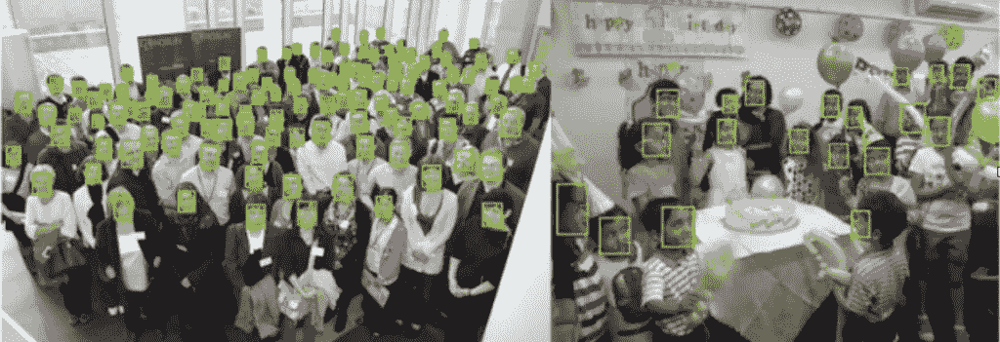
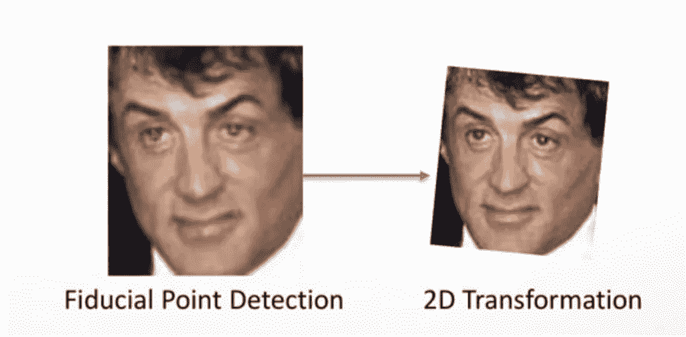
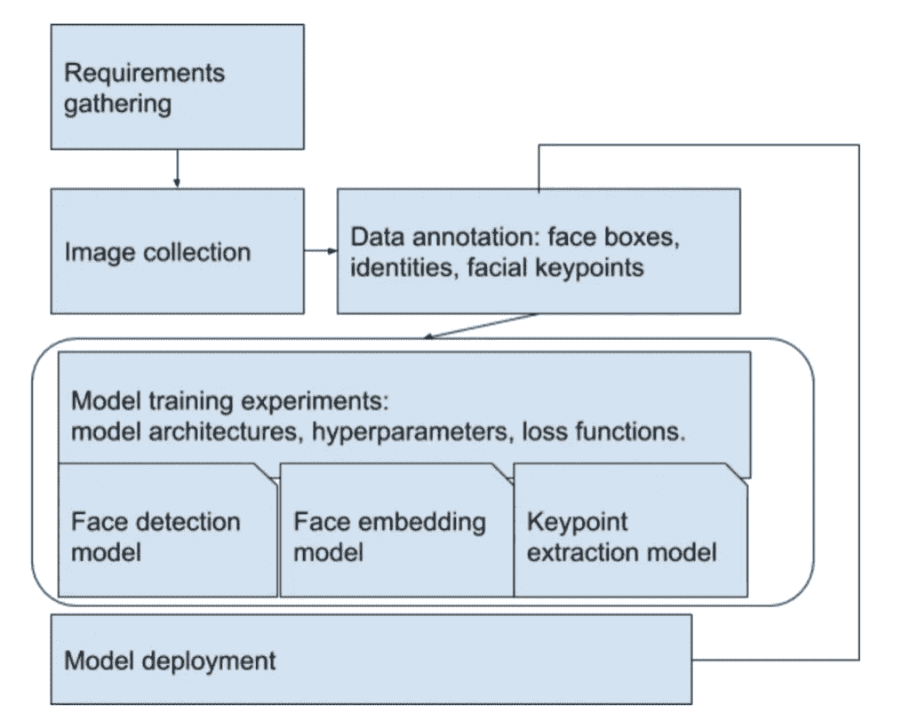

# 一种利用 2D 目标检测进行人脸识别的通用方法

> 原文：<https://towardsdatascience.com/a-general-approach-for-using-2d-object-detection-for-facial-id-b5dc816a970?source=collection_archive---------12----------------------->

有几种技术可以利用计算机视觉进行面部识别。在这个场景中，我们演示了一种通过面部识别来识别感兴趣的人的方法。有多种方法可以实现积极的身份识别。深度学习可用于映射和识别人脸的三维平面。或者，也可以应用聚焦在人脸上的 2D 对象检测技术。前者需要大规模扫描的 3D 人脸，这是非常昂贵的，需要目前正在研究和开发的技术，并达到远低于 80%的精度水平。用这种方法看到成功将是困难的、不确定的和昂贵的。我们认为这种方法不太实际。后者(2D 物体探测技术)需要高分辨率的照片作为数据集，这可以通过高质量的相机来实现。2D 深度学习技术，卷积神经网络(CNN)今天被应用于各种类型的识别。利用 2D 面部识别技术来识别感兴趣的人是可行的，可以实现高度的准确性(80%以上)，并且减少了总的技术债务。我们建议开发一个 2D 面部识别模型原型，作为一个实用的方法，积极的面部识别感兴趣的人。

**一般方法:**

数据是关键。最初，您需要评估和绘制数据采集过程和数据结构(例如，使用什么相机，照明如何，照片中通常出现多少人)。基于以上所述，您应该收集速度和准确性要求，建立什么被认为是“可接受的”。然后，评估并记录硬件限制。

一旦正确的评估完成，开始并建立使用系统的 UI/UX 流程，并定义 API 端点。建立视频/照片和标签的数据收集系统。然后将数据集解析成训练、验证和测试桶。需要开发适当的数据预处理管道来减少图像和视频数据中的模糊和噪声。

构建深度学习算法(CNN)或将迁移学习应用于现有模型；接受过特定人脸检测、嵌入和分类模型的培训。在开发了核心人脸检测和识别模型之后，您将需要开发一个跟踪模型来跟踪整个视频中的多个对象。

最后，集成和服务于模型的数据库和后端将被开发。需要定义和实现一个人在回路中的过程来持续改进模型。

**型号选择/开发:**

我们建议从人脸检测、关键点提取、对齐和嵌入的开源解决方案开始。这允许对感兴趣的应用的现有技术进行快速评估，并通知我们集中改进建模技术或数据采集的方向。然后，收集带标签的图像或视频，并标注人脸边界框和身份。

通过进一步的特征工程和超参数调整来调整所选模型。然后，测试系统并找出系统故障所在。一旦选择了模型，您将需要为重新培训、测试、部署和监控计划创建一个计划。

**技术推荐:**

对于人脸检测和识别模型，我们建议使用卷积神经网络(例如 ResNet)作为主干。对于人脸检测损失函数，我们推荐使用 SSD 损失(交叉熵和回归损失)。人脸嵌入模型的损失函数有多种选择:

*   交叉熵损失
*   三重损失
*   中心损失

对于关键点提取，我们建议使用回归损失。

当然，你需要训练数据。这可能是一个挑战。为了达到高水平的准确性，您将需要标记的训练数据(1 到 1000 万张脸)。

**人脸检测**

给定一幅图像，我们需要检测人脸所在的像素区域。下面是一个例子，我们的工作中，面部检测显示。

**输入**:图像

**输出** : 1)包含正面或稍微侧面的面的边界框(上、左、下、右)；2)对应于眼睛、鼻子和嘴的面部上的关键点

采用多路最先进的卷积神经网络进行计算。

**面部对齐**

使用面部关键点对图像执行 2D 变换，使眼睛和月份处于大致正常的位置。

**输入**:检测到人脸的裁剪图像块

**输出**:面部对齐的图像补片

**人脸嵌入(描述符)**

**输入**:裁剪后的人脸图像补丁

**输出**:描述人脸的向量

人脸嵌入模型将是一个卷积神经网络。它可以基于预先训练的模型(例如:最初用于分类 1000 个对象类别-例如猫和狗)。执行迁移学习，并使用交叉熵损失或三重损失(在最近的文献中提出了新的损失)在我们的面部匹配数据集上微调模型。

**图上的人脸聚类**

嵌入的面部描述符存在于向量空间中。在这个向量空间中两个面的距离表明它们是多么不同。在由面部向量之间的这些成对距离指定的面部图上执行聚类算法。每个聚类包括很可能是同一个人的面部。

**输入**:人脸描述符

**输出**:人脸聚类，每个人脸聚类是一组很可能属于同一个人的人脸。

**项目流程图:**

**预处理和标准化**

需要带标签的训练数据来提供照片、人脸的带标签的边界框以及每个边界框的身份(人名或 ID)。标签需要组织成一种易于使用的格式，比如 PASCAL VOC 格式。对于原型的范围，我们将假设数据可用性和结构。

**部署后改进系统**

构建一个人在回路中的组件，该组件审核生产中的模型，并标注边界框和人员身份的正确标签。这包括开发一个批量训练过程，不断吸收新的训练数据。

这个人在回路组件的目的是扩大已知人脸和嵌入向量的数据库。他们会尝试在照片中加入不同的光线，不同的角度，不同的玻璃等等。提高在新照片中认出那个人的回忆率。

准确性取决于 1:N 人脸比较的干扰物比率(每个查询人脸的干扰物数量)。在 mega face(N = 100 万)上，最精确的系统可以达到大约 30%的精度。在 1:1 人脸比对上，可以达到 99%+的准确率。

**潜在挑战:**

用于培训和验证的图像质量将阻碍项目的成功:

*   光线太弱或太强。
*   低分辨率。
*   运动模糊。
*   鱼眼相机。

复杂的场景提供了额外的噪声，影响了准确识别面部的能力。例如，拥挤的场景和来自其他对象的遮挡必须被隔离。

此外，数据大小可能会成为技术基础架构和资源的负担。数千万张照片产生了海量数据。这对于有限的计算资源是有问题的，并且会产生长的训练周期。这导致了缓慢的迭代。

硬件提供了约束。如果模型部署在“边缘”(例如，在 Raspberry Pi 或移动电话上)而不是云实例上，则只能使用模型的一小部分。大量使用可能会有问题。如果许多相机数据流同时消耗 API，那么对面部识别 API 的请求会淹没计算能力。

会有速度限制。如果需要模型来生成实时预测，这就限制了可以使用的模型的大小和类型。

**克服挑战:**

*图像质量*

使用高质量和高分辨率的相机；安装摄像机的方式应能获得最佳的角度、距离和照明。

*复杂场景*

对模型的局限性设定期望。关注确定最高价值目标的更窄的用例。

*数据大小*

可能需要更多计算资源。我们将开发一个更好的分布式模型训练算法来减轻资源的负担。

*高用量*

在模型部署期间提供足够的机器资源。

**培训流程:**

首先，需要将数据收集到对象存储中的一个桶中(例如 AWS S3)。使用 TensorFlow/PyTorch/Caffe 框架开发培训管道。则需要供应 GPU 资源。一旦模型被训练，模型工件和度量就被持久化到对象存储中。

在模型训练期间，我们建议执行连续的超参数调整。我们调整的 nob 包括但不限于:

*   主干架构:VGG，雷斯网，DenseNet，MobileNet，NASNet。
*   学习率调度。
*   批量大小。

可能需要分布式培训。如果图像数量超过数百万，通常需要在多个 GPU 实例上进行分布式训练。我们推荐 Horovod(来自优步)。

虽然 3D 面部识别是一个可行的解决方案，但它并非没有挑战。它的计算成本很高，当前的精度基准对许多应用来说可能太低。人脸识别的 2D 对象检测应该足以处理大多数用例。以上提供了许多方法中的一种。我们鼓励其他人分享他们的！

***功夫。AI 是一家人工智能咨询公司，帮助公司建立他们的战略，运营和部署人工智能解决方案。请点击*** [***查看 www.kungfu.ai***](http://www.kungfu.ai)