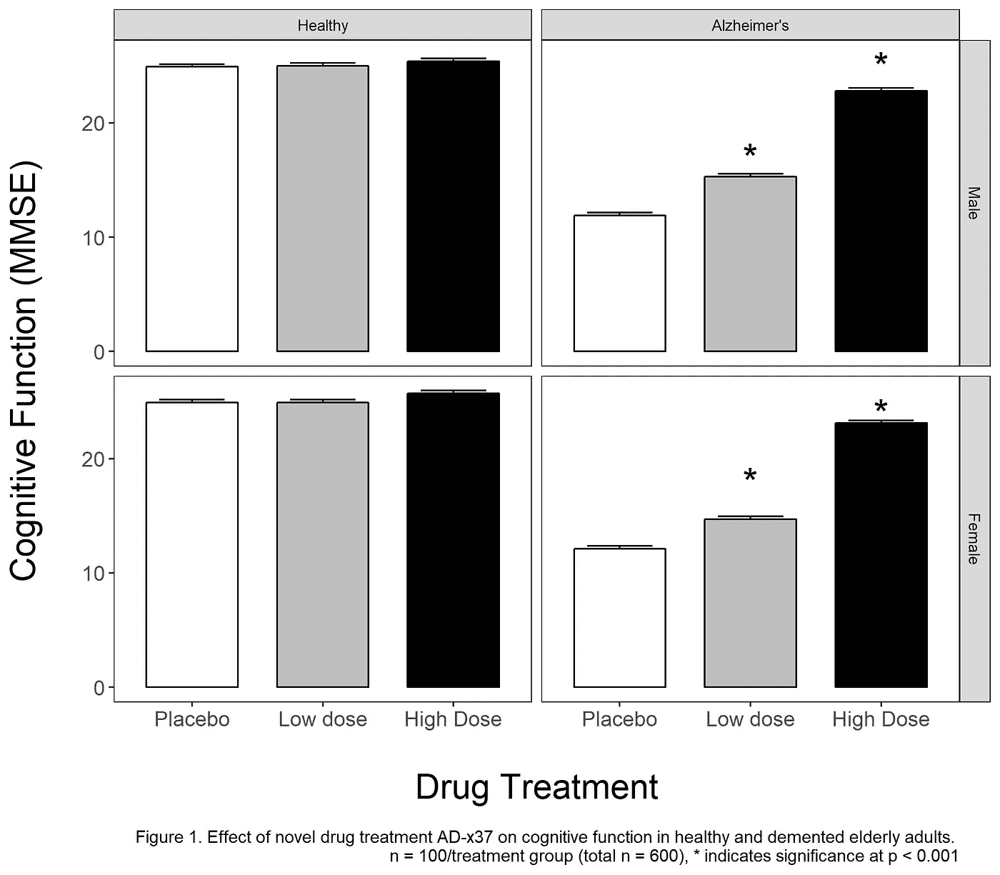
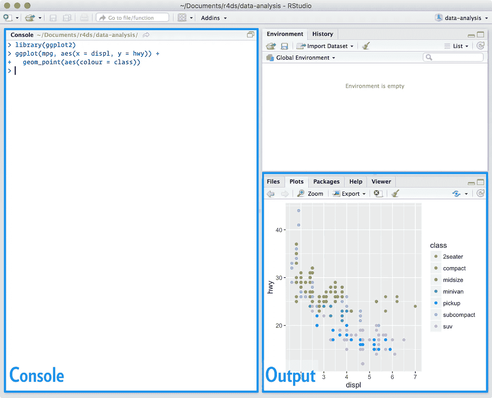
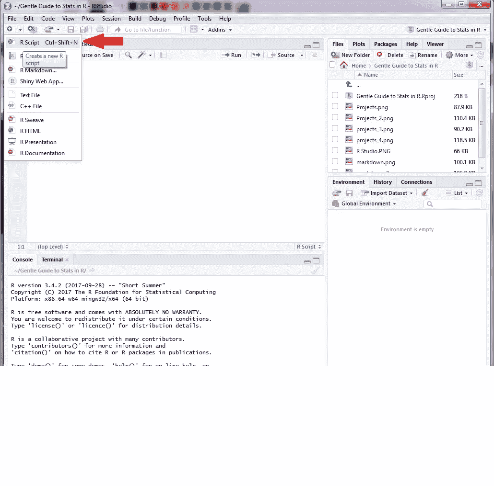

# R 中整洁统计的简明指南(第 1 部分)

> 原文：<https://towardsdatascience.com/a-gentle-guide-to-statistics-in-r-a1da223e08b7?source=collection_archive---------3----------------------->


While data analysis in R can seem intimidating, we will explore how to use it effectively and clearly!

# 介绍

Jesse Maegan 在 Twitter 上提出了以下问题，并在 R 频谱的所有点上与#RStats 用户展开了一场大讨论。

许多人加入进来，提出了缺少详细插图的包、使用其他编程语言的社会团体的影响、难以找到与你相关的例子、需要更多关于大学编程与统计的指导，以及许多其他主题。

两条推文给我留下了深刻的印象，与我在 r 中的第一个需求非常相似。关于您感兴趣的主题的多元和描述性统计！对于我们许多从事科学研究的人来说，通过 ANOVAs 和线性回归/相关性以及简单的总结(描述性统计)进行的均值测试将解决我们的许多问题。

然后，David 带来了一个很好的观点和视角，他是一个需要指导学生/同事的人，这些学生/同事表达了使用 R 的**需求**，但在数据科学的背景下没有 R 的需求或愿望。对于局外人来说，R 的编码本质可能是令人生畏的，让你看起来好像是在“矩阵”中执行数据分析

我肯定去过那里，还没有找到一个坚实的例子走过多变量 ANOVAs，后 hocs，绘图，和描述性统计。基本上是一个完整的 R 语言数据分析的例子，但用于学术用途。

所以我告诉大卫我会写一篇博客，我们开始吧！

如果你觉得打开和使用 R Studio 很舒服，请随意跳到[第二部分](https://medium.com/@j.thomasmock/a-gentle-guide-to-statistics-in-r-ccb91cc1177e)！里面有所有的统计数据和图表！



We’ll get here eventually I promise!

# R/R 工作室

我将大量借用切斯特·伊斯梅和艾伯特·金的精彩电子书《T4 现代潜水》。如果你对如何使用 R 感兴趣，他们的电子书是最好的之一，而且还是免费的！

如果你需要安装 R，请参见他们关于下载和安装 R and R 工作室的章节[。](https://ismayc.github.io/moderndiver-book/2-getting-started.html)

现在开始使用 R Studio！打个电话的比方，R 是运行你手机的电脑，而 R Studio 是主屏幕。R Studio 提供了交互的接口，告诉 R 做什么。R 分为 4 个主要部分，左边是 R 脚本(在这里输入代码)和 R 控制台，而右边是环境和文件/图/包部分。



Source: Grolemund & Wickham — R for Data Science

继续进行电话类比，我还想介绍一下**包**。软件包类似于手机上的应用程序。虽然你的手机/R 可以做很多开箱即用的事情，但应用程序/软件包增加了功能！要在 R 中安装这些“应用”，我们需要先明确告诉 R 安装包！

要开始用 R 编写代码，首先同时输入“ctrl + shift + N”。这将打开一个新的 R 脚本，基本上是一个文件，您可以在其中保存键入的 R 代码和您对正在做的事情的评论。或者，您可以单击左上角的绿色“+”并从下拉菜单中选择 R Script。



在那里，您可以安装我们进行这些分析所需的一个包。首先在新的 R 脚本中键入以下代码，然后在光标停留在同一行的同时单击 ctrl + enter。不管包的名字是什么，我们都需要用" "

`install.packages("tidyverse")`

这将首次将感兴趣的软件包安装到您的计算机上。您不需要再次安装它，除非您希望在将来下载更新的软件包。

每当你启动 R Studio 时，你也需要**加载**这个包。这就相当于在手机上打开一个 app！它将加载额外的功能，并允许您通过键入代码来调用它们。

`library("tidyverse")`

在您的脚本/分析的顶部加载包是一个好主意，因此很清楚需要什么包！我们还可以在笔记上添加注释，记录我们正在做的事情以及我们为什么要这么做！R 中的注释可以在你的注释前加一个#形成。这个#告诉 R 不要“读取”同一行上的任何内容，防止它在试图读取您的精彩评论时向您抛出错误！

`# Adding the hashtag/pound sign tells R to not evaluate this line`

不涉及太多细节,`tidyverse`包为我们提供了一个优雅的描述性统计、漂亮的出版级图表的选项，并使我们的代码更具可读性！

我想介绍的下一个概念是赋值操作符

`<-`

这告诉 R 你正在把右边的所有东西分配给左边的对象。让我们将变量`x`赋值为 5，`y`赋值为 6，然后做一些基本的数学运算。

```
x <- 5
y <- 6
x * y# output
>[1] 30
```

您可以在 R 中做同样的事情，一旦您运行了`x * y`代码，您将看到 30 在输出控制台中弹出！恭喜你写出了你的第一个代码！

我们将跳过前面的部分，直接进入分析的开始部分。如果你想了解更多关于 R 的基础知识，我再次建议你去看看[Modern Dive](http://moderndive.com/index.html)——R 的统计介绍。此外，[www.datacamp.com](https://www.datacamp.com/home)有很多与 R 相关的免费内容，而且经常打折！

继续第二部分！