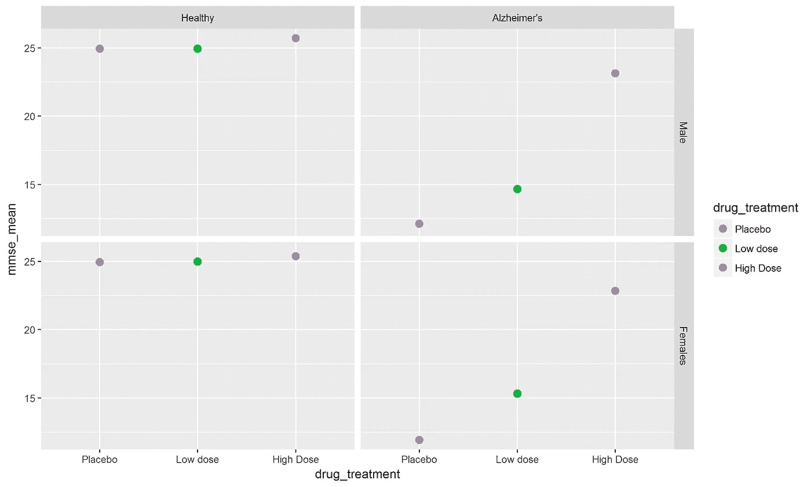
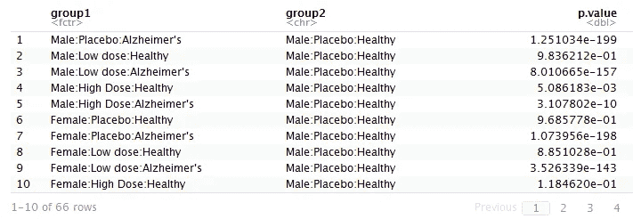

# R 中整洁统计的简明指南(第 2 部分)

> 原文：<https://towardsdatascience.com/a-gentle-guide-to-statistics-in-r-ccb91cc1177e?source=collection_archive---------1----------------------->


While data analysis in R can seem intimidating, we will explore how to use it effectively and clearly!

[第 1 部分](https://medium.com/@j.thomasmock/a-gentle-guide-to-statistics-in-r-a1da223e08b7)让您踏上用 R 代码运行统计数据的旅程。

# 介绍

在 Jesse Maegan ( [@kiersi](http://twitter.com/kiersi) )在 Twitter 上发起了一场大讨论之后，我决定发布一些(伪造的)实验治疗数据。这些数据与一种名为 AD-x37 的新(假)研究药物相对应，AD-x37 是一种理论药物，已被证明对阿尔茨海默病小鼠模型的认知衰退具有有益的结果。在目前的实验中，我们将对**药物**在减少痴呆患者的**认知障碍**方面是否有效进行**统计测试**。此处见数据[。](https://github.com/TexData43/tidy-stats-in-R/blob/master/ad_treatment.xlsx)

我们将使用 MMSE(简易精神状态测验)分数来评估认知障碍的程度。在真正的临床试验中，会记录许多其他变量，但为了一个简单但多变量的例子，我们将只关注 MMSE。


Source: Folstein et al, 1975 — J Psychiatr Res 12:189–198

我们将通过`tidyverse`加载、绘制、分析和保存我们的分析输出，这是一个为数据分析而设计的“R 包的自以为是的集合”。我们将把依赖性限制在两个包中:`tidyverse`和`broom`，而对其余的包使用基数 R。在我看来，这两个包极大地改进了数据分析工作流程。虽然其他侧重于统计的包提供了额外的统计测试，但 base R 有相当好的能力来执行开箱即用的统计分析。我将使用`knitr::kable`为 markdown 文档生成一些 html 表格，但是对于工作流来说这不是必需的。

此外，我将上传本例中使用的 [excel 表](https://github.com/TexData43/tidy-stats-in-R/blob/master/ad_treatment.xlsx)，以便您可以自己重新创建工作流程。您可以简单地复制粘贴此处看到的代码，它将在 R 中运行。如果您希望在 R-Markdown 文档中看到整个工作流，请参见此处的。R Markdown 是在 R 内部创建的一个文档，它允许您编写代码、内联执行代码，并在编写过程中编写注释/笔记。你可以把它想象成能够在一个基本的 Word 文档中编写 R 代码(但是它能做的远不止这些！).

虽然您可能对我提供的数据集不感兴趣，但这有望为您提供一个清晰的工作流程，让您可以交换感兴趣的数据并完成基本分析！

## 装载扫把、扫帚和编织机

使用库函数，我们将加载`tidyverse`。如果您以前从未安装过它，您也可以使用`install.packages("tidyverse")`调用来首次安装它。这个包包括`ggplot2`(图形)、`dplyr` / `tidyr`(汇总统计、数据操作)、和`readxl`(读取 excel 文件)以及管道`%>%`，这将使我们的代码更具可读性！我们还将加载`broom`包来整理我们的一些统计输出。最后，我们将通过`knitr::kable,`加载`knitr`来制作漂亮的 html 表格，但不需要简单地将输出保存到 Excel。

```
# Load libraries
library(tidyverse)
library(broom)
library(knitr)
library(readxl)
```

这将输出一些关于正在加载的包和任何函数调用冲突的消息。

**加载数据**

当我呼叫`readxl::read_xlsx`时，您也可以简单地使用`read_xlsx,` ，但是为了透明起见，我将使用完整的呼叫开始。使用`::`调用函数的概念很重要，因为一些包在函数上有冲突，例如多个包包括函数`select` 和`summarize`。这样，我们可以明确我们希望 R 从哪个包中调用我们的函数，所以`package::function`！要了解更多关于调用函数时“名称空间”的概念，请查看[这里](http://r-pkgs.had.co.nz/namespace.html)。

`readxl` 很不幸是一个有趣的例子，因为安装`tidyverse` 会安装`readxl`，但是通过`library` 调用加载`tidyverse` 时`readxl` 不会被加载。因此，我们必须像加载任何其他包一样加载`readxl` ，或者像`readxl::read_xlsx.` `readxl` 中允许我们读取的那样调用包和名称。xls，。或者，您可以将您的 Excel 表转换为。csv，可以通过`read_csv()`读取。通过使用来自`dplyr`的`glimpse`函数，我们可以看到变量是如何导入的，以及前几行。

```
# Read excel file
raw_df <- readxl::read_xlsx("ad_treatment.xlsx")
dplyr::glimpse(raw_df)# this is the output from glimpse(raw_df)
Observations: 600
Variables: 5
$ age            <dbl> 80, 85, 82, 80, 83, 79, 82, 79, 80, 79, ...
$ sex            <dbl> 0, 0, 0, 0, 0, 0, 0, 0, 1, 0, 0, 1, 0, ...
$ health_status  <chr> "Healthy", "Healthy", "Healthy", ...
$ drug_treatment <chr> "Placebo", "Placebo", "Placebo", ...
$ mmse           <dbl> 24.78988, 24.88192, 25.10903, 23.38...
```

我们现在可以收集一些关于数据集的信息。也就是说，我们有 3 个分类/因素变量:性别、健康状况和药物治疗以及 1 个因变量(DV): mmse。我们也有年龄，但重要的是它被记录为一个离散的数字，而不是一个因素(如 85 岁，而不是老)。因此，我们可以考虑年龄，但我们不会把它作为方差分析的一个因素。

**检查数据分布**

我们将使用第一个`ggplot2`调用来创建一个显示年龄分布的图表。为了分解我们正在做的事情，我们需要调用 ggplot，告诉它使用什么数据，并使用`aes` 或“美学”调用来分配 x 坐标。然后我们添加一个`+` ，告诉 ggplot 包含下一行代码。`geom_density`告诉 R 我们想要创建一个密度分布层，我们想要`fill`用蓝色！关于`ggplot2`的更多信息，请点击[此处](http://moderndive.com/3-viz.html)或[此处](http://r4ds.had.co.nz/data-visualisation.html)。

```
ggplot(data = raw_df, aes(x = age)) + 
 geom_density(fill = "blue")
```


图表显示，年龄实际上只在 79-85 岁之间，而且实际上不存在年龄过高或过低的情况。我们可以通过一个`dplyr`summary 调用或通过调用 base R 中的`range`来确认年龄范围 s。顺便提一下，我们现在可以讨论使用管道或`%>%.`管道将结果或数据从它的左边传递到右边。有关该管道的更多信息，请参见[这里](https://www.datacamp.com/community/tutorials/pipe-r-tutorial)。

我们可以把下面的代码理解为取`raw_df`，然后通过取`age`变量的`min`和`max`来`summarize`它。现在，因为我们从`raw_df`开始，R 知道我们想要从这个数据帧中取出列`age`。

```
raw_df %>% summarize(
 min = min(age), 
 max = max(age))# A tibble: 1 x 2
    min   max
  <dbl> <dbl>
1  79.0  85.0
```

或者，我们可以使用 base R `range`函数，这需要使用`$`。美元符号表示 R 应该使用来自`raw_df`的`age`列。这两个函数给我们的结果是一样的，最小数和最大数。

```
range(raw_df$age)[1] 79 85
```

有关使用这两种语法的更多信息，请点击[这里](http://www.science.smith.edu/~amcnamara/Syntax-cheatsheet.pdf)或者查看备忘单[这里](https://www.rstudio.com/resources/cheatsheets/)。

实验变量水平如何？

现在，虽然我非常清楚这个数据框架中的变量，但你可能不会不探索它！为了快速确定`drug_treatment`组、`health_status`组以及它们如何交互，我们可以做一个`table`调用。通过在`drug_treatment`和`health_status`上调用它，我们得到了一个很好的表格，它分解了每个变量组中有多少行。

```
table(raw_df$drug_treatment, raw_df$health_status)#output below Alzheimer's Healthy
  High Dose         100     100
  Low dose          100     100
  Placebo           100     100
```

或者，我们可以用下面的代码在`dplyr`中做同样的事情。

```
raw_df %>% 
  group_by(drug_treatment, health_status) %>% 
  count()
```

现在我们知道了我们感兴趣的变量的水平，并且每个整体治疗组有 100 名患者！

**因变量的数据探索**

在运行我们的汇总统计数据之前，我们可以通过一个`geom_boxplot`调用来可视化范围、集中趋势和四分位数。

```
ggplot(data = raw_df, # add the data
       aes(x = drug_treatment, y = mmse, # set x, y coordinates
           color = drug_treatment)) +    # color by treatment
  geom_boxplot() +
  facet_grid(~health_status) # create panes base on health status
```


我们将健康和阿尔茨海默病患者的数据分成单独的图形面(或窗格),并按药物治疗分成每个面内的组。这个图表告诉我们一些有趣的事情。看起来我们的(假的)神奇药物确实有效果了！让我们用描述性统计来探讨这个问题。

虽然这是一个探索性的图表，我们不一定要将其“调整”到完美，但我们可以注意到，我们的药物治疗应该是安慰剂< Low dose < High Dose and we should have Healthy patients presented first, and Alzheimer’s patients second. This is something we can fix in our next section!

**汇总统计**

我们希望生成 mmse 分数的平均值和标准误差，这对于测量集中趋势和创建我们的最终出版图表是有用的。我们有性别、药物治疗和健康状况的分类变量。然而，回到我们之前的`glimpse`调用，我们可以看到数据没有被正确“编码”。即性是一个`dbl`(数字)，没有描述性名称，`health_status` / `drug_treatment`是`chr`(人物)！这些都需要换算成因子！

```
Observations: 600
Variables: 5
$ age            <dbl> 80, 85, 82, 80, 83, 79, 82, 79, 80, 79, ...
$ sex            <dbl> 0, 0, 0, 0, 0, 0, 0, 0, 1, 0, 0, 1, 0, 1...
$ health_status  <chr> "Healthy", "Healthy", "Healthy", ...
$ drug_treatment <chr> "Placebo", "Placebo", "Placebo", ...
$ mmse           <dbl> 24.78988, 24.88192, 25.10903, 23.38...
```

我们可以使用`dplyr::mutate`函数告诉 R 我们想要改变(突变)感兴趣的变量中的行。因此，我们将获取`sex`、`drug_treatment`和`health_status` 列中的数据，并将它们从数字或字符转换成因子变量！`dplyr::mutate`还可以表演数学，以及许多其他有趣的事情。更多信息，请参见[此处](http://stat545.com/block010_dplyr-end-single-table.html#use-mutate-to-add-new-variables)。

我们将使用`mutate` 函数和基数 R `factor`函数将我们的变量转换成适当的因子，并给它们加上标签(表示性别)或重新排列因子的级别。

我们需要非常小心地准确键入列中显示的标签，否则它会用 NA 替换那些拼写错误的标签。例如，您是否注意到`High Dose`有一个大写的“D ”,而`Low dose`有一个小写的“D ”?

```
sum_df <- raw_df %>% 
            mutate(
              sex = factor(sex, 
                  labels = c("Male", "Females")),
              drug_treatment =  factor(drug_treatment, 
                  levels = c("Placebo", "Low dose", "High Dose")),
              health_status = factor(health_status, 
                  levels = c("Healthy", "Alzheimer's"))
              )
```

尽管 R 非常强大，但它需要明确而准确的代码输入来完成最终目标。因此，如果我们键入“High **d** ose ”,它会给出安娜，而“High **D** ose”会正确输出。我们现在将`age` 和`mmse` 视为`dbl` (数字)，将`sex`、`health_status`和`drug_treatment` 视为因子。

```
Observations: 600
Variables: 5
$ age            <dbl> 80, 85, 82, 80, 83, 79, 82, 79, 80, 79,...
$ sex            <fct> Male, Male, Male, Male, Male, Females, Mal...
$ health_status  <fct> Healthy, Healthy, Healthy, Healthy, Health...
$ drug_treatment <fct> Placebo, Placebo, Placebo, Placebo, Placeb...
$ mmse           <dbl> 24.78988, 24.88192, 25.10903, 24.92636,...
```

现在一切都已正确编码，我们可以计算我们的平均值和标准误差(se =标准偏差/样本数的平方根)！我们将使用`group_by`来告诉 R 我们想要…分组的因素！然后，我们将通过首先调用`summarize`然后用`mmse_mean`和`mmse_se`以及样本数量`n()`指定我们想要的汇总来创建命名汇总。最后，我们将`ungroup`，从数据帧中删除`group_by`代码。

```
sum_df <- sum_df %>%   
  group_by(sex, health_status, drug_treatment) %>%  
  summarize(mmse_mean = mean(mmse),   
            mmse_se = sd(mmse)/sqrt(n()),
            n_samples = n()) %>%
  ungroup() # ungrouping variable is a good habit to prevent errors
```

现在我们有了一个格式良好的数据框架，可以保存到 Excel 中，或用于绘图。我们需要指出我们正在写什么数据(`sum_df`)以及我们希望结果文件被命名为什么(`“adx37_sum_stats.csv”`)。

```
# code to save the table into a .csv Excel file
write.csv(sum_df, "adx37_sum_stats.csv")
```


**总结图**

通过调用 ggplot 函数，我们可以生成一个初步的摘要图。

```
ggplot(data = sum_df, # add the data
       aes(x = drug_treatment,  #set x, y coordinates
           y = mmse_mean,
           group = drug_treatment,  # group by treatment
           color = drug_treatment)) +    # color by treatment
  geom_point(size = 3) + # set size of the dots
  facet_grid(sex~health_status) # create facets by sex and status
```



我们现在可以看到，该图按照药物治疗和健康状况进行了适当的分类。我们在最终的图表上还有一些工作要做，但是让我们先来看看 ANOVAs！

**方差分析终于出来了！**

我们将准备一个数据框架，通过方差分析进行分析。我们需要再次确保通过`mutate`将我们的因素作为因素，并且顺序正确。这是 ANOVA/事后检验工作所必需的，并使事后 hoc 和 ANOVA 输出更容易读取。

```
stats_df <- raw_df %>% # start with data
   mutate(drug_treatment = factor(drug_treatment, 
             levels = c("Placebo", "Low dose", "High Dose")),
         sex = factor(sex, 
             labels = c("Male", "Female")),
         health_status = factor(health_status, 
             levels = c("Healthy", "Alzheimer's")))glimpse(stats_df)#output belowObservations: 600
Variables: 5
$ age            <dbl> 80, 85, 82, 80, 83, 79, 82, 79, 80, 79...
$ sex            <fct> Male, Male, Male, Male, Male, Male, ...
$ health_status  <fct> Healthy, Healthy, Healthy, Healthy...
$ drug_treatment <fct> Placebo, Placebo, Placebo, Placebo,...
$ mmse           <dbl> 24.78988, 24.88192, 25.10903...
```

这使我们的数据框架进入工作状态！

通过`aov`功能调用 ANOVA。基本语法通过下面的伪代码显示。我们首先放入因变量(在我们的例子中是 mmse ),然后是一个`~`,然后是我们想要测试的自变量。最后，我们指定使用什么数据。

```
aov(dependent_variable ~ independent variable, data = data_df)
```

我们可以通过下面的代码添加真实的数据集:

```
# this gives main effects AND interactions
ad_aov <- aov(mmse ~ sex * drug_treatment * health_status, 
        data = stats_df)# this would give ONLY main effects
ad_aov <- aov(mmse ~ sex + drug_treatment + health_status, data = stats_df)
```

因为我们有 3 个独立变量，所以我们要做出选择。我们可以简单地通过在每个变量之间添加一个`+`来寻找主效应，或者我们可以通过在每个变量之间添加一个`*`来寻找主效应和交互作用。确保不要用逗号替换`+`或`*`，因为这会导致错误！

```
# this throws an error because we shouldn't use commas in between!
ad_aov <- aov(mmse ~ sex, drug_treatment, health_status, data = stats_df)
```

通过将 ANOVA 分配给`ad_aov`对象，我们可以调用它的`summary` 来查看 ANOVA 的结果。

```
# look at effects and interactions
summary(ad_aov) Df  Sum Sq Mean Sq  F value Pr(>F)    
sex                                1      0       0    0.047  0.828    
drug_treatment                     2   3601    1801  909.213 **<2e-16** 
health_status                      1  10789   10789 5447.953 **<2e-16** 
sex:drug_treatment                 2      8       4    2.070  0.127    
sex:health_status                  1      5       5    2.448  0.118    
drug_treatment:health_status       2   2842    1421  717.584 **<2e-16** 
sex:drug_treatment:health_status   2      5       2    1.213  0.298    
Residuals                        588   1164       2                    
---
Signif. codes:  0 ‘***’ 0.001 ‘**’ 0.01 ‘*’ 0.05 ‘.’ 0.1 ‘ ’ 1
```

总结给出了自由度、平方和、均方、F 值和 p 值。我在<2e -16, these p values are so small that R switches to scientific notation. So we see significant main effects of drug treatment, health status, and an interaction of drug treatment by health status. We can interpret that Alzheimer’s patients had different cognitive scores than healthy, and that drug treatment had an effect on cognitive scores. Importantly, sex was not a significant factor, as p = 0.828\. Variables being scored as significant or non-significant can both be important!

We can also use 【 to clean up the results of the ANOVA and put them into a dataframe. This is useful for storage, or for automation of some analysis for future ANOVAs.

```
# this extracts ANOVA output into a nice tidy dataframe
tidy_ad_aov <- tidy(ad_aov)# which we can save to Excel
write.csv(tidy_ad_aov, "ad_aov.csv")
```

However, we don’t know the direction of changes, or where the changes occurred. Was it just the high dose? Low dose? Both? We need follow-up post hoc tests to determine these answers!

**后 hocs >博士后(学术界笑话<爸爸笑话)**上加了一个醒目的强调

我们有多种方式来看待后 hocs。我将在这一部分展示两个。

对于成对的，我们需要使用`$`从每个数据帧中选择列，并通过`:`查看交互。我们的第一个两两比较没有对多重比较进行校正，与无保护的 Fisher's-LSD post-hoc 相当。这一点也不严格，考虑到我们所做的大量比较，建议要么继续进行 p.adjusting Bonferonni 校正(将`p.adj = “none”`改为`p.adj = “bonf”`)要么进行 Tukey 事后测试，如下例所示。您可以看到，由于`dataset$column`方法和每次交互之间对`:`的需要，这个方法读起来有点混乱。我们可以这样理解，我们需要对`sex` 和`drug_treatment` 和`health_status`的相互作用进行成对 t.test，它给出了这些因素相对于其他因素的每一次迭代。

```
# call and save the pair.t.test
ad_pairwise <- pairwise.t.test(stats_df$mmse,    stats_df$sex**:**stats_df$drug_treatment**:**stats_df$health_status, 
p.adj = "none")
```

此外，我们需要提取 p 值矩阵并保存到 Excel 文件中以备将来使用。

我们通过简单地用`broom::tidy`包装我们的`ad_last` posthoc 来做到这一点。

```
# tidy the post hoc
tidy_ad_pairwise <- broom::tidy(ad_pairwise)# save to excel
write.csv(tidy_ad_pairwise, "tidy_ad_pairwise.csv")
```



Tukey post-hoc 比未调整的成对 t-test 更容易调用。请注意，我们已经将 Tukey 结果封装在`broom::tidy`中，以保存为一个整洁的数据帧！TukeyHSD 调用合并了 ANOVA 调用的结果，并且优于前面的方法。

下面的代码可以被阅读，因为我们想要对我们的`ad_aov` ANOVA 的结果进行 Tukey 事后测试，该 ANOVA 跨越`drug_treatment` by `health_status`的`sex` 的交互。注意每个变量之间的`‘sex:drug_treatment:health_status’`和`:`的引号。这些是告诉 R 我们希望 Tukey 如何运行所必需的！一旦完成，R 就对它运行 tidy，使它成为一个好的数据帧，类似于我们之前的成对测试。然后我们可以将结果保存到 Excel 中！

```
# call and tidy the tukey posthoc
tidy_ad_tukey <- tidy(TukeyHSD(ad_aov, which =             'sex:drug_treatment:health_status'))# save to excel
write.csv(tidy_tukey_ad, "tukey_ad.csv")
```

**出版图**

现在，我们已经生成了 ANOVAs 和 post-hoc，并将其保存到 Excel 中进行存储，我们可以开始制作出版物级别的图表了！

图表允许极端的定制，我在图表上添加的一些内容是个人的选择，因此我建议与你所在领域的导师或有经验的成员讨论。条形图在我的领域中无处不在，虽然我认为绘制成箱线图可以告诉我们更多的数据，但我首先会从条形图开始。

我们的目标是绘制平均值、标准误差，并指出其发生的意义。我将使用`tribble` 函数手工制作一个定制的数据帧，而不是依赖一个包来标记重要性。除了这样做还有其他选择，但是我可以很容易地控制使用这种方法会发生什么，而且数据帧包含的内容非常明显。下面的例子显示了三层结构的基本原理。我们用`~`指定列，然后显式地写出我们在列的每一行中想要的内容。

```
[tribble](https://rdrr.io/cran/tibble/man/tribble.html)(
  ~colA, ~colB,
  "a",   1,
  "b",   2,
  "c",   3
)# Output below
*# A tibble: 3 x 2*
   colA  colB
  <chr> <dbl>
1     a     1
2     b     2
3     [c](https://rdrr.io/r/base/c.html)     3
```

这是我们制作自定义数据帧的实际代码。

```
# make the dataframe with specific points of interest to add *
sig_df <- tribble(
  ~drug_treatment, ~ health_status, ~sex, ~mmse_mean,
  "Low dose", "Alzheimer's", "Male", 17,
  "High Dose", "Alzheimer's", "Male", 25,
  "Low dose", "Alzheimer's", "Female", 18, 
  "High Dose", "Alzheimer's", "Female", 24
  )# convert the variables to factors again :)
sig_df <- sig_df %>% 
  mutate(drug_treatment = factor(drug_treatment, 
               levels = c("Placebo", "Low dose", "High Dose")),
         sex = factor(sex, 
               levels = c("Male", "Female")),
         health_status = factor(health_status, 
               levels = c("Healthy", "Alzheimer's")))# Output below
# A tibble: 4 x 4
  drug_treatment health_status sex    mmse_mean
  <fctr>         <fctr>        <fctr>     <dbl>
1 Low dose       Alzheimer's   Male        17.0
2 High Dose      Alzheimer's   Male        25.0
3 Low dose       Alzheimer's   Female      18.0
4 High Dose      Alzheimer's   Female      24.0
```

现在我们有了这个数据框，我们可以在一个`geom_text`调用中使用它，用重要性标签来标记我们的条，如`*`所示。

下面是最终发布图在`ggplot2`代码中的样子。你会注意到我把它赋给了`g1`，而不是直接调用它。这意味着我将不得不调用`g1` 来查看图表，但我现在可以保存它！为了理解我们正在做的事情，我像以前一样调用初始的`ggplot` 调用，但是添加了一个误差条层、一个条形图层、分为性别和健康状态的窗格、切换到另一个外观(`theme_bw`)、手动设置颜色、通过主题进行微小调整、添加`*` 以指示重要性，最后在添加图形标题的同时更改轴标签。

```
g1 <- ggplot(data = sum_df, 
       aes(x = drug_treatment, y = mmse_mean, fill = drug_treatment,  
           group = drug_treatment)) +
  geom_errorbar(aes(ymin = mmse_mean - mmse_se, 
                    ymax = mmse_mean + mmse_se), width = 0.5) +
  geom_bar(color = "black", stat = "identity", width = 0.7) +

  facet_grid(sex~health_status) +
  theme_bw() +
  scale_fill_manual(values = c("white", "grey", "black")) +
  theme(legend.position = "NULL",
        legend.title = element_blank(),
        axis.title = element_text(size = 20),
        legend.background = element_blank(),
        panel.grid.major = element_blank(), 
        panel.grid.minor = element_blank(),
        axis.text = element_text(size = 12)) +
  geom_text(data = sig_df, label = "*", size = 8) +
  labs(x = "\nDrug Treatment", 
       y = "Cognitive Function (MMSE)\n",
       caption = "\nFigure 1\. Effect of novel drug treatment AD-x37 on cognitive function in healthy and demented elderly adults. \nn = 100/treatment group (total n = 600), * indicates significance at p < 0.001")g1# save the graph!
ggsave("ad_publication_graph.png", g1, height = 7, width = 8, units = "in")
```

保存是通过`ggsave` 函数完成的，在这里我们需要用" "，告诉 R 我们想要哪个 ggplot 对象(`g1`)，并通过高度、宽度和单位指示大小。

还有最后的图！


我认为说你可以通过简单地重现我的例子来学习`ggplot`是一种伤害。因此，我想为您指出数据科学教科书的 [R 方向，以及](http://r4ds.had.co.nz/data-visualisation.html)[现代潜水电子书](http://moderndive.com/3-viz.html)。这些免费的电子书有大量的信息，可能超出你今天需要完成的，但会在你未来的努力中为你服务。他们关于数据可视化的章节对 R 绘图入门非常有帮助！

# **谢谢**


如果你已经做到了这一步，对你有好处！我希望这有所帮助，如果你有任何问题，我建议你通过#rstats 标签联系 twitter，或者你可以在 Twitter 上找到我@thomas_mock。

此外， [Jesse Maegan](https://medium.com/u/56211c3483cf?source=post_page-----ccb91cc1177e--------------------------------) 有一个 R for Data Science Slack 频道，你可以在那里学习和提问。r 工作室(潮汐看护者)在 https://community.rstudio.com/举办他们自己的论坛。