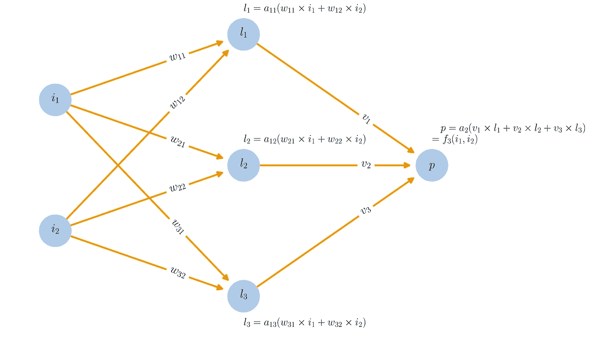
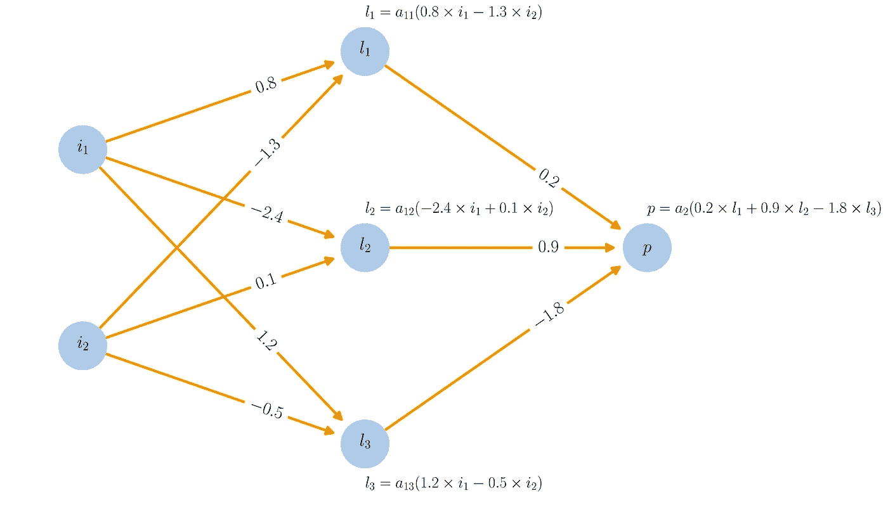
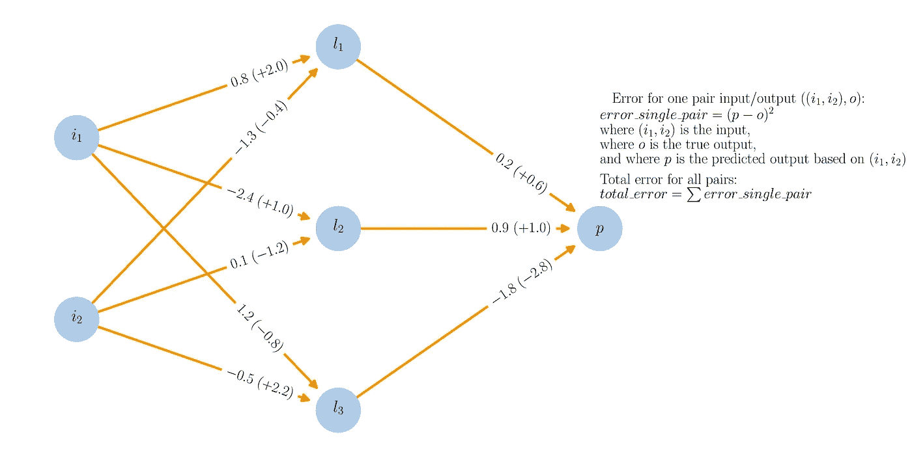

# 从线性回归到神经网络的温和旅程

> 原文：<https://towardsdatascience.com/a-gentle-journey-from-linear-regression-to-neural-networks-68881590760e?source=collection_archive---------0----------------------->

## 一些机器学习和深度学习概念的软介绍。

Credit: [Pexels](https://pixabay.com/fr/users/pexels-2286921/) on [Pixabay](https://pixabay.com/)

# 介绍

深度学习是一个非常时髦的术语。主要原因是，相关技术最近显示出令人难以置信的能力，即使不是最先进的，也能在各种问题上产生非常好的结果，从图像识别到文本翻译。面对这种不断发展的技术，由于数据和计算机能力的增加而成为可能，对于没有入门的人来说，有时很难真正知道“幕后发生了什么”。什么是深度学习？神经网络是如何工作的？

> 我们希望通过这篇文章，帮助消除与主题相关的大部分困惑或疑问，并为正确的(即使是非常基本的)理解和一些有洞察力的直觉创造空间。

为此，我们将尝试给出一些简单的答案来理解什么是深度学习，尤其是神经网络是如何工作的。我们将利用例子、说明、类比和任何能使理解尽可能容易的东西。我们在这里的目标更多的是让主要的指导方针尽可能的清晰，而不是用一些技术细节来阻碍读者的理解(尽管这可能非常有趣)。特别是，我们将从简单的问题到更困难的问题，以展示神经网络如何自然地(至少在精神上)扩展一些众所周知的技术。显然，在我们的过程中，我们将不得不进行一些简化或省略一些细节。如果在某些方面，它会让更高级的读者感到沮丧，我们提前道歉。

由于本文的目的主要是给读者一个简单的概述和一些直觉，以符合机器学习、深度学习和神经网络的主要思想，因此后面的大部分内容不需要高级的数学背景。

## 概述

在第一部分，我们给出了机器学习的定义，并用线性回归这个非常基本的例子说明了机器学习技术是如何从数据中提取知识的。

然后，在第二部分中，我们表明问题通常比真正简单的线性回归更难，并且需要一些更高级的机器学习技术。我们介绍了这样一个事实，即具有更好预测能力的更先进的模型，通常是以模型的优化或可解释性的更高难度为代价的，然后简要讨论了这两个问题。

最后，在最后一节中，我们看到对于一些真正复杂的问题，我们可以选择放弃(部分或全部)可解释性来设计具有更好预测能力的模型。我们介绍深度学习，尤其是神经网络。我们展示了在何种意义上神经网络可以被视为我们的初始线性回归例子的自然延伸，并讨论了反向传播算法。

# 基础机器学习

## 什么是机器学习？

计算机游戏和人工智能领域的先驱亚瑟·塞缪尔(Arthur Samuel)将机器学习(ML)定义为在没有明确编程的情况下赋予计算机学习能力的研究领域。换句话说，无论我们算法的目的是什么，实现这一目标的规则都不是显式编程的，而是由计算机根据一些有用的数据“学习”(稍后我们将回到这个词)。这是与经典算法的最大区别。

在经典算法中，规则被明确地给予计算机来执行任务。在机器学习算法中，定义一系列可能规则的模型(参数化或未参数化)与一大堆数据和基于这些数据在可能规则中寻找更好规则的策略一起提供给计算机(优化)。在下一段中，我们将在现有的最基本的机器学习模型之一中明确所有这些元素:线性回归。

## 简单线性回归

线性回归是我们能想到的最简单的机器学习算法的例子之一。让我们看看它完全符合我们上面给出的描述。假设你有一堆关于房子两个属性的数据:面积(用 ***s*** 表示)和价格(用 ***p*** 表示)。现在，假设您想要一个程序，它以房子的大小作为参数，并返回一个价格，即该房子的估计价格。第一种选择是对规则进行显式编程。在这种情况下，这意味着我们必须明确定义函数 ***f*** 使得 ***p = f(s)。*** 换句话说，我们必须明确给出价格，作为尺寸的明确函数。然而我们可能不知道这个函数是什么，或者我们可能只有一个模糊的概念。如果是这样的话，我们可以依靠数据以 ML 的方式建立我们的规则。然后，我们首先定义一组(一族)规则:在这个例子中，我们假设一个线性规则表达了价格和大小之间的联系。因此，我们现在已经知道 ***f*** 具有形式 ***f(s)=as+b*** ，具有 ***a*** 和 ***b*** 未指定的参数(自由度)，这些参数需要基于可用数据并遵循给定策略来定义。传统上，对于线性回归，这种策略非常简单，包括选择*和 ***b*** 以最小化真实输出和预测输出之间的误差平方和。这可以在线性回归的情况下分析完成(我们可以找到一个封闭形式的解决方案)。但是我们会看到事情并不总是那么容易。然而，我们可以注意到，在这个例子中，我们有三个提到的部分:一个(参数化的)模型，一些数据和一个优化策略(一种找到最佳参数的方法)。我们将在本文讨论的更高级的方法中再次遇到这个三联体(模型/数据/优化)。*

## *非参数化模型*

*前面的线性回归的例子是参数化模型的例子，其中*和 ***b*** 是参数。在本文中，我们将主要讨论这类模型，因为我们想展示向(高度)参数化的神经网络的过渡。然而，人们应该记住，也存在非参数化模型。然而，三联画保持不变。该模型仍然定义了一组可能的函数，并且在该组函数中的选择是基于遵循给定优化策略(大多数情况下是误差最小化)的可用数据进行的。**

# **高级机器学习**

## **问题往往会变得更难**

**当然，问题不能总是用线性回归这样简单的方法来解决，在大多数情况下，我们将不得不建立更复杂的模型。有些问题甚至不符合线性回归所建议的具体框架(即:取一些真实的输入，返回一个真实的输出)。然而，无论我们选择哪种方法，我们总能恢复我们潜在的三联模型/数据/优化。**

**例如，假设您有一些关于客户使用您的某项服务的数据，并且您想要一个工具来根据这些数据预测客户是否会流失。在本例中，要预测的输出不是一个实数值，而是一个二进制值(两类问题)，因此，我们面对的是分类问题，而不是回归问题。然后，输出预测应该是 0 和 1 之间的变动概率，并且具有无界输出的线性回归应该例如通过在线性输出之上应用专用非线性函数而转变成逻辑回归。**

**另一个例子是考虑一个客户细分问题。假设您有一些关于客户的数据，并且希望展示这些数据中的聚类，以便获得客户细分。这里的问题不再是一个监督的问题。事实上，我们不想学习一些输入和给定输出(监督)之间的映射，而是在未标记的数据(非监督)中寻找一些结构。**

**即使我们不打算给出每一种机器学习算法的细节，我们也可以给出以下大图:更高级的模型旨在表达数据中更复杂的结构，但这可能是以优化或解释模型的一些困难为代价的。让我们以后讨论这两点。**

## **最佳化**

**一旦定义了模型，就必须对其进行优化，使其“刚好足以”拟合数据，以捕捉数据中的相关总体结构，同时忽略不相关的特定“噪声”(我们将在后面讨论“过度拟合”的概念)。事实上，正如前面提到的，一个模型定义了一个空间(这个模型的可能“实例”)，我们需要在这个空间中找到关于一个选择的度量的最佳点(一种评估空间中每个点的质量的方法)。该指标通常由误差项定义，惩罚与数据不匹配的模型实例，有时还加入正则化项，惩罚过于复杂和过于接近数据的模型实例。然后，我们可以把我们得到的最优化问题主要分为三类。**

**首先，对于非常简单的方法，我们可以面对一个二次型优化问题。这里我们指的是有可能找到我们问题的封闭形式解的情况(我们知道如何用数学方法表达问题的解)。线性回归显然就是这样一种方法。事实上，我们可以获得一个封闭形式的解决方案是非常有吸引力的，但也反映了简单，因此无法捕捉数据中的复杂结构，由模型定义的空间。**

****

**Quadratic minimisation with linear derivative. Finding the minimum is straightforward in an analytical way : we just need to find the 0 of a linear function.**

**那么，优化问题可以是非二次的，而是凸的。非二次优化问题通常不能用解析方法解决，大多数时候需要迭代方法。这些迭代方法背后的主要思想是从空间的给定点开始——由我们的模型描述的空间，其中一个点是模型的一个实例，例如具有特定参数——并通过在每次迭代中选择在我们的空间中的最佳可能方向上迈出一小步(取决于我们如何定义“最佳”的概念)来尝试改进这个解决方案迭代。这些迭代方法可以采取不同的形式，如各种梯度下降变量、EM 算法等，但最终的基本思想是相同的:我们无法找到直接的解决方案，所以我们从给定点开始，一步一步地前进，在每次迭代中朝着改进当前解决方案的方向迈出一小步。关于梯度下降的图示，请参见下图。对于这种迭代方法，空间的凸性是一个非常重要的性质，它确保无论选择什么样的起点，我们都将达到全局最优(我们将获得的模型实例将是关于定义的优化问题的最佳可能实例)。**

****

**Convex minimisation. Finding the minimum is not straightforward and require iterative approach (as the derivative is no longer linear). Here, we used gradient descent. However, convexity ensure that iterative approach will reach the global minimum.**

**最后，由模型定义的空间可以是非凸的，然后我们面临一个非凸优化问题。在这种情况下，非线性将再次影响迭代方法的使用。然而，非凸性使得我们不再确定迭代过程将在整个空间上达到最佳可能点。换句话说，我们获得的最优(模型的实例)高度依赖于我们选择的起点。这显然是我们所能面对的最优化问题的最坏情况，也是一些更先进的模型在表达数据内部复杂结构方面的高能力的一个明显缺陷。**

****

**Non-convex minimisation. Finding the minimum require iterative approach (here, gradient descent) but the non-convexity make it possible to reach local minima instead of the global minimum depending on the starting point.**

## **小心过度拟合**

**一般来说，在机器学习中，当处理优化过程时，我们需要非常小心过度拟合。当模型不仅学习了我们想要的有趣的一般特征，而且还学习了一些特定的不想要的噪声时，我们说模型过度拟合了数据。换句话说，过度拟合是指优化过程导致模型实例过于接近训练数据，因此不能很好地推广到新的未知数据。下图很好地说明了过度拟合现象。**

****

**From left to right : underfitting, fitting and overfitting. Over the same set of data we fit polynomial functions of various degrees. We can see that 1 degree polynomial function has not enough freedom while 20 degrees polynomial function has too much.**

**模型的参数数量和可用于训练的数据数量之间的比率对过度拟合风险有影响。如果与参数的数量相比没有足够的数据，在某种意义上，就有学习不希望的噪声的空间。但是，如果数据的数量足够大，它将具有正则化效果，并将迫使参数仅学习一般特征(见下图)。当拟合神经网络时，参数的数量可能非常多，因此存在过度拟合的风险。**

****

**From left to right : fitting of a 5 degrees polynomial function with 10, 30 and 100 points. We can see that more points have a regularisation effect : with 100 points, the fitted curve looks like a 2 degrees polynomial function.**

**我们应该注意到，正则化参数/约束参数以关注一般特征的另一种方式是引入显式正则化器。我们不会在本文中给出任何细节，但这是机器学习中一个非常重要的概念:误差函数(我们希望优化)通常包含正则化器，以加强对主要期望特征的关注，并减少噪声的潜在影响。**

## **模型可解释性**

**模型的可解释性是一个不容忽视的大问题，有时是决定选择一个模型而不是另一个模型的决定性因素。**

**我们所说的模型的“可解释性”是指一旦模型被优化，理解为什么一些输入给出一些输出的能力。让我们以上一节的线性回归为例( ***p=f(s)=as+b*** ，以 ***s*** 一套房子的大小和 ***p*** 其价格)。一旦我们优化了参数 ***a*** 和 ***b*** ，基于这些数据，我们可以完全解释我们所获得的结果。事实上，我们可以说，为了猜测新房子的价格，我们有一个基础价格 ***b*** 货币单位，我们为房子的每个尺寸单位加上 ***a*** 货币单位。同样，线性回归的完全可解释性来自于它的过于简单以及建模方面的一些限制。相反，一些模型非常强大，但可解释性差得多(如果有的话)。然而，在模型的性能和它的可解释性之间没有必然的直接联系。例如，已知支持向量机在许多问题上表现良好，并且它们的可解释性也很好。**

## **可解释性的重要性**

**请注意，随着机器学习在我们的日常生活中占据越来越重要的位置，可解释性问题变得越来越重要，并且在未来会越来越重要。机器学习模型将帮助人类完成一些(可能是重要的)任务(在健康、金融、驾驶等方面)，我们有时希望能够理解模型返回的结果是如何获得的。例如，一个智能键盘在输入信息时会提示下一个最有可能的单词，这个键盘不一定要让人理解:我们只是希望它有效率。然而，预测患者是否存在疾病的模型最好在准确的基础上是可解释的:在这种情况下，我们不仅对结果感兴趣，而且希望理解其背后的“逻辑”，以便让人类确认或不确认诊断。**

**因此，可解释性是一个非常吸引人的模型特征。然而，有时有必要通过建立一些非常复杂的模型来牺牲一些(如果不是全部)可解释性以获得更大的预测能力:这正是下一节中讨论的神经网络的情况。**

# **深度学习**

## **我们在说什么？**

**在谷歌上快速搜索会给我们提供以下“深度学习”的定义:“深度学习方法的集合是更广泛的机器学习方法家族的一部分，旨在用高度抽象的数据建模”。在这里，我们应该理解深度学习在于建立非常复杂的模型，用可解释性的容易程度换取预测能力。**

**神经网络属于深度学习方法。从大的方面来看，它们是高度参数化的复杂函数，我们试图优化(我们寻找最佳参数)以适应我们的数据。如果我们想在极端情况下进行模式化，我们可以说神经网络是线性回归的非常复杂的“进化”,旨在能够对数据中的复杂结构进行建模。**

**例如，让我们考虑一个回归或分类问题。在这两种情况下，我们都有一些输入，用 ***(i1，i2，…，in)*** 表示，我们希望找到这些输入的一个函数，它很好地解释了观察到的相应输出，用 ***(o1，o2，…，om)*** 表示。换句话说，就像在我们的线性回归示例中一样，我们正在寻找一个函数 ***f*** ，使得 ***(o1，o2，…，om)*** 很好地近似为 ***f(i1，i2，…，in)*** 。神经网络建模背后的想法是忘记建立主要由人类“塑造”并由机器调整(通过这几个参数，如在我们的线性回归示例中)的轻度参数化函数的想法，而是建立非常灵活的高度参数化函数，该函数对人类来说没有太多先验意义，但将在学习阶段方便地塑造。让我们试着用一个简单的神经网络来说明这一点。**

## **基本前向神经网络**

**在这一小节中，我们将看看基本的前向神经网络。这将使我们有机会介绍一些关于神经网络的基本术语，并清楚地看到它们如何被视为线性回归的自然延伸。**

**然后，让我们再次考虑我们的房屋定价示例，但是这一次有 2 个输入可用(让我们将这些输入表示为 ***i1*** 和 ***i2*** )，并且没有关于这些输入和我们想要预测的价格之间的关系的特殊知识(表示为 ***o1*** )，除了这种关系是先验的、相当复杂的和非线性的。**

**所以我们要学习函数 ***f*** 使得 ***f(i1，i2)*** 是 ***o1*** 的一个很好的估计量。然后，我们可以建议以下第一种模式:**

****

**其中 ***w11*** 和 ***w12*** 只是权重/系数(暂时不关心指数)。在继续之前，我们应该注意到，在这里，模型中没有常数项。但是，我们可以通过设置 ***f1(i1，i2) = w11 * i1 + w12 * i2 + c*** 来引入此术语。为了简化一些符号，我们不会在下面写这样的常数项，但读者应该记住，它们总是可以添加的(而且大多数情况下都是这样)。
这种模型是多输入的线性回归模型(也称为多线性回归),可表示如下。**

****

**“Network” graphical representation of the multilinear regression (model f1)**

**在这种情况下，模型很容易理解和拟合，但有一个很大的缺点:没有非线性！这显然不尊重我们的非线性假设。为了引入非线性，让我们对前面的模型做一点修改，提出下面的模型。**

****

**其中 ***a(。)*** 是一个被称为“激活函数”的非线性函数。然后，我们可以注意到***w11 * i1+w12 * I2***仍然是线性的，但是当我们让这个值通过一个非线性函数时，整体结果不再是线性的，因此，这个模型比之前的模型更接近我们的假设。这个模型可以表示如下。**

****

**“Network” graphical representation of the f2 model. If the activation function **a** is the logistic function, it defines the well known logistic regression model.**

**请注意，如果我们选择所谓的“逻辑函数”作为激活函数，我们以这种方式定义了一个称为“逻辑回归”的模型，该模型可以适合例如一些二元分类问题(实际上，逻辑函数输出 0 和 1 之间的数字，该数字可以被视为属于两个类别之一的概率)。**

**然而，即使比多线性模型更好，这种模型仍然过于简单，不能处理输入和输出之间关系的假设的潜在复杂性。我们可以更进一步，通过以下方式丰富模型。首先，我们可以认为数量 ***a( w11 * i1 + w12 * i2 )*** 不再是最终输出，而是我们函数的一个新的中间特征，称为 ***l1*** 。第二，我们可以考虑以相同的方式构建几个(在我们的例子中是 3 个)这样的特征，但是可能具有不同的权重和不同的激活函数:***L1 = a11(w11 * i1+w12 * I2)***、*L2 = a12(w21 * i1+w22 * I2)*和***L3 = a13(w31 * i1+W32 * I2)***，其中最后，我们可以考虑我们的最终输出是基于这些中间特征用相同的“模板”构建的:***a2(v1 * L1+v2 * L2+v3 * L3)***。如果我们把所有的部分加起来，我们就会得到:**

****

**这里我们应该主要记住的是，*是非线性激活函数，而 ***w*** 和 ***v*** 是权重。在下一张图中，我们以与之前相同的方式给出了该模型的网络图形表示。***

****

**“Network” graphical representation of the f3 model. Here we have a neural network with 2 entries, 1 hidden layer with 3 hidden nodes/neurones and 1 output.**

**最后一个模型是一个基本的前馈神经网络，具有 2 个条目( ***i1*** 和 ***i2*** )，1 个具有 3 个隐藏神经元的隐藏层(其输出为 ***l1*** 、 ***l2*** 和 ***l3*** )，以及 1 个最终输出。我们可以决定在 ***l*** 和最终输出之间添加另一个中间“隐藏”层，就像我们在输入和输出之间添加这些 ***l*** 一样:这样我们就有了一个具有两个隐藏层的神经网络。或者，我们可以选择保持 1 个隐藏层，但有更多的神经元(例如，5 个而不是 3 个)。因此，我们有不同的方法来丰富/复杂化模型，这将使权重的数量增加。隐藏层的数量、每层神经元的数量(如权重值)和激活函数的性质定义了神经网络，因此也定义了该网络所描述的函数的“模板”。**

**最后，让我们注意几件重要的事情。首先，在对这些网络进行数学描述的过程中，我们可以(而且我们总是这样做！)用矩阵符号写出前面所有的方程:对于大的架构来说，这使得所有这些更容易阅读。然而，在这里，我们的例子足够小，可以不使用矩阵符号，因此，我们可以避免使用它们，因为读者可能不习惯这些符号。第二，所有的神经网络都不符合上面描述的模板:有不同种类的架构(我们将在下一段中对此说几句)，但前馈神经网络确实是首先要了解的基本架构。第三，一旦定义，模型仍然需要拟合(权重应该根据数据进行调整，以最小化一些误差函数，就像线性回归的情况一样)，这是一个真正难以完成的优化任务。**

## **不同的需求，不同的架构**

**正如我们在上一段中看到的，神经网络是高度可调的函数模板，通过其参数，需要优化以适应数据。但是根据问题的性质和建模的数据，我们可能需要使用不同种类的模板。这些不同种类的模板被称为不同的“架构”。例如，上面讨论的基本前向神经网络(也称为多层感知器)是第一种基本架构。然而，还有其他几个。在众所周知的架构中，我们可以提到递归神经网络(RNN)——其代表一些序列数据的递归函数，其中在时间 ***t*** 的输出取决于在该时间 ***t*** 的输入以及在时间 ***t-1*** 的先前输出——以及卷积神经网络(CNN)——其代表对输入的数学卷积运算，并且例如在诸如图像识别的一些基于图像的问题中显示出良好的特性。
在所有正在进行的研究工作中，总是会根据要建模的问题设想出更多的架构。显然，我们无法描述所有这些类型的架构(这完全超出了本文的范围)，但这里要记住的最重要的事情是，神经网络的架构应该始终被视为一个可能函数的空间，其中优化网络的参数等同于在这个空间中找到最佳函数(基于优化标准)。因此，选择正确的架构当然很重要，因为如果选择不当，我们将定义一个空间，在这个空间中，即使最好的功能也可能与我们的预期相差甚远。**

## **为什么这是个好主意？**

**在使神经网络如此有效和受欢迎的原因中，我们可以提到以下三个。首先，许多领域中可用的数据量不断增加，这使得使用这种高度参数化的模型变得合理。请注意，模型的参数也称为“自由度”(该术语不专用于机器学习领域，表示模型中“可调值”或“动作杠杆”的概念)，并且模型中的许多自由度需要大量数据来调整/校准该模型。本着同样的精神，你不能在一个线性方程组中有比方程更多的未知数，你需要在你的网络中有比参数更多的数据(事实上，更多更好)。第二，计算能力总是更强，再加上智能优化技术，使得在具有如此多参数的超大规模模型上进行训练成为可能。在大型模型中，可能有数百万个参数需要优化，而在合理的时间内实现优化过程只需要最低的计算能力。最后，正如我们刚才所说的，优化过程是一项艰巨的任务，毫无疑问，简单而聪明的优化技术，如非常适合基于计算机的优化框架的众所周知的“反向传播”，是神经网络取得成功的主要原因之一。**

## **神经网络很难优化**

**那么，什么是反向传播呢？在回答这个问题之前，让我们简单讨论一下在处理神经网络时我们需要面对的优化问题。我们在选择的“架构”所描述的函数空间中寻找最佳函数(最小化一些预定义误差度量的参数)。由于构成这种“架构”的非线性激活函数以及由模型定义的参数化函数的整体复杂性，我们面临的最小化问题是非线性和非凸的。**

**优化问题的非线性需要使用一些如前所述的迭代方法。因此，想法如下:随机设置网络的初始权重(给定一些精心选择的分布)，然后对所有这些参数应用梯度下降方法，以迭代地改善(减少)误差度量。换句话说，这意味着:使用您的数据在网络中向前传递，观察结果，将模型输出结果与实际预期结果进行比较，然后稍微改变网络中的权重，使结果稍微接近真实值(通过梯度下降方法)，并重复此过程，只要我们可以对权重进行“小移动”以改善结果。**

**让我们举个例子来说明一下。考虑前面介绍的简单前向神经网络(具有 2 个输入、1 个具有 3 个隐藏神经元的隐藏层和 1 个输出)。假设该神经网络的权重在给定时间处于某种状态(见下图)。然后，我们可以为数据集中的每个输入计算当前权重的预测输出。**

****

**At the beginning of a step, the neural network has its weights set at some values. We can then compute a forward path for all inputs **(i1, i2)**.**

**现在，为了进行梯度下降的一步，我们应该独立地问我们自己网络中的每个权重:什么样的行为会降低增加和减少这个权重之间的误差。**

> **让我们强调“独立”的概念:这意味着，对于每一个权重，我们必须定义，假设所有其他权重固定，我们是否需要降低或增加这个权重以减少误差。**

**这样做，我们在某种意义上给每个权重*赋予了一点“**+*****w***”(增加)或“**-**【𝜶_】***w***(减少)，其中𝜶_ ***w*** 为正，与该权重增加(或减少)多少有关(见下图)前面的量显然是关于每个权重的导数，直到一个符号(导数将指示如何增加误差)。***

****

**Once the forward computations achieved, the error related to each input can be computed. The total error is the sum of the individual errors for each input data. For each weight, we can assign (between parenthesis on the graphic) the opposite sign of the derivative of the total error with respect to this weight. **Roughly speaking, for each weight, these values answer the question : if we suppose all the other weights fixed, should we increase or decrease this weight to lower the total error ?****

**一旦对每个权重都完成了，我们就可以应用梯度下降步骤，并且更新所有标有“**+𝜶_*w*的权重，使得**w*w***↓***w+*𝜶_*w *步长*** ，而更新所有标有“ **-𝜶_ *w*** 的权重，使得注意 ***step_size*** 定义了在每次迭代中改变多少权重，并且可以随着训练时间的推移而演变。一旦达到这一步，我们可以重新开始一个新的迭代，直到权重不能再提高了。****

****

**Finally, we can apply the gradient descent step. We considered in this example **a step size of 0.1**. The weights are then updated (two examples are detailed in the graphic) and we can then start again, until weights can not be improved anymore.**

**即使我们不会给出关于它的任何更多细节，我们应该提到，对于大多数迭代优化过程，没有什么可以确保我们以比初始状态更好的网络状态(就误差而言)结束迭代(特别是因为步长可能太大，或者因为我们在假设所有其他权重固定的情况下计算每个权重的更新值，但是我们同时更新所有权重)。**

## **作为“逐层”梯度下降的反向传播**

**我们刚刚描述了神经网络上的梯度下降过程。然而，为了能够进行这些权重的“微小移动”，我们仍然需要计算误差项相对于网络中每个权重的导数(我们需要知道每个权重是应该增加还是减少一点)。它需要计算由网络表示的函数相对于每个权重的导数。这是一个真正的大任务，除非我们利用网络的分层结构来帮助我们。事实上，正如我们前面提到的，网络通常是分层构建的，这意味着我们面对的是(高度)复合的功能。反向传播算法在于使用这种特定的分层结构来有效地计算导数。为此，我们依赖于这样一个事实，即对于给定层的权重的导数可以表示为两个事物的函数:第一，对于下一层的权重的导数，以及第二，在向前传递期间取神经元的值。网络中导数的这种特殊表达直接来自于合成函数的数学导数(***)f(g(x))' = f '(g(x))* g '(x)***)。然后，如下进行有效的导数计算。我们从计算正向传递开始(我们提供输入，并运行计算直到输出)。然后，我们以相反的方向返回，首先计算误差相对于最后一层的权重的导数。基于这些计算，我们可以计算相对于前一层的导数，以此类推，回到第一层。换句话说，我们在网络中“反向传播”导数计算。这种算法技术使得优化过程更加容易处理。**

## **局部最小值和过拟合风险**

**最后，假设通过神经网络的优化过程获得的解的质量在很大程度上受到潜在优化问题的非凸性以及由于模型中大量参数而导致的过拟合风险的影响。**

**由于优化问题的高度复杂性，迭代方法几乎不可能达到全局最优。所面临的优化问题的非凸性带来了在迭代过程中陷入局部最小值的巨大风险。由于这个原因(也是为了解决计算约束)，也可以使用随机梯度下降(SGD)。SGD 在于不使用整个训练数据集来进行权重更新(通过梯度下降),而是连续使用不同批次的该数据，以便使优化过程有一点噪声，并且由于这种噪声，有机会克服局部最优。这里我们不再进一步讨论随机梯度下降的概念。**

**此外，在拟合/训练神经网络时，我们必须特别小心过度拟合的风险。为了避免过度拟合，我们可以减少网络参数的数量，获得更多的数据或使用显式正则化器(在损失函数中或通过本文中不讨论的退出过程)。**

# **外卖食品**

**在这篇谦虚的文章中，我们试图给读者一些关于神经网络是什么的直觉。为此，我们从机器学习的概念及其简单模型转向更具体的深度学习概念，即神经网络。一路上，我们遇到了与机器学习相关的各种概念，如迭代优化、过度拟合风险等。正如我们在导言中提到的，这里的目的根本不是深入探讨问题的每一个部分，而是给出“为什么”、“什么”和“如何”的总体情况。**

****主要要点如下:****

*   **机器学习是在没有明确编程的情况下赋予计算机学习能力的研究领域。**
*   **机器学习依赖于三联模型/数据/优化。**
*   **在建立更复杂的模型时，主要有两点需要注意:如何优化和如何解释？**
*   **粗略地说，当使用深度学习和神经网络时，我们通过建立非常复杂的模型来放弃可解释性，以获得更大的预测能力。**
*   **神经网络所取得的成功主要来自于不断增长的可用数据量和计算能力，以及非常有效的反向传播思想，这种思想使得优化过程更加容易处理。**

**总之，让我们说神经网络是非常强大的工具。他们已经证明了他们在许多现代问题上表现出色的能力。然而，它们不是能够解决任何问题的神奇工具。这项工作真正聪明的部分仍然在人类手中，他们知道在哪里以及如何以正确的方式使用这些模型。如果因为许多人在该领域引入的解决越来越复杂问题的所有聪明想法而将神经网络简化为“曲线拟合”是令人不快的，那么将它们描述为“神奇工具”也是不准确的，因为这些模型目前覆盖的问题范围明显有限。作为一个正确的平衡，让我们享受伟大的(巨大的！)这些工具在许多领域带来了进步，同时牢记它们目前的局限性……并且不会被可怕的机器人杀手所吓倒。暂时如此。**

**感谢阅读！**

**感谢 Baptiste Rocca 和 Benjamin Blanc 阅读草案并提出有益的修改和改进。**

***欢迎对本文的任何反馈！***

**与[巴蒂斯特·罗卡](https://medium.com/u/20ad1309823a?source=post_page-----68881590760e--------------------------------)一起写的其他文章:**

** [## 机器学习中不平衡数据集的处理

### 面对不平衡的班级问题，应该做什么，不应该做什么？

towardsdatascience.com](/handling-imbalanced-datasets-in-machine-learning-7a0e84220f28)  [## 理解生成敌对网络(GANs)

### 一步一步地建立导致 GANs 的推理。

towardsdatascience.com](/understanding-generative-adversarial-networks-gans-cd6e4651a29)**