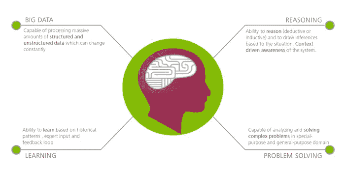

# 今天和明天之间人工智能潜力一瞥(上)

> 原文：<https://towardsdatascience.com/a-glimpse-into-ai-potential-between-today-and-tomorrow-part-1-e73e28f394ce?source=collection_archive---------9----------------------->

***4 月 23 日，我很荣幸被*** [***GDG 莫纳斯提尔***](https://www.facebook.com/gdgmonastir/) ***(突尼斯)邀请作为演讲人参加 Google Next 2017 扩展活动。我的演讲是关于人工智能的，以下是我想要传达的想法的书面版本。***

我敢打赌，当你想到/听到人工智能的时候，你的脑海中会浮现出许多想法！大数据，IBM Watson，Alexa，谷歌自动驾驶汽车，NAO，图灵，谷歌云，但什么是人工智能？是能胜过人类大脑的大脑吗？人工智能如何影响我们的日常生活？AI 背后有哪些技术？

# AI 是什么？

回到 1950 年，当计算机科学先驱艾伦·图灵开始思考“如果机器学习会怎样？”。为了制造智能机器，他发明了图灵测试。这项测试改编自一个叫做*模仿游戏*的维多利亚风格的比赛。当时，艾伦指出了一个许多人不相信或从未想象过的人工智能的可能前景。

仅仅 5 年后，在达特茅斯会议上，[约翰·麦卡锡](https://fr.wikipedia.org/wiki/John_McCarthy)创造了“人工智能”一词，定义为“**制造智能机器的科学和工程**”。

智能机器，人工智能..在深入挖掘之前，让我们先定义一下智力。

What Intelligence consists of [1]

正如我们所见，智力包括:

1.  **处理数据的能力**、
2.  **学**，
3.  **解决特殊用途和通用领域的复杂问题**，
4.  根据情况进行推理和推断的能力。

这些机器都有这些能力吗？你们中的一些人会说“我想是的！”其他人会反对..而我在这里建议的是，通过查人工智能现在在哪里，一起发现答案！因为没有比真实的事实更有说服力的论据了！

# AI 有什么影响？

人工智能在不同的行业都有影响:汽车、电子商务、市场营销、机器人、移动设备等等。毫无疑问，健康是人类最重要的支柱之一。如果一个人的健康状况不佳，他就不可能在技术上取得任何进步。因此，对包括 IBM 和谷歌在内的许多公司来说，在医疗领域投资人工智能是一件大事。

人工智能正在帮助医生更好地探索人体，并处理其复杂性。2017 年 4 月，英国诺丁汉大学的一个团队进行的一项研究证明，医生在使用人工智能时，可以更好地预测病人的心脏病发作风险。这每年可以拯救成千上万的人。

事实是，每年有 1500 万到 2000 万人成为心血管疾病的受害者，包括心脏病发作、中风和动脉阻塞。医生使用一种称为 ACC/AHA 的方法，根据年龄、胆固醇水平和血压等指南来预测心脏病发作的风险。实际上，该方法显示出不是非常有效。人体的复杂性还隐藏着一些不为人知的生物学准则。

幸运的是，正如诺丁汉大学的流行病学家斯蒂芬·翁告诉《科学》杂志的那样。"计算机科学让我们能够探索这些联系."在这个问题上尝试一些机器学习算法，如逻辑回归和神经网络，得到了更好的预测！该算法比 ACC/AHA 方法多 7.6%，导致假阳性减少 1.6%。这意味着，在大约 83，000 份病历的样本量中， [355 条额外的生命本可以被挽救](http://journals.plos.org/plosone/article?id=10.1371/journal.pone.0174944)。[2]

人工智能在医学领域的成就不止于此:

1.  IBM Watson for oncology 致力于癌症诊断，
2.  谷歌 DeepMind 失明检测:英国有 200 万人患有失明，其中约 36 万人注册为盲人或部分失明。[3]这个研究项目是调查技术如何帮助更好地分析扫描结果，让医生更好地了解眼病。研究团队开发了一种人工智能算法，可以自动识别糖尿病视网膜病变，这是成年人失明的主要原因。“*我们能够把谷歌的一些核心东西——对猫、狗和面孔进行分类——应用到另一类问题上，”在谷歌负责该项目的医生和生物医学工程师 Lily Peng 说。*
3.  [像软银公司开发的用于老年人辅助的罗密欧一样，作为手术和病人助手的机器人](http://medicalfuturist.com/robotics-healthcare/)。

虽然为了真正帮助开发医疗服务和患者援助，确实还有许多工作要做，但人工智能的影响已经存在，医生们相信与人工智能的合作将是有益的，“我不能强调它的重要性，”加利福尼亚州帕洛阿尔托斯坦福大学的血管外科医生埃尔西·罗斯告诉《科学》，“我真的非常希望医生们开始接受使用人工智能来帮助我们护理患者。”

让我们继续关注与人工智能一起成长的第一个领域:**游戏**。
这个故事始于计算机通过简单地计算棋盘上所有可能的走法或死记硬背，在国际象棋或危险边缘等游戏中击败人类。

今天，计算机甚至可能具有超前思考和推理的能力！在谷歌的阿尔法围棋赢得 T4 之前，研究人员没有考虑到这些可能性！

2016 年 3 月，世界顶级围棋选手之一李世石(Lee Se-dol)在与 AlphaGo 程序的比赛中只赢了一场。该游戏被认为比国际象棋复杂得多，因为它有更多的移动可能性(> 10170 个合法位置)。因此，它通常需要一种特殊的人类技能:直觉和创造力。DeepMind 的研究人员表示，这种计算能力在游戏之外还有现实世界的前景，特别是在医疗保健和科学领域。

DeepMind 的研究人员表示，这种计算能力在游戏之外还有现实世界的前景，特别是在医疗保健和科学领域。

健康，游戏，还有什么？

Google self-driving car

嗯，人们现在都在谈论不仅能运送我们，还能替我们思考的交通工具！

*“谷歌在 2012 年开始测试一辆自动驾驶汽车，从那时起，美国交通部* [*发布了不同自动化水平的定义*](https://www.transportation.gov/briefing-room/us-department-transportation-releases-policy-automated-vehicle-development) *，谷歌的汽车被列为全自动化的第一级。其他交通方式有* [*更接近全自动化*](http://onlinemasters.ohio.edu/millennials-cars-and-the-future-of-transportation/) *，比如公交车和火车。*

人工智能在交通领域的应用领域非常广泛。由于模式识别、系统识别、分类和许多其他人工智能子集，交通运输多年来发生了巨大的演变！

交通状态跟踪、[高级驾驶员辅助系统(ADAS)](https://www.lifewire.com/advanced-driver-assistance-systems-534859) 、[驾驶员警报系统](https://www.lifewire.com/drivers-alter-systems-534806)(例如睡意检测)已经存在，为驾驶员提供更好的驾驶体验。谷歌、特斯拉、沃尔沃以及许多其他公司都专注于提供道路安全，其方式是“*人工智能可以改变我们的情感以及我们与汽车的实际关系*”。

好吧，你可能会告诉我:这听起来不错，但我身边没有这些人工智能的应用！“我在美国不是为了看自动驾驶汽车”，“我不是为了在工作中尝试人工智能辅助的医生”，“我不玩游戏！”我不确定 AI 对我生活的影响！

你已经在用 AI 了！又不是科幻！是真的。也许，你只是没有意识到！不管你愿不愿意，人工智能正在影响你日常生活的方方面面。

在网上冲浪时，你正在试验用户行为跟踪。像谷歌、亚马逊、脸书等许多公司都在利用你的偏好、历史、搜索和购买，以便预测你的兴趣，并根据情况锁定你(脸书新闻提要，网站页面右侧/左侧的广告，购买书籍的建议..).所以，通过谷歌搜索，脸书，网飞的电影推荐，亚马逊商店，你会遇到人工智能的方方面面。

人工智能也在你的手机里！Siri、Google Now、Cortana 都是使用人工智能技术的智能助手，旨在帮助你获得问题的答案，或通过语音控制执行操作。例如，你可以说:“今天天气怎么样？”助手会搜索这些信息并把它与你联系起来。

不仅如此，AI 还用于在线客户支持。不是你访问的每个网站都有真人和你交流。在许多情况下，你在和一个初级的人工智能(聊天机器人)交谈。

你看到了吗？AI 无处不在！你的智能手机，你的汽车，你的银行和你的房子也可能！

在这一点上，这个故事开始像一部恐怖电影:谈论所有这些人工智能的影响提出了一些问题..好像有争议吧？直觉，创造力，协助，保存你的数据，可能会拿你的隐私冒险，使用数据训练机器，帮助医生，分心的司机识别，[人形机器人](http://techniblogic.com/top-5-humanoid-ai-robots/)，下一步是什么？人工智能是否拥有真正的“智能”(我们在开始时定义的智能)？人工智能会取代我们的工作吗？

***未完待续……***

原创文章发表在[我的网站](https://www.sarahmestiri.com/index.php/2017/05/05/a-glimpse-into-a…day-and-tomorrow/)。

资源:

[1] [人工智能定义，德勤](https://www2.deloitte.com/nl/nl/pages/data-analytics/articles/part-1-artificial-intelligence-defined.html)。

[2] [机器学习能否利用常规临床数据提高心血管风险预测？](http://journals.plos.org/plosone/article?id=10.1371/journal.pone.0174944)

[3] [谷歌健康领域的 DeepMind 研究](https://deepmind.com/applied/deepmind-health/research/)。